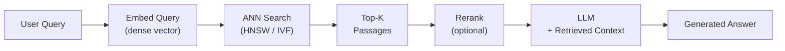

# Embeddings and Vector Databases
> **One-line summary:** Embeddings turn meaning into vectors, and vector databases make those vectors searchable at scale.

---

## 🎯 Intuition

### Core Idea
Dense text embeddings transform natural-language text into high-dimensional vectors where semantic similarity is captured as geometric proximity—typically measured by cosine distance. Paired with purpose-built vector databases, embeddings form the retrieval backbone of every RAG system, determining what context the language model actually sees.

An embedding model maps a span of text (a sentence, paragraph, or passage) to a fixed-length vector—commonly 768 to 3072 dimensions. Models are trained with contrastive learning on (query, positive passage, negative passage) triples so that semantically related texts cluster together while unrelated texts are pushed apart.

### Analogy
Embeddings are like GPS coordinates for words — nearby points mean similar meanings.

### Why It Matters
Embeddings are the semantic bridge between a user's natural-language question and the stored knowledge base. Without high-quality embeddings, the entire RAG pipeline degrades—irrelevant passages are retrieved, the LLM is fed noise, and answers suffer. Choosing the right embedding model, dimensionality, and vector index is foundational work that pays dividends across every downstream component.

---

## ⚙️ Core Mechanics

### How It Works
Leading models include E5 (Microsoft), BGE (BAAI), OpenAI `text-embedding-3-small` / `text-embedding-3-large`, and Cohere `embed-v3`. Each varies in dimensionality, context window, and multilingual coverage.

**Figure:** RAG retrieval pipeline — the query is embedded, nearest passages are retrieved via ANN search, optionally reranked, then fed to the LLM for grounded generation.

Vector databases store these embeddings and answer "given this query vector, return the k most similar vectors" at scale.Because exact nearest-neighbor search is $O(n)$ and impractical at millions of vectors, databases use approximate nearest-neighbor (ANN) algorithms. HNSW (Hierarchical Navigable Small World) graphs offer high recall with logarithmic query time. IVF (Inverted File Index) partitions the space into Voronoi cells for coarse-grained filtering. Product quantization compresses vectors to reduce memory, trading a small amount of recall for large storage savings.

### Key Specifications
- **Contrastive training**: Models learn from (query, positive, hard-negative) triples; hard negatives mined from BM25 or in-batch sampling force fine-grained discrimination.
- **Cosine similarity**: `sim(a, b) = dot(a, b) / (||a|| × ||b||)`. Most embedding models are normalized so cosine ≡ dot product.
- **Dimensionality**: Higher dims capture more nuance but cost more storage and compute. OpenAI's Matryoshka embeddings allow truncation to lower dims with graceful degradation.
- **HNSW index**: Graph-based ANN; tunable `M` (edges per node) and `efConstruction`/`efSearch` control recall-vs-speed tradeoff.
- **IVF index**: Partition vectors into `nlist` clusters; at query time probe `nprobe` nearest clusters.
- **Product quantization (PQ)**: Split vector into sub-vectors, quantize each independently; dramatically reduces memory at slight recall cost.
- **Metadata filtering**: Most vector DBs support pre- or post-filtering on structured metadata (date, source, tag) alongside vector search.

### Key Facts
- Embedding vectors are commonly **768 to 3072 dimensions**.
- The choice of embedding model is often the **single largest lever on RAG quality**.
- A poor embedding that conflates unrelated concepts produces irrelevant retrievals no amount of reranking can fully repair.
- A high-quality embedding aligned to the domain's vocabulary and query style can make even a simple top-k retrieval pipeline competitive with more complex architectures.

| Aspect | FAISS | Pinecone | Qdrant | Chroma | Weaviate | Milvus |
| --- | --- | --- | --- | --- | --- | --- |
| Deployment | Library (in-memory) | Managed cloud | Self-host or cloud | Lightweight / local | Self-host or cloud | Self-host or cloud |
| Language | C++ / Python | API-only | Rust | Python | Go | Go / C++ |
| Best for | Research, batch | Production SaaS | Performance-critical | Prototyping | Hybrid search | Large-scale |
| ANN algorithms | HNSW, IVF, PQ | Proprietary | HNSW | HNSW | HNSW + BM25 | HNSW, IVF, DiskANN |

---

## 🔬 Deep Dive

### Technical Details
Approximate nearest-neighbor search is what makes vector retrieval practical at scale. HNSW builds a layered graph so queries can quickly navigate toward nearby regions. IVF reduces work by probing only the nearest coarse clusters instead of the whole space. Product quantization makes very large indexes feasible by compressing vectors, accepting a modest recall tradeoff.

Embedding model selection is not just about benchmark scores. Domain vocabulary, multilingual coverage, and query style matter. A model trained on generic web data may underperform on legal, medical, or code-heavy corpora even if its headline benchmark looks strong.

### Limitations
Exact nearest-neighbor search scales poorly. ANN methods improve speed but require tuning and can reduce recall. Higher-dimensional vectors improve expressiveness but increase storage and latency costs. Compression techniques help with scale, but every compression step risks losing retrieval fidelity.

### Impact
Embeddings and vector databases decide which evidence gets surfaced for generation. In practice, that means they shape answer quality, citation quality, and the ceiling of the whole RAG system.

---

## 🏋️ Practice

### Warm-Up
1. What does cosine similarity measure in an embedding system?
2. Why do vector databases use ANN instead of exact search at scale?
3. What tradeoff does product quantization make?

### Core Problems
1. You have a domain-specific corpus full of rare technical terms. Why might embedding choice matter more than your reranker?
2. You need lower latency but do not want to scan millions of vectors exactly. Which ANN family would you consider first, and why?
3. A team wants to shrink storage costs with PQ. What quality risk should they watch for?

### Challenge
Pick an embedding model and vector database strategy for a multilingual documentation assistant. Justify your dimensionality, ANN index, and whether you would rely on metadata filtering.

For a local applied workflow, use [[LLM/Study/Local RAG Retrieval Evaluation and Reranking Lab|Local RAG Retrieval Evaluation and Reranking Lab]] to measure whether the embedding/index choice retrieves expected sources before the generator runs.

---

## Supporting Chunks / References

### Supporting Chunks
*(To be populated as chunks are created)*

### See Also
- [[LLM/Foundations/Embeddings and Representation Geometry|Embeddings Foundations]] — the theoretical basis for text embeddings
- [[LLM/Architecture Variants/Encoder-Only Models|Encoder-Only Models]] — modern embedding models descend from BERT
- [[LLM/Study/Local RAG Retrieval Evaluation and Reranking Lab]] — local top-k, rank, hybrid-search, and citation evaluation

### References
- [[LLM/Sources/Sources Index]]
