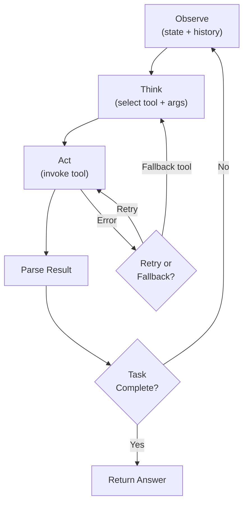

# Tool Selection and Execution Loops

> **One-line summary** Tool selection and execution loops define how an agent chooses tools, sequences actions, handles errors, and decides when to stop.

## 🎯 Intuition

**The Core Idea:**  
An agent is useful only if it can repeatedly inspect the current situation, choose the right tool, use it correctly, and decide what to do next. Tool selection and execution loops are the control system that makes this possible.

**Analogy:**  
Think of an autonomous worker in a workshop: it must notice what the job needs, pick the right instrument, use it, inspect the result, and either continue, switch tools, or stop. Good tools alone are not enough; the workflow around them matters.

**Why It Matters:**  
Most practical agent failures are not due to raw language ability. They happen because the wrong tool gets chosen, retries spiral, parallel work is mishandled, or the system cannot tell when it is finished.

---

## ⚙️ Core Mechanics

### How It Works

Tool selection is the decision process by which an agent chooses which tool to invoke given a task context, and execution loops are the control flow patterns that govern how tool calls are sequenced, parallelized, and terminated. Together they form the runtime engine of any agentic system—the observe-think-act cycle that transforms a language model from a text generator into an autonomous operator.

The fundamental cycle is observe-think-act. The agent *observes* the current state (user request, conversation history, previous tool results), *thinks* about what to do next (selecting a tool and formulating arguments), and *acts* (invoking the tool). The result feeds back as a new observation, and the cycle repeats.

**Figure:** Agent observe-think-act execution loop — the agent iterates until task completion, with error recovery via retry or fallback to alternative tools.

This is conceptually identical to the ReAct loop but framed at the systems level rather than the prompting level—it's about how the orchestration code structures the agent's behavior.

Tool selection becomes non-trivial when the agent has access to many tools—dozens or hundreds. With a small toolset (5–10 tools), the model can reason over all descriptions simultaneously. At scale, this breaks down: tool descriptions consume context window, the model struggles to differentiate similar tools, and latency increases. Solutions include *description matching* (embedding the query and tool descriptions, selecting top-k most relevant), *hierarchical organization* (grouping tools into categories, first selecting a category then a specific tool), and *dynamic tool loading* (only surfacing tools relevant to the current task phase). Some systems use a separate "tool router" model—a smaller, faster model that selects tools, while the main model focuses on reasoning.

Execution loops come in several patterns. *Single-turn*: one tool call, one result, done—suitable for simple lookups. *Multi-turn*: iterative tool calls where each result informs the next action—the standard agentic pattern. *Parallel*: multiple independent tool calls dispatched simultaneously—reduces latency when operations don't depend on each other. Most production agents use a combination: parallel calls within a turn, sequential turns in the overall loop. Stopping conditions are critical: the agent must know when to stop (task complete, error limit reached, user interrupt, or a maximum iteration count as a safety net).

### Key Specifications

- **Observe-think-act cycle**: Core loop—current state → reasoning → tool invocation → new state → repeat
- **Tool selection at scale**: Description embedding + similarity search, hierarchical tool categories, dynamic tool loading per task phase
- **Tool router pattern**: Lightweight model selects tools, heavy model does reasoning—separates selection from execution
- **Single-turn execution**: One call, one result—for simple factual lookups or single operations
- **Multi-turn execution**: Iterative loop—each tool result feeds into the next reasoning step until task completion
- **Parallel execution**: Independent tool calls dispatched simultaneously within a single turn to reduce latency
- **Error recovery**: Retry with corrected arguments, fall back to alternative tool, ask user for clarification, or gracefully degrade
- **Result parsing**: Extracting structured information from tool outputs—critical when tools return raw text, HTML, or large payloads
- **Tool use overhead**: Each tool call adds latency (network round-trip + execution time) and cost (additional tokens for result injection)—minimizing unnecessary calls matters
- **Stopping conditions**: Task-complete signal from model, maximum iteration limit, error threshold, timeout, or explicit user intervention
- **Fallback chains**: If primary tool fails, try secondary tool, then tertiary, then report failure—graceful degradation over hard crashes

### Key Facts

The execution loop is where theory meets production. A beautifully designed agent with poor loop control will spin endlessly, waste tokens, or stop prematurely. The practical challenges—tool selection accuracy at scale, parallel execution coordination, error recovery without infinite retries, and knowing when to stop—are what separate demo agents from production agents. Most agent failures in practice are loop-level failures: wrong tool selected, infinite retry on an unrecoverable error, or premature termination before the task is actually complete.

| Loop Pattern | Turns | Parallelism | Use Case |
| --- | --- | --- | --- |
| Single-turn | 1 | None | Simple lookups, single API calls |
| Multi-turn sequential | N | None | Dependent multi-step tasks |
| Multi-turn parallel | N | Within-turn | Independent subtasks per step |
| Fan-out/fan-in | 2–3 | Massive | Batch operations (search N sources, aggregate) |

---

## 🔬 Deep Dive

### Technical Details

The systems perspective matters because an agent is not just a prompt—it is an orchestration loop. Observe-think-act describes how state evolves over time: each tool result changes what the model knows and therefore what action is appropriate next.

At small scale, the model can directly inspect a short tool list and decide. At large scale, that becomes inefficient and error-prone, which is why tool routing methods emerge. Embedding-based description matching narrows the candidate set; hierarchical organization decomposes the selection problem; dynamic loading exposes only tools relevant to the current phase. Separating a lightweight router from a heavier reasoning model is another way to control cost and latency.

Loop design also determines concurrency and robustness. Parallel calls reduce latency for independent subtasks, but they require aggregation logic. Sequential multi-turn loops preserve dependence structure, but they increase latency and can accumulate error over many steps. The best production systems combine both patterns under explicit stopping and fallback rules.

### Limitations and Criticisms

Large toolsets are difficult for models to navigate reliably. Similar tool descriptions, context-window pressure, and argument-construction mistakes all degrade performance.

Execution loops also create failure cascades. A bad early tool result can steer later actions off course. Retry logic can become infinite or wasteful if stopping conditions are weak. Overly complex loop controllers can become fragile themselves, especially when parsing raw outputs or coordinating partial failures across parallel branches.

### Impact and Legacy

Tool selection and execution loops are central to the shift from "LLM as chat interface" to "LLM as agent runtime." They operationalize the model's reasoning by connecting it to actions in the world.

Their legacy is practical rather than purely conceptual: production agents now depend on loop-control patterns such as bounded iteration, fallback chains, router layers, and mixed sequential/parallel execution. These design choices largely determine whether an agent feels reliable outside a demo.

---

## 🏋️ Practice

### Warm-Up (5 min)

1. What are the three stages of the observe-think-act cycle?
2. Why does tool selection become harder when the number of tools grows large?
3. What is one common stopping condition for an execution loop?

### Core Problems

1. Compare single-turn, multi-turn sequential, multi-turn parallel, and fan-out/fan-in loop patterns.
2. Explain why tool routing may be useful in systems with dozens or hundreds of tools.
3. Describe a failure scenario caused by poor stopping conditions, and how you would prevent it.
4. When should a system retry a tool call, and when should it fall back or ask the user for clarification instead?

### Challenge

Design an execution loop for an agent that must search documentation, call an API, summarize results, and recover gracefully if the API fails. Specify how tools are selected, which calls can run in parallel, what the stopping conditions are, and what fallback chain should be used if a step breaks.

## References
### Supporting Chunks

- Evidence chunks and raw source notes are reachable through [[LLM/LLM Corpus Index|LLM Corpus Index]] and [[LLM/Sources/Sources Index|LLM Sources Index]].

### References

- [[LLM/Sources/Sources Index]]
