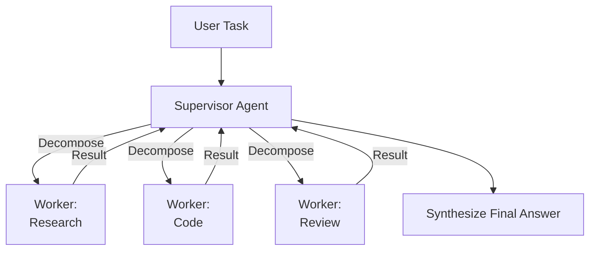

# Multi-Agent Systems

> **One-line summary**: Multi-agent systems improve capability and reliability on complex tasks by dividing work across specialized agents that coordinate through messages, delegation, or critique.

---

## 🎯 Intuition

### Core Idea
Multi-agent systems use multiple LLM-powered agents that collaborate, delegate, or debate to solve tasks that are too broad, too long, or too failure-prone for a single monolithic agent. Instead of one generalist doing everything, different agents can plan, code, review, research, or validate.

### Analogy
This is like **a team of specialists communicating via shared notes**. One person can try to do everything, but a coordinated team can split labor, parallelize work, and cross-check mistakes.

### Why It Matters
This mirrors how human organizations handle complexity. Multi-agent setups can provide specialization, parallel execution, and built-in review loops, but they also introduce coordination overhead and new failure modes.

---

## ⚙️ Core Mechanics

### How It Works
The simplest architecture is **supervisor-worker**: an orchestrator receives the task, decomposes it, delegates subtasks to specialists, gathers results, and synthesizes the final answer. This maps well to systems like AutoGen-style group managers.

**Figure:** Supervisor-worker multi-agent pattern — the supervisor decomposes tasks, delegates to specialists, and synthesizes results.

A second pattern is **peer-to-peer** coordination, where agents pass work directly among themselves in role-based or sequential chains. CrewAI-style workflows are a common example.

A third pattern is **debate/adversarial** coordination, where multiple agents propose and critique competing answers before converging.

### Key Specs
- **Supervisor-worker**: clear control flow, easy decomposition, but a central bottleneck
- **Peer-to-peer**: distributed coordination, but more handoff risk
- **Debate/adversarial**: improved checking and reasoning, but higher cost and latency
- **AutoGen (Microsoft)**: framework for multi-agent conversations with configurable roles and human-in-the-loop options
- **CrewAI**: role-based teams with sequential or hierarchical processes and shared memory patterns
- **Benefits**: specialization, parallelism, quality checks
- **Risks**: cascading errors, cost multiplication, coordination overhead

### Key Facts
- Multi-agent systems help most when the task naturally decomposes or benefits from adversarial review.
- The major practical problem is the **communication problem**: every handoff can lose or distort context.
- A single-agent system is often better for narrow, well-defined tasks.
- Multi-agent systems can also help when a single context window is too small for the whole task.

| Pattern | Coordination | Failure Mode | Best For |
| --- | --- | --- | --- |
| Supervisor-worker | Centralized | Supervisor bottleneck | Clear task decomposition, parallel subtasks |
| Peer-to-peer chain | Sequential handoff | Information loss at boundaries | Pipeline workflows (research → write → edit) |
| Debate | Adversarial rounds | Cost explosion, consensus failure | Reasoning tasks, fact-checking, decision-making |
| Swarm | Emergent | Unpredictable behavior | Exploratory tasks, brainstorming |

---

## 🔬 Deep Dive

### Technical Details
In **supervisor-worker** systems, the supervisor handles high-level reasoning and routing while workers focus on narrower tasks. This makes specialization easy, but if the supervisor decomposes the task poorly, downstream work is wasted.

In **peer-to-peer** systems, failure is more distributed, but so is ambiguity. Each message must carry enough context for the next agent to act correctly. Information loss at handoff boundaries is one of the biggest reasons these systems underperform in practice.

In **debate** systems, adversarial pressure can improve reasoning accuracy because agents critique one another's mistakes. Research has shown benefits on math and logic tasks, but cost and latency multiply because several agents are effectively thinking at once.

### Limitations
- More agents do not automatically mean better performance.
- Message passing can amplify hallucinations or omissions.
- Coordination overhead can outweigh the benefit on simple tasks.

### Impact
Multi-agent systems are one of the main scaling ideas for LLM automation: not just bigger models, but better division of labor. Their usefulness depends on whether the capability gain exceeds the coordination cost.

---

## 🏋️ Practice

### Warm-Up
1. What problem is a multi-agent system trying to solve that a single agent may struggle with?
2. What is the simplest multi-agent architecture?
3. Why can handoffs between agents be dangerous?

### Core Problems
1. Compare supervisor-worker, peer-to-peer, and debate architectures.
2. Explain when multi-agent systems outperform a single well-prompted agent.
3. Describe the communication problem and how it can degrade results.

### Challenge
Design a multi-agent workflow for software engineering with separate planning, coding, testing, and review agents. Explain when you would keep the system multi-agent and when you would collapse it back to a single agent for efficiency.

---

## Supporting Chunks
*(To be populated as chunks are created)*

---

## See Also

- [[Function Calling]] — agents invoke tools via structured function calls
- [[Chain-of-Thought Prompting]] — reasoning traces guide agent planning steps
- [[Reinforcement Learning from Human Feedback]] — aligning agent behavior to human preferences
- [[Few-Shot Prompting]] — in-context examples shape agent behavior
- [[Instruction Tuning]] — instruction-following capability that enables agents

---

## References
- [[LLM/Sources/Sources Index]]
