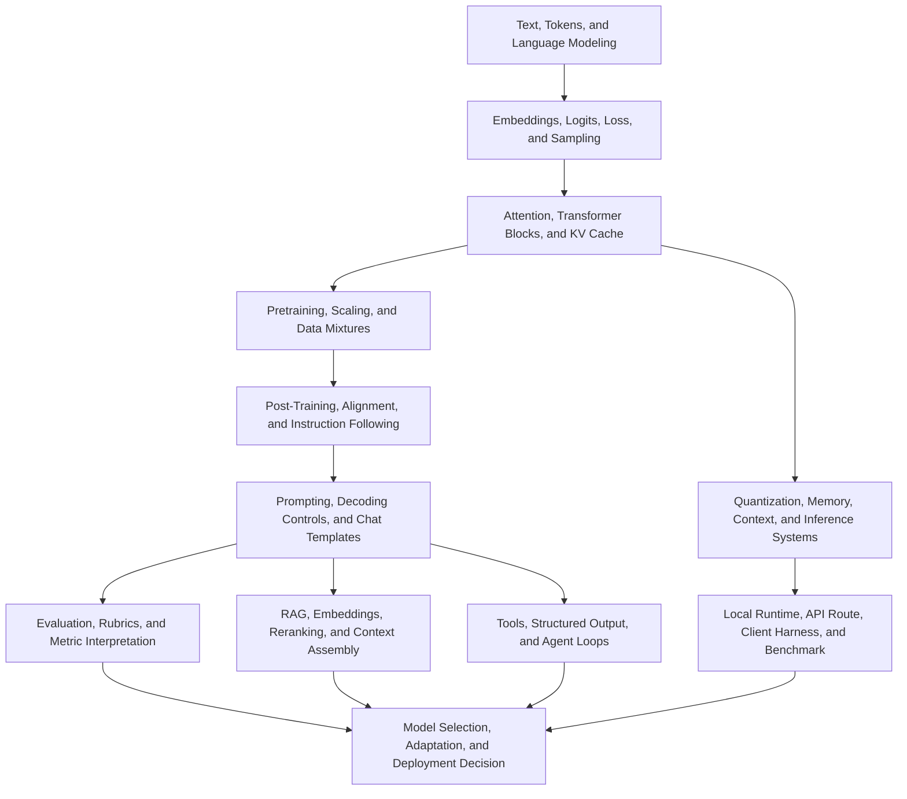

# LLM Concept Dependency Map

> **One-line summary** This map shows what has to be understood before each LLM skill becomes reliable: text and tokens, transformer mechanisms, training and alignment, evaluation, RAG/tools, and local inference operations.

Use this with [[LLM/Study/LLM Mastery Roadmap|LLM Mastery Roadmap]], [[LLM/Study/LLM Mastery Study Cadence|LLM Mastery Study Cadence]], and [[LLM/Study/LLM Mastery Capstone Workbook|LLM Mastery Capstone Workbook]]. The roadmap says the gates. This map says the dependency order and the failure route.

The rule: if a practical proof fails, move backward to the lowest unproven concept or layer. Do not change model, runtime, prompt, sampler, hardware, and evaluation all at once.

## Mastery Graph

Do not read the graph as a strict calendar. Read it as a debugging graph. A serving failure can come from a low-level environment issue. A bad answer can come from model capability, prompt format, retrieval miss, evaluation weakness, or post-training mismatch.

## Dependency Ladder

| Layer | You need this before | Vault route | Proof artifact |
|---|---|---|---|
| Text and tokenization | You interpret prompts, context windows, and tokenizer failures | [[LLM/Pre-2017 — Before Transformers/Tokenization]], [[LLM/Study/LLM Inference Request Lifecycle Lab]] | Token-to-logit sketch or request lifecycle row |
| Language modeling objective | You understand why generation is next-token prediction | [[LLM/Pre-2017 — Before Transformers/Language Modeling Objectives]], [[LLM/Study/LLM Math and Tensor Shape Primer]] | Shifted target and cross-entropy explanation |
| Attention and transformer blocks | You diagnose KV cache, prefill, prompt length, and local memory pressure | [[LLM/2017 — The Transformer/Attention Mechanism]], [[LLM/Study/Attention Implementation Lab]] | Attention implementation or tensor-shape proof |
| Training and scaling | You compare model size, data, compute, and inference economics | [[LLM/Study/LLM Training Pipeline Map]], [[LLM/2020–2021 — The Scaling Era/Scaling Laws]] | Capability trace or tiny decoder training run |
| Post-training and alignment | You explain why an instruct model behaves differently from a base model | [[LLM/2022 — Alignment and Chat/Instruction Tuning]], [[LLM/2022 — Alignment and Chat/Reinforcement Learning from Human Feedback]], [[LLM/2022 — Alignment and Chat/Direct Preference Optimization]] | SFT/RLHF/DPO comparison row |
| Prompting and decoding | You run comparable local quality tests | [[LLM/Study/Decoding and Sampling Controls Lab]], [[LLM/Study/Chat Template and Tokenizer Compatibility Lab]] | Sampler and chat-template rows |
| Metric interpretation | You avoid confusing benchmark score, latency, memory, and quality | [[LLM/Study/LLM Metrics and Evaluation Interpretation Guide]], [[LLM/Study/Local LLM Quality Evaluation Harness]] | Metric card and scored prompt-suite row |
| RAG and retrieval | You build grounded local assistants | [[LLM/Study/Local RAG Assistant Lab]], [[LLM/Study/Local RAG Retrieval Evaluation and Reranking Lab]], [[LLM/Study/Local RAG Minimal Python Harness]] | Corpus, retrieval, citation, refusal, and failure artifacts |
| Tools and structure | You trust local tool calls or JSON output | [[LLM/Study/Local LLM Tool Calling and Structured Output Lab]] | Tool schema, validation, execution, and denied-action rows |
| Local inference systems | You host a model and explain latency/memory | [[LLM/Study/Local LLM Windows First-Run Quickstart]], [[LLM/Study/Local LLM Command Cookbook]], [[LLM/Study/Local LLM Serving Runbook]] | First response, route proof, benchmark row |
| Operations and safety | You keep a local endpoint maintainable and private | [[LLM/Study/Local LLM Observability and Operations Runbook]], [[LLM/Study/Local LLM Security and Privacy Runbook]], [[LLM/Study/Local LLM Service Lifecycle and Upgrade Runbook]] | Observability, security, lifecycle, and rollback rows |
| Deployment decision | You choose local, hosted, hybrid, or batch responsibly | [[LLM/Study/LLM Deployment Decision Matrix]], [[LLM/Study/LLM Adaptation and Fine-Tuning Decision Guide]] | Deployment memo and adaptation/no-train decision |

## Academic Mechanism To Applied Skill

| Academic mechanism | Applied local skill | If this is weak, the practical symptom is |
|---|---|---|
| Tokenization | Count prompt tokens, compare tokenizer behavior, avoid stop-token mistakes | Unexpected truncation, bad role handling, unstable output boundaries |
| Cross-entropy and next-token prediction | Explain why local APIs return sampled continuations, not database facts | Treating a fluent answer as evidence without evaluation |
| Attention | Understand context interactions and why long prompts cost more | Slow first token, long-context OOM, poor explanation of prefill |
| KV cache | Estimate memory growth with context and concurrency | OOM only after longer prompts or more clients |
| Scaling laws and Chinchilla-style trade-offs | Choose small plausible local models before chasing the largest loadable one | Large model barely loads, smaller candidate was never tested |
| Quantization | Compare memory, speed, and quality rather than file size alone | Fast but wrong output, load failures, poor model/runtime match |
| Instruction tuning and RLHF | Prefer instruct/chat artifacts for assistant behavior | Base model ignores roles or gives completion-style answers |
| DPO and preference optimization | Separate preference behavior from factual correctness | Polite or confident answer passes despite wrong content |
| RAG | Ground private or changing knowledge in retrieved context | Hallucinated citations, unsupported facts, retrieval miss |
| Tool use | Bind model output to schema, policy, and execution evidence | Unsafe command, malformed JSON, unbounded retry loop |
| Evaluation science | Use multiple metrics and workload rubrics | One benchmark or one smoke prompt decides too much |
| Serving systems | Separate prefill, decode, queueing, batching, and cache behavior | Random tuning without knowing the bottleneck |

## Backward Debug Map

Use this when a local experiment fails. Start at the observed symptom, then move left until you find the first unproven dependency.

| Symptom | First dependency to check | Then check | Evidence route |
|---|---|---|---|
| No local server response | Runtime boundary and listener | Process, port, host, firewall, WSL/Docker route | [[LLM/Study/Local LLM Environment Preflight Lab]], [[LLM/Study/Local LLM Troubleshooting Decision Tree]] |
| `/v1/models` works but chat fails | Route and model id | Chat endpoint, required headers, request schema | [[LLM/Study/Local LLM OpenAI-Compatible API Contract Lab]] |
| Model loads but answers as plain completion | Chat template and tokenizer | Base vs instruct artifact, role markers, stop policy | [[LLM/Study/Chat Template and Tokenizer Compatibility Lab]] |
| Output quality is weak | Workload and model selection | Prompt, examples, RAG need, rubric, model class | [[LLM/Study/Local LLM Workload to Model Selection Playbook]], [[LLM/Study/Local LLM Quality Evaluation Harness]] |
| First token is slow | Prompt tokens and prefill | Retrieval size, system prompt, queueing, prompt cache | [[LLM/Study/Local LLM Context Window and Token Budgeting Lab]], [[LLM/Study/Local LLM Serving Internals and Scheduler Lab]] |
| Later tokens are slow | Decode bottleneck | Model size, quantization, CPU/GPU offload, backend | [[LLM/Study/Local LLM Quantization and GPU Offload Lab]], [[LLM/Study/Local LLM Runtime Comparison Lab]] |
| Long prompts fail | KV cache and context budget | Output reserve, batch size, concurrency, retrieved chunks | [[LLM/Study/Local LLM Context Window and Token Budgeting Lab]] |
| RAG answer is unsupported | Retrieval and context assembly | Chunking, embeddings, reranking, citation rule | [[LLM/Study/Local RAG Retrieval Evaluation and Reranking Lab]] |
| Tool output is unsafe or malformed | Tool schema and policy | Validation, allowlist, denied-action row, retry cap | [[LLM/Study/Local LLM Tool Calling and Structured Output Lab]] |
| Endpoint works today but not after restart | Service lifecycle | Startup mode, cache path, model revision, rollback | [[LLM/Study/Local LLM Service Lifecycle and Upgrade Runbook]] |

## Study Path By Objective

| Objective | Minimal dependency path |
|---|---|
| Explain how LLMs work | Tokenization -> logits/loss -> attention -> transformer blocks -> pretraining -> post-training -> evaluation |
| Read core papers | Field timeline -> paper protocol -> 20-paper synthesis map -> mechanism-to-inference bridge |
| Implement core mechanisms | Math primer -> attention lab -> tiny decoder training -> training pipeline map |
| Host first local model | Environment preflight -> Windows quickstart -> command cookbook -> first evidence pack -> serving runbook |
| Compare local runtimes | Model selection -> compatibility matrix -> command cookbook -> benchmark log -> runtime comparison |
| Diagnose local inference failure | Runtime stack anatomy -> troubleshooting tree -> lowest unproven layer -> one controlled retest |
| Build local RAG | Endpoint proof -> embedding/reranker proof -> retrieval evaluation -> RAG harness -> quality harness |
| Use local tools safely | API contract -> structured output/tool lab -> security runbook -> quality harness |
| Decide deployment | Benchmark log -> quality harness -> security runbook -> lifecycle runbook -> deployment matrix |

## Oral Check

You understand the dependency map when you can answer these without opening notes:

1. How does text become token IDs, logits, probabilities, and sampled output?
2. Why does attention create both capability and inference cost?
3. Why can a chat-template problem look like a weak model?
4. What is the difference between prefill latency and decode throughput?
5. Why can quantization improve feasibility while reducing quality?
6. What does a local smoke response prove, and what does it not prove?
7. When should a local quality failure be fixed with prompting, RAG, model swap, fine-tuning, or deployment change?
8. Which evidence proves a local endpoint is safe to expose beyond loopback?

## Completion Gate

This map has served its purpose when:

- [ ] each roadmap level has a matching concept dependency and proof artifact
- [ ] the capstone workbook links at least one proof for concept, mechanism, implementation, local inference, RAG/tools, evaluation, operations, and deployment
- [ ] every failed local inference experiment is routed to a lowest unproven dependency
- [ ] the self-assessment misses are remediated by moving backward in this map instead of rereading randomly

## References

- [[LLM/Study/LLM Mastery Roadmap]]
- [[LLM/Study/LLM Mastery Study Cadence]]
- [[LLM/Study/LLM Mastery Capstone Workbook]]
- [[LLM/Study/LLM Mastery Self-Assessment Exam]]
- [[LLM/Study/LLM Paper Reading Protocol]]
- [[LLM/Study/LLM 20-Paper Fast Path Synthesis Map]]
- [[LLM/Study/LLM Mechanism-to-Inference Bridge Map]]
- [[LLM/Study/LLM Math and Tensor Shape Primer]]
- [[LLM/Study/LLM Training Pipeline Map]]
- [[LLM/Study/LLM Metrics and Evaluation Interpretation Guide]]
- [[LLM/Study/Local LLM Hands-On Practicum Sequence]]
- [[LLM/Study/Local LLM Command Cookbook]]
- [[LLM/Study/Local LLM Troubleshooting Decision Tree]]
