# LLM Training Pipeline Map

> **One-line summary** A modern LLM is built through a sequence of data, objective, optimization, evaluation, and deployment gates: pretraining teaches broad prediction, post-training shapes behavior, and inference systems expose the result under real constraints.

Use this as the bridge between academic training mechanisms and applied model operation. It connects [[LLM/Pre-2017 — Before Transformers/Language Modeling Objectives|Language Modeling Objectives]], [[LLM/2018–2019 — Pretrained Language Models/Data Curation and Deduplication|Data Curation and Deduplication]], [[LLM/2020–2021 — The Scaling Era/Training Infrastructure and Parallelism|Training Infrastructure and Parallelism]], [[LLM/2018–2019 — Pretrained Language Models/Supervised Fine-Tuning|Supervised Fine-Tuning]], [[LLM/2022 — Alignment and Chat/Reinforcement Learning from Human Feedback|Reinforcement Learning from Human Feedback]], [[LLM/2022 — Alignment and Chat/Direct Preference Optimization|Direct Preference Optimization]], and [[LLM/Study/LLM Adaptation and Fine-Tuning Decision Guide|LLM Adaptation and Fine-Tuning Decision Guide]].

The goal is not to memorize every training recipe. The goal is to identify which stage is responsible for a capability, which artifact proves it worked, and which failure mode belongs to that stage.

## Pipeline Overview

```mermaid
flowchart LR
    raw["Raw sources"] --> curate["Curation\nfilter, dedupe, mix"]
    curate --> pretrain["Pretraining\nobjective + scale"]
    pretrain --> eval1["Base eval\nloss, benchmarks, probes"]
    eval1 --> sft["Instruction/SFT\nbehavior examples"]
    sft --> pref["Preference training\nRLHF, DPO, CAI"]
    pref --> adapt["Specialization\nRAG, LoRA, QLoRA, distill"]
    adapt --> deploy["Deployment\nserving, safety, monitoring"]
    deploy --> eval2["Live eval\nquality, drift, incidents"]
```

## Stage Map

| Stage | Input | Objective | Output | What it teaches |
|---|---|---|---|---|
| Data curation | Web, books, code, papers, chat, domain corpora | Filtering, deduplication, source mix | Training corpus | What the model can learn from |
| Tokenization | Text corpus | Stable reversible token IDs | Vocabulary and token stream | Unit of prediction and context accounting |
| Pretraining | Large token stream | Causal LM, MLM, span corruption, FIM, or denoising | Base model | Language, facts, patterns, latent skills |
| Scaling and infrastructure | Model, data, compute budget | Efficient distributed optimization | Checkpoints | Whether the run can finish stably |
| Base evaluation | Held-out data and benchmarks | Loss, capability, contamination, safety probes | Model report | What the base model can and cannot do |
| Instruction tuning / SFT | Prompt-response demonstrations | Cross-entropy on desired completions | Instruction-following model | Format, style, task behavior |
| Preference optimization | Pairwise or binary feedback | Reward modeling + PPO, DPO, KTO, ORPO, or CAI | Aligned assistant | Human preference, refusal style, helpfulness |
| Adaptation | Task data, corpus, adapters, teacher outputs | Prompting, RAG, LoRA, QLoRA, distillation, continued pretraining | Specialized system or model | Workload fit |
| Deployment | Weights, runtime, prompts, tools, policy | Serve under latency, cost, privacy, and safety constraints | Product or local assistant | Operational usefulness |
| Monitoring | Logs, eval suites, incidents, feedback | Regression and drift detection | Iteration plan | What must be fixed next |

## Data Types And Training Signals

| Data type | Used for | Typical signal | Main risk |
|---|---|---|---|
| Raw web/text/code | Pretraining | Next-token or reconstruction loss | Noise, duplication, bias, memorization |
| Curated domain corpus | Continued pretraining or RAG | Domain language modeling or retrieval | Stale knowledge, narrow bias, privacy |
| Demonstrations | SFT and instruction tuning | Correct response likelihood | Style overfitting, shallow coverage |
| Preference pairs | RLHF, DPO, ranking eval | Chosen response should beat rejected response | Label noise, reward hacking, preference drift |
| Constitutional critiques | CAI/RLAIF | Revise against explicit principles | Principle gaps, model self-bias |
| Tool traces | Tool-use training or eval | Correct tool selection and result use | Unsafe execution if policy is externalized |
| Teacher outputs | Distillation | Student imitates teacher answer or reasoning trace | Teacher errors copied into student |
| Held-out eval prompts | Evaluation only | Pass/fail, score, pairwise preference | Leakage if reused during training |

## Objective Map

| Objective | Core idea | Best fit | Watch for |
|---|---|---|---|
| Causal LM | Predict the next token from previous tokens | Decoder-only generation models | Weak bidirectional representation compared with encoders |
| Masked LM | Predict hidden tokens from bidirectional context | Encoders and embeddings | Awkward generation |
| Span corruption / denoising | Reconstruct missing or corrupted spans | Encoder-decoder models | More complex training format |
| Fill-in-the-middle | Generate missing middle from prefix and suffix | Code and infilling | Requires special formatting and eval |
| SFT cross-entropy | Increase likelihood of target completions | Instruction following and formats | Memorization and forgetting |
| Reward model loss | Learn scalar preference score | RLHF | Reward model becomes bottleneck |
| PPO with KL | Optimize policy against reward while staying near reference | Online preference optimization | Instability, reward hacking |
| DPO-style loss | Prefer chosen over rejected relative to reference model | Offline preference optimization | Distribution shift in fixed data |
| Distillation loss | Student imitates teacher outputs or traces | Smaller/cheaper deployment | Inherits teacher weaknesses |

## What Each Stage Cannot Fix

| Stage | Does not solve |
|---|---|
| More pretraining | Current facts, private document grounding, tool permissions, or deployment safety |
| More SFT | Bad retrieval, missing evidence, reward hacking, or weak base capability |
| More preference optimization | Factual grounding, private-data access, or systematic tool-policy enforcement |
| More RAG | Bad instruction following, weak reasoning, tokenizer mismatch, or slow runtime |
| More LoRA/QLoRA | Missing source material, bad eval design, or unsafe application permissions |
| More serving optimization | Low model quality, bad data, or hallucinated citations |

## Evaluation Gates

| Gate | Minimum evidence |
|---|---|
| Corpus gate | Source mix, filtering, deduplication, privacy boundary, and contamination policy |
| Pretraining gate | Objective, context length, token count, compute estimate, loss curve, and held-out loss |
| Instruction gate | Demonstration data shape, chat template, held-out tasks, format and safety checks |
| Preference gate | Preference source, agreement/noise estimate, reward or DPO eval, and bias checks |
| Adaptation gate | Failure mode, chosen method, held-out suite, rollback, and regression checks |
| Deployment gate | Runtime, benchmark, quality harness, security boundary, cost, and owner |

## Failure Diagnosis

| Symptom | Likely stage to inspect first |
|---|---|
| Model cannot speak the domain language | Pretraining data, domain corpus, or continued pretraining |
| Model knows facts but ignores requested format | SFT, prompt template, constrained output, or chat template |
| Model is verbose and agreeable but wrong | Preference optimization and quality eval |
| Model cites unsupported documents | RAG retrieval, context assembly, and citation evaluation |
| Model fails private/current questions | RAG or tool access, not weight training |
| Model is too slow or too expensive | Deployment, quantization, distillation, or smaller model choice |
| Model regresses after fine-tuning | Data mix, overfitting, catastrophic forgetting, and held-out eval |
| Model passes benchmark but fails workload | Evaluation design and contamination control |

## Mini-Lab

Use this as the applied proof that the training pipeline is not just vocabulary.

1. Pick one model behavior you care about, such as instruction following, citation grounding, coding format, refusal behavior, or domain terminology.
2. Identify which pipeline stage most likely created that behavior.
3. Use [[LLM/Study/Tiny Decoder-Only Transformer Training Lab|Tiny Decoder-Only Transformer Training Lab]] to run one toy next-token training loop and record shifted targets, loss, validation loss, and generated samples.
4. Name the evidence that would prove the stage worked: corpus metadata, loss curve, held-out prompt suite, preference eval, quality harness, benchmark row, or deployment check.
5. Name one tempting but wrong fix from another stage.
6. Write a one-paragraph diagnosis explaining whether the next change should be data, objective, evaluation, adaptation, retrieval, serving, or deployment policy.

## Completion Gate

You understand the training pipeline when you can:

- trace raw data to tokenization, pretraining, SFT, preference optimization, adaptation, and deployment
- explain the objective and artifact at each stage
- assign a failure to the right stage before proposing a fix
- explain why evaluation and held-out data are not optional
- connect training-stage decisions to local hosting, inference cost, privacy, and rollback

## References

- [[LLM/Sources/Sources Index]]
- [[LLM/Study/LLM Mastery Roadmap]]
- [[LLM/Study/LLM Mastery Capstone Workbook]]
- [[LLM/Study/LLM Mastery Self-Assessment Exam]]
- [[LLM/Study/Tiny Decoder-Only Transformer Training Lab]]
- [[LLM/Study/LLM Adaptation and Fine-Tuning Decision Guide]]
- [[LLM/Study/LLM Deployment Decision Matrix]]
- [[LLM/Study/Local LLM Quality Evaluation Harness]]
- [[LLM/Pre-2017 — Before Transformers/Language Modeling Objectives]]
- [[LLM/2018–2019 — Pretrained Language Models/Data Curation and Deduplication]]
- [[LLM/2018–2019 — Pretrained Language Models/Supervised Fine-Tuning]]
- [[LLM/2018–2019 — Pretrained Language Models/Domain Adaptation]]
- [[LLM/2018–2019 — Pretrained Language Models/Distillation and Model Compression]]
- [[LLM/2020–2021 — The Scaling Era/Scaling Laws]]
- [[LLM/2020–2021 — The Scaling Era/Training Infrastructure and Parallelism]]
- [[LLM/2020–2021 — The Scaling Era/Contamination and Data Leakage]]
- [[LLM/2020–2021 — The Scaling Era/LoRA and QLoRA]]
- [[LLM/2022 — Alignment and Chat/Instruction Tuning]]
- [[LLM/2022 — Alignment and Chat/Reinforcement Learning from Human Feedback]]
- [[LLM/2022 — Alignment and Chat/Direct Preference Optimization]]
- [[LLM/2022 — Alignment and Chat/Constitutional AI]]
- [[LLM/2022 — Alignment and Chat/Alignment Objectives and Failure Modes]]
- [[LLM/2023 — Open Models and Agents/RAG Evaluation and Failure Modes]]
