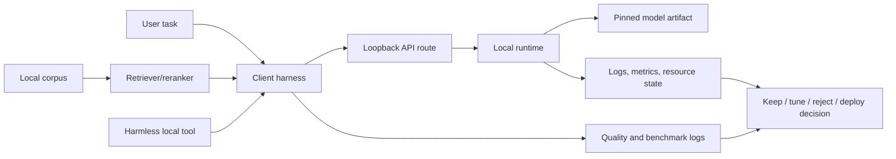

# Local LLM Capstone Project Blueprint

> **One-line summary** The LLM capstone is a small local assistant that you can explain academically, run through a local endpoint, evaluate against a workload, secure on loopback, and operate with evidence.

Use this after [[LLM/Study/LLM Mastery Roadmap|LLM Mastery Roadmap]] has given you the gates and before filling the final rows in [[LLM/Study/LLM Mastery Capstone Workbook|LLM Mastery Capstone Workbook]]. The workbook is the ledger. This blueprint is the project spec. Use [[LLM/Study/LLM Deployment Readiness Audit Runner|LLM Deployment Readiness Audit Runner]] before accepting the final deployment memo, then use [[LLM/Study/LLM Mastery Evidence Audit Runner|LLM Mastery Evidence Audit Runner]] after the full evidence bundle exists to check academic, mechanism, local-inference, system, and exam gates before final defense.

The goal is not to build the largest possible system. The goal is to prove that you can connect paper claims, transformer mechanisms, model artifacts, local runtime behavior, client inference, RAG or tools, quality evaluation, and operations decisions in one defensible local project.

## Capstone Thesis

Build and defend:

```text
a loopback-only local LLM assistant
that serves one pinned model artifact
through one reproducible client harness
for one named workload
with one optional extension path: RAG, tools, or both
and one evidence bundle proving quality, performance, safety, and operations
```

If any noun in that sentence is vague, the project is not ready for final defense.

## Architecture



The minimal capstone can omit RAG and tools only if the deployment decision explains why. A stronger capstone includes one small RAG path and one harmless tool path because those force you to separate model behavior from system behavior.

## Build Phases

| Phase | Deliverable | Main evidence route |
|---|---|---|
| 0. Academic defense | Paper claims, mechanisms, and metric interpretation are linked. | [[LLM/Study/LLM Paper Claim Ledger]] |
| 1. Workload contract | One user task, success rubric, privacy boundary, latency target, and failure tolerance. | [[LLM/Study/Local LLM Workload to Model Selection Playbook]] |
| 2. Machine preflight | OS, shell, CPU/RAM, GPU/VRAM, disk, runtime boundary, and port plan. | [[LLM/Study/Local LLM Environment Preflight Lab]] |
| 3. Windows storage and runtime gate | Model-store decision, Ollama install source, new-shell PATH, version, logs, and listener boundary are captured before model pull. | [[LLM/Study/Local LLM Windows Runtime Install Gate]] |
| 4. Model custody | Model card, license, artifact, revision, format, local path, safety decision, and first Ollama pull metadata when using Ollama. | [[LLM/Study/Local LLM Model Acquisition and Provenance Checklist]] and [[LLM/Study/Local LLM First Model Pull Gate]] |
| 5. Runtime compatibility | Tokenizer, chat template, quantization, runtime, route, workload fit, and repeatable template/tokenizer audit when behavior matters. | [[LLM/Study/Local LLM Runtime and Model Compatibility Matrix]] and [[LLM/Study/Chat Template and Tokenizer Compatibility Runner]] |
| 6. First endpoint | CLI or server response plus loopback HTTP proof after install and model-pull gates pass, then a checked first endpoint evidence audit. | [[LLM/Study/Local LLM First Endpoint Run Sheet]] and [[LLM/Study/Local LLM First Endpoint Evidence Audit Runner]] |
| 7. Client and app integration | Reproducible script or client wrapper with request, response, timing, errors, app boundary, user flow, response handling, failure behavior, privacy/logging, evaluation, operations, and promotion evidence. | [[LLM/Study/Local LLM Client Harness Lab]] and [[LLM/Study/Local LLM Application Integration Evidence Runner]] |
| 8. Metric interpretation | TTFT, TPOT, total latency, tokens, memory, queue, quality, and next action. | [[LLM/Study/Local LLM Inference Metrics Field Guide]] |
| 9. Quality gate | Evaluation-set design is audited before workload prompts are scored pass/hold/fail with failure owners; LLM-as-judge rows have calibration proof before they support decisions. | [[LLM/Study/Local LLM Evaluation Set Design Runner]], [[LLM/Study/Local LLM Quality Evaluation Harness]], and [[LLM/Study/Local LLM Judge Calibration Runner]] |
| 10. RAG extension | Corpus, chunks, embedding/reranker proof, retrieval, citations, and refusal. | [[LLM/Study/Local RAG Minimal Python Harness]] |
| 11. Tool extension | Tool schema, validation, policy decision, execution log, and bounded retry. | [[LLM/Study/Local LLM Tool Calling and Structured Output Lab]] |
| 12. Security and privacy | Loopback binding, logs, data boundary, RAG corpus boundary, tool permissions. | [[LLM/Study/Local LLM Security and Privacy Runbook]] |
| 13. Operations | Loaded-model state, logs/metrics, resource pressure, restart, upgrade, rollback plan. | [[LLM/Study/Local LLM Observability and Operations Runbook]] |
| 14. Result synthesis and deployment decision | Local evidence is reconciled into keep/tune/reject/deploy readiness, then local CPU/GPU, self-hosted, hosted API, hybrid, or batch path is chosen with rejected alternative. | [[LLM/Study/Local LLM Result Synthesis Runner]] and [[LLM/Study/LLM Deployment Decision Matrix]] |
| 15. Deployment readiness audit | Machine-checkable audit of workload, selected path, model/runtime, endpoint, benchmark, quality, privacy, operations, cost, rejected alternative, and retest proof. | [[LLM/Study/LLM Deployment Readiness Audit Runner]] |

Do not reorder phases 1 through 7. You need a workload before a model, model-store and runtime evidence before first pull, model custody before serving, and endpoint proof before client/RAG/tool claims.

## Evidence Bundle

Create one dated capstone note or folder with these links:

| Evidence item | Required content |
|---|---|
| Academic proof | Paper claim ledger rows, paper claim audit output, mechanism bridge rows, metric interpretation row. |
| Workload card | Task, users, data boundary, success rubric, latency target, quality floor, rejection trigger. |
| Runtime install card | Model-store decision, installer source, new-shell PATH, version, listener boundary, log paths, rollback route. |
| Model card | Model source, license, artifact, revision/tag/file, local path, quantization, tokenizer/template. |
| Model pull card | Selected tag, source check, pull output, `ollama ls`, `/api/tags`, `/api/show`, pass/hold/fail handoff. |
| Template/tokenizer compatibility proof | Model package, tokenizer, special tokens, chat template, rendered prompt or non-exposure control, route behavior, tokenizer sanity counts, stop/role boundary, and benchmark or quality link. |
| Endpoint proof | Startup command, route, model id, loopback URL, request body, response excerpt, timing, and first endpoint evidence audit output. |
| Failure triage proof | Any failed local run has symptom, failed layer, proof link, mechanism owner, ruled-out layers, and one controlled next action from [[LLM/Study/Local LLM Failure Triage Runner|Local LLM Failure Triage Runner]]. |
| Client proof | Script/config path, request settings, non-streaming or streaming result, error handling. |
| Open WebUI proof | When Open WebUI is used, UI identity, loopback boundary, provider route, expected model visibility, transcript, persistent data path, secret-key proof, redacted config/logs, and handoffs from [[LLM/Study/Local Open WebUI Provider Integration Runner|Local Open WebUI Provider Integration Runner]]. |
| Application integration proof | App contract, endpoint contract, client flow, user flow, response handling, failure behavior, privacy/logging, evaluation handoff, operations handoff, and promotion decision from [[LLM/Study/Local LLM Application Integration Evidence Runner|Local LLM Application Integration Evidence Runner]]. |
| Benchmark proof | Prompt id, prompt/output tokens, TTFT, TPOT, tokens/sec, total latency, memory, decision. |
| Scheduler proof | Scheduler evidence audit output when concurrency, queue, cache, long-prompt, or serving-policy decisions affect the project. |
| Evaluation set design proof | Workload, decision scope, required task classes, held-out/private rows, contamination controls, expected behavior, rubric, pass criteria, refresh plan, and downstream routes. |
| Quality proof | Prompt suite, rubric, pass/hold/fail, failure owner, next controlled action. |
| Judge calibration proof | Human review, AB and BA judge rows, agreement rate, position-bias signal, verbosity-bias signal, and next route when LLM-as-judge evidence is used. |
| RAG proof | Corpus manifest, chunk policy, embedding/reranker route, top-k evidence, cited answer, refusal. |
| Tool proof | Schema, validated args, policy check, execution output, injected result, denied unsafe action. |
| Security proof | Loopback binding, log boundary, RAG data boundary, tool permission boundary. |
| Operations proof | Logs/metrics, resource state, restart check, backup/rollback, retest trigger. |
| Result synthesis proof | Selected candidate, evidence contradictions, missing proof, rejected alternative, review trigger, and keep/tune/reject/deploy decision. |
| Deployment readiness audit | JSON/Markdown/CSV audit output proving the final deployment memo has complete or explicitly waived evidence rows. |
| Mastery audit proof | JSON/Markdown audit output with no critical academic, mechanism, local-inference, system, or exam gaps. |
| Final memo | Decision, rejected alternative, known limits, next version. |

## Minimum Project

The smallest acceptable project is:

1. One local model served on loopback.
2. One model-store, runtime-install, and first-model-pull evidence chain before the endpoint proof.
3. One client harness call with frozen request settings and one application integration audit when the endpoint is wired into an app, CLI, UI, job, RAG assistant, or tool loop.
4. One benchmark row, one evaluation set design audit, and one quality row; when LLM-as-judge is used, one judge calibration audit.
5. One academic explanation tying the observed behavior to tokenization, prefill/decode, KV cache, quantization, sampling, or evaluation.
6. One security row proving the endpoint did not leave loopback.
7. One result synthesis output and one deployment memo rejecting at least one alternative.
8. One deployment readiness audit output or linked remediation row.

This minimum proves local inference. It does not prove RAG, tools, multi-user serving, or maintainable operations.

## Strong Project

A strong project adds:

- one local RAG corpus with retrieval evidence and citation audit
- one harmless local tool with schema validation and policy denial
- one runtime comparison or quantization/offload comparison
- one context-budget row for a long or RAG prompt
- one scheduler evidence audit when concurrency, queue, cache, or long-prompt policy affects the workload
- one observability row with logs or metrics and resource pressure
- one lifecycle row with restart, backup, upgrade, rollback, and post-change validation

This version proves that you can build an LLM system, not just call a model.

## Defense Questions

You should be able to answer these without searching:

| Question | Expected answer route |
|---|---|
| Which paper claim explains the project architecture? | [[LLM/Study/LLM Paper Claim Ledger]] |
| How do you know the paper claim set is complete enough to defend? | [[LLM/Study/LLM Paper Claim Audit Runner]] |
| Which transformer mechanism explains the main local bottleneck? | [[LLM/Study/LLM Mechanism-to-Inference Bridge Map]] |
| Why was this model chosen instead of a larger or smaller one? | [[LLM/Study/Local LLM Workload to Model Selection Playbook]] |
| What exact artifact was served? | [[LLM/Study/Local LLM Model Acquisition and Provenance Checklist]] |
| How do you know the client called the intended local route? | [[LLM/Study/Local LLM OpenAI-Compatible API Contract Lab]] |
| How do you know the local model path works through the actual app boundary? | [[LLM/Study/Local LLM Application Integration Evidence Runner]] |
| If the local run failed, how did you know which layer failed first? | [[LLM/Study/Local LLM Failure Triage Runner]] |
| What metric made you keep, tune, or reject the setup? | [[LLM/Study/Local LLM Inference Metrics Field Guide]] |
| What scheduler evidence supports the queue, cache, or long-prompt policy? | [[LLM/Study/Local LLM Scheduler Evidence Audit Runner]] |
| What failed first when quality was weak? | [[LLM/Study/Local LLM Quality Evaluation Harness]] |
| If RAG is present, did retrieval or generation fail? | [[LLM/Study/Local RAG Retrieval Evaluation and Reranking Lab]] |
| If a tool is present, who authorized execution? | [[LLM/Study/Local LLM Tool Calling and Structured Output Lab]] |
| What prevents accidental exposure or data leakage? | [[LLM/Study/Local LLM Security and Privacy Runbook]] |
| What changes would force a retest? | [[LLM/Study/Local LLM Service Lifecycle and Upgrade Runbook]] |
| How do you know the deployment memo is ready to defend? | [[LLM/Study/LLM Deployment Readiness Audit Runner]] |

## Pass, Hold, Fail

| Decision | Meaning |
|---|---|
| Pass | The project has endpoint, client, benchmark, quality, safety, operations, and final decision evidence linked in the workbook. |
| Hold | The endpoint works, but quality, security, RAG/tool boundary, operations, or deployment decision is incomplete. |
| Fail | The model cannot be served, the client cannot reproduce inference, the quality gate fails without a controlled next action, or endpoint exposure is unsafe. |

Do not mark the capstone passed because a chat UI answered once. A single answer is endpoint evidence, not mastery evidence.

## Completion Gate

This blueprint is complete for one project when:

- [ ] one dated capstone note or folder links every required evidence item
- [ ] the academic proof explains at least one paper claim and one mechanism behind a local behavior
- [ ] the paper claim audit runner output is linked before paper claims support the capstone defense
- [ ] Windows first-run gates link model-store, runtime-install, and first-model-pull evidence when Ollama is the first runtime
- [ ] template/tokenizer compatibility runner output is linked before chat behavior, structured output, benchmark, quality, or deployment decisions rely on the endpoint
- [ ] the endpoint proof includes model id, runtime, route, request, response, and loopback boundary
- [ ] any failed local run has a failure triage runner output before benchmark, quality, or deployment evidence depends on the rerun
- [ ] the client proof is reproducible without UI-only steps
- [ ] any Open WebUI transcript has Open WebUI provider integration runner output before it supports app, lifecycle, security, or final capstone evidence
- [ ] any app, CLI, UI, job, RAG, or tool-loop integration has an application integration evidence runner output before result synthesis or deployment readiness
- [ ] the evaluation set design audit is linked before the full quality row
- [ ] benchmark and quality rows agree on a keep/hold/fail decision
- [ ] any LLM-as-judge quality row has calibration output before it supports the project decision
- [ ] scheduler evidence is audited when the project changes concurrency, queue, cache, long-prompt, or deployment policy
- [ ] RAG and tool paths are either proven or explicitly out of scope with a reason
- [ ] security, operations, lifecycle, and deployment rows have pass/hold/fail decisions
- [ ] [[LLM/Study/Local LLM Result Synthesis Runner|Local LLM Result Synthesis Runner]] output is linked before the deployment memo
- [ ] [[LLM/Study/LLM Deployment Readiness Audit Runner|LLM Deployment Readiness Audit Runner]] output is linked before accepting the final deployment memo
- [ ] [[LLM/Study/LLM Mastery Evidence Audit Runner|LLM Mastery Evidence Audit Runner]] has no critical gaps or links remediation rows
- [ ] [[LLM/Study/LLM Mastery Capstone Workbook|LLM Mastery Capstone Workbook]] links the final capstone note

## References

- [[LLM/Study/LLM Mastery Roadmap]]
- [[LLM/Study/LLM Mastery Capstone Workbook]]
- [[LLM/Study/LLM Mastery Self-Assessment Exam]]
- [[LLM/Study/LLM Mastery Evidence Audit Runner]]
- [[LLM/Study/LLM Paper Claim Ledger]]
- [[LLM/Study/LLM Paper Claim Audit Runner]]
- [[LLM/Study/LLM Mechanism-to-Inference Bridge Map]]
- [[LLM/Study/Local LLM End-to-End Mental Model]]
- [[LLM/Study/Local LLM Hands-On Practicum Sequence]]
- [[LLM/Study/Local LLM Workload to Model Selection Playbook]]
- [[LLM/Study/Local LLM Windows Model Store and Cache Plan]]
- [[LLM/Study/Local LLM Model Store Readiness Snapshot]]
- [[LLM/Study/Local LLM Windows Runtime Install Gate]]
- [[LLM/Study/Local LLM First Model Pull Gate]]
- [[LLM/Study/Local LLM First Endpoint Run Sheet]]
- [[LLM/Study/Local LLM First Endpoint Evidence Audit Runner]]
- [[LLM/Study/Local LLM Failure Triage Runner]]
- [[LLM/Study/Local LLM Scheduler Evidence Audit Runner]]
- [[LLM/Study/Local LLM Client Harness Lab]]
- [[LLM/Study/Local Open WebUI Provider Integration Runner]]
- [[LLM/Study/Local LLM Application Integration Evidence Runner]]
- [[LLM/Study/Local LLM Inference Metrics Field Guide]]
- [[LLM/Study/Local LLM Judge Calibration Runner]]
- [[LLM/Study/Chat Template and Tokenizer Compatibility Runner]]
- [[LLM/Study/Local LLM Evaluation Set Design Runner]]
- [[LLM/Study/Local LLM Quality Evaluation Harness]]
- [[LLM/Study/Local LLM Result Synthesis Runner]]
- [[LLM/Study/Local RAG Minimal Python Harness]]
- [[LLM/Study/Local LLM Tool Calling and Structured Output Lab]]
- [[LLM/Study/Local LLM Security and Privacy Runbook]]
- [[LLM/Study/Local LLM Observability and Operations Runbook]]
- [[LLM/Study/LLM Deployment Decision Matrix]]
- [[LLM/Study/LLM Deployment Readiness Audit Runner]]
