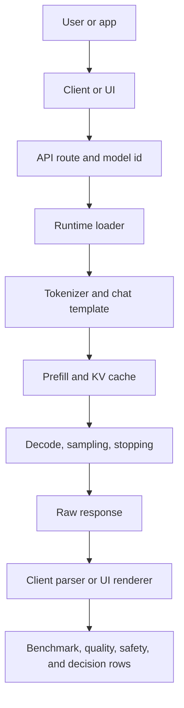

# Local LLM Runtime Stack Anatomy

> **One-line summary** A local LLM endpoint is a stack of contracts: hardware, OS boundary, package environment, model bytes, numeric format, tokenizer/template, runtime loader, scheduler/cache, API route, client/UI, workload, and operations evidence.

Use this after [[LLM/Study/Local LLM Environment Preflight Lab|Local LLM Environment Preflight Lab]] and before [[LLM/Study/Local LLM Runtime and Model Compatibility Matrix|Local LLM Runtime and Model Compatibility Matrix]], [[LLM/Study/Local LLM Serving Runbook|Local LLM Serving Runbook]], or [[LLM/Study/Local LLM Docker GPU Container Serving Lab|Local LLM Docker GPU Container Serving Lab]]. The preflight proves the machine. This note names the stack layers. The compatibility matrix decides whether a specific artifact fits a specific runtime.

Use [[LLM/Study/Local LLM Hands-On Practicum Sequence|Local LLM Hands-On Practicum Sequence]] when you want to execute these layers in order and leave proof at each stage.

Use [[LLM/Study/LLM Inference Request Lifecycle Lab|LLM Inference Request Lifecycle Lab]] when you want the inside of one request: prompt assembly, tokenization, prefill, decode, sampling, stopping, streaming, and measurement. Use this note when you want the outside of the endpoint: which layer owns the failure or proof.

## Stack Rule

Do not debug a higher layer until the lower layer has an evidence row.

If a local answer is bad, slow, missing, malformed, or unreachable, name the lowest unproven layer first. A model can look bad because the GPU is invisible, the wrong artifact loaded, the API route is wrong, the chat template is missing, the sampler changed, the client parsed the wrong field, or the UI points at a different provider.

## Stack Layers

| Layer | Contract | Evidence that proves it | Typical failure if missing |
|---|---|---|---|
| Hardware | CPU, RAM, GPU, VRAM, disk, and power budget exist for the run. | `nvidia-smi`, RAM/disk snapshot, explicit CPU-only note. | OOM, paging, slow decode, false GPU assumptions. |
| Runtime boundary | Windows, WSL, Docker, remote Linux, or desktop GUI is the actual place serving happens. | Shell path, container id, WSL distro, service account, listener host/port. | `localhost` confusion, missing GPU, wrong cache path. |
| Package environment | The runtime binary, Python env, container image, or desktop app is known. | Version, install path, image tag/digest, env name, launch command. | Import errors, kernel mismatch, hidden upgrades. |
| Model custody | The exact local model bytes are known and allowed. | Model card, license/gate, revision/tag/digest, cache path, hash or verification. | Wrong model, unsafe file, irreproducible rerun. |
| Artifact container | The file package matches the runtime. | HF directory, safetensors shards, GGUF, Ollama tag, MLX, GPTQ/AWQ, adapter. | Runtime refuses to load or silently uses another artifact. |
| Numeric format | Precision and quantization are explicit. | FP16/BF16/INT8/INT4/GGUF/GPTQ/AWQ/FP8 metadata and load log. | Quality loss, unsupported kernels, unexpected memory use. |
| Tokenizer/template | Text becomes the token sequence the model was trained to answer. | Tokenizer source, special-token check, chat template, rendered prompt if available. | Prompt continuation, role leaks, bad JSON, false quality failure. |
| Runtime loader | The engine can load the artifact on the intended hardware path. | Startup log, model list route, loaded-model state, memory headroom. | Startup crash, `model not found`, CPU fallback, load-time OOM. |
| Scheduler/cache | Prefill, decode, batching, KV cache, slots, and prefix reuse are controlled. | Launch flags, metrics, queue state, cache-hit evidence, TTFT/TPOT split. | Slow first token, throughput collapse, context OOM. |
| API route | Native route and OpenAI-compatible route are not mixed. | Base URL, route, request body, response shape, `/v1/models` or native model list. | 404, wrong model id, stream parser failure. |
| Client or UI | The caller is pointed at the intended provider and parses the response correctly. | Client config, raw response excerpt, UI provider settings, parsed record. | App works in CLI but fails in UI or SDK. |
| Workload contract | Prompt class, context, tools, RAG, schema, streaming, and quality gate are known. | Benchmark row, quality row, context budget, tool/RAG proof if relevant. | Fast-but-wrong model choice. |
| Operations boundary | Binding, auth, logs, backup, upgrade, rollback, and data retention are explicit. | Security row, observability row, lifecycle card, rollback target. | Accidental exposure, secret leakage, unmaintainable service. |

## Request Path Through The Stack

The same visible symptom can belong to different layers:

| Symptom | First stack question |
|---|---|
| `connection refused` | Is there a listener on the intended host/port in the same runtime boundary? |
| `/v1/chat/completions` returns `404` | Is this endpoint native-only, OpenAI-compatible, or using a different base path? |
| `model not found` | What model id does the runtime actually expose? |
| Startup OOM | Do weights plus runtime overhead fit before KV cache is considered? |
| Long prompt OOM | Did the context budget include template, history, RAG, tools, output reserve, and concurrency? |
| Wrong role or role-token output | Did the chat template, stop policy, and route match the model? |
| Same prompt differs across tools | Did sampler defaults, template, route, model id, or tokenizer change? |
| UI slow but API fast | Is the UI provider, queue, browser path, or streaming parser the changed layer? |
| API fast but quality poor | Is the workload quality harness failing, or is the prompt/template/sampler malformed? |
| RAG cites unsupported text | Is the failure retrieval, context assembly, generation, citation check, or evaluation? |

## Evidence Before Blame

Use the stack to decide which proof comes next.

| Before saying... | Prove... | Route |
|---|---|---|
| "The model is too weak." | Template, sampler, context budget, and quality row are controlled. | [[LLM/Study/Chat Template and Tokenizer Compatibility Lab]], [[LLM/Study/Decoding and Sampling Controls Lab]], [[LLM/Study/Local LLM Quality Evaluation Harness]] |
| "The runtime is slow." | Prompt length, TTFT, TPOT, queue/cache state, and hardware pressure are separated. | [[LLM/Study/LLM Inference Request Lifecycle Lab]], [[LLM/Study/Local LLM Observability and Operations Runbook]] |
| "The GPU path works." | The serving boundary can see the GPU and the runtime is actually using it. | [[LLM/Study/Local LLM WSL CUDA vLLM and SGLang Setup Lab]], [[LLM/Study/Local LLM Docker GPU Container Serving Lab]] |
| "The API is OpenAI-compatible." | The exact route, model id, streaming shape, error shape, and unsupported fields are recorded. | [[LLM/Study/Local LLM OpenAI-Compatible API Contract Lab]] |
| "The model file is safe and reproducible." | Source, license, revision, local path, file list, hash or verification, and conversion/import are known. | [[LLM/Study/Local LLM Model Acquisition and Provenance Checklist]], [[LLM/Study/Local LLM Artifact Download Cache and Conversion Lab]] |
| "The service is ready to keep." | Startup mode, backup, security, observability, lifecycle, and rollback are written. | [[LLM/Study/Local LLM Security and Privacy Runbook]], [[LLM/Study/Local LLM Service Lifecycle and Upgrade Runbook]] |

## Runtime Stack Cards

### Windows-Native First Run

| Layer | Minimal proof |
|---|---|
| Boundary | PowerShell on Windows, loopback host, intended port. |
| Runtime | Ollama or LM Studio version/path, server toggle or process state. |
| Model | Runtime-visible model tag/id and provenance note. |
| Route | Native API or OpenAI-compatible base URL tested directly. |
| Request | One fixed prompt with temperature and output cap recorded. |
| Response | Raw response saved before client parsing. |
| Decision | Keep, tune, stronger model, different runtime, or stop. |

This is enough for a first private loopback proof. It is not enough for production-style GPU serving, a shared service, or a deployment decision.

### GPU Service Candidate

| Layer | Minimal proof |
|---|---|
| Boundary | WSL/Linux/server or Docker container can see the GPU. |
| Runtime | vLLM, SGLang, llama.cpp, or other server launch command and version/image. |
| Model | Artifact custody, compatibility card, quantization, tokenizer/template. |
| Scheduler | Batching, KV/cache, context, concurrency, and metrics route when available. |
| Route | `/v1/models` plus a chat/completions or native smoke response. |
| Client | Windows or host client can reach the loopback/server route intended for use. |
| Operations | Logs, resource pressure, security binding, lifecycle/rollback row. |

This is the minimum shape for treating a local endpoint as a maintained service candidate.

## Stack Anatomy Card

Copy this into a run note, benchmark row, or capstone proof.

| Field | Value |
|---|---|
| Run id |  |
| Workload | chat / coding / RAG / tool / batch / service |
| Boundary | Windows / WSL / Docker / remote Linux / desktop GUI |
| Hardware proof |  |
| Runtime and version/image |  |
| Launch command or UI/server setting |  |
| Model id or file |  |
| Artifact custody proof |  |
| Artifact container | HF directory / safetensors / GGUF / Ollama tag / MLX / GPTQ / AWQ / adapter |
| Numeric format | FP16 / BF16 / INT8 / INT4 / GGUF quant / GPTQ / AWQ / FP8 / unknown |
| Tokenizer/template proof |  |
| Context/cache/scheduler proof |  |
| API base URL and route |  |
| Native model list or `/v1/models` proof |  |
| Raw smoke response |  |
| Client/UI proof |  |
| Benchmark row |  |
| Quality row |  |
| Security boundary | loopback / LAN / tunnel / remote |
| Operations/lifecycle row |  |
| Lowest unproven layer |  |
| Next controlled action |  |

## Layer Order For Troubleshooting

1. Prove the boundary: shell, process, container, host, port, GPU view.
2. Prove the exact model bytes and format.
3. Prove the runtime can load that artifact with headroom.
4. Prove the route and served model id.
5. Prove the tokenizer/template path.
6. Prove the request settings and context budget.
7. Prove benchmark timing with TTFT and decode separated.
8. Prove output quality with a workload rubric.
9. Prove security and lifecycle before reuse or exposure.

Changing two layers at once makes the run hard to learn from. If you change model and runtime together, mark the result as exploratory, not a runtime comparison.

## Common Stack Mistakes

| Mistake | Why it breaks learning | Better move |
|---|---|---|
| Starting with the biggest model that barely loads | It hides whether failures are capability, memory, or serving pressure. | Start small, prove the stack, then scale. |
| Treating GUI chat as endpoint proof | The UI may use a different provider, route, sampler, or model id. | Test the provider endpoint directly. |
| Assuming OpenAI-compatible means identical | Local runtimes can support different routes, fields, streaming shapes, tools, and errors. | Fill an API contract card. |
| Re-pulling a model to fix a route error | The served route/model id is the problem, not the bytes. | List models and test the exact base URL. |
| Blaming quality before checking template | Instruct behavior depends on the learned chat interface. | Render or identify the template and stops. |
| Benchmarking before recording sampler/context | Timing and quality are not comparable. | Freeze prompt, sampler, context target, and output cap. |
| Exposing beyond loopback for convenience | Local data and tool surfaces become network risks. | Finish the security runbook first. |

## Completion Gate

This note has done its job when you can:

- [ ] draw the stack from hardware to workload decision
- [ ] place any local failure at the lowest unproven layer
- [ ] explain why API compatibility, template compatibility, and runtime compatibility are different claims
- [ ] fill one Stack Anatomy Card for a Windows-native first run or GPU service candidate
- [ ] choose the next lab from the failed or unproven layer instead of guessing

## References

Internal routes:

- [[LLM/Sources/Sources Index]]
- [[LLM/Study/Local LLM Environment Preflight Lab]]
- [[LLM/Study/Local LLM First Inference Evidence Pack]]
- [[LLM/Study/Local LLM Hands-On Practicum Sequence]]
- [[LLM/Study/Local LLM Runtime and Model Compatibility Matrix]]
- [[LLM/Study/Local LLM Hosting and Inference Lab]]
- [[LLM/Study/Local LLM Serving Runbook]]
- [[LLM/Study/Local LLM OpenAI-Compatible API Contract Lab]]
- [[LLM/Study/LLM Inference Request Lifecycle Lab]]
- [[LLM/Study/Chat Template and Tokenizer Compatibility Lab]]
- [[LLM/Study/Decoding and Sampling Controls Lab]]
- [[LLM/Study/Local LLM Context Window and Token Budgeting Lab]]
- [[LLM/Study/Local LLM Observability and Operations Runbook]]
- [[LLM/Study/Local LLM Service Lifecycle and Upgrade Runbook]]
- [[LLM/Study/Local LLM Security and Privacy Runbook]]
- [[LLM/Study/Local LLM Troubleshooting Decision Tree]]
- [[LLM/Study/Local LLM WSL CUDA vLLM and SGLang Setup Lab]]
- [[LLM/Study/Local LLM Docker GPU Container Serving Lab]]
- [[LLM/Study/Local LLM Quality Evaluation Harness]]

Primary docs:

- [vLLM online serving](https://docs.vllm.ai/en/stable/serving/online_serving/)
- [vLLM quickstart](https://docs.vllm.ai/en/latest/getting_started/quickstart/)
- [SGLang OpenAI-compatible APIs](https://docs.sglang.ai/basic_usage/openai_api_completions.html)
- [Ollama OpenAI compatibility](https://docs.ollama.com/api/openai-compatibility)
- [llama.cpp HTTP server README](https://github.com/ggml-org/llama.cpp/blob/master/tools/server/README.md)
- [llama-cpp-python OpenAI-compatible server](https://llama-cpp-python.readthedocs.io/en/latest/server/)
