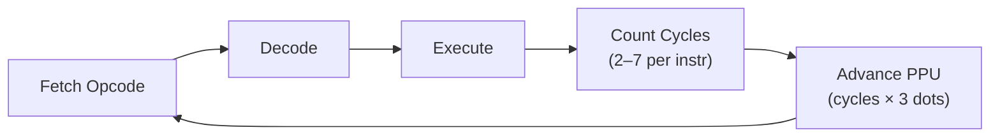

# CPU Cycle Accuracy and Timing

> **How every CPU cycle maps to exactly 3 PPU dots, and why getting this ratio wrong breaks real NES games.**

## 🎯 Intuition
**The Core Idea:** The NES has no frame buffer — the CPU and PPU run in lockstep, and games exploit exact cycle timing for visual effects, so your emulator must count every cycle precisely.
**Analogy:** Imagine two musicians playing together: the CPU is the drummer keeping time at one tempo, and the PPU is a guitarist playing exactly 3 notes for every drumbeat. If the drummer skips a beat or the guitarist falls out of sync by even one note, the whole song (the video frame) falls apart.
**Why It Matters:** Cycle accuracy is what separates "plays most games" from "plays all games." Mid-frame effects like sprite 0 hit, raster scrolling, and mapper IRQs all depend on the CPU and PPU being synchronized to the exact dot.

---

## ⚙️ Core Mechanics
### How It Works
The NES has no frame buffer — the PPU renders pixels in real-time as the CPU runs. Games depend on exact CPU-PPU synchronization for mid-frame effects like:
- **Sprite 0 hit** — detect when a specific sprite overlaps background to split the screen
- **Raster effects** — change scroll position, palette, or CHR bank mid-scanline
- **Mapper IRQs** — MMC3 counts scanlines to trigger timed interrupts

**Figure:** CPU fetch-decode-execute cycle with PPU synchronization — every instruction's cycle cost advances the PPU proportionally.

An emulator that runs instructions without tracking cycles will break these games.

### Key Specifications

**Cycle Costs**

| Operation | Cycles | Notes |
|-----------|--------|-------|
| Simple register ops (INX, DEY) | 2 | Minimum instruction time |
| Zero page access | 3 | +1 for ZP,X |
| Absolute access | 4 | +1 if page crossed |
| Branches (not taken) | 2 | +1 taken, +1 page cross |
| JSR | 6 | Push 16-bit return address |
| RTS | 6 | Pull 16-bit return address |
| Interrupts (NMI/IRQ) | 7 | Push PC + P, load vector |

### Key Facts
- **The 3:1 PPU:CPU Ratio:** For every CPU cycle, the PPU executes exactly 3 dots (pixels)
- One CPU instruction (2-7 cycles) = 6-21 PPU dots
- One scanline (341 dots) ≈ 113.67 CPU cycles
- One frame (262 scanlines × 341 dots) = 89,342 PPU dots ≈ 29,781 CPU cycles
- The CPU clock rate is ~1.789773 MHz (NTSC)

---

## 🔬 Deep Dive
### Hardware Behavior Details
**Instruction-Level vs Cycle-Level Emulation:** Most emulators (including OxideNES) use instruction-level timing — execute the full instruction, then advance the PPU by the instruction's cycle count × 3. True cycle-level emulation would interleave CPU and PPU at each individual cycle, but instruction-level is sufficient for nearly all games.

**Page-Cross Penalties Are Variable:** Not all instructions incur the page-cross penalty. Store instructions (STA abs,X) always take the penalty cycle regardless of whether a page is actually crossed (they do a dummy read of the wrong address first). Read-modify-write instructions always take 2 extra cycles.

**Odd CPU Cycle Alignment:** The CPU alternates between read and write cycles. Some timing-sensitive operations (like OAM DMA) behave differently depending on whether they start on an odd or even cycle.

### Common Emulation Pitfalls
1. **Running instructions without tracking PPU advancement** — The simplest emulator mistake; sprite 0 hit will never trigger at the right time, and status bar games like Super Mario Bros. will glitch
2. **Forgetting the page-cross penalty** — A single missing cycle per instruction accumulates over thousands of instructions per frame, causing PPU sync to drift and raster effects to misalign
3. **Integer truncation on scanline math** — 341 dots / 3 = 113.67 CPU cycles per scanline. If you round to 113, you'll lose a third of a cycle per scanline, accumulating to a full scanline of drift every ~3 frames

### Reference Implementations
The OxideNES main loop in bus.rs calls `tick(cpu_cycles)` which runs `ppu.tick()` three times per CPU cycle. Each instruction in cpu.rs returns its exact cycle count including page-crossing penalties. The lock-step execution ensures PPU and CPU are always synchronized.

---

## 🏋️ Practice
### Warm-Up (5 min)
1. If an LDA Absolute,X instruction crosses a page boundary, how many total CPU cycles does it take and how many PPU dots elapse?
2. How many CPU cycles occur during VBlank (scanlines 241-260, 20 scanlines × 341 dots each)?
3. Why is cycle accuracy more important for NES emulation than for systems with a frame buffer?

### Core Problems
1. **Implement the main clock loop:** Write the synchronization loop that takes a CPU cycle count, multiplies by 3, and advances the PPU dot-by-dot. Handle scanline boundaries and frame completion.
2. **Sprite 0 hit timing:** Given that sprite 0 is at X=100, Y=50, calculate the exact CPU cycle (from frame start) when sprite 0 hit would be detected. Account for the PPU pipeline delay.

### Challenge
**Raster timing precision:** A game writes to PPUSCROLL during visible rendering at the exact cycle when the PPU is at dot 200 of scanline 100. If your emulator has accumulated a 2-cycle drift due to rounding errors, what visual artifact appears on screen? Calculate the PPU dot position with and without the drift, and explain the visual difference.

---

*See also:* [[6502 Instruction Set]], [[6502 Addressing Modes]], [[Interrupts — NMI, IRQ, and Reset]], [[PPU Registers and Timing]], [[CPU — The 6502 Processor Overview]]

## References
→ [[NES Emulation/Sources/Sources Index|Sources Index]]
