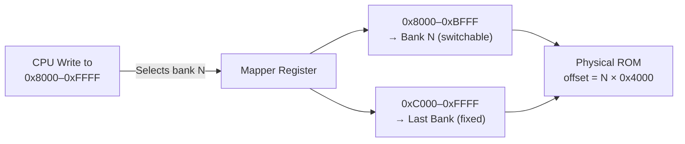

# Bank Switching Explained

> **How mapper hardware maps ROM segments larger than 32 KB into the CPU's limited address space by swapping banks.**

## 🎯 Intuition
**The Core Idea:** Bank switching is a hardware sliding-window mechanism that maps different ROM segments into the CPU's 32 KB address space, letting games far exceed the processor's native addressing limit.
**Analogy:** Like a library with more books than shelf space — the mapper swaps different sections of the collection onto the visible shelves on demand.
**Why It Matters:** This is THE foundational concept for games larger than 32 KB. Every non-NROM mapper implements some form of bank switching, and understanding it is prerequisite to implementing any mapper.

---

## ⚙️ Core Mechanics
### How It Works
The 6502 CPU has a 16-bit address bus (64 KB). After RAM, registers, and I/O consume the lower half, only 32 KB remains for game code (PRG ROM). But many NES games are much larger (128 KB, 256 KB, or more). Mapper hardware on the cartridge dynamically connects different segments (banks) of the full ROM to the CPU's visible address window.

```
CPU sees:           Full ROM:
0x8000 ─── Bank 0 ─── 0x00000
0xC000 ─── Bank 7 ─── 0x1C000 (fixed last bank)
                       ...
                       0x3C000 (256 KB total)
```



**Figure:** Bank switching — CPU writes select which ROM bank appears at 0x8000; the last bank at 0xC000 stays fixed for interrupt vectors.

### Key Specifications

| Scheme | PRG Layout | Switchable Region | Fixed Region | Example Mappers |
|--------|-----------|-------------------|--------------|-----------------|
| Fixed + Switchable | 2 × 16 KB | 0x8000–0xBFFF | 0xC000–0xFFFF (last bank) | UxROM (Mapper 2), MMC1 |
| Fine-Grained | 4 × 8 KB | Multiple 8 KB banks independently | Varies | MMC3 (Mapper 4), MMC5 (Mapper 5) |
| CHR Switching | 1–8 KB CHR banks | Pattern table regions | Varies | CNROM (8 KB), MMC3 (1 KB/2 KB) |

### Key Facts
- Most mappers fix the last bank at 0xC000–0xFFFF to ensure reset/interrupt vectors are always accessible
- Games select banks by writing to specific addresses in the cartridge space (0x8000–0xFFFF)
- CHR (pattern table) data can also be bank-switched, enabling smooth animation by swapping tile sets
- MMC3 has 8 independently mappable 1 KB CHR and 8 KB PRG banks for fine-grained control

---

## 🔬 Deep Dive
### Fixed + Switchable Scheme
The simplest and most common layout. The upper 16 KB (0xC000–0xFFFF) is permanently wired to the last bank of the ROM, guaranteeing the CPU can always find the reset and interrupt vectors. The lower 16 KB (0x8000–0xBFFF) can be remapped to any bank by writing to a mapper register. UxROM uses this scheme with a single write selecting the active bank.

### Fine-Grained Banking (MMC3, MMC5)
More advanced mappers divide the 32 KB window into smaller 8 KB banks, each independently switchable. MMC3 has 8 independently mappable 1 KB CHR and 8 KB PRG banks. MMC5 takes this further with 5 different PRG banking modes and 4 CHR banking modes, supporting 1 KB CHR granularity.

### CHR Bank Switching
Pattern table data (tiles) can also be bank-switched. Some mappers support 1 KB granularity for CHR, enabling smooth animation by swapping tile sets. CNROM (Mapper 3) is the simplest: a single write selects one of several 8 KB CHR banks. MMC3 provides finer 1 KB/2 KB CHR bank control.

### Address Translation
The mapper converts CPU/PPU addresses to physical ROM offsets. For a 16 KB bank scheme: `physical_offset = bank_number * 0x4000 + (cpu_address - 0x8000)`. The mapper must also handle the distinction between ROM (read-only) and RAM (read-write) regions.

### Reference Implementations
Each mapper in mapper.rs implements `read_prg(addr)`/`write_prg(addr, data)` and `read_chr(addr)`/`write_chr(addr, data)`. Bank selection logic in `write_prg()` updates internal bank registers that offset ROM reads.

---

## 🏋️ Practice
### Warm-Up (5 min)
1. Why can't the 6502 directly address more than 32 KB of PRG ROM?
2. Why do most mappers fix the last bank rather than the first?
3. What is the difference between PRG bank switching and CHR bank switching?

### Core Problems
1. **UxROM Bank Switching:** Implement `read_prg()` for UxROM (Mapper 2). The last 16 KB bank is fixed; the first is switchable via writes to 0x8000–0xFFFF. Given a 256 KB ROM (16 banks), verify that writing bank number 5 maps 0x8000 to physical offset 0x14000.
2. **Address Translation:** Write a function that converts a CPU address and bank register value to a physical ROM offset for a 16 KB banking scheme. Handle both the switchable (0x8000–0xBFFF) and fixed (0xC000–0xFFFF) regions.

### Challenge
**MMC3 Fine-Grained Banking:** Implement the MMC3 bank register system with its 8 configurable bank slots. Support the two PRG banking modes (0xC000 fixed vs. 0x8000 fixed) and the two CHR banking modes (2 KB + 1 KB vs. 1 KB + 2 KB). Verify correct address translation across all bank configurations.

---

*See also:* [[Common Mappers]], [[Advanced Mappers]], [[iNES ROM Format]], [[Cartridges and Mappers Overview]]

## References
→ [[NES Emulation/Sources/Sources Index|Sources Index]]
