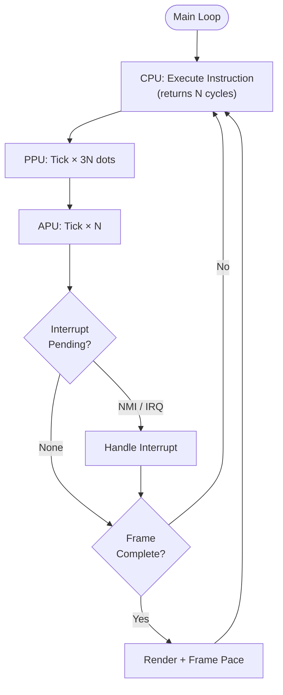

# Main Loop and Cycle Ratios

> **OxideNES keeps CPU, PPU, and APU in lock-step so the emulator advances at exact NES hardware timing ratios.**

## 🎯 Intuition
**The Core Idea:** The main loop steps the emulated chips together at the correct hardware ratios: 1 CPU cycle corresponds to 3 PPU dots, while the APU is also advanced from the CPU-driven loop.
**Analogy:** Like a conductor keeping different orchestra sections in time: strings, brass, and percussion all move together, but not always at the same rate.
**Why It Matters:** Wrong ratios break timing-sensitive games, because NES software relies on the exact relationship between CPU execution, PPU rendering, and audio timing.

---

## ⚙️ Core Mechanics
### How It Works
OxideNES runs a tight lock-step loop:

```
loop {
    cpu_cycles = cpu.clock()      // Execute one instruction (1-7 cycles)
    for _ in 0..cpu_cycles {
        ppu.tick()                // 3 PPU dots per CPU cycle
        ppu.tick()
        ppu.tick()
        apu.tick()                // 1 APU tick per CPU cycle
    }
    check_interrupts()            // NMI, IRQ, mapper IRQ
}
```



**Figure:** Emulator main loop — CPU drives execution, PPU and APU advance in lock-step at hardware ratios, interrupts checked per instruction.

The CPU drives the outer loop, because instruction execution is the natural unit of emulation progress. For each CPU cycle consumed by an instruction, the PPU advances three dots and the APU advances one tick. Interrupts such as NMI, IRQ, and mapper IRQ are then checked at the appropriate boundary.

### Key Specifications

| Component | Rate | Ratio to CPU |
|-----------|------|-------------|
| CPU | 1.789773 MHz | 1:1 |
| PPU | 5.369318 MHz | 3:1 |
| APU Timer | ~894.9 kHz | ~1:2 (ticked per CPU cycle) |
| APU Frame Seq | ~240 Hz | Divides from CPU clock |

### Key Facts
- **NTSC frame:** 29,781 CPU cycles = 89,342 PPU dots = 262 scanlines
- **Target:** 60.0988 Hz (16.639ms per frame)
- **Hybrid frame pacer** ensures accurate timing with minimal drift

---

## 🔬 Deep Dive
### Frame Timing and Synchronization
The central constraint is that CPU, PPU, and APU cannot be advanced independently if you want timing-correct behavior. The NES master timing relationship means the emulator must respect the 3:1 PPU:CPU ratio continuously, not just average it out over a whole frame.

At frame scale, the numbers matter directly: 29,781 CPU cycles per NTSC frame correspond to 89,342 PPU dots spread across 262 scanlines. That timing yields a target refresh rate of 60.0988 Hz, or about 16.639 ms per frame.

### Frame Pacer
OxideNES uses a hybrid frame pacing strategy:
1. Additive timing to eliminate cumulative drift
2. Custom pacer (not minifb's built-in limiter)
3. Windows timer resolution boost for sub-ms precision
4. Fast-forward mode bypasses frame limiting entirely

The additive-timing approach matters because it schedules each frame relative to the ideal running timeline instead of sleeping relative to "now," which reduces long-run drift. A custom pacer is used because the built-in limiter in `minifb` is not the control point OxideNES needs for precise emulator timing. On Windows, timer resolution is boosted so short sleeps behave with sub-millisecond precision. When fast-forward is enabled, frame limiting is skipped entirely so the emulator runs as fast as possible.

### Reference Implementations
In OxideNES, the main loop is the coordination point where `cpu.clock()` determines how many cycles to bill, `ppu.tick()` is called three times per CPU cycle, `apu.tick()` is called once per CPU cycle, and interrupt sources are checked immediately after the instruction's cycle budget is processed.

---

## 🏋️ Practice
### Warm-Up (5 min)
1. If the PPU runs at 5.369318 MHz and uses 341 dots per scanline across 262 scanlines, how many PPU dots occur in one NTSC frame?
2. Why does OxideNES use a custom frame pacer instead of relying on `minifb`'s built-in limiter?
3. What kinds of bugs appear when the CPU:PPU ratio is wrong even if the average frame rate looks correct?

### Core Problems
1. Trace what happens during one instruction that consumes 4 CPU cycles: how many `ppu.tick()` and `apu.tick()` calls occur before interrupts are checked?
2. Compare a broken emulator using a 2:1 PPU:CPU ratio with the correct 3:1 ratio. Explain how the error accumulates across a full frame.

### Challenge
Design a timing test that would reveal whether an emulator is only matching frame rate on average rather than preserving the exact per-cycle CPU/PPU/APU relationships.

---

*See also:* [[OxideNES Module Architecture]], [[Performance Optimization in OxideNES]], [[Emulator Architecture Overview]]

## References
→ [[Sources Index]]
