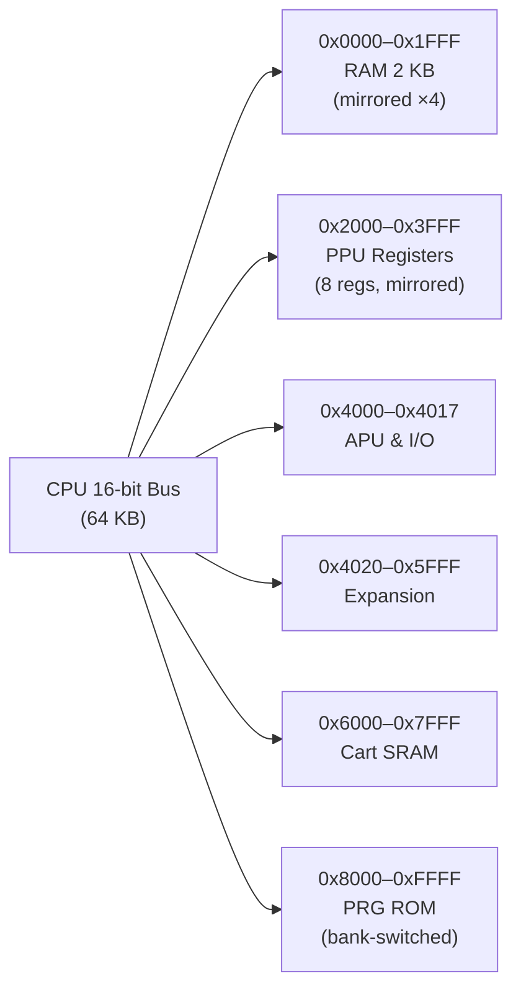

# CPU Memory Map

> **The 64 KB address space that maps the NES's 2 KB of RAM, PPU registers, APU/IO, and cartridge ROM/RAM through mirroring and bank switching.**

## 🎯 Intuition
**The Core Idea:** The CPU sees a single flat 64 KB address space, but behind every address is a physical device — RAM, PPU registers, APU, or cartridge — connected through mirroring that makes small memories appear to fill large address ranges.
**Analogy:** The CPU memory map is like a postal system for a small town: there are only a few real buildings (2 KB RAM, 8 PPU registers, cartridge), but the post office has assigned thousands of addresses that all redirect to the same buildings. Writing to address 0x0000 and 0x0800 delivers mail to the same RAM mailbox — the post office just strips the extra bits.
**Why It Matters:** Your emulator's bus read/write functions are called for every single memory access — they must correctly decode addresses, apply mirroring, and route to the right device. Get mirroring wrong and the entire system breaks.

---

## ⚙️ Core Mechanics
### How It Works
The CPU's 16-bit address bus can address 64 KB (0x0000-0xFFFF). Physical devices are mapped into this space, with extensive mirroring to fill gaps. The bus logic must decode each address and route it to the correct hardware component.

### Key Specifications

**Address Space Layout**

**Figure:** NES CPU memory map — address ranges route through the bus to physical hardware with extensive mirroring.

| Range | Size | Device |
|-------|------|--------|
| 0x0000-0x07FF | 2 KB | Internal RAM |
| 0x0800-0x1FFF | 6 KB | Mirrors of 0x0000-0x07FF |
| 0x2000-0x2007 | 8 bytes | PPU registers |
| 0x2008-0x3FFF | ~8 KB | Mirrors of PPU registers |
| 0x4000-0x4017 | 24 bytes | APU and I/O registers |
| 0x4018-0x401F | 8 bytes | Test mode registers (unused) |
| 0x4020-0x5FFF | ~8 KB | Expansion ROM (rare) |
| 0x6000-0x7FFF | 8 KB | Cartridge SRAM (battery-backed) |
| 0x8000-0xBFFF | 16 KB | PRG ROM lower bank |
| 0xC000-0xFFFF | 16 KB | PRG ROM upper bank |

### Key Facts
- **RAM mirroring:** address 0x0000 and 0x0800 (and 0x1000 and 0x1800) all access the same physical byte — only 2 KB of RAM exists, filling an 8 KB range through mirroring
- **PPU register mirroring:** 0x2000-0x2007 are mirrored every 8 bytes through 0x3FFF, giving 1023 mirrors
- **Zero Page (0x0000-0x00FF):** The first 256 bytes have special significance — zero-page addressing modes are faster (one fewer byte to fetch); games use zero page for frequently accessed variables
- **Stack (0x0100-0x01FF):** The 6502 stack occupies page 1; the stack pointer holds only the low byte (high byte is always 0x01); the stack grows downward (push decrements SP)

---

## 🔬 Deep Dive
### Hardware Behavior Details
**Mirroring Masks:** RAM mirroring is implemented by masking the address with `addr & 0x07FF`. PPU register mirroring uses `addr & 0x0007` (offset from 0x2000). These bitwise operations are the fastest way to resolve mirrors.

**Open Bus Behavior:** Reading from unmapped addresses (0x4018-0x401F, some expansion ranges) returns the last value on the data bus — not zero. Some games inadvertently depend on this behavior.

**Cartridge Space:** The 0x4020-0xFFFF range is controlled by the cartridge. Mappers can bank-switch PRG ROM, provide SRAM with battery backup, and even add extra hardware (IRQ timers, sound chips) in the expansion region.

### Common Emulation Pitfalls
1. **Forgetting RAM mirroring** — If your emulator allocates 8 KB for the 0x0000-0x1FFF range without mirroring, writes to 0x0000 won't be visible at 0x0800, breaking games that access RAM through mirrored addresses
2. **PPU register mirror mask off-by-one** — The mask must be `(addr - 0x2000) % 8` or `addr & 0x0007` applied to the 0x2000-0x3FFF range; mistakes here route PPU writes to wrong registers
3. **Ignoring open bus** — While most games don't depend on open bus, some test ROMs and edge-case games read from unmapped space and expect the last bus value

### Reference Implementations
OxideNES bus.rs `cpu_read()` uses range matching: `0x0000..=0x1FFF` masks to `addr & 0x07FF` for RAM mirroring. `0x2000..=0x3FFF` masks to `addr & 0x0007` for PPU register mirroring. Game Genie checks intercept reads in the 0x8000+ range.

---

## 🏋️ Practice
### Warm-Up (5 min)
1. If the CPU writes 0x42 to address 0x0000, what value will it read from address 0x1000? Why?
2. How many unique PPU registers exist, and how many addresses in the CPU memory map can access them?
3. What lives at address 0x01FF and why is it significant?

### Core Problems
1. **Implement `cpu_read()`/`cpu_write()`:** Write the bus routing function that decodes a 16-bit address into the correct device (RAM, PPU regs, APU/IO, cartridge) with proper mirroring for RAM and PPU registers.
2. **Test mirroring correctness:** Write a test that writes a distinct value to each of the four RAM mirror regions (0x0000, 0x0800, 0x1000, 0x1800) and verifies they all read from the same underlying 2 KB.

### Challenge
**Open bus emulation:** Implement "open bus" behavior where reads from unmapped addresses return the last value placed on the data bus. Track the bus value across reads and writes, and test with a sequence that reads from 0x4018 (unmapped) after writing 0xFF to 0x0000 — the read should return 0xFF.

---

*See also:* [[PPU Memory Map]], [[OAM DMA]], [[Memory Map and Bus Overview]]

## References
→ [[NES Emulation/Sources/Sources Index|Sources Index]]
