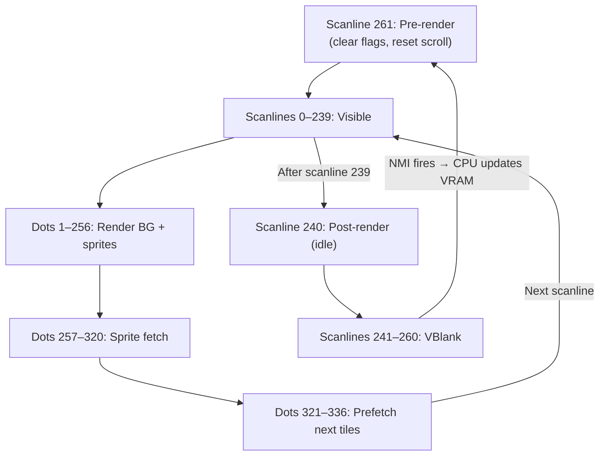

# PPU Rendering Pipeline

> **The dot-by-dot, scanline-by-scanline process that renders 256×240 pixels per frame using shift registers, tile fetches, and sprite evaluation.**

## 🎯 Intuition
**The Core Idea:** The PPU is a state machine that processes one dot (pixel) every cycle, fetching tile data in an 8-dot pipeline while simultaneously outputting pixels through shift registers — all perfectly synchronized across 262 scanlines per frame.
**Analogy:** The PPU is like an artist with a conveyor belt: while painting the current tile's pixels one by one (shifting out through registers), the other hand is already reaching for the next tile's paint supplies (fetching from VRAM). Every 8 pixels, the supplies arrive just in time to reload. Meanwhile, a separate helper checks which sprites appear on the next line.
**Why It Matters:** The rendering pipeline is the heart of PPU emulation. Every dot must be modeled to achieve accurate sprite 0 hit timing, correct pixel priority, and proper sprite evaluation — the pipeline's timing determines when mid-frame effects take effect.

---

## ⚙️ Core Mechanics
### How It Works
Each frame consists of 262 scanlines, each 341 dots (PPU cycles) wide. The PPU outputs one pixel per dot during visible scanlines, using a prefetch pipeline to keep tile data flowing.

### Key Specifications

**Frame Structure (NTSC)**

**Figure:** PPU frame pipeline — the PPU cycles through pre-render, visible rendering, idle, and VBlank every 262 scanlines.

| Scanline | Type | Activity |
|----------|------|----------|
| 0-239 | Visible | Render background + sprites pixel by pixel |
| 240 | Post-render | Idle scanline |
| 241 | VBlank start | NMI fires, CPU updates VRAM safely |
| 241-260 | VBlank | CPU time for game logic and VRAM writes |
| 261 | Pre-render | Clear flags, prepare for next frame |

**Per-Scanline Rendering (Dots 0-340)**
1. **Dots 1-256:** Render pixels — fetch nametable byte, attribute byte, pattern low/high for next tile while outputting current tile through shift registers
2. **Dots 257-320:** Sprite evaluation — load sprite patterns for next scanline
3. **Dots 321-336:** Fetch first two tiles of next scanline
4. **Dots 337-340:** Unused nametable fetches

### Key Facts
- **Shift Register Mechanism:** Background rendering uses two pairs of 16-bit shift registers:
  - Pattern shift registers (×2) — 2 bits per pixel for 8-pixel tile pattern
  - Attribute shift registers (×2) — Palette selection for current tile group
  - Shifted left every dot, loaded with new tile data every 8 dots
- **Pixel Output Priority:** For each pixel:
  1. Background pixel (from shift registers) — 0 = transparent
  2. Sprite pixel (from sprite evaluation) — 0 = transparent
  3. Priority bit determines whether sprite renders in front of or behind background
  4. Sprite 0 hit detected when sprite 0 and background are both opaque at the same pixel

---

## 🔬 Deep Dive
### Hardware Behavior Details
**Pre-Render Scanline (261):** This scanline clears the vblank, sprite 0 hit, and sprite overflow flags at dot 1. It also performs the vertical scroll reset (copying vertical bits from t to v at dots 280-304) and the horizontal scroll reset at dot 257, just like visible scanlines.

**Sprite Evaluation Timing:** Sprite evaluation actually begins at dot 65 of each visible scanline (checking all 64 OAM entries), but sprite pattern fetches happen during dots 257-320. The 8-sprite-per-scanline limit is enforced during evaluation.

**Dot 0 Behavior:** Dot 0 of each scanline is an idle cycle — no memory access occurs. On the pre-render scanline of odd frames (with rendering enabled), this dot is skipped entirely (odd frame skip), making the frame one dot shorter.

### Common Emulation Pitfalls
1. **Wrong sprite 0 hit timing** — Sprite 0 hit must be detected at the exact pixel where both sprite 0 and background are opaque, not at the end of the scanline. Games that poll this flag in a tight loop (Super Mario Bros. status bar) will have a misaligned screen split
2. **Not modeling the shift registers** — If you render whole tiles at once instead of shifting pixel-by-pixel, fine scrolling will not work correctly (the fine X scroll selects which bit of the shift register is the current pixel)
3. **Skipping the pre-render scanline** — The pre-render scanline is critical for clearing flags and resetting scroll. Without it, vblank flag persists into the next frame and scroll resets fail

### Reference Implementations
The OxideNES `tick()` method in `ppu.rs` models every dot of every scanline. Background shifters are updated via `update_shifters()` and loaded via `load_background_shifters()`. Sprite evaluation scans all 64 OAM entries at dot 257.

---

## 🏋️ Practice
### Warm-Up (5 min)
1. How many total PPU dots are in one NTSC frame, and how does this translate to CPU cycles?
2. Why does the PPU fetch tile data for the *next* tile while outputting the *current* tile's pixels?
3. At what scanline and dot does VBlank begin, and what signal does the PPU send to the CPU?

### Core Problems
1. **Implement the scanline state machine:** Write a PPU tick function that handles visible scanlines (0-239), post-render (240), vblank (241-260), and pre-render (261) with the correct flag-setting and clearing behavior.
2. **Implement background shift registers:** Write the shift register logic that loads new tile data every 8 dots, shifts every dot, and outputs the correct pixel accounting for fine X scroll.

### Challenge
**Pixel-perfect sprite 0 hit:** Sprite 0 is at position (64, 100) using an 8×8 tile where only pixels at relative positions (3,0) through (3,7) are opaque (a vertical line). The background tile at that screen position has all pixels opaque. At exactly which PPU dot of which scanline does sprite 0 hit trigger? Account for the +1 dot evaluation delay and the fact that sprite X position 64 means the first sprite pixel appears at screen X=64.

---

*See also:* [[PPU Registers and Timing]], [[Backgrounds and Nametables]], [[PPU Scrolling]], [[Sprites and OAM]], [[PPU — Picture Processing Unit Overview]]

## References
→ [[Sources Index]]
