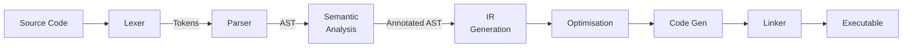

# Compilation Pipeline Stages

> Every compiler follows the same fundamental pipeline: source text in, executable code out, with increasingly refined representations in between.

---

## 🎯 Intuition

**Core Idea:** A compiler is a sequence of transformations that progressively lower human-readable source code into machine-executable instructions, each stage producing a more constrained and optimised representation than the last.

**Analogy:** The compilation pipeline is an assembly line — raw materials (source text) are shaped into parts (tokens, AST), quality-checked (semantic analysis), assembled (IR generation & optimisation), and packaged (code generation & linking) into a finished product (executable).

**Why It Matters:** Understanding the pipeline lets you reason about where errors are caught (syntax vs type vs link errors), why build times vary across languages, and how optimisation interacts with correctness. Every language design decision — from Rust's borrow checker to Go's fast compile times — maps to a specific stage in this pipeline.

---

## ⚙️ Core Mechanics

### How It Works



**Figure:** Compilation pipeline — each stage produces a progressively lower-level representation from source text to executable.

```
Source Code
    |
    v
[Lexing/Tokenization]  -->  Token Stream
    |
    v
[Parsing]              -->  AST (Abstract Syntax Tree)
    |
    v
[Semantic Analysis]    -->  Annotated AST (types, scopes resolved)
    |
    v
[IR Generation]        -->  Intermediate Representation
    |
    v
[Optimization]         -->  Optimized IR
    |
    v
[Code Generation]      -->  Machine Code / Bytecode
    |
    v
[Linking]              -->  Executable
```

**Lexing (Tokenization):** Convert character stream to tokens. Keywords, identifiers, literals, operators, and punctuation become discrete units. Most languages use regular expressions for lexing; some (like Python with significant whitespace) need context-sensitive lexers.

**Parsing:** Convert token stream to an AST representing the program's structure. Parser generators (yacc, ANTLR) or hand-written recursive descent parsers (most modern compilers choose this for better error messages). The grammar determines what programs are syntactically valid.

**Semantic Analysis:** Type checking, name resolution, overload resolution, borrow checking (Rust), lifetime inference (Rust), module resolution, and constant evaluation. This is where most language-specific complexity lives. Haskell's type inference, Rust's borrow checker, and C++'s template instantiation all happen here.

**IR Generation:** Convert the annotated AST to a lower-level intermediate representation. IRs are simpler than the source language and closer to machine code, making optimization easier. Multiple IRs may be used (Rust: HIR to MIR to LLVM IR).

**Optimization:** Transform IR to equivalent but faster/smaller IR. Common optimizations: dead code elimination, constant folding, loop unrolling, function inlining, register allocation, vectorization. LLVM provides a shared optimization infrastructure used by Rust, Swift, Julia, and many others.

**Code Generation:** Convert optimized IR to target machine code (x86, ARM, RISC-V) or bytecode (JVM, CLR, Wasm). Backend-specific optimizations (instruction selection, scheduling) happen here.

### Key Concepts

| Concept | Definition |
|---|---|
| Token | Smallest meaningful unit produced by lexing (keyword, literal, operator) |
| AST | Tree structure representing syntactic structure of the program |
| Semantic Analysis | Validation layer for types, scopes, lifetimes, and language-specific rules |
| Intermediate Representation (IR) | Lower-level program form sitting between source language and machine code |
| Optimisation Pass | A single transformation applied to the IR to improve speed or size |
| Code Generation | Backend stage that emits target-specific machine code or bytecode |
| Linking | Final stage that resolves external symbols and produces an executable |

### Language Examples

| Compiler / Runtime | Pipeline Characteristics |
|---|---|
| **LLVM** | Dominant compiler infrastructure. Frontend produces LLVM IR; LLVM handles optimisation and code generation. Used by Rust (rustc), Swift (swiftc), Clang (C/C++/ObjC), Julia, and many others. Strength: write a frontend for your language and get world-class optimisation for free. |
| **GCC** | The GNU Compiler Collection. Self-contained (does not use LLVM). Supports C, C++, Fortran, Go (gccgo), and Ada. Historically produced better optimised code than LLVM for some workloads; the gap has narrowed. |
| **Go (gc)** | Uses its own compiler, not LLVM. Custom compiler trades slightly less optimised output for fast compilation (seconds, not minutes). Compilation speed is a key developer experience advantage. |
| **V8 (JavaScript)** | Ignition interpreter generates bytecode; TurboFan JIT compiles hot functions to optimised machine code using profiling feedback. The compilation pipeline runs concurrently with program execution. |
| **GHC (Haskell)** | Notable for many intermediate representations: Haskell → Core (desugared Haskell) → STG (Spineless Tagless G-machine) → Cmm (C minus minus) → native code or LLVM IR. Each IR makes different optimisations natural. |

### Key Facts

- A single-pass compiler collapses multiple stages into one traversal; a multi-pass compiler keeps them separate for clarity and power.
- Most modern compilers use hand-written recursive descent parsers rather than generated parsers, primarily for better error messages.
- LLVM's shared optimisation infrastructure means many languages benefit from the same backend improvements.
- Python's significant-whitespace rules require a context-sensitive lexer, unlike most languages that use regular expressions.

---

## 🔬 Deep Dive

### Formal Foundations

The pipeline stages correspond to well-studied formal domains. Lexing maps to **regular languages** (finite automata / regular expressions). Parsing maps to **context-free grammars** (pushdown automata; LL, LR, PEG families). Semantic analysis operates over **type systems** formalised as judgement rules (e.g., Hindley–Milner for ML-family inference). IR transformations are grounded in **dataflow analysis** and **graph rewriting**, where correctness of each pass is typically proved by showing semantic preservation between input and output IR.

### Trade-offs and Design Decisions

**Speed vs Optimisation:** Fast compilation (Go, Zig) requires simpler optimisation passes. Maximum optimisation (LLVM, GCC) requires expensive whole-program analysis. Debug builds and release builds often use different optimisation levels: Rust's debug builds compile quickly with minimal optimisation; release builds spend much longer for peak performance.

**Single IR vs Multiple IRs:** A single IR (LLVM IR) simplifies the infrastructure but may lose high-level information. Multiple IRs (GHC's Core → STG → Cmm; Rust's HIR → MIR → LLVM IR) preserve domain-specific structure at each level, enabling optimisations that would be awkward to express in a single representation.

**AOT vs JIT:** Ahead-of-time compilers (GCC, LLVM, Go) run the full pipeline before execution. JIT compilers (V8 TurboFan, JVM HotSpot) defer optimisation to runtime, gaining profiling feedback at the cost of startup latency and memory overhead.

### Historical Context

Early compilers (1950s–60s, e.g., FORTRAN I) were monolithic and hand-crafted. The separation into distinct pipeline stages emerged through academic work on formal languages and automata theory. Lex (1975) and Yacc (1975) formalised lexer and parser generation. The LLVM project (started 2000, Chris Lattner) popularised the idea of a reusable, language-agnostic optimisation and code-generation backend, fundamentally changing how new languages are built.

---

## 🏋️ Practice

### Warm-Up

1. A compiler reports "unexpected token `}`". Which pipeline stage detected this error — lexing, parsing, or semantic analysis? Explain your reasoning.
2. Why do most modern compilers choose hand-written recursive descent parsers over parser generators like yacc or ANTLR?
3. Name three common optimisation passes and describe what each one does to the IR.

### Core Problems

4. Trace a simple function `fn add(a: i32, b: i32) -> i32 { a + b }` through each stage of the Rust compilation pipeline (lexing → parsing → semantic analysis → HIR → MIR → LLVM IR → machine code). Describe what the representation looks like at each step.
5. Compare the compilation pipelines of Go (gc) and Rust (rustc). For each, explain how its pipeline design reflects the language's priorities (compile speed vs runtime performance).

### Challenge

6. Design a minimal compilation pipeline for a new language that targets WebAssembly. Decide how many IRs to use, whether to reuse LLVM or write a custom backend, and justify each trade-off in terms of compilation speed, output quality, and implementation effort.

---

*See also:* [[Compilation and Runtime Overview]] · [[Sources Index]]

---

## Supporting Chunks / References

- [[Sources Index]]

## References
- [[Programming Languages/Sources/Sources Index|Programming Languages Sources Index]]
