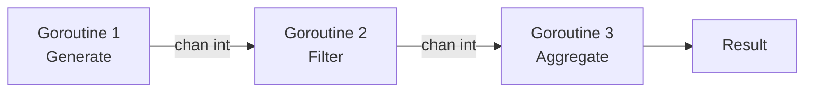

# CSP and Channel-Based Concurrency

> Independent processes communicate by passing messages through typed channels — no shared memory, no locks.

---

## 🎯 Intuition

### Core Idea

CSP's fundamental principle: **"Don't communicate by sharing memory; share memory by communicating."** Instead of two threads accessing a shared variable with a lock, one thread sends a value through a channel and another receives it. The channel synchronizes the transfer — no locks needed.

### Analogy

Channels are like **pneumatic tubes in a building**: departments don't share desks, they send capsules through tubes. A sender inserts a capsule (value) into a tube (channel); the receiver retrieves it at the other end. Neither department needs to know the other's internal layout — they only need to agree on which tube to use. Buffered channels are tubes with a short holding queue; unbuffered channels require the receiver to be waiting before the capsule can leave the sender's hand.

### Why It Matters

Shared-memory concurrency forces programmers to reason about every possible interleaving of reads and writes — a combinatorial explosion that breeds race conditions and deadlocks. CSP sidesteps this by making communication explicit: data flows through well-defined conduits, so the points of interaction between concurrent processes are visible in the code, not hidden in memory addresses.

---

## ⚙️ Core Mechanics

### How It Works

Communicating Sequential Processes (CSP) models concurrent computation as independent processes that communicate by passing messages through channels. Instead of sharing memory, processes share channels. Each process runs sequentially on its own; concurrency arises from multiple processes executing in parallel and coordinating through channel sends and receives.

### Key Concepts

| Concept | Description |
|---|---|
| **Process** | An independent sequential unit of execution (goroutine in Go, go block in Clojure) |
| **Channel** | A typed conduit connecting processes; the sole means of communication |
| **Send / Receive** | A process *sends* a value into a channel; another *receives* it — this synchronizes the two |
| **Unbuffered channel** | Sender blocks until receiver is ready and vice versa — a rendezvous point |
| **Buffered channel** | Allows asynchronous communication up to the buffer size before the sender blocks |
| **Select / Alt** | Multiplexes over multiple channels, waiting for whichever is ready first |
| **Channel direction** | Channels can be restricted to send-only or receive-only in function signatures |
| **First-class channels** | Channels can be passed to functions, stored in data structures, and sent through other channels |

### Language Examples

**Go** is the most prominent CSP-based language. **Goroutines** are lightweight concurrent functions (not OS threads — the Go runtime multiplexes thousands of goroutines onto a smaller number of OS threads). **Channels** (`chan T`) are typed conduits for passing values between goroutines.

```go
ch := make(chan int)
go func() { ch <- 42 }()  // send
value := <-ch               // receive (blocks until value available)
```

Go's `select` statement multiplexes over multiple channels — waiting for whichever is ready first, like a concurrent switch statement. This is directly from Hoare's original CSP formalism.

**Go's channel philosophy:**
- Unbuffered channels synchronize sender and receiver (both block until the other is ready)
- Buffered channels allow asynchronous communication up to the buffer size
- Channels are first-class values — they can be passed to functions, stored in data structures, and sent through other channels
- Channel direction can be restricted in function signatures: `chan<- int` (send-only), `<-chan int` (receive-only)

**The dark side:** Go also provides `sync.Mutex` and atomic operations, acknowledging that channels aren't always the best tool. The Go community debates the right balance — channels for coordination, mutexes for protecting shared state.

| Language | Channel Mechanism | Key Distinction |
|---|---|---|
| **Go** | Built-in `chan T`, `select` | Language primitive; goroutine runtime scheduler |
| **Rust** | `std::sync::mpsc`, crossbeam crate | Library feature; ownership transfer prevents aliasing bugs |
| **Clojure** | `core.async` library, `go` blocks | JVM-hosted; go blocks park without blocking OS threads |
| **Erlang/Elixir** | Actor model (mailboxes, not channels) | Processes are named; no separate channel objects — messages go to a process's mailbox |

**Rust:** Rust's standard library provides channels via `std::sync::mpsc` (multi-producer, single-consumer). The crossbeam crate offers more advanced channel types. Unlike Go, channels in Rust are a library feature, not a language primitive. Rust's ownership system ensures that sending a value through a channel transfers ownership — the sender can no longer access it. This prevents the aliasing bugs that channels in other languages can still produce.

**Clojure:** Clojure provides CSP-style channels via the `core.async` library, implementing goroutine-like go blocks that park on channel operations without blocking OS threads. This brings Go-style concurrency to the JVM without language-level support.

**Erlang/Elixir:** Erlang's actor model is often confused with CSP, but they differ fundamentally. In CSP, channels are named and processes are anonymous — any process can send to any channel. In the actor model, processes are named (have addresses) and there are no separate channel objects — you send messages directly to a process's mailbox. Go's goroutines + channels are CSP; Erlang's processes + mailboxes are actors.

### Key Facts — When Channels Shine

Channels are ideal for: **pipeline architectures** (stage 1 feeds stage 2 feeds stage 3), **fan-out/fan-in patterns** (multiple workers consuming from one channel), and **event-driven coordination**. They're less ideal for fine-grained shared state (a shared counter is simpler with an atomic operation than a dedicated goroutine serving channel requests).



**Figure:** CSP pipeline pattern — independent goroutines connected by typed channels; data flows left to right with no shared memory.

---

## 🔬 Deep Dive

### Formal Foundations

CSP was formalized by **Tony Hoare in 1978** as an algebraic process calculus. Processes are defined by the events they engage in and composed using operators such as sequential composition, parallel composition, and choice. The key insight is that communication itself is an event that both parties must agree on — enabling mechanical reasoning about deadlock, livelock, and determinism. Hoare's original paper and the later book (*Communicating Sequential Processes*, 1985) remain foundational references in concurrency theory. Go's `select` statement is a direct descendant of CSP's *guarded choice* operator.

### Trade-offs and Design Decisions — Channels vs Mutexes

| Dimension | Channels | Mutexes / Atomics |
|---|---|---|
| **Mental model** | Data flows between owners | Data sits in place, access is serialized |
| **Composition** | `select` composes cleanly over multiple sources | Composing multiple locks risks deadlock ordering bugs |
| **Overhead** | Higher per-operation cost (scheduling, copying) | Lower per-operation cost (single CAS or lock) |
| **Best for** | Coordination, pipelines, fan-out/fan-in | Protecting simple shared state (counters, caches) |
| **Failure mode** | Goroutine leaks if a channel is never drained | Deadlocks if lock ordering is violated |

The Go community's pragmatic stance: use channels for *coordination* (signaling, handing off work), use mutexes for *protecting state* (guarding a map or counter). Neither is universally superior.

### Historical Context

Hoare's 1978 CSP paper preceded practical implementations by decades. Occam (1983) was the first language to embed CSP directly. Rob Pike and Ken Thompson carried CSP ideas through Newsqueak (1988), Alef (1992–2000), and Limbo (1995) before crystallizing them in Go (2009). Meanwhile, the π-calculus (Milner, 1992) extended CSP with *mobile channels* — channels that can themselves be sent over channels — a feature Go supports natively.

---

## 🏋️ Practice

### Warm-Up

1. Explain in your own words why an unbuffered channel acts as a synchronization point between two goroutines.
2. A Go program creates a channel but no goroutine ever receives from it. What happens when the main goroutine sends on that channel?
3. How does Rust's ownership model provide a safety guarantee for channel communication that Go's type system does not?

### Core Problems

4. Design a three-stage pipeline in Go (or pseudocode) where stage 1 generates integers, stage 2 filters out odd numbers, and stage 3 sums the remaining values. Use only channels for inter-stage communication. Identify where buffered channels might improve throughput.
5. You have a web scraper with 100 URLs to fetch. Design a fan-out/fan-in architecture using channels: a dispatcher sends URLs to N worker goroutines, and a collector aggregates results. How do you signal completion without leaking goroutines?

### Challenge

6. Compare implementing a thread-safe bounded queue using (a) a buffered channel and (b) a mutex-protected slice. Analyze the trade-offs in terms of blocking semantics, fairness, and performance under high contention. Under what workload would each approach win?

---

*See also:* [[Concurrency Models Overview]] · [[Programming Languages/Concurrency Models/The Actor Model|Actor Model]] · [[Programming Languages/Concurrency Models/Threads and Locks|Mutex and Lock-Based Concurrency]] · [[Programming Languages/Language Profiles/Go — Language Profile|Go Concurrency Patterns]]

---

## Supporting Chunks / References

- Hoare, C.A.R. *Communicating Sequential Processes.* Communications of the ACM, 1978.
- Hoare, C.A.R. *Communicating Sequential Processes* (book). Prentice Hall, 1985.
- Pike, Rob. "Concurrency Is Not Parallelism." Talk, 2012.
- Milner, Robin. *The Polyadic π-Calculus: A Tutorial.* 1992.
- [[Programming Languages/Sources/Sources Index|Sources Index]]

## References

- [[Programming Languages/Sources/Sources Index]]
- [[Programming Languages/Programming Languages Book Reading Spine]]
- [[Programming Languages/Programming Languages]]
