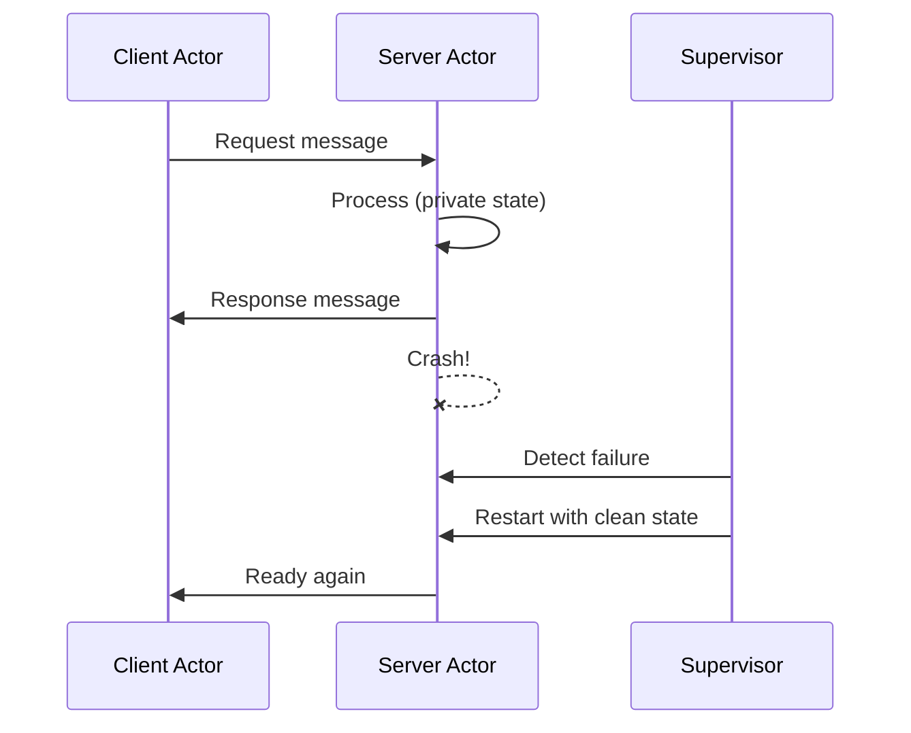

# The Actor Model

> The actor model eliminates shared state entirely — each actor is an isolated unit with private state, communicating exclusively through asynchronous message passing, making data races impossible by construction.

---

## 🎯 Intuition

### Core Idea

The actor model, conceived by Carl Hewitt in 1973 and brought to practical fruition by Erlang in 1986, represents the most radical approach to concurrency: eliminate shared state entirely. Each actor is an isolated unit with its own private state, communicating exclusively through asynchronous message passing. There is no shared mutable state to race on — data races are impossible by construction.

### Analogy

Actors are like **office workers with private desks and mailboxes** — they never share desks, only pass notes through mailboxes. Each worker reads one note at a time from their inbox, updates things at their own desk, and drops replies into other workers' mailboxes. No one ever reaches across to touch another worker's desk.

### Why It Matters

The actor model influenced: Go's goroutines (lighter-weight than OS threads, though Go uses CSP not actors), Swift's actor types (Swift 5.5), Kotlin's coroutines (structured concurrency), and Rust's Actix framework. Every major language is converging on some form of isolated-state concurrency, and the actor model is the purest expression of that idea.

---

## ⚙️ Core Mechanics

### How It Works — Four Core Principles

1. **Isolation:** Each actor has private state that no other actor can access
2. **Message passing:** Actors communicate by sending immutable messages to other actors' mailboxes
3. **Asynchronous:** Sending is non-blocking; the sender doesn't wait for the receiver
4. **Single-threaded processing:** Each actor processes one message at a time, sequentially

**Figure:** Actor message passing with supervision — actors communicate via async messages; supervisors detect crashes and restart actors with clean state.

### Key Concepts

| Concept | Description |
|---|---|
| Actor | Isolated unit of computation with private state and a mailbox |
| Mailbox | Ordered queue of incoming messages awaiting processing |
| Message | Immutable data sent asynchronously between actors |
| Supervision | A parent actor monitors children and restarts them on failure |
| Location transparency | Sending a message to a remote actor uses the same syntax as local |
| Let it crash | Processes crash on unexpected conditions; supervisors handle recovery |
| Lightweight process | Actor runtime process far cheaper than an OS thread (hundreds of bytes) |

### Language Examples

**Erlang — The Actor Model Incarnate**
Erlang was designed at Ericsson for telecom switches that needed 99.999% uptime (5 minutes of downtime per year). Its design philosophy is unique in programming:
- **Lightweight processes:** Erlang processes are not OS threads — they're extremely lightweight (a few hundred bytes each). A single Erlang VM routinely runs millions of concurrent processes. Process creation is as cheap as object creation in Java.
- **Per-process GC:** Each process has its own small heap, collected independently. No global stop-the-world pauses. When a process dies, its entire heap is freed instantly.
- **Hot code reloading:** Running code can be replaced without stopping the system — essential for telecom switches that can never go down.
- **Distribution transparency:** Sending a message to a process on another machine uses the same syntax as sending locally. This enables transparent clustering.

**Elixir — Modern Syntax on BEAM**
Elixir (2011) brings modern language design to Erlang's BEAM VM: Ruby-inspired syntax, powerful metaprogramming (macros), the |> pipe operator for readable data transformation chains, and the Phoenix web framework. Elixir compiles to BEAM bytecode, inheriting all of Erlang's concurrency and fault-tolerance properties.

**Akka — Actors on the JVM**
Akka brings the actor model to Scala and Java on the JVM. Unlike Erlang, actors in Akka share the JVM heap — isolation is by convention, not enforcement. This is a pragmatic trade-off: JVM interop at the cost of weaker guarantees.

**OTP (Open Telecom Platform)**
Erlang's real power is OTP — a set of design patterns for building fault-tolerant systems:
- **GenServer:** Generic server process (request-response pattern)
- **Supervisor:** Monitors child processes, restarts them on failure
- **Application:** Groups related processes into a unit
- **Supervision trees:** Hierarchical failure containment

These patterns encode decades of telecom reliability engineering into reusable abstractions.

### Key Facts

- Erlang VM routinely runs **millions** of concurrent processes
- Each process costs only a **few hundred bytes** of memory
- Ericsson's target: **99.999% uptime** (≈ 5 min downtime/year)
- Hewitt's original paper: **1973**; Erlang first appeared: **1986**; Elixir: **2011**

---

## 🔬 Deep Dive

### Formal Foundations

Carl Hewitt introduced the actor model in 1973 as a mathematical framework for concurrent computation. In this model, the actor is the universal primitive — everything is an actor. Upon receiving a message, an actor can: (1) create new actors, (2) send messages to actors it knows about, and (3) designate the behaviour to use for the next message it receives. This is a fully asynchronous, non-deterministic model with no global state and no global clock.

### Trade-offs and Design Decisions

**Limitations**
The actor model struggles with:
- Operations requiring consistent views of multiple actors' state (no transactions)
- Fine-grained shared data structures (a shared hash map as an actor is slow due to message overhead)
- Debugging (message-passing flows are harder to trace than call stacks)

**"Let It Crash" Philosophy**
Instead of defensive programming with error checking everywhere, Erlang encourages processes to crash on unexpected conditions. A supervisor process detects the crash and restarts the failed process with clean state. This produces more robust systems than try/catch everywhere — unexpected states are handled uniformly. The insight: recovery code is simpler when it always starts from a known good state.

**Convention vs. Enforcement**
Erlang enforces isolation at the VM level — processes cannot share memory. Akka on the JVM relies on programmer discipline; actors share the JVM heap, so a misbehaving actor can violate isolation. This is a fundamental design axis: stronger guarantees vs. broader ecosystem interop.

### Historical Context

The actor model's practical success is rooted in the telecom industry. Ericsson needed switches handling millions of concurrent calls with near-zero downtime. This drove the creation of Erlang and OTP, proving that the actor model scales to real-world, high-reliability systems. WhatsApp famously served 900 million users with fewer than 50 engineers, running on Erlang. The BEAM VM remains the gold standard for soft-real-time, massively concurrent systems.

---

## 🏋️ Practice

### Warm-Up

1. In the office-worker analogy, what prevents data races — and what real mechanism does that map to in the actor model?
2. Why does per-process garbage collection eliminate global stop-the-world pauses, and what happens to a process's heap when it crashes?
3. Explain why sending a message in the actor model is non-blocking. What trade-off does the sender accept?

### Core Problems

1. Design a supervision tree for a chat application with rooms and users. Each room is an actor; each user connection is an actor. Sketch which supervisors own which children, and define the restart strategy when a room actor crashes. What happens to the user actors in that room?
2. You need to transfer funds between two bank-account actors atomically. The actor model has no built-in transactions. Propose a protocol using only message passing that guarantees the transfer either fully completes or fully rolls back, even if one actor crashes mid-transfer.

### Challenge

1. Architect a distributed key-value store using actors where each key range is owned by a separate actor, actors can migrate between nodes, and the system must handle node failures via supervision. Describe your sharding strategy, how you route messages after migration, and how supervisors on different nodes coordinate restarts.

---

*See also:* [[Concurrency Models Overview]] · [[CSP and Go Channels]] · [[Software Transactional Memory]] · [[Erlang and OTP]] · [[Fault-Tolerant Systems]]

---

## Supporting Chunks / References

- Hewitt, C. (1973). *A Universal Modular ACTOR Formalism for Artificial Intelligence*
- Armstrong, J. (2003). *Making Reliable Distributed Systems in the Presence of Software Errors* (Erlang thesis)
- [[Sources Index]]
