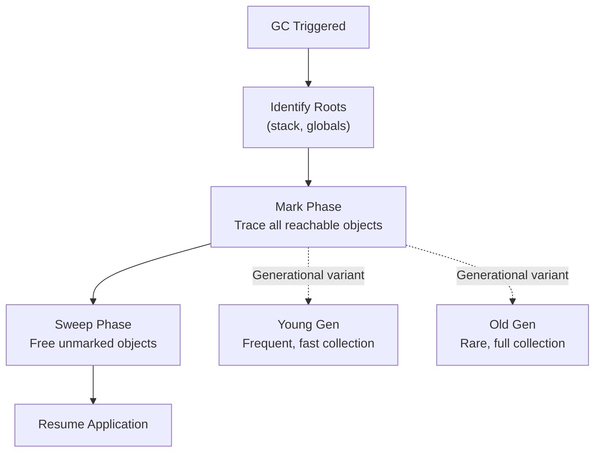

# Garbage Collection Strategies

## 🎯 Intuition
**The Core Idea:** Garbage collection (GC) automates memory management by periodically identifying and reclaiming unreachable objects.

**Analogy:** GC is an automated janitor: the program keeps using rooms, the janitor starts from all currently occupied rooms, follows every open doorway, and throws away anything no longer connected to living activity.

**Why It Matters:** It removes a huge class of manual memory bugs, which is why it became the dominant memory management strategy in Java, Go, C#, Python, JavaScript, OCaml, Haskell, Erlang, Ruby, and most modern languages.

Garbage collection was invented by John McCarthy for Lisp in 1958, and the central promise has stayed the same ever since: let programmers think more about objects and less about `free()`.

## ⚙️ Core Mechanics
Most modern GCs are tracing collectors. Tracing GC works by starting from root references such as stack variables and global variables, then tracing all reachable objects. Anything not reachable is garbage and can be freed.

**Figure:** Mark-and-sweep GC cycle — generational collectors optimise by collecting short-lived young objects frequently and old objects rarely.

### Mark-and-Sweep (Classic)
The simplest tracing algorithm has two phases:
1. Mark all reachable objects starting from roots.
2. Sweep through the heap freeing unmarked objects.

Its classic disadvantage is stop-the-world behavior: the program must pause during collection, and the pause can scale with heap size.

### Generational GC (Java, C#, OCaml)
Generational collectors rely on the generational hypothesis: most objects die young. Memory is divided into generations:
- **Young generation:** Recently allocated objects. Collected frequently with fast, small collections.
- **Old generation:** Objects that survived multiple young collections. Collected rarely with full collections.

**Java's G1 (Garbage First):** Divides the heap into fixed-size regions. Collects regions with the most garbage first, enabling predictable pause times. Java also offers ZGC and Shenandoah for sub-millisecond pauses on terabyte heaps.

**OCaml's GC** is a generational collector with a fast minor (young) heap using a copying collector and a major (old) heap using incremental mark-and-sweep. OCaml's GC is notable for very low latency — minor collections are extremely fast because OCaml's immutable-by-default style means most young objects don't have old-to-young pointers.

### Concurrent/Incremental GC (Go, Java ZGC)
**Go's GC** is a concurrent, tri-color mark-and-sweep collector. It runs concurrently with the application, using write barriers to track mutations during collection. Go prioritizes low latency over throughput — sub-millisecond pauses even on large heaps. The trade-off: lower overall throughput compared to generational collectors.

Go's GC design reflects Go's philosophy: simplicity and predictability. No generational complexity, no tuning knobs. The GC "just works" with good-enough performance for most server workloads.

### Language Examples
- **Java / C#:** Generational GC is the mainstream choice because server applications benefit from high throughput and because most objects die young.
- **Go:** Uses one concurrent collector rather than offering many strategies, reflecting Go's preference for predictability and minimal tuning.
- **OCaml:** Uses a generational design specifically tuned for functional allocation patterns with many short-lived immutable values.
- **JavaScript (V8):** Uses a generational collector with concurrent marking because browser UI responsiveness is highly sensitive to pauses.

## 🔬 Deep Dive
### Trade-offs / Historical Context
Different runtimes optimize for different goals, so “GC” is really a family of trade-offs rather than a single technique.

**Java:** Maximum throughput for server applications. Offers multiple GC algorithms (Serial, Parallel, G1, ZGC, Shenandoah) because different workloads need different trade-offs. JVM tuning is a specialized skill.

**Go:** Minimum latency, no tuning needed. A single GC algorithm that works well enough for everyone. "Our users shouldn't need to understand GC internals."

**OCaml:** Fast minor collections for functional code. The GC is tuned for the allocation patterns of functional programming — many short-lived immutable values. OCaml's GC is one of the fastest for this workload.

**Erlang/BEAM:** Per-process GC. Each lightweight process has its own small heap collected independently. No global stop-the-world pauses. Short-lived processes don't need collection at all — their heap dies with them. This is uniquely suited to the actor model.

**Haskell (GHC):** Generational, parallel GC. Lazy evaluation creates many thunks (delayed computations) that produce unusual allocation patterns. GHC's GC handles this with a two-generation system and parallel collection on multiple cores.

**JavaScript (V8):** Generational with concurrent marking. V8 uses Orinoco (concurrent, incremental, parallel GC) to minimize main-thread pauses. Critical for browser UI responsiveness — even small GC pauses cause visible jank.

 
| Runtime / Language | GC emphasis | Notable consequence |
|--------------------|-------------|---------------------|
| Java | Maximum throughput with multiple algorithms | Powerful but tuning-heavy |
| Go | Minimum latency, minimal tuning | Predictable but lower throughput than generational collectors |
| OCaml | Fast minor collections for functional code | Excellent for short-lived immutable values |
| Erlang/BEAM | Per-process GC | No global stop-the-world pauses |
| Haskell (GHC) | Generational, parallel GC | Handles thunk-heavy lazy allocation patterns |
| JavaScript (V8) | Concurrent, incremental, parallel generational GC | Reduces browser jank |

Go's choice of GC for a "systems language" was controversial. Critics argued GC makes Go unsuitable for real-time systems, kernel development, and embedded programming. Proponents countered that most "systems programming" — web servers, CLI tools, and infrastructure — does not need sub-microsecond latency guarantees.

This debate illuminated that "systems programming" means different things to different communities. Go's GC is fine for cloud infrastructure; it is not fine for audio drivers.

## 🏋️ Practice
1. Explain why the generational hypothesis makes young-generation collections fast, and name one language runtime that leans on this idea heavily.
2. Compare Java's “many collectors for many workloads” philosophy with Go's “one collector, minimal tuning” philosophy. What workload assumptions drive each choice?
3. Imagine you are building (a) a browser UI engine, (b) a cloud API server, and (c) a hard real-time audio driver. Which GC strategy or non-GC approach would you consider appropriate for each, and why?

## References

- [[Sources Index]]
