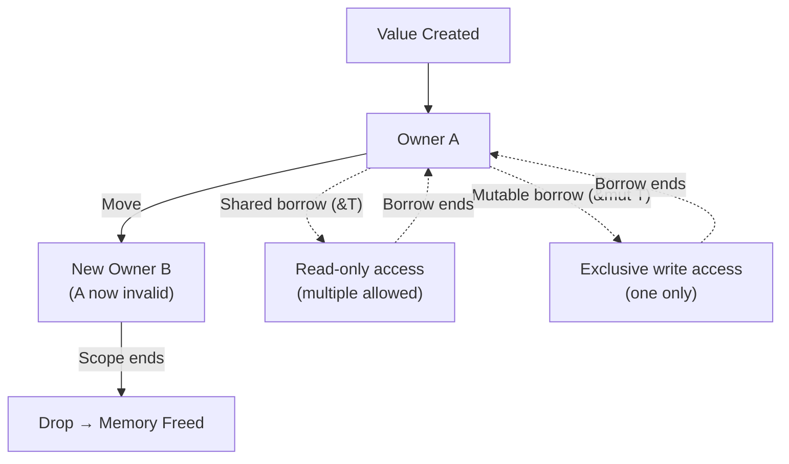

# Ownership and Borrowing

## 🎯 Intuition
**The Core Idea:** Rust's ownership system achieves memory safety and data-race freedom entirely at compile time, with zero runtime overhead.

**Analogy:** Ownership is like strict library book rules: one person is the official borrower, temporary readers can consult the book under controlled conditions, and nobody gets to keep a note card pointing to a book after the library has shelved it.

**Why It Matters:** Ownership represents the most significant innovation in memory management since garbage collection because it showed that memory safety does not require GC pauses or manual `free()` discipline.

## ⚙️ Core Mechanics
### The Core Rules
Rust's ownership has three rules:
1. **Each value has exactly one owner** — a variable that "owns" the data
2. **When the owner goes out of scope, the value is dropped** (RAII-style deterministic destruction)
3. **Ownership can be transferred (moved)** — the previous owner becomes invalid

**Figure:** Rust ownership flow — values have one owner; borrows grant temporary access; memory is freed deterministically when the owner's scope ends.

These rules alone prevent double-free (only one owner can free), use-after-free (moved values can't be accessed), and memory leaks (values are always dropped).

### Borrowing: References Without Ownership
Ownership transfer is too restrictive for most code — you'd have to move values into every function and move them back. Borrowing allows temporary access:

- **Shared references (&T):** Multiple readers, no writers. Immutable access.
- **Mutable references (&mut T):** Exactly one writer, no readers. Exclusive access.

This is enforced at compile time by the borrow checker. The fundamental invariant: at any point, you can have EITHER multiple shared references OR one mutable reference, but never both. This prevents data races by construction.

### Lifetimes: References Must Not Outlive Data
The borrow checker also tracks reference lifetimes — ensuring references never outlive the data they point to. Most lifetimes are inferred; explicit lifetime annotations (`'a`) are needed when the compiler can't determine the relationship automatically, typically in function signatures returning references.

### Language Examples
- **Rust:** Uses ownership, borrowing, and lifetimes as the default model.
- **Rust with `Rc<T>` and `Arc<T>`:** Uses reference counting only for shared ownership scenarios that do not fit the single-owner model.
- **OCaml:** Often reaches some similar practical safety outcomes through immutable-by-default programming rather than ownership annotations.

## 🔬 Deep Dive
### Trade-offs / Historical Context
Ownership changes what programs are easy to express, and its advantages are clearest in comparison with other memory-management strategies.

**vs. Garbage Collection:** Ownership has zero runtime overhead — no GC pauses, no mark phase, no write barriers. Deallocation is deterministic. However, the borrow checker rejects some valid programs that GC-based languages accept (particularly graph structures and shared mutable state).

**vs. Manual Management:** Ownership provides the same performance as manual `malloc`/`free` with compile-time safety guarantees. You cannot have use-after-free or double-free in safe Rust. The trade-off is the learning curve — the borrow checker imposes a new way of thinking about data flow.

**vs. Reference Counting:** Ownership handles most lifetimes at zero cost. RC (`Rc<T>`, `Arc<T>`) is available for shared ownership scenarios that don't fit the single-owner model. RC has runtime overhead (counter updates) that ownership does not.

| Comparison | Ownership advantage | Ownership cost |
|------------|---------------------|----------------|
| vs. Garbage Collection | Zero runtime overhead, deterministic deallocation, no mark phase, no write barriers, no GC pauses | Some valid GC-style programs are rejected, especially graph-heavy or shared-mutable designs |
| vs. Manual Management | Manual-management performance with compile-time safety guarantees | Steeper learning curve and borrow-checker-driven design constraints |
| vs. Reference Counting | Most lifetimes handled at zero cost | Shared ownership still requires RC escape hatches |

### Influence and Mental Model Shift
Rust's ownership system is influencing other languages:
- **Swift** added move-only types and borrowing annotations
- **C++** proposals for lifetime annotations (inspired by Rust)
- **Vale** (research language) explores generational references
- **Mojo** incorporates ownership for systems-level Python
- **Linear types** (Haskell research) explore similar ideas in a functional context

The key insight that ownership validated: memory safety doesn't require runtime overhead. The cost is paid in compiler complexity and developer learning curve instead.

Programming in Rust requires thinking about data ownership explicitly. Every variable, every function parameter, every return value has a clear ownership story. This initially feels restrictive but produces code with clear data flow — you always know who is responsible for what data.

OCaml programmers often note similarity to Rust's discipline: OCaml's immutable-by-default style naturally avoids shared mutable state, achieving similar safety through functional programming rather than ownership annotations.

## 🏋️ Practice
1. State Rust's three ownership rules from memory, then explain which bug each rule helps prevent.
2. Why can Rust guarantee no data races when it enforces “either many readers or one writer” for references?
3. Compare Rust's ownership approach with OCaml's immutable-by-default approach. How do both reduce shared mutable state problems by different means?

## References

- [[Sources Index]]
