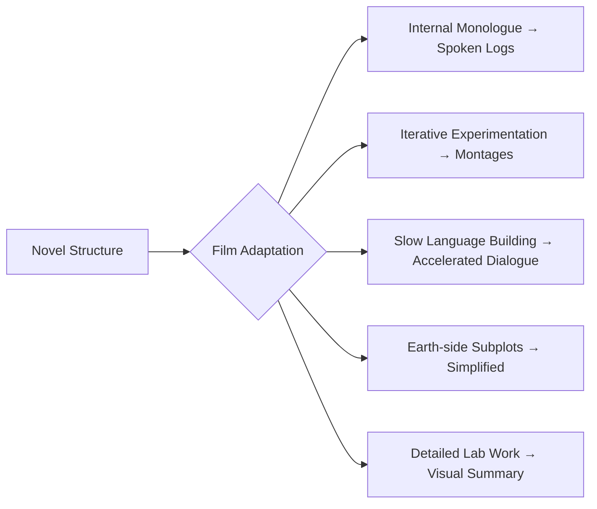

---
tags:
  - phm
  - adaptation
  - film
  - novel
up: "[[Project Hail Mary]]"
confidence: verified
tier-coverage: [intuition, core, deep-dive, practice]
---
# Novel vs Film Adaptation

> **One-line summary** — The film adaptation preserves the novel's big ideas by externalizing thought, compressing process, and simplifying detail for the screen.

## 🎯 Intuition
**The Core Idea:** The *Project Hail Mary* film adaptation (directed by Phil Lord and Christopher Miller, screenplay by Drew Goddard, starring Ryan Gosling) faces the classic challenge of translating a deeply internal, science-heavy novel into a visual medium.
**Why It Matters:** This note tracks the major adaptation strategies and what changes. The novel is structured around internal monologue, iterative experimentation, gradual language building, and technical detail. None of these translate directly to film.

## ⚙️ Core Mechanics
### Key Details
### Core Adaptation Challenges

The novel is structured around:
1. **Internal monologue**: Grace's reasoning is the primary narrative engine — readers follow his thought process step by step.
2. **Iterative experimentation**: Many solutions emerge through repeated hypothesis-test-revise cycles.
3. **Gradual language building**: The Grace-Rocky communication develops slowly over many pages.
4. **Technical detail**: Weir includes substantial chemistry, physics, and biology exposition.

None of these translate directly to film.

### Key Adaptation Strategies
#### Externalizing Internal Reasoning
The film converts Grace's inner monologue into:
- **Spoken logs and narration** — talking to the ship's computer or recording entries.
- **Visual flashbacks** — showing Earth-side events that the novel reveals through memory.
- **Dialogue with Rocky** — once Rocky arrives, conversations replace internal reasoning.

#### Compressing Experimentation
The novel's iterative science sequences (try → fail → adjust → retry) become **montages** in the film. This sacrifices the methodological feel but maintains pacing.

#### Rocky's Communication
In the novel, Grace slowly decodes Eridian through painstaking trial and error. The film accelerates this and uses **synthesized/vocalized Eridian** that is more immediately accessible to the audience. See [[Xenolinguistics and First Contact]] for the linguistic details.

> [!warning] Tone Shift
> The slow language-building process is one of the novel's most praised sequences. Compressing it changes the emotional texture of the relationship.

#### Simplified Earth-Side Plot
The novel includes significant Earth-side political and engineering subplots (Stratt's authority, international cooperation, ethical dilemmas of crew selection). The film reportedly simplifies or cuts several of these threads for runtime.

#### Biological Detail Reduction
Weir's detailed Astrophage biology and Grace's lab-bench work are streamlined. The film conveys the *what* (Astrophage eats stars, stores energy) without the full *how* (specific experimental procedures, spectral analysis steps).

### What's Gained and Lost

| Aspect | Novel Strength | Film Trade-off |
|---|---|---|
| Science depth | Full experimental reasoning | Compressed to key results |
| Grace-Rocky bond | Built through slow communication | Faster but less earned |
| Visual spectacle | Reader imagination | Actual visuals of alien, ship, stars |
| Earth-side stakes | Political complexity | Streamlined urgency |
| Emotional payoff | Earned through 400 pages of detail | Concentrated but potentially shallower |

### Uncertainty Note

> [!note] Limited Public Detail
> As of the research window, detailed scene-by-scene comparisons between the final film cut and the novel are still emerging. Some adaptation choices described here are based on interviews and early coverage, not comprehensive final-cut analysis. This note should be updated as more detailed breakdowns become available.

### Key Facts

| Fact | Detail |
|---|---|
| Narrative engine | Grace's internal monologue is the novel's primary narrative engine. |
| Screen translation | The film externalizes reasoning through spoken logs, flashbacks, and dialogue with Rocky. |
| Scientific process | Iterative experimentation is compressed into montages to preserve pacing. |
| Language arc | Rocky's communication is accelerated and made more accessible through synthesized/vocalized Eridian. |
| Earth-side changes | Political and engineering subplots are simplified or cut for runtime. |
| Science detail | Astrophage biology and lab procedure are streamlined to emphasize outcomes over method. |

## 🔬 Deep Dive
### Scientific Accuracy
The adaptation appears to preserve the novel's high-level science and causal logic while reducing procedural detail. Astrophage biology, spectral analysis, and experimental method remain present in concept, but the film conveys results more readily than step-by-step reasoning.

### Narrative Analysis
The medium shift pushes the story away from internal process and toward external performance. Spoken logs, flashbacks, and faster dialogue with Rocky keep the plot moving, but they also make the science feel less methodical and the relationship less gradually earned.

### Connections

- Science the film discusses: [[Astrophage Biology]], [[The Hail Mary Drive]], [[Rocky and the Eridians]]
- Communication process in the novel: [[Xenolinguistics and First Contact]]
- Rocky's on-screen design challenges: [[Rocky on Screen]]
- Science exposition challenges: [[Science Exposition on Screen]]
- How accurate is the underlying science: [[Science Accuracy Scorecard]]

## 🏋️ Practice
### Discussion Questions
1. Which adaptation change most affects the novel's identity: compressed science, faster language-building, or simplified Earth-side politics?
2. How much step-by-step scientific reasoning does a film audience need in order for the story to still feel like *Project Hail Mary*?
3. Does visual spectacle compensate for the loss of detailed experimental process, or does it change the story's appeal?

### Analysis
- Compare how the novel and the film would build the Grace-Rocky relationship through pacing and communication.
- Analyze whether simplifying Earth-side material sharpens the story's focus or weakens its stakes.

### Creative Challenge
- **What if...** the film preserved one full hypothesis-test-revise sequence without montage — which scene should get that treatment, and why?

## References

- [[Sources Index#Nature Film Review]] — science-journal perspective
- [[Sources Index#Science News Review]] — science coverage of the adaptation
- [[Sources Index#No Film School Goddard Interview]] — screenwriter's adaptation choices
- [[Sources Index#SlashFilm Changes]] — book-to-movie change list
- [[Sources Index#CinemaBlend Production]] — behind-the-scenes context