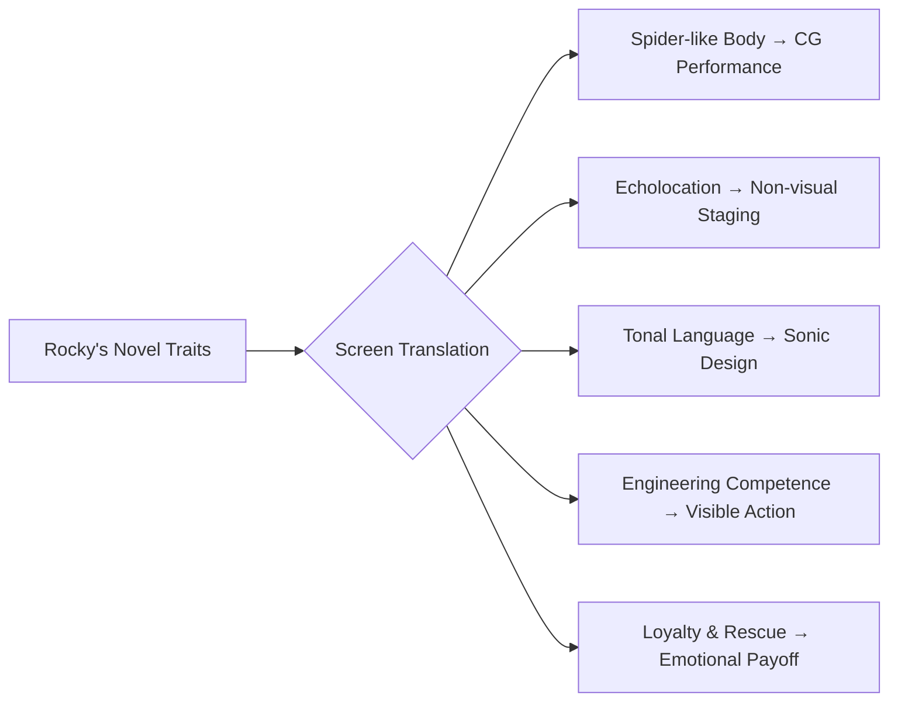

---
tags:
  - phm
  - adaptation
  - rocky
  - film
  - vfx
up: "[[Project Hail Mary]]"
confidence: verified
tier-coverage: [intuition, core, deep-dive, practice]
---
# Rocky on Screen

> **One-line summary** — Rocky is difficult to adapt because the film must make a non-humanoid, non-visual, tonal-language alien into a fully legible co-lead.

## 🎯 Intuition
**The Core Idea:** Bringing Rocky to film is arguably the single hardest adaptation challenge in [[Project Hail Mary]].
**Why It Matters:** This note examines why a non-humanoid, non-visual, tonal-language alien co-lead is so difficult to translate to screen, and what the known adaptation approach implies. The audience must sustain emotional investment in this character for the full runtime. This means the design must work not just in a reveal shot but across hours of dialogue, collaboration, and crisis.

## ⚙️ Core Mechanics
### Key Details

> [!note] Limited Public Detail
> As of the research window, full scene-by-scene breakdowns of Rocky's on-screen treatment are still emerging. This note draws on the novel's design constraints and available adaptation coverage. Specific VFX details should be updated as more information becomes available.

### Why Rocky Is Hard
Rocky presents a convergence of adaptation challenges that few film aliens face simultaneously:

#### 1. Non-Humanoid Body Plan
Rocky is described as roughly spider-like — an exoskeletal, multi-limbed body plan with no face in the human sense. There are no eyes to emote through, no mouth to read. Most successful film aliens (E.T., Chewbacca, the Na'vi) rely on recognizably human-like facial expressions. Rocky has none of these affordances.

The design team must create a character the audience bonds with emotionally despite the absence of the primary channels film normally uses for empathy.

#### 2. No Shared Visual Channel
Rocky perceives the world through echolocation, not vision (see [[Eridian Sensory Biology]]). He does not respond to visual stimuli, does not make eye contact, and does not gesture in ways a sighted audience would instinctively read. This removes another standard tool for screen performance: the reaction shot based on gaze and visual attention.

#### 3. Tonal Communication
Eridian language is chord-based — simultaneous tones encoding meaning through pitch combinations and intervals (see [[Xenolinguistics and First Contact]]). In the novel, this is conveyed through description. On screen, the audience must *hear* something that registers as language and emotion without subtitles making it trivial.

The challenge is finding a vocal design that is alien enough to feel non-human but expressive enough that the audience can track Rocky's emotional state — excitement, grief, concern, stubbornness — through audio cues alone.

#### 4. The Co-Lead Problem
Rocky is not a brief cameo or a silent presence. He is the film's co-lead, present in nearly every scene from first contact through the ending. The audience must sustain emotional investment in this character for the full runtime. This means the design must work not just in a reveal shot but across hours of dialogue, collaboration, and crisis.

### What the Novel Gives the Filmmakers
Despite the challenges, the novel provides strong design anchors:

- **Behavioral characterization.** Rocky's personality — pragmatic, emotionally direct, loyal, engineering-minded — is conveyed entirely through actions and dialogue. These traits translate to screen through what Rocky *does*, not how he looks.
- **Emotional audio.** The novel establishes that Grace learns to read Rocky's emotional state through tonal quality. A well-designed vocal performance could accomplish the same for the audience.
- **Physical engineering.** Rocky builds things on screen. The xenonite tunnel, the pressure sphere, the sampling chain — these are visible, concrete actions that establish competence and care.
- **The rescue sequence.** Rocky entering Grace's lethal oxygen atmosphere to save him ([[Novel - Rocky enters Grace's oxygen atmosphere to save him accepting lethal exposure]]) is the single most powerful character beat. It needs no facial expression; the action speaks.

### Design Considerations
Based on the novel's constraints and general adaptation practice:

- **Animation/VFX approach.** Rocky will almost certainly require CG or advanced puppetry — the body plan and environmental constraints (high-temperature ammonia atmosphere, pressure-sealed tunnel) rule out practical costuming. The performance capture question is whether Rocky's movements are actor-driven or purely animated.
- **Voice design.** The tonal language needs a distinctive sonic signature. Too musical and it risks feeling comic; too mechanical and it loses warmth. The novel's description suggests something between a musical instrument and speech — a challenging brief for sound design.
- **Physicality and scale.** Rocky's size and movement style must convey both the alien body plan and the character's personality. Quick, precise movements suggesting engineering competence; stillness suggesting attention; agitation conveyed through vibration or posture changes.

### Precedents and Anti-Precedents

| Film Alien | What It Got Right | Where Rocky Differs |
|---|---|---|
| E.T. (*E.T.*, 1982) | Non-verbal emotional bonding | Rocky is verbal (tonal); more active collaborator |
| Chewbacca (*Star Wars*) | Non-human vocalizations with emotional readability | Rocky is non-humanoid; no facial mapping |
| Heptapods (*Arrival*, 2016) | Truly alien communication system | Rocky is a co-lead with sustained dialogue, not episodic contact |
| Gollum (*LOTR*) | CG character with full emotional range | Gollum has a human-like face; Rocky does not |

The closest challenge may be *Arrival*'s heptapods — genuinely non-humanoid aliens whose communication is central to the plot — but Rocky demands far more sustained emotional engagement than the heptapods' screen time required.

### Key Facts

| Fact | Detail |
|---|---|
| Body plan | Rocky is a spider-like, non-humanoid alien with no face in the human sense. |
| Sensory gap | Rocky perceives the world through echolocation rather than vision. |
| Language challenge | Eridian communication is chord-based and must feel both alien and expressive on screen. |
| Narrative role | Rocky is the film's co-lead, not a cameo or background creature. |
| Strongest screen anchors | Rocky's behavior, engineering actions, and rescue sequence translate most directly to film. |
| Likely execution | The adaptation will likely rely on CG or advanced puppetry plus careful sound design. |

## 🔬 Deep Dive
### Scientific Accuracy
The adaptation can stay scientifically faithful if Rocky's body plan, echolocation-based perception, and ammonia-environment constraints remain intact. The biggest risk is not the species concept itself, but simplifying the sensory and linguistic strangeness so much that Rocky feels less distinctly Eridian.

### Narrative Analysis
Rocky's design problem is really a storytelling problem: the film must create empathy without the usual face, gaze, or human body language. That shifts emphasis toward movement, sound, action, and collaboration, which can preserve Rocky's character but changes how the audience reads him moment to moment.

### Connections

- Rocky as character: [[Rocky]]
- Rocky's biology and species science: [[Rocky and the Eridians]]
- Sensory system the film must convey: [[Eridian Sensory Biology]]
- The language the film must render audible: [[Xenolinguistics and First Contact]]
- Broader adaptation challenges: [[Novel vs Film Adaptation]]
- Science exposition challenges (related): [[Science Exposition on Screen]]

## 🏋️ Practice
### Discussion Questions
1. Which matters more for Rocky's adaptation success: body design, vocal design, or behavioral characterization?
2. How can a film communicate emotion for a character who lacks eyes, facial expressions, and conventional reaction shots?
3. Should the adaptation prioritize preserving Rocky's alien strangeness or maximizing immediate audience readability?

### Analysis
- Compare Rocky's adaptation challenge with the heptapods in *Arrival* and identify what makes Rocky harder to sustain as a co-lead.
- Analyze how the rescue sequence can carry emotion without relying on facial performance.

### Creative Challenge
- **What if...** Rocky's first full reveal were staged primarily through sound and engineering action rather than a conventional creature shot?

## References

- [[Sources Index#No Film School Goddard Interview]] — screenwriter's adaptation approach
- [[Sources Index#CinemaBlend Production]] — behind-the-scenes production context
- [[Sources Index#Nature Film Review]] — science-journal perspective on the film
