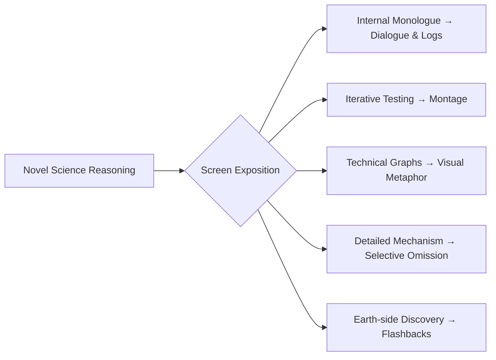

---
tags:
  - phm
  - adaptation
  - film
  - exposition
  - hard-sf
up: "[[Project Hail Mary]]"
confidence: verified
freshness: stable
tier-coverage: [intuition, core, deep-dive, practice]
---
# Science Exposition on Screen

> **One-line summary** — The adaptation challenge is to make Grace's step-by-step scientific reasoning legible on screen without losing pacing or identity.

## 🎯 Intuition
**The Core Idea:** One of the defining features of [[Project Hail Mary]] is its deep science exposition — readers follow Grace's reasoning step by step through biology, physics, and engineering problems.
**Why It Matters:** Translating this to film is a fundamental adaptation challenge. The science exposition problem is not just a technical challenge — it goes to the core of what makes *Project Hail Mary* distinctive. If the film reduces the science to plot furniture — things that happen to move the story forward rather than things the audience works through with Grace — it risks losing the novel's identity.

## ⚙️ Core Mechanics
### Key Details

> [!note] Limited Public Detail
> This note discusses general adaptation strategies based on the novel's structure and available adaptation coverage. Specific scene-by-scene choices should be updated as detailed breakdowns become available.

### The Problem
The novel's science exposition works because of two structural features that film cannot directly replicate:

#### 1. Internal Monologue as Narrative Engine
Grace's reasoning is the primary storytelling mechanism. The reader follows his thought process: observe anomaly → form hypothesis → test → revise → test again. This iterative inner dialogue is what makes the science feel authentic and what drives the plot forward. Film has no native equivalent to internal monologue at this density.

#### 2. The Reader Controls the Pace
A reader encountering a passage about spectral absorption lines or predator-prey ecology can slow down, reread, or pause to think. A film audience cannot. The exposition must land in real time, at the film's pace, not the audience's.

### Strategies the Adaptation Can Use
#### Externalized Dialogue
The novel already provides a natural escape valve: once Rocky arrives, Grace can explain his reasoning *to Rocky*. This is the oldest trick in science-fiction adaptation — the knowledgeable character explaining to the less-knowledgeable one — but it works here because the knowledge asymmetry is genuine. Grace is the biologist; Rocky is the engineer. Each has reason to explain their domain to the other.

Before Rocky's arrival, the film faces the harder version of the problem. Available tools:
- **Ship's log / spoken reasoning.** Grace talking to a recorder or to himself — functional but risks feeling like narration.
- **Visual flashbacks.** Earth-side scenes can *show* the science being discovered rather than explained — Stratt's briefings, lab sequences, the Baikonur explosion ([[Novel - Baikonur explosion demonstrates Astrophage energy density as an intuition failure for safe handling]]).

#### Visual Metaphor and Demonstration
Some of the novel's best science moments are inherently visual:
- Astrophage glowing under the microscope — energy density made visible.
- The Petrova Line in a spectrogram — the crisis rendered as a graph.
- Taumoeba consuming Astrophage under magnification — the solution as biological drama.
- The fuel-tank breach — physics made physical and terrifying.

A skilled adaptation can replace paragraphs of explanation with seconds of well-designed imagery. The trade-off is precision: the audience understands *what* happens but may lose the *why*.

#### Compression and Montage
The novel's iterative experimentation — try, fail, adjust, try again — is one of its most praised features but is inherently repetitive on screen. The standard adaptation strategy is **montage**: compress multiple iterations into a sequence that conveys process and elapsed time without reproducing each step. See [[Novel vs Film Adaptation]] for the broader compression analysis.

What's lost: the methodological feel that makes the novel's science authentic. What's gained: pacing and visual momentum.

#### Selective Omission
Not every scientific explanation in the novel needs to reach the screen. The film can:
- Keep the high-level logic (Astrophage eats stars; Taumoeba eats Astrophage; breed a resistant strain; deploy it) while omitting intermediate chemistry.
- Show results (the spectrogram, the dimming data) without fully explaining the detection method.
- Trust the audience to follow cause-and-effect without understanding mechanism.

This is the most common adaptation strategy for hard-SF material, and it carries a real cost: the novel's argument that *the science itself is the adventure* becomes harder to sustain when the science is summarized rather than shown.

### What's at Stake
The science exposition problem is not just a technical challenge — it goes to the core of what makes *Project Hail Mary* distinctive. Weir's method ([[Weir's Hard SF Method]]) depends on the reader experiencing the problem-solving process. If the film reduces the science to plot furniture — things that happen to move the story forward rather than things the audience works through with Grace — it risks losing the novel's identity.

The most successful adaptations of hard-SF material (*The Martian*, *Apollo 13*, *Arrival*) found ways to make the problem-solving feel urgent and comprehensible without requiring the audience to follow every technical step. *Project Hail Mary* faces the same challenge at higher difficulty because its science is more exotic (alien biology, interstellar ecology) and its key concepts are less intuitive than growing potatoes on Mars.

### Key Facts

| Fact | Detail |
|---|---|
| Core challenge | The novel depends on dense science exposition driven by Grace's reasoning. |
| Structural limit | Film cannot directly reproduce internal monologue at the same density. |
| Pacing difference | Readers can pause and reread; film audiences must absorb exposition in real time. |
| Main workaround | Dialogue with Rocky gives the adaptation a natural way to externalize explanation. |
| Visual strength | Spectrograms, microscopes, Taumoeba, and breaches can turn explanation into imagery. |
| Main risk | Selective omission can preserve plot while weakening the sense that science itself is the adventure. |

## 🔬 Deep Dive
### Scientific Accuracy
A film version can preserve the novel's scientific framework even while omitting intermediate steps. The likely compromise is strong fidelity to high-level logic and outcomes, paired with reduced visibility into the actual chain of hypothesis, test, revision, and proof.

### Narrative Analysis
The medium shift changes science from a sustained reading process into a real-time audiovisual experience. That makes dialogue, imagery, montage, and omission essential tools, but it also means the film must work harder to keep problem-solving central rather than merely illustrative.

### Connections

- The method being adapted: [[Weir's Hard SF Method]]
- Broader adaptation analysis: [[Novel vs Film Adaptation]]
- Rocky's design as a related challenge: [[Rocky on Screen]]
- The protagonist whose reasoning must be externalized: [[Ryland Grace]]
- The science the film must convey: [[Astrophage Biology]], [[Taumoeba and the Biological Solution]], [[Stellar Dimming and the Petrova Line]]

## 🏋️ Practice
### Discussion Questions
1. Which science sequences in *Project Hail Mary* absolutely need to be shown in process rather than summarized in results?
2. How much explanation can a hard-SF film omit before it stops feeling like hard SF?
3. Does dialogue with Rocky strengthen the science exposition by making it social, or weaken it by simplifying the reasoning?

### Analysis
- Compare the novel's hypothesis-test-revise rhythm with what a film montage can and cannot preserve.
- Analyze whether selective omission clarifies the story or erodes the novel's central appeal.

### Creative Challenge
- **What if...** the adaptation devoted one full scene to Grace explaining a scientific insight visually, without voiceover, narration, or exposition-heavy dialogue?

## References

- [[Project Hail Mary/Sources/Sources Index#No Film School Goddard Interview|No Film School Goddard Interview]] — screenwriter's approach to adaptation
- [[Project Hail Mary/Sources/Sources Index#Nature Film Review|Nature Film Review]] — science-journal perspective
- [[Project Hail Mary/Sources/Sources Index#SlashFilm Changes|SlashFilm Changes]] — book-to-movie change tracking