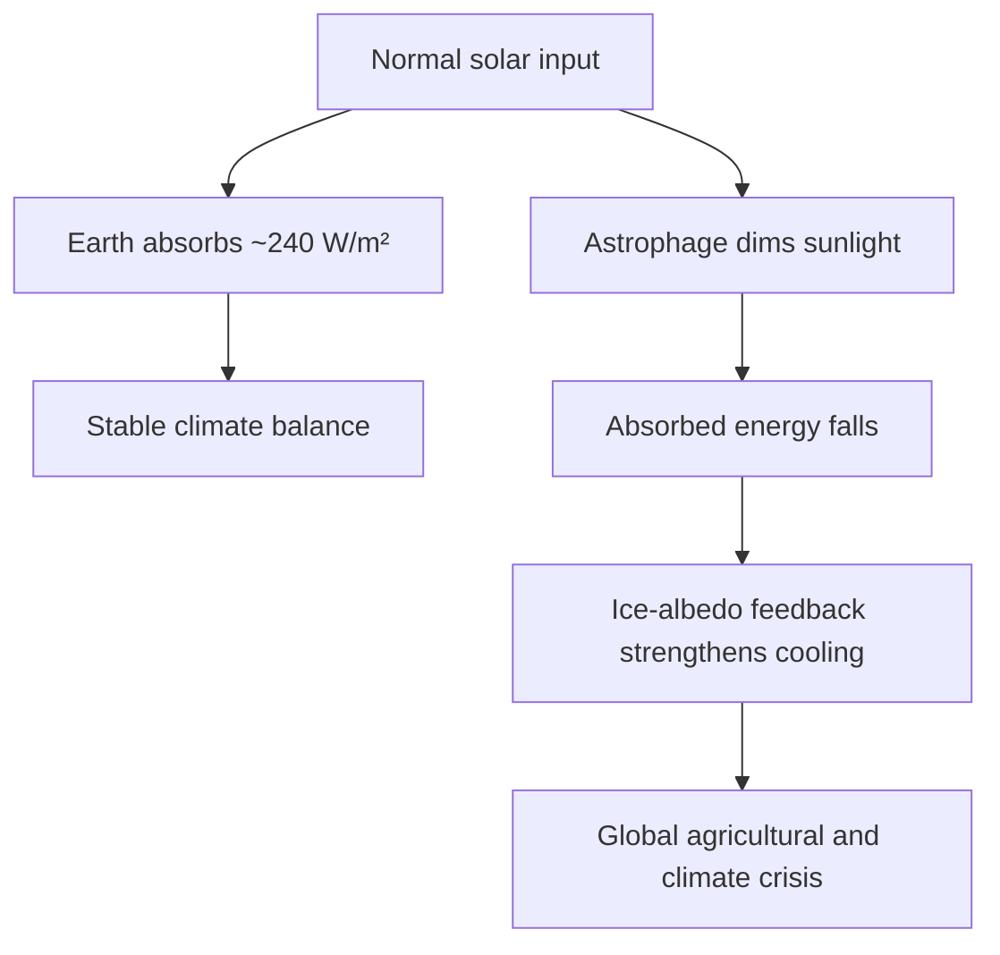

---
tags:
  - phm
  - astronomy
  - climate
  - energy-budget
up: "[[Project Hail Mary]]"
confidence: verified
freshness: stable
tier-coverage: [intuition, core, deep-dive, practice]
---
# Earth Energy Budget Under Threat

> **One-line summary** — Even a modest Astrophage-driven drop in sunlight would hit Earth's climate far harder than today's greenhouse imbalance and could push the planet toward catastrophic cooling.

## 🎯 Intuition
**The Core Idea:** Earth's climate depends on a narrow energy balance, so even a few percent reduction in incoming sunlight would be globally destabilizing.
**Why It Matters:** In [[Project Hail Mary]], [[Astrophage Biology|Astrophage]] does not need to block all sunlight to threaten civilization; it only needs to shift the energy budget enough to trigger severe cooling. This gives the novel's central crisis real scientific weight, because the climate system already responds strongly to changes much smaller than the dimming implied by the story.

## ⚙️ Core Mechanics
### Key Details
In [[Project Hail Mary]], [[Astrophage Biology|Astrophage]] intercepts enough solar output to threaten Earth's climate. This note examines the real energy budget and why even small changes matter enormously.

Earth's climate is a finely tuned energy balance. The solar constant at the top of the atmosphere is about 1,361 W/m², but because Earth is spherical the global-average insolation is only about 340 W/m². After albedo is accounted for, Earth absorbs roughly 240 W/m².

The crucial point is that the system is already sensitive to small imbalances: the present-day radiative imbalance from greenhouse gases is only about ~1 W/m², and that is already driving measurable warming. A solar reduction of a few percent would therefore be enormous by climate standards.

A **2% solar reduction** would decrease absorbed energy by ~5 W/m²—five times the current greenhouse imbalance, but in the cooling direction. A **5–10% reduction** would plausibly trigger **ice-albedo feedback**: more ice → higher reflectivity → less absorption → more ice. This is the same basic mechanism implicated in historical snowball-Earth episodes.

The **Maunder Minimum** (1645–1715), a period of reduced solar activity with only ~0.1% luminosity change, correlated with the Little Ice Age. A multi-percent drop would be incomparably worse. That is why the novel's premise—that a few percent of solar dimming could end civilization—is well-grounded in climate physics. If anything, Andy Weir may understate how quickly agricultural collapse would follow.

The PHM scenario posits ongoing, accelerating dimming as Astrophage populations grow. This creates a ticking clock: humanity must either eliminate the Astrophage or find a way to restore solar output. There is no graceful recovery from runaway ice-albedo feedback without restoring the energy source.

> [!note] Nuance
> The novel doesn't deeply explore intermediate climate responses (ocean thermal inertia, atmospheric circulation changes). Real climate models show complex transients before a snowball state is reached. But the endpoint concern is legitimate.

### Key Facts

| Fact | Detail |
|---|---|
| Solar constant | About ~1,361 W/m² at the top of Earth's atmosphere |
| Global-average insolation | About ~340 W/m² after geometric averaging over the sphere |
| Absorbed energy | About ~240 W/m² after Earth's albedo is accounted for |
| Current radiative imbalance | Roughly ~1 W/m², already enough to drive measurable warming |
| 2% solar reduction | Would cut absorbed energy by ~5 W/m², far larger than today's imbalance |
| 5–10% reduction risk | Could trigger ice-albedo feedback and push Earth toward extreme cooling |

## 🔬 Deep Dive
### Scientific Accuracy
This page's core claim is strongly grounded in real climate physics: small radiative forcings can have planet-scale consequences, and a multi-percent solar dimming would be severe. The novel simplifies the path to catastrophe by not dwelling on transient ocean and atmosphere responses, but its endpoint warning is scientifically credible.

### Narrative Analysis
This science gives the novel its urgency. The crisis is not abstract astronomy but a direct threat to agriculture, habitability, and social stability on Earth, which justifies the extreme, desperate scale of the Hail Mary mission.

### Connections
- Source of the dimming: [[Stellar Dimming and the Petrova Line]]
- The organism causing it: [[Astrophage Biology]]
- Solar variability context: [[Solar Variability and Historical Precedents]]
- The mission to fix it: [[The Hail Mary Drive]]
- Accuracy summary: [[Science Accuracy Scorecard]]

## 🏋️ Practice
### Discussion Questions
1. Why does the comparison between a ~1 W/m² greenhouse imbalance and a multi-watt solar reduction make the PHM crisis feel scientifically credible?
2. How does this page deepen the stakes of [[Stellar Dimming and the Petrova Line]] by translating an astronomical anomaly into a planetary survival problem?
3. What real-world lessons about climate sensitivity and food-system fragility can be drawn from the scenario described here?

### Analysis
- Compare the novel's dimming crisis with historical climate perturbations such as the Maunder Minimum: where does PHM stay realistic, and where does it simplify the timeline?
- Assess whether ice-albedo feedback is the most important concept for understanding why a seemingly small solar change could become an existential threat.

### Creative Challenge
- **What if...** Astrophage had reduced solar output by only a fraction of the amount feared in the novel—would slow-moving climate damage still have pushed humanity into a global emergency mission?

## References

- [[Project Hail Mary/Sources/Sources Index#NASA Earth Energy Budget|NASA Earth Energy Budget]] — authoritative energy budget data
- [[Project Hail Mary/Sources/Sources Index#NOAA Incoming Sunlight|NOAA Incoming Sunlight]] — solar variability and Maunder Minimum
- [[Project Hail Mary/Sources/Sources Index#Britannica PHM Science|Britannica PHM Science]] — PHM astronomy context

## Supporting Chunks

- [[Astronomy - Global average sunlight is one quarter of the solar constant]] — The factor-of-four geometry and real insolation numbers
- [[Astronomy - Ice albedo feedback amplifies solar dimming]] — Why the feedback loop makes the crisis existential