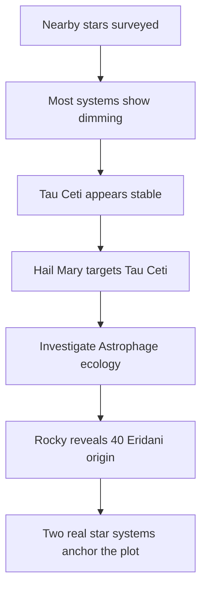

---
tags:
  - phm
  - astronomy
  - exoplanets
  - tau-ceti
  - eridani
  - habitability
up: "[[Project Hail Mary]]"
confidence: verified
freshness: stable
tier-coverage: [intuition, core, deep-dive, practice]
---
# Exoplanet Science and Target Star Selection

> **One-line summary** — The novel's mission logic is built around real nearby stars, but the planets and ecological details that matter most to the plot remain partly or wholly speculative.

## 🎯 Intuition
**The Core Idea:** [[Project Hail Mary]] chooses target systems using recognizably real exoplanet reasoning, then layers its fictional Astrophage ecology onto those real stellar anchors.
**Why It Matters:** Tau Ceti matters because it appears to resist the dimming affecting other stars, making it a scientifically motivated investigation target rather than a random destination. 40 Eridani matters because it gives the story a plausible nearby K-dwarf system for Rocky's world, tying alien biology to a real astronomical setting.

## ⚙️ Core Mechanics
### Key Details
[[Project Hail Mary]] sends its mission to Tau Ceti because that system appears to resist Astrophage dimming, and Rocky's homeworld orbits 40 Eridani A. Both are real star systems with real exoplanet candidates. This note covers the actual state of exoplanet science for these systems and where Weir's choices are grounded versus speculative.

In the novel, Tau Ceti is selected not because it is known to host habitable worlds, but because its luminosity is anomalously stable while other nearby stars are dimming. The mission is to discover *why* — not to colonize. This is a reasonable fictional framing: it takes a real astronomical target and gives it a novel-specific significance.

40 Eridani is Rocky's origin system. The novel needs a nearby star plausibly hosting an extreme-environment planet where ammonia-based life could evolve. 40 Eridani A, a K-dwarf, fits this requirement.

See [[Tau Ceti and 40 Eridani]] for basic stellar properties and the novel's specific use of each system.

**Tau Ceti: What We Actually Know**

**Star:** G8.5V, ~12 light-years away. Slightly cooler and smaller than the Sun. One of the nearest Sun-like stars — a perennial target of SETI and exoplanet searches.

**Exoplanet candidates:**
- Multiple radial-velocity candidates have been reported (Tuomi et al. 2013, Feng et al. 2017), with up to 4–5 possible planets in periods ranging from ~20 to ~600+ days.
- **Confirmation status: disputed.** Several candidates may be artifacts of stellar activity (granulation noise, magnetic cycles) rather than true planetary signals. Tau Ceti's high metallicity and known debris disk complicate detection.
- At least two candidates (Tau Ceti e and f) have been placed near the habitable zone in some analyses, but their existence remains provisional.
- No transit detection has confirmed any Tau Ceti planet.

**What the novel assumes:** A planetary system exists. The specific planet(s) involved in the Astrophage ecology are fictional constructs. The choice of Tau Ceti is grounded — it is a real nearby Sun-like star where planet searches are active — but the specific planetary configuration is speculative.

**40 Eridani: What We Actually Know**

**Star:** 40 Eridani A is a K1V dwarf in a triple-star system, ~16.3 light-years away. The system also contains a white dwarf (40 Eridani B) and a red dwarf (40 Eridani C).

**Exoplanet candidates:**
- 40 Eridani Ab (HD 26965 b) was reported in 2018 as a super-Earth candidate with a ~42-day orbital period, placing it near the inner edge of the habitable zone.
- **Confirmation status: debated.** Some follow-up analyses suggest the signal may be stellar activity rather than a planet. The detection remains provisional.
- The triple-star system's dynamics could affect long-term orbital stability of planets, though the wide separations of the B and C components make this less problematic for planets close to the A component.

**What the novel assumes:** A planet orbiting 40 Eridani A with extreme pressure, temperature, and atmospheric conditions suitable for ammonia-based life. This is entirely fictional but uses a real stellar target. The choice of a K-dwarf is reasonable: K-dwarfs are considered among the most promising hosts for habitable planets due to their longer main-sequence lifetimes and moderate UV output.

**Broader Exoplanet Context**

As of the 2020s, exoplanet science has confirmed thousands of planets around other stars, but:
- Most confirmed exoplanets are detected by transit (Kepler/TESS) or radial velocity. Direct imaging is rare.
- Nearby Sun-like stars remain among the hardest targets because their planets produce small signals relative to stellar noise.
- Habitability assessments remain model-dependent. "Habitable zone" is a useful heuristic, not a guarantee.
- Atmospheric characterization (the kind of data that would reveal Astrophage-like phenomena) is in its early stages, with JWST beginning to provide spectroscopic data for transiting exoplanets.

Weir's choice to use real, nearby stars as mission targets is consistent with both real astronomy and the novel's hard-SF method: start with reality, extrapolate one impossible thing (Astrophage), and follow the consequences.

### Key Facts

| Fact | Detail |
|---|---|
| Tau Ceti | Real nearby G8.5V Sun-like star about ~12 light-years away |
| Tau Ceti planets | Multiple candidates have been proposed, but none are securely confirmed |
| 40 Eridani A | Real nearby K1V dwarf in a triple-star system about ~16.3 light-years away |
| 40 Eridani Ab | Reported super-Earth candidate, but confirmation remains debated |
| Novel mission logic | Tau Ceti is chosen for anomalous luminosity stability, not colonization |
| Fictional layer | The specific planetary environments and Astrophage ecology are novel inventions |

## 🔬 Deep Dive
### Scientific Accuracy
The novel is careful in its choice of stellar targets: Tau Ceti and 40 Eridani are both legitimate nearby systems that astronomers actually study. What remains speculative is exactly what exoplanet science still struggles with in reality—whether certain candidate planets are real, what their atmospheres are like, and whether their environments are remotely habitable.

| Element | Status | Notes |
|---|---|---|
| Tau Ceti is a real nearby Sun-like star | ✅ Real | ~12 ly, G8.5V |
| Tau Ceti has confirmed planets | ❓ Uncertain | Candidates exist; none confirmed |
| 40 Eridani A is a real nearby K-dwarf | ✅ Real | ~16.3 ly, K1V |
| 40 Eridani Ab (super-Earth) is confirmed | ❓ Uncertain | Debated; may be stellar noise |
| Both systems are within plausible interstellar-mission range | 🔶 Extrapolated | At 0.1c–0.5c, decades to centuries |
| Specific planetary environments in the novel | ❌ Fictional | No observational basis for novel's conditions |
| Selection logic (nearby Sun-like + anomalous stability) | ✅ Grounded method | Real target-selection reasoning, fictional trigger |

### Narrative Analysis
This topic lets the novel feel rigorous without requiring every astronomical detail to be real. By choosing real nearby systems and then making the dramatic leap in the ecological details, the story keeps one foot in actual exoplanet science while building a mystery that can drive interstellar travel, first contact, and the Astrophage investigation.

### Connections
- Stellar properties and novel-specific use: [[Tau Ceti and 40 Eridani]]
- Rocky's homeworld biology: [[Rocky and the Eridians]] and [[Alternative Biochemistry]]
- The anomaly that triggers the mission: [[Stellar Dimming and the Petrova Line]]
- Solar variability context: [[Solar Variability and Historical Precedents]]
- The Adrian ecology at Tau Ceti: [[The Adrian Ecology]]
- Accuracy overview: [[Science Accuracy Scorecard]]

## 🏋️ Practice
### Discussion Questions
1. Why is Tau Ceti a stronger narrative choice as an "anomalously stable" system than as a simple habitable-world destination?
2. How does the uncertainty around both Tau Ceti's and 40 Eridani's planets actually help the novel rather than weaken its realism?
3. What does this page suggest about the limits of current exoplanet science when trying to move from star data to claims about habitability or ecology?

### Analysis
- Evaluate how effectively the novel uses real astronomical uncertainty as space for fiction: where does this feel disciplined, and where does it become pure invention?
- Compare Tau Ceti's role as a scientific target with 40 Eridani's role as Rocky's origin system: how do the two systems serve different narrative functions?

### Creative Challenge
- **What if...** a future telescope had already confirmed a complex planetary system at Tau Ceti before the Petrova crisis began—would that have made the Hail Mary mission easier to justify, or more politically complicated?

## References

- [[Project Hail Mary/Sources/Sources Index#Britannica PHM Science|Britannica PHM Science]] — star system context
- [[Project Hail Mary/Sources/Sources Index#Northeastern Accuracy Discussion|Northeastern Accuracy Discussion]] — fact-check of astronomical claims

## Supporting Chunks