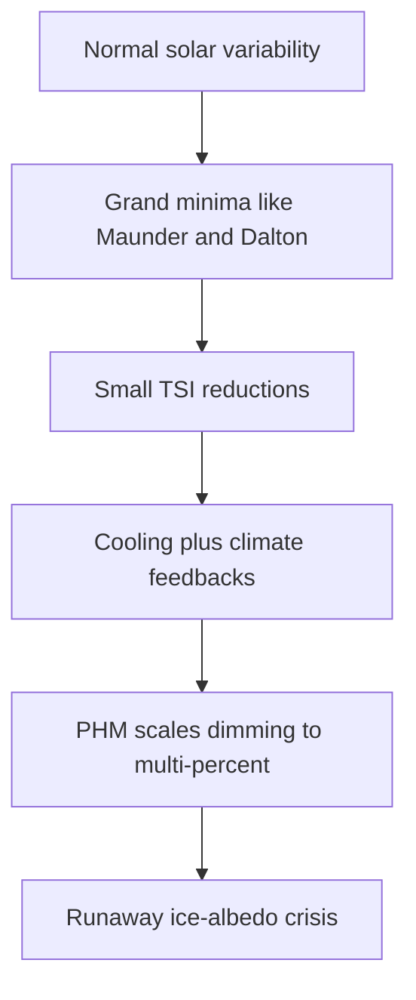

---
tags:
  - phm
  - astronomy
  - solar
  - climate
  - maunder-minimum
up: "[[Project Hail Mary]]"
confidence: verified
freshness: stable
tier-coverage: [intuition, core, deep-dive, practice]
---
# Solar Variability and Historical Precedents

> **One-line summary** — Real solar variability is small but climatically meaningful, which is why PHM's much larger fictional dimming feels scientifically plausible in kind even though its scale is invented.

## 🎯 Intuition
**The Core Idea:** The Sun is not perfectly constant, and history shows that even small dips in solar output can matter once climate feedbacks begin to amplify them.
**Why It Matters:** The premise of [[Project Hail Mary]] — that solar dimming could threaten civilization — draws power from real solar physics and real climate history. The novel exaggerates the magnitude of the dimming, but it does so on top of a true scientific foundation: small changes in sunlight can produce serious downstream consequences.

## ⚙️ Core Mechanics
### Key Details
The premise of [[Project Hail Mary]] — that solar dimming could threaten civilization — is grounded in real solar physics and historical climate events. This note covers what we know about natural solar variability, the historical precedents for dimming-driven climate disruption, and why the novel's premise is scientifically reasonable in kind (if not in degree).

The Sun's luminosity varies on multiple timescales:
- **11-year solar cycle.** Sunspot counts rise and fall over roughly 11 years, driving total solar irradiance (TSI) variations of about **0.1%** (roughly 1.3 W/m² at Earth's orbit). This is small but measurable and correlates with minor climate effects.
- **Longer-period modulation.** Multi-decadal and centennial variations in solar activity produce periods of notably high or low sunspot activity. These are the **grand minima** and **grand maxima** of solar activity.
- **Secular trend.** Over geological time, the Sun has slowly brightened by roughly 30% since the origin of the Solar System (the "faint young Sun" problem). This is irrelevant to the novel's timescale but establishes that solar output is fundamentally variable.

The Maunder Minimum is the best-documented grand solar minimum. During this roughly 70-year period:
- Sunspot counts dropped to near zero. Entire decades passed with almost no observed sunspots.
- Estimated TSI reduction: approximately **0.04–0.08%** below modern averages — a tiny fractional change.
- The period coincides with the coldest phase of the **Little Ice Age** in Europe and North America: frozen rivers, crop failures, advancing glaciers, and documented societal stress.

The causal link between the Maunder Minimum and the Little Ice Age is real but complex. The TSI change alone is too small to explain the full cooling; amplifying mechanisms (UV variation affecting stratospheric ozone, cloud nucleation changes, ocean circulation feedbacks) likely contributed. The point is that even a *very small* solar output change can have measurable and consequential climate effects when combined with feedback mechanisms.

A less severe grand minimum, the Dalton Minimum featured:
- Reduced sunspot activity (not as extreme as the Maunder Minimum).
- Estimated TSI reduction of roughly **0.02–0.04%**.
- Correlation with cooler Northern Hemisphere temperatures, though volcanic eruptions (especially Tambora in 1815) complicate attribution.

The Dalton Minimum reinforces the pattern: reduced solar activity correlates with cooler periods, even if the direct radiative forcing is small.

The novel posits that Astrophage is intercepting a significant fraction of solar output — not 0.1% but potentially several percent and growing. That is the crucial scaling move. **The *kind* of threat is grounded:** solar variability affects climate, small changes have measurable consequences, and larger changes would have larger consequences. **The *scale* is fictional:** no natural mechanism produces multi-percent solar dimming on human timescales, so Astrophage is the invented bridge between real variability and existential threat.

See [[Earth Energy Budget Under Threat]] for the detailed energy-budget analysis of why multi-percent dimming triggers ice-albedo feedback and potential civilizational collapse.

The specific danger the novel highlights — and that real climate science confirms — is that solar dimming beyond a threshold triggers a **positive feedback loop**:
1. Reduced solar input → cooling → more ice/snow cover.
2. More ice/snow → higher surface albedo (reflectivity).
3. Higher albedo → less solar energy absorbed → further cooling.
4. Repeat.

This is the mechanism behind historical **Snowball Earth** episodes (~700 Mya, ~2,300 Mya), when the planet may have been entirely or nearly ice-covered. The ice-albedo feedback is real, well-modeled, and the reason why the novel's premise — once you grant the fictional cause — leads to genuinely catastrophic consequences. See [[Astronomy - Ice albedo feedback amplifies solar dimming]].

### Key Facts

| Fact | Detail |
|---|---|
| 11-year solar cycle | Changes TSI by about ~0.1%, enough for measurable but modest climate effects |
| Maunder Minimum | Roughly 1645–1715, with very low sunspot counts and ~0.04–0.08% TSI reduction |
| Dalton Minimum | Roughly 1790–1830, with weaker but still noticeable reduced solar activity |
| Historical lesson | Small solar-output changes can matter when feedbacks amplify them |
| PHM scaling | The novel jumps from sub-0.1% natural variability to multi-percent fictional dimming |
| Key climate danger | Ice-albedo feedback can turn cooling into a runaway process |

## 🔬 Deep Dive
### Scientific Accuracy
The novel's premise is scientifically reasonable in structure but not in magnitude. Real solar variability is small, yet historical precedents like the Maunder and Dalton minima show that even tiny irradiance changes can correlate with meaningful climate stress; PHM then scales that logic up by introducing Astrophage as an impossible but narratively disciplined cause.

| Scenario | TSI Change | Climate Effect |
|---|---|---|
| Normal 11-year cycle | ~0.1% | Minor, measurable |
| Maunder Minimum | ~0.04–0.08% | Contributed to Little Ice Age cooling |
| Dalton Minimum | ~0.02–0.04% | Cooler decades, crop stress |
| PHM premise (multi-percent) | **1–10%+** | Catastrophic: ice-albedo runaway, agricultural collapse |

The gap between historical variability (~0.1%) and the novel's premise (~1–10%) is enormous — roughly **two orders of magnitude**. That is exactly where the hard-SF move happens: the climate response is grounded, while the cause and scale are fictional.

### Narrative Analysis
This topic helps the story avoid feeling arbitrary. By showing that real solar changes already have climatic consequences, the novel makes its central emergency feel like an amplified extension of known science rather than a purely fantastical disaster.

### Connections
- The novel's energy-budget analysis: [[Earth Energy Budget Under Threat]]
- The cause of the fictional dimming: [[Stellar Dimming and the Petrova Line]]
- The organism responsible: [[Astrophage Biology]]
- Target systems for investigation: [[Tau Ceti and 40 Eridani]]
- Exoplanet context: [[Exoplanet Science and Target Star Selection]]
- Accuracy overview: [[Science Accuracy Scorecard]]

## 🏋️ Practice
### Discussion Questions
1. Why does the existence of real solar minima make the PHM premise feel more credible even though Astrophage-driven dimming is far larger than anything natural?
2. How does this page complement [[Earth Energy Budget Under Threat]] by moving from historical precedent to planetary consequences?
3. What does the Maunder Minimum example reveal about the difference between a direct forcing and a full climate response?

### Analysis
- Analyze whether the novel's realism depends more on the truth of solar variability itself or on the realism of feedback mechanisms like ice-albedo amplification.
- Compare the explanatory role of the Maunder and Dalton minima: which is more useful for understanding the story's science, and why?

### Creative Challenge
- **What if...** astronomers had first assumed the Petrova crisis was just an extreme natural solar minimum—how long might that misdiagnosis have delayed the real response?

## References

- [[Project Hail Mary/Sources/Sources Index#NOAA Incoming Sunlight|NOAA Incoming Sunlight]] — solar variability and Maunder Minimum context
- [[Project Hail Mary/Sources/Sources Index#NASA Earth Energy Budget|NASA Earth Energy Budget]] — energy budget data
- [[Project Hail Mary/Sources/Sources Index#Britannica PHM Science|Britannica PHM Science]] — PHM astronomy context

## Supporting Chunks

- [[Astronomy - Global average sunlight is one quarter of the solar constant]] — the baseline energy numbers
- [[Astronomy - Ice albedo feedback amplifies solar dimming]] — the feedback mechanism that makes dimming existential