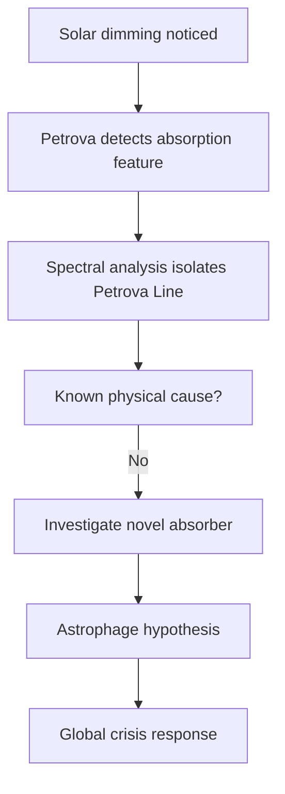

---
tags:
  - phm
  - astronomy
  - spectroscopy
  - petrova-line
up: "[[Project Hail Mary]]"
confidence: verified
tier-coverage: [intuition, core, deep-dive, practice]
---
# Stellar Dimming and the Petrova Line

> **One-line summary** — The Petrova Line turns a mysterious drop in solar output into a solvable scientific problem by giving the dimming a detectable spectral fingerprint.

## 🎯 Intuition
**The Core Idea:** A strange absorption feature in the Sun's spectrum reveals that the dimming is being caused by something real and detectable, not just by ordinary solar variation.
**Why It Matters:** This is the inciting scientific discovery of [[Project Hail Mary]], because it transforms a vague planetary crisis into a specific astronomical anomaly that can be investigated. It also grounds the novel in a real scientific method: when something odd dims a star, astronomers use spectroscopy to figure out what is in the way.

## ⚙️ Core Mechanics
### Key Details
The inciting crisis of [[Project Hail Mary]] is that the Sun is dimming. This note covers the real-world science of stellar dimming, how spectroscopy works as a detection tool, and where the novel departs from reality.

Dr. Irina Petrova identifies an anomalous absorption feature in the solar spectrum—the **Petrova line**—revealing that the Sun's luminosity is declining at a rate that will trigger a catastrophic ice age within decades. The cause is [[Astrophage Biology|Astrophage]]—organisms intercepting solar output. Eva Stratt, a high-ranking administrator, is appointed to lead the international taskforce responding to the crisis, but the discovery itself belongs to Petrova and the spectral signature that bears her name.

Spectroscopy is astronomy's most powerful identification tool. Every element and molecule absorbs or emits light at characteristic wavelengths (spectral lines). By analyzing a star's spectrum, astronomers determine its composition, temperature, motion, and—critically—the presence of intervening material.

The Petrova-line concept is **methodologically realistic**: if a novel substance were present in sufficient quantity between a star and an observer, it would produce a detectable absorption feature. This is exactly how we identify interstellar gas, exoplanet atmospheres, and stellar compositions.

KIC 8462852 ("Tabby's Star") exhibited unexplained dimming events of up to 22%, detected by the *Kepler* space telescope. The dimming triggered intense investigation and speculation (including, briefly, megastructure hypotheses). The leading explanation is now orbiting dust or debris clouds.

Tabby's Star illustrates the real scientific workflow: anomalous dimming → spectral analysis → hypothesis testing. The PHM storyline follows the same logic, substituting biology for dust.

### Key Facts

| Fact | Detail |
|---|---|
| Petrova Line | An anomalous absorption feature showing that the Sun's dimming has a specific spectral signature |
| Discoverer | Dr. Irina Petrova identifies the key spectral evidence in the novel |
| Real method | Spectroscopy uses characteristic wavelengths to identify substances and conditions |
| Real analog | Tabby's Star showed major unexplained dimming and triggered intensive follow-up analysis |
| Grounded element | Detecting dimming and inferring causes from absorption features are standard astronomy practices |
| Fictional leap | A biological absorber—[[Astrophage Biology|Astrophage]]—causing the feature has no real precedent |

## 🔬 Deep Dive
### Scientific Accuracy
The novel's science is strongest at the level of method. Photometric dimming, spectroscopic fingerprinting, and hypothesis testing are exactly how astronomers investigate real anomalies; the invented part is not the workflow but the existence of a space-dwelling organism that creates the absorption signature.

| Aspect | Status |
|---|---|
| Detecting dimming via photometry | ✅ Standard practice |
| Identifying cause via absorption lines | ✅ Real method |
| Novel absorption line from unknown substance | ✅ Plausible in principle |
| Biological origin of the absorption | ❌ No precedent |
| Astrophage as the absorbing agent | ❌ Fictional organism |

### Narrative Analysis
The Petrova Line is the plot's scientific trigger. It gives the disaster a name, a discoverer, and a measurable mechanism, which lets the novel pivot from vague fear into investigation, geopolitics, and eventually the Hail Mary mission.

### Connections
- The cause of the dimming: [[Astrophage Biology]]
- Climate consequences of reduced solar input: [[Earth Energy Budget Under Threat]]
- Target star systems for investigation: [[Tau Ceti and 40 Eridani]]
- Accuracy overview: [[Science Accuracy Scorecard]]

## 🏋️ Practice
### Discussion Questions
1. Why does giving the dimming a named spectral signature make the PHM crisis feel more concrete and scientifically believable?
2. How does the comparison with Tabby's Star help distinguish between realistic detection methods and the novel's fictional biological explanation?
3. What role does Petrova's discovery play in turning a climate threat into an astronomy-driven mystery?

### Analysis
- Assess whether the Petrova Line works better as a hard-SF device because it is tied to spectroscopy rather than to a more vague observational anomaly.
- Compare the narrative importance of Petrova's scientific discovery with Stratt's administrative response: which one truly launches the story, and why?

### Creative Challenge
- **What if...** the Sun had been dimming but no unique Petrova Line had appeared—would humanity have recognized the true cause in time, or misread the crisis as natural solar variability?

## References

- [[Sources Index#OpenStax Spectroscopy]] — textbook spectroscopy
- [[Sources Index#Tabby's Star Overview]] — real anomalous dimming
- [[Sources Index#Britannica PHM Science]] — contextualizing PHM's astronomy
- [[Sources Index#NASA Earth Energy Budget]] — solar constant data

## Supporting Chunks

- [[Astrophage - Petrova-line breeding band at Adrian is 91.2 km altitude and less than 200 metres thick]]
- [[Novel - Sol's recovery to pre-Astrophage brightness confirms the Beetle delivery succeeded]]
- [[Astronomy - Petrova Line email introduces the Astrophage phenomenon as an unexplained infrared arc]] — Ch01: the email that first identified the infrared arc
- [[Astrophage - CO2 emission spectroscopy explains how Astrophage navigates to Venus for reproduction]] — Ch04: mechanism explaining the Petrova Line's shape