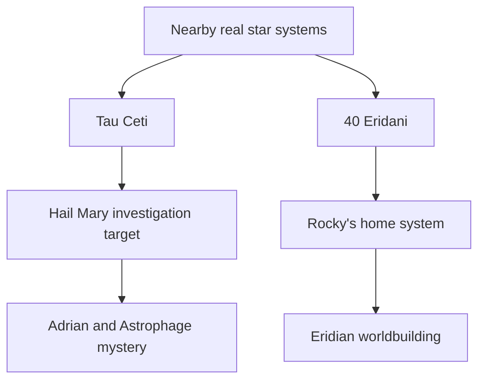

---
tags:
  - phm
  - astronomy
  - star-systems
  - tau-ceti
  - eridani
up: "[[Project Hail Mary]]"
confidence: verified
freshness: stable
tier-coverage: [intuition, core, deep-dive, practice]
---
# Tau Ceti and 40 Eridani

> **One-line summary** — Tau Ceti and 40 Eridani are real nearby star systems that anchor PHM's mission target and Rocky's home system in plausible astronomy even where the planetary details are fictional.

## 🎯 Intuition
**The Core Idea:** The novel uses two real nearby stars for two different purposes: Tau Ceti as the mystery to investigate and 40 Eridani as the home of an alien civilization.
**Why It Matters:** This choice helps [[Project Hail Mary]] feel like hard science fiction rather than generic space adventure. By building the story around real, lookup-able stars, Andy Weir gives the novel a strong astrophysical frame even when the planets, biospheres, and ecological details are extrapolated.

## ⚙️ Core Mechanics
### Key Details
[[Project Hail Mary]] sends its mission to the Tau Ceti system, and Rocky's homeworld orbits 40 Eridani. This note covers the real astrophysics of both systems and where the novel simplifies.

**Tau Ceti**
- **Spectral type**: G8.5V — a Sun-like star, slightly cooler and smaller.
- **Distance**: ~12 light-years from Earth — one of the closest Sun-like stars.
- **Exoplanet candidates**: Multiple candidates detected via radial velocity, but their existence and orbital parameters remain debated. Some may be statistical artifacts of stellar activity.
- **Habitable zone**: Estimated, but Tau Ceti's higher metallicity and possible debris disk complicate habitability assessments.

**In the novel**: Tau Ceti is chosen because it's a nearby Sun-like star that appears to resist Astrophage dimming — its luminosity is stable while other stars dim. The mission's goal is to discover why. This is a reasonable fictional choice: Tau Ceti is a real, nearby, Sun-like star that astronomers have long considered a candidate for hosting habitable worlds.

**What's simplified**: The novel treats Tau Ceti's habitable zone as more clearly defined than current data supports. Real exoplanet confirmation around Tau Ceti is still provisional.

**40 Eridani (Keid)**
- **System**: A triple-star system ~16.3 light-years away. The primary (40 Eridani A) is a K1V dwarf.
- **Exoplanets**: 40 Eridani A has a reported super-Earth candidate (40 Eridani Ab), but the detection itself remains debated — some analyses attribute the signal to stellar activity rather than a planet.
- **Relevance**: Rocky's home system. The Eridian environment — high pressure, high temperature, ammonia-based — is built around a plausible (if extreme) planetary scenario near a K-dwarf star.

**What's simplified**: The novel needs a nearby star system with a plausible extreme-environment planet. 40 Eridani fits well enough, but the specific planetary conditions (pressure, temperature, atmospheric composition) are fictional constructions rather than observational results.

Weir chose both systems for sound narrative and scientific reasons:
1. **Proximity** — both are within ~16 light-years, making (barely) plausible interstellar missions.
2. **Sun-like properties** — both host main-sequence stars where Astrophage behavior (feeding on stellar output) makes conceptual sense.
3. **Real targets** — using real stars rather than invented ones grounds the story and lets readers look up real data.

### Key Facts

| Fact | Detail |
|---|---|
| Tau Ceti type and distance | G8.5V star about ~12 light-years away |
| Tau Ceti role | Mission target because it appears resistant to Astrophage dimming |
| Tau Ceti limitation | Proposed planets and habitable-zone details remain uncertain |
| 40 Eridani system | Triple-star system about ~16.3 light-years away with K1V primary 40 Eridani A |
| 40 Eridani role | Rocky's home system and the anchor for Eridian worldbuilding |
| Main simplification | The novel invents the detailed planetary environments around both systems |

## 🔬 Deep Dive
### Scientific Accuracy
This page is a good example of Weir's broader method: choose real stars first, then fictionalize only the parts astronomy cannot yet pin down. Tau Ceti and 40 Eridani are both legitimate nearby targets, but the novel simplifies the uncertainty around their planets and stretches available data into fully realized ecosystems and plot-critical worlds.

### Narrative Analysis
The two systems divide narrative labor cleanly. Tau Ceti functions as the outward scientific mystery that launches the mission, while 40 Eridani gives the story its first-contact and comparative-biology payoff through Rocky and the Eridians.

### Connections
- Why the mission exists: [[Stellar Dimming and the Petrova Line]]
- Rocky's home environment: [[Rocky and the Eridians]]
- Alternative biochemistry under Eridian conditions: [[Alternative Biochemistry]]
- Exoplanet detection details: [[Exoplanet Science and Target Star Selection]]
- The Adrian ecology in the Tau Ceti system: [[The Adrian Ecology]]
- Accuracy overview: [[Science Accuracy Scorecard]]

## 🏋️ Practice
### Discussion Questions
1. Why are Tau Ceti and 40 Eridani better hard-SF choices than fully invented star systems would have been?
2. How does this page clarify the difference between the novel's investigative destination and Rocky's biological origin?
3. What does the uncertainty around exoplanets in both systems reveal about the limits of present-day astronomy?

### Analysis
- Compare how the novel uses Tau Ceti for mystery and 40 Eridani for payoff: which system carries more scientific weight, and which carries more emotional or narrative weight?
- Evaluate whether the realism of the stars themselves is enough to support the more speculative planetary and biological assumptions built around them.

### Creative Challenge
- **What if...** Rocky had come from a completely invented star system instead of 40 Eridani—how much would the novel have lost in plausibility and thematic symmetry?

## References

- [[Project Hail Mary/Sources/Sources Index#Britannica PHM Science|Britannica PHM Science]] — star system context
- [[Project Hail Mary/Sources/Sources Index#Northeastern Accuracy Discussion|Northeastern Accuracy Discussion]] — fact-check of astronomical claims

## Supporting Chunks

- [[Novel - Adrian is the first named investigation target for anomalous Astrophage suppression]]
- [[Astronomy - Petrovascope first activation confirms Astrophage is present at Tau Ceti]] — Ch05: Astrophage confirmed at Tau Ceti