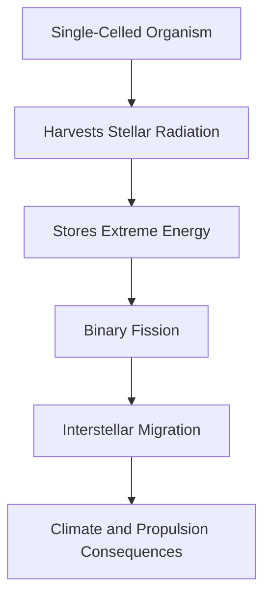

---
tags:
  - phm
  - astrophage
  - biology
  - extremophiles
up: "[[Project Hail Mary]]"
confidence: verified
tier-coverage: [intuition, core, deep-dive, practice]
---
# Astrophage Biology

> **One-line summary** — Astrophage combines real extremophile inspiration with wildly fictional energy biology to become the central organismal mystery of [[Project Hail Mary]].

## 🎯 Intuition
**The Core Idea:** Astrophage is a fictional single-celled organism that feeds on stellar radiation, survives extraordinary environments, and stores energy at impossible densities.
**Why It Matters:** It sits at the heart of the novel's scientific mystery because its biology explains both the stellar dimming crisis and the extraordinary propulsion technology built from it. The page matters scientifically because Weir grounds Astrophage in real extremophile ideas before pushing them far beyond known chemistry and physics.

## ⚙️ Core Mechanics
### Key Details
Astrophage is the fictional single-celled organism at the heart of [[Project Hail Mary]]. It migrates between stars, feeds on stellar radiation, and stores energy at densities far beyond any known biology. This note separates what is grounded in real science from what is pure invention.

The idea of radiation-eating life is not fiction. **Radiotrophic fungi** (e.g., *Cladosporium sphaerospermum*) use melanin pigments to harvest ionizing radiation for metabolic energy—confirmed both in Chernobyl reactors and aboard the ISS. *Deinococcus radiodurans* survives radiation doses thousands of times lethal to humans by rapidly repairing DNA damage. *Methanopyrus kandleri* thrives at 122°C near hydrothermal vents. These organisms demonstrate that life can exploit extreme energy sources and survive hostile conditions.

Weir's genius was combining these real traits into a single organism and then scaling the concept far beyond observed limits.

Astrophage gets several things right at the level of scientific inspiration and narrative logic. The [[Stellar Dimming and the Petrova Line|Petrova-line]] detection method—identifying a novel absorption line in a star's spectrum—mirrors real astronomical practice, since spectral fingerprinting is exactly how we identify elements, molecules, and unexpected phenomena in stellar light. The jump from “fungi eat radiation” to “cells eat starlight” is a legitimate speculative extrapolation within hard SF. Astrophage also fills a coherent ecological niche: it intercepts stellar output, reproduces, and migrates, and that ecological logic is self-consistent even if the mechanism is fictional.

The science breaks hardest in three places. First, Astrophage supposedly tolerates the stellar photosphere (~5,500°C), but no known chemistry—carbon, silicon, or otherwise—remains structured at those temperatures; all covalent bonds disintegrate well below this range. Second, Astrophage stores energy at densities approaching E = mc², implying near-complete mass-energy conversion within a single cell. Real biochemistry such as ATP or glucose stores energy at roughly 10⁻¹⁰ of that density, making this the single largest departure from known physics. See [[Astrophage Energy Physics]] for details. Third, individual cells accelerate to a significant fraction of *c* using IR emission or neutrino-like mechanisms, but even theoretical neutrino drives produce negligible thrust per unit power. See [[The Hail Mary Drive]].

### Key Facts

| Fact | Detail |
|---|---|
| Organism type | Astrophage is presented as a fictional single-celled organism central to [[Project Hail Mary]] |
| Real inspiration | Radiotrophic fungi, *D. radiodurans*, and hyperthermophiles show that life can exploit extreme radiation and heat-adjacent environments |
| Detection method | The [[Stellar Dimming and the Petrova Line|Petrova-line]] idea is grounded in real spectroscopy practice |
| Biggest scientific leap | Its energy storage approaches E = mc², far beyond any real biochemical system |
| Major survivability issue | No known chemistry could stay structured in a stellar photosphere around 5,500°C |
| Plot role | Astrophage is both the cause of stellar dimming and the fuel basis for [[The Hail Mary Drive]] |

## 🔬 Deep Dive
### Scientific Accuracy
The biology is anchored in real extremophile and radiotroph concepts, especially melanized fungi that can exploit ionizing radiation and microbes that tolerate extreme conditions. But the organism's survival at photospheric temperatures, near-mass-energy storage density, and relativistic self-propulsion are firmly fictional inventions rather than plausible near-future biology.

### Narrative Analysis
Astrophage drives the entire plot because understanding its biology is the gateway to understanding the sun-dimming crisis. It also creates the novel's signature blend of biology and engineering, since the same organism is both existential threat and technological solution.

### Connections
- Astrophage's stellar feeding drives the [[Stellar Dimming and the Petrova Line|stellar dimming]] crisis
- The dimming directly threatens the [[Earth Energy Budget Under Threat|Earth's energy budget]]
- Astrophage serves as both threat and fuel for [[The Hail Mary Drive]]
- Rocky's world faces the same Astrophage crisis; see [[Rocky and the Eridians]]
- Full lifecycle and migration mechanics: [[Astrophage Life Cycle and Migration]]
- The biological predator that solves the crisis: [[Taumoeba and the Biological Solution]]
- Accuracy summary: [[Science Accuracy Scorecard]]

## 🏋️ Practice
### Discussion Questions
1. Why does Astrophage feel scientifically persuasive even though its core energy biology is impossible by known physics?
2. How does Astrophage's biology connect the astronomical mystery of the Petrova line to the engineering of [[The Hail Mary Drive]]?
3. Which real-world extremophile provides the closest conceptual parallel to Astrophage, and where does the analogy fail?

### Analysis
- Compare the novel's use of extremophile biology with real examples like radiotrophic fungi and heat-tolerant archaea.
- Evaluate whether Astrophage works better as a biological idea, a physics idea, or a narrative device.

### Creative Challenge
- **What if...** scientists discovered a real microbe that could harvest radiation efficiently but only at terrestrial energy densities?

## References

- [[Sources Index#Dadachova 2007]] — melanin + ionizing radiation in fungi
- [[Sources Index#Casadevall 2017]] — melanized fungi and radiation review
- [[Sources Index#Shunk 2020]] — ISS *C. sphaerospermum* experiment
- [[Sources Index#Royal Institution Article]] — science-behind-fiction overview
- [[Sources Index#NASA PHM Science]] — NASA's PHM breakdown

## Supporting Chunks

- [[Astrophage - Melanized fungi accelerate under ionizing radiation]] — ISS evidence for radiotrophic growth
- [[Astrophage - Living fungal shields can attenuate radiation]] — Biological radiation shielding
- [[Astrophage - Reproduction and lifecycle involve binary fission and stellar residence]] — fictional lifecycle claim
- [[Astrophage - Interstellar migration is driven by IR-photon emission and charge gradients]] — fictional migration claim
- [[Astrophage - Grace hypothesises Astrophage may be the universal ancestor of all DNA-based galactic life]]
- [[Astrophage - Adrian is reframed as the Astrophage homeworld with a co-evolved ecology]]
- [[Astronomy - Petrovascope first activation confirms Astrophage is present at Tau Ceti]] — Ch05: Petrova Line detected at Tau Ceti
- [[Astrophage - Astrophage super cross-section turns the fuel layer into a hull radiation shield]] — Ch12: super cross-section property