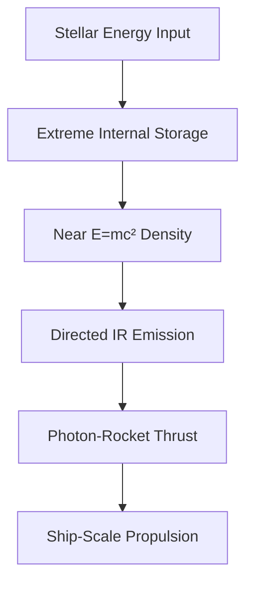

---
tags:
  - phm
  - astrophage
  - physics
  - thermodynamics
up: "[[Project Hail Mary]]"
confidence: verified
freshness: stable
tier-coverage: [intuition, core, deep-dive, practice]
---
# Astrophage Energy Physics

> **One-line summary** — Astrophage's most spectacular trait is not really biology at all, but a near-impossible physics package of extreme energy storage and microscopic photon-rocketry.

## 🎯 Intuition
**The Core Idea:** Astrophage is biologically framed in the novel, but its most important properties depend on fictional thermodynamics and propulsion physics.
**Why It Matters:** The entire plausibility of Astrophage as both crisis agent and fuel source rests on its absurd energy density. This page matters because it shows exactly where the novel stays spiritually connected to real energy conversion biology and where it leaps into hard-SF impossibility.

## ⚙️ Core Mechanics
### Key Details
This note examines the energy-storage and propulsion physics attributed to Astrophage in [[Project Hail Mary]]. While the novel frames Astrophage as a biological discovery, its thermodynamic properties belong squarely in the domain of speculative physics.

Astrophage stores energy at a density that implies near-total mass-energy conversion (E = mc²). For context, no known biological or chemical process approaches the fission tier, let alone antimatter-level storage. Astrophage's energy content is a fictional stipulation, not an extrapolation from biology.

| Storage Medium | Energy Density (J/kg) | Ratio to Astrophage |
|---|---|---|
| ATP hydrolysis | ~10⁵ | ~10⁻¹² |
| Gasoline | ~5 × 10⁷ | ~10⁻¹⁰ |
| Uranium fission | ~8 × 10¹³ | ~10⁻³ |
| Matter-antimatter | ~9 × 10¹⁶ | ~1 (the theoretical max) |

Astrophage propels itself by emitting IR photons (and possibly neutrinos). This makes it a microscopic **photon rocket**—a concept that is physically real but staggeringly inefficient. A photon rocket converts energy to directed light, with thrust = power / c. To produce 1 Newton of thrust requires ~300 MW of radiated power. For a single cell to reach relativistic speeds, the power-to-mass ratio must be astronomically high. The novel acknowledges the IR emission but sidesteps the efficiency arithmetic. See [[The Hail Mary Drive]] for how these constraints scale to the ship.

The thermodynamic impossibilities compound the problem. There is **no known containment** that could store ~10¹⁶ J/kg in a cell-sized volume without vaporizing the structure. There is **no known release mechanism** that would allow controlled discharge at the cellular level without self-destruction. And while a cell that absorbs broadband starlight and re-emits directed IR does not violate a fundamental law in principle—it is still a kind of heat engine—achieving anything like Carnot-level efficiency at stellar temperatures with a biological membrane is beyond any known or theorized mechanism.

Even so, the idea gets something important right in spirit. Real biology already includes systems that act as energy-conversion devices: chloroplasts, mitochondria, and radiotrophic fungi all convert ambient energy into stored chemical potential. Weir's extrapolation follows a “turn the dial to 11” logic that is internally consistent inside the novel, even though no real dial goes remotely that high.

### Key Facts

| Fact | Detail |
|---|---|
| Core claim | Astrophage stores energy at densities comparable to near-total mass-energy conversion |
| Real comparison | Biology and chemistry do not come close; even uranium fission is still orders of magnitude below Astrophage |
| Propulsion model | The cell functions like a microscopic photon rocket through IR emission |
| Efficiency limit | Photon thrust is real but extremely weak, requiring enormous power for modest thrust |
| Biggest obstacle | No known material or cell-scale mechanism could contain and safely release that much energy |
| Narrative consequence | These fictional properties make Astrophage both the stellar threat and the basis for interstellar propulsion |

## 🔬 Deep Dive
### Scientific Accuracy
This page sits closest to outright fiction: chloroplast-like energy conversion has real biological analogues, but Astrophage's storage density is essentially at the antimatter limit. The novel borrows real equations and real propulsion concepts, then assigns them capabilities far beyond what thermodynamics, materials science, or biophysics permit.

### Narrative Analysis
The physics is what transforms Astrophage from an interesting alien microbe into the engine of the entire story. Without these impossible energy properties, there is no Hail Mary mission architecture and no believable path for humanity to exploit the same organism causing the crisis.

### Connections
- Biological grounding of the organism: [[Astrophage Biology]]
- Ship-scale consequences: [[The Hail Mary Drive]]
- Accuracy rating: [[Science Accuracy Scorecard]]

## 🏋️ Practice
### Discussion Questions
1. Why is Astrophage's energy density a much larger scientific leap than its radiation-feeding biology?
2. How does the same fictional energy physics underpin both Astrophage migration and [[The Hail Mary Drive]]?
3. What real-world limits from thermodynamics or propulsion theory most strongly constrain a biological photon rocket?

### Analysis
- Compare Astrophage's fictional energy density with real benchmarks from ATP, gasoline, nuclear fission, and antimatter.
- Assess whether the novel's use of real equations makes the speculation feel more credible or simply more precise.

### Creative Challenge
- **What if...** engineers discovered a material that could safely store only one-thousandth of Astrophage's energy density—how much of the novel's technology would suddenly become plausible?

## References

- [[Project Hail Mary/Sources/Sources Index#Morgan 1998|Morgan 1998]] — neutrino propulsion thrust analysis
- [[Project Hail Mary/Sources/Sources Index#NASA PHM Science|NASA PHM Science]] — NASA's PHM science overview
- [[Project Hail Mary/Sources/Sources Index#Northeastern Accuracy Discussion|Northeastern Accuracy Discussion]] — broad accuracy fact-check

## Supporting Chunks

- [[Astrophage - Neutrino production is the mechanism for Astrophage's 96.415 C temperature lock]] — Ch12: the CERN neutrino-storage finding that explains the precise temperature constant