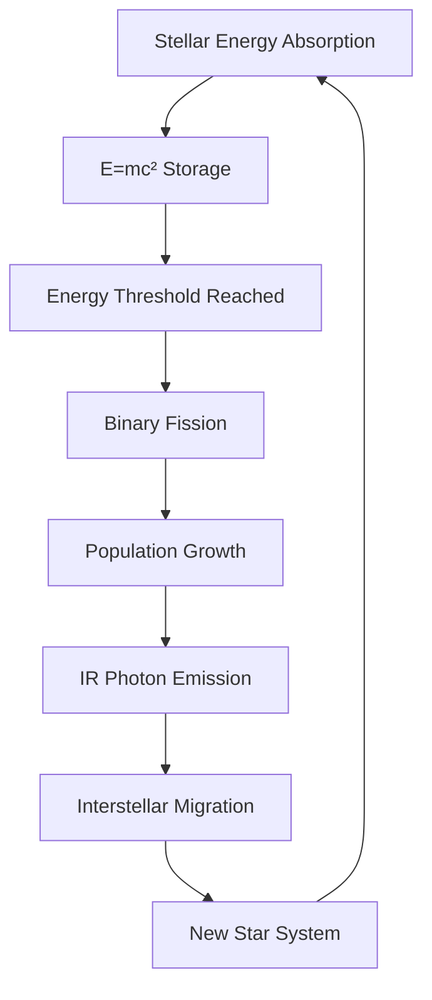

---
tags:
  - phm
  - astrophage
  - lifecycle
  - migration
  - ecology
up: "[[Project Hail Mary]]"
confidence: verified
tier-coverage: [intuition, core, deep-dive, practice]
---
# Astrophage Life Cycle and Migration

> **One-line summary** — Astrophage matters not just as exotic fuel, but as a full ecological organism whose stellar reproduction and interstellar dispersal make the crisis galaxy-scale.

## 🎯 Intuition
**The Core Idea:** In the novel, Astrophage reproduces near stars and migrates between star systems, turning it from a strange microbe into a self-propagating ecological force.
**Why It Matters:** This lifecycle is what makes stellar dimming persistent and widespread instead of local and accidental. It also sets up the logic of the solution: once Astrophage is treated as an organism with population dynamics, a predator like [[Taumoeba and the Biological Solution]] becomes a coherent answer.

## ⚙️ Core Mechanics
### Key Details
Astrophage is not merely an energy-dense microbe — it is, as the novel depicts, a complete ecological organism with a lifecycle that anchors it to stars and a dispersal mechanism that carries it between them. This note covers what the novel depicts about Astrophage's reproduction and population ecology, maps those depictions onto real microbiology where parallels exist, and draws out the implications for the Taumoeba solution.

> **Note on sourcing:** All claims attributed to the novel's in-universe biology are derived from primary-mode chapter notes verified directly from [[Weir 2021 - Project Hail Mary Novel]]. Real-science parallels are sourced and marked separately.

The novel depicts Astrophage as reproducing by a process analogous to binary fission, fueled by the enormous radiation output of a host star. Cells absorb electromagnetic energy (primarily in the infrared), store it at near-E=mc² density (see [[Astrophage Energy Physics]]), and upon reaching an energy threshold, divide. This is a fictional mechanism — no organism is known to reproduce at stellar-photosphere temperatures (~5,500°C), and the thermodynamic barriers are absolute. The inspiration is real, however: radiotrophic fungi like *Cladosporium sphaerospermum* demonstrably harvest ionizing radiation for metabolic energy (see [[Astrophage Biology]] and [[Astrophage - Melanized fungi accelerate under ionizing radiation]]).

The fictional implication of stellar-residence reproduction is population accumulation: given adequate stellar radiation, Astrophage colonies grow until they measurably intercept stellar output, producing the spectroscopic signature detected as the Petrova Line (see [[Stellar Dimming and the Petrova Line]]).

The novel depicts Astrophage cells migrating between star systems by expelling stored energy as directional infrared photons, generating photon-rocket thrust. Across interstellar timescales (millions to billions of years), this mechanism is depicted as sufficient to carry cells from one stellar neighborhood to another, seeding new systems.

Real physics context:
- **Photon thrust is real.** Photon rockets are a legitimate concept — every emitted photon carries momentum. See [[The Hail Mary Drive]] for the mass-ratio constraints.
- **The scale is deeply fictional.** Real photon thrust from a single-cell organism, even with extraordinary energy storage, would require geological-to-astronomical timescales to cross even the nearest stellar distances. The novel requires this to have happened, but treats it as given rather than detailed.
- **The grain of real science:** Directed panspermia — the hypothesis that life could travel between star systems passively — is a genuine if speculative field. Astrophage is active panspermia at heroic scale.

If Astrophage reproduces and migrates, it is an ecological organism subject to population dynamics. That is the conceptual bridge to [[Taumoeba and the Biological Solution]]:
- A reproducing population can be preyed upon.
- A migrating organism can seed multiple systems, creating a multi-system crisis — but also a multi-system co-evolutionary history in which predators can evolve.
- The Tau Ceti system having Taumoeba is coherent with this ecology: Astrophage arrived (or evolved) there long enough ago that a predator co-evolved. The Sun's system has no such predator — hence the current crisis.

This framing transforms the Astrophage problem from physics to ecology, which is exactly the conceptual shift the novel's resolution requires.

### Key Facts

| Fact | Detail |
|---|---|
| Reproduction mode | Astrophage reproduces by a binary-fission-like process powered by stellar energy |
| Residence phase | The organism's growth phase is tied to stars, where accumulated cells measurably dim stellar output |
| Migration mechanism | Cells migrate interstellarly by emitting directional IR photons as a photon-rocket drive |
| Real anchor | Radiation-harvesting biology exists in limited form through radiotrophic fungi |
| Ecological consequence | Once reproduction and migration exist, predator-prey dynamics become logically possible |
| Solution link | This lifecycle is the conceptual bridge that makes [[Taumoeba and the Biological Solution]] work |

## 🔬 Deep Dive
### Scientific Accuracy

| Element | Assessment | Notes |
|---|---|---|
| Radiation-eating biology | ✅ Grounded analog | Radiotrophic fungi are real ([[Astrophage Biology]]) |
| Binary fission reproduction | 🔶 Extrapolated | Familiar mechanism, impossible conditions |
| Stellar-temperature survival | ❌ Impossible | No known chemistry survives >~3,000°C (photosphere is ~5,500°C) |
| E=mc² energy storage | ❌ Impossible | ~10¹⁰× any known biochemistry ([[Astrophage Energy Physics]]) |
| Photon-thrust migration | 🔶 Physically real, scale fictional | Photon rockets work; cell-scale over interstellar range does not |
| Population ecology logic | ✅ Grounded | Predator-prey dynamics apply once reproduction is granted |

### Narrative Analysis
This lifecycle model gives the novel a satisfying scientific progression: what starts as astrophysics becomes microbiology, then ecology. It also makes the ending feel earned, because the final solution depends on understanding Astrophage not as inert fuel but as a living species embedded in a larger system.

### Connections
- The organism itself: [[Astrophage Biology]]
- Energy storage physics: [[Astrophage Energy Physics]]
- The Adrian ecology: [[The Adrian Ecology]]
- Spectroscopic detection: [[Stellar Dimming and the Petrova Line]]
- The drive that exploits migration physics: [[The Hail Mary Drive]]
- The predator that exploits the lifecycle: [[Taumoeba and the Biological Solution]]
- The discovery arc built on this lifecycle: [[Arc - Taumoeba Discovery]]
- Rocky's planet faces the same threat: [[Rocky and the Eridians]]
- Accuracy overview: [[Science Accuracy Scorecard]]

## 🏋️ Practice
### Discussion Questions
1. Why is Astrophage's lifecycle more important to the novel's resolution than its raw energy density alone?
2. How does the shift from migration physics to ecology prepare the reader for the Taumoeba discovery arc?
3. Which part of the lifecycle has the strongest real-world analogue: radiation harvesting, binary fission, dispersal, or population ecology?

### Analysis
- Trace how the page turns Astrophage from an astrophysical anomaly into a species with ecological consequences.
- Evaluate whether the novel needs the interstellar migration mechanism to be physically plausible, or only narratively consistent.

### Creative Challenge
- **What if...** the Solar System had evolved its own Astrophage predator long before the events of the novel?

## References

- [[Sources Index#Shunk 2020]] — ISS radiotrophic fungi (real-science anchor)
- [[Sources Index#Dadachova 2007]] — melanin + radiation energy transduction
- [[Sources Index#Baez Relativistic Rocket]] — photon-thrust physics context
- [[Sources Index#Weir 2021 Novel]] — in-universe lifecycle depictions (fictional source)

## Supporting Chunks

- [[Astrophage - Reproduction and lifecycle involve binary fission and stellar residence]] — fictional lifecycle claim
- [[Astrophage - Interstellar migration is driven by IR-photon emission and charge gradients]] — fictional migration claim
- [[Astrophage - Grace hypothesises Astrophage may be the universal ancestor of all DNA-based galactic life]]
- [[Astrophage - Adrian is reframed as the Astrophage homeworld with a co-evolved ecology]]
- [[Taumoeba - ECU microscopy reveals multiple life forms co-evolving with Astrophage at Adrian]]
- [[Taumoeba - Fictional predator of Astrophage native to Tau Ceti system]] — predator identity supports population-ecology framing
- [[Taumoeba - Microbial predator-prey co-evolution can produce stable coexistence]] — Lotka-Volterra basis for Tau Ceti co-existence
- [[Engineering - Redell's blackpanel design is scalable Sahara Astrophage production infrastructure]] — cultivation exploits the reproduction threshold
- [[Astrophage - CO2 emission spectroscopy explains how Astrophage navigates to Venus for reproduction]] — Ch04: navigation mechanism
- [[Eridian - Oceanic Astrophage farming at 200C contrasts with Earth s Sahara blackpanel approach]] — Ch17: Eridian harvesting contrast