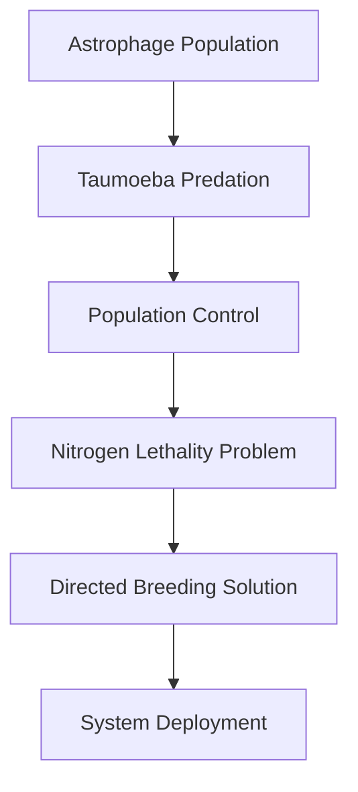

---
tags:
  - phm
  - taumoeba
  - astrophage
  - xenobiology
  - ecology
  - resolution
up: "[[Project Hail Mary]]"
confidence: verified
tier-coverage: [intuition, core, deep-dive, practice]
---
# Taumoeba and the Biological Solution

> **One-line summary** — Taumoeba solves the Astrophage crisis by turning the novel's central mystery from impossible physics into workable predator-prey ecology.

## 🎯 Intuition
**The Core Idea:** Taumoeba is a fictional micro-predator that specifically consumes Astrophage, making ecological control possible where engineering alone would fail.
**Why It Matters:** It provides the novel's resolution, but it also reveals the deeper scientific structure of the story: Astrophage is not just fuel or plague, but part of an ecosystem. The page matters because it shows how Weir anchors an alien biological fix in real microbial predation, even while the environmental conditions remain wildly impossible.

## ⚙️ Core Mechanics
### Key Details
Taumoeba is the fictional organism that provides *Project Hail Mary*'s resolution. It is depicted as a single-celled predator native to the Tau Ceti system that specifically consumes Astrophage. This note separates what is novel-fiction, what is grounded in real microbiology, and where the ecological analogy breaks down.

> **Note on sourcing:** All plot-specific claims are derived from primary-mode chapter notes verified directly from [[Weir 2021 - Project Hail Mary Novel]]. Supporting chunks are sourced from the chapter layer with precise page references.

The novel depicts Taumoeba as:
- A single-celled organism native to a planet (or planetary environment) in the Tau Ceti system.
- A specific predator of Astrophage — it consumes Astrophage as its primary (or sole) food source.
- Capable of surviving the same extreme temperature and pressure conditions Astrophage inhabits.
- Present in the Tau Ceti system in sufficient numbers to hold Astrophage population below crisis levels — explaining why Tau Ceti has not suffered the same catastrophic dimming as the Sun.
- Host-specific enough that Grace must carefully test whether it will prove dangerous in other contexts.

This is fiction. No organism is known to prey on another organism in stellar-photosphere conditions, and Taumoeba's energy-environment requirements are as physically implausible as Astrophage's own. The conceptual plausibility is ecological, not thermodynamic.

The plausible backbone of the Taumoeba concept is **predatory microbiology** — specifically, the well-documented phenomenon of bacteria that prey on other bacteria with measurable host-specificity.

*Bdellovibrio bacteriovorus* is the canonical example. This gram-negative proteobacterium:
- Attacks gram-negative prey bacteria by binding to the cell wall, penetrating the periplasm, and consuming cellular contents before lysing the prey and releasing daughter cells.
- Completes a predatory cycle in roughly 3–4 hours at laboratory temperatures.
- Shows measurable **host-specificity**: strains have preferred prey species and may show poor predation of others, even within gram-negative bacteria.
- Can suppress target prey populations by 99%+ under controlled conditions — but typically does *not* drive prey to extinction, instead establishing predator-prey equilibrium.

Related organisms — *Vampirovibrio chlorellavorus*, *Micavibrio aeruginosavorus* — extend the predatory-prokaryote niche across multiple bacterial clades, suggesting microbial predation is an independently evolved ecological strategy. See [[Taumoeba - Predatory bacteria demonstrate host-specific population suppression]].

Classic Lotka-Volterra predator-prey models apply at microbial scales. Long-term co-culture experiments with *Bdellovibrio* show:
- Oscillating predator-prey population cycles (counterphase peaks and troughs).
- Arms-race co-evolution: prey resistance mutations arise, predator counter-resistance evolves.
- Stable long-term coexistence rather than competitive exclusion in most conditions.

This is the real-world basis for the Tau Ceti system's ecological equilibrium in the novel: Taumoeba and Astrophage have co-evolved a stable predator-prey relationship, so neither has exterminated the other. See [[Taumoeba - Microbial predator-prey co-evolution can produce stable coexistence]].

The conceptual leap from *Bdellovibrio* to Taumoeba is substantial. What carries over is the *logical structure*: a host-specific predator can regulate a prey population without exterminating it, leaving the ecological balance the novel requires. What does not carry over is any mechanistic or thermodynamic detail.

Taumoeba matters not just as a plot solution but as a *scientific method* showcase. The novel depicts Grace: (1) observing that Tau Ceti's dimming is less severe than expected and inferring a controlling agent exists, (2) collecting Astrophage samples and discovering an organism consuming them, (3) characterizing Taumoeba's properties, testing its host-specificity, and assessing its safety, and (4) designing a delivery mechanism to introduce it to the Solar System. This arc models real scientific process (observation → hypothesis → experiment → application) more faithfully than most science fiction. The solution is biological and ecological, which fits a microbiologist-protagonist.

The resolution is not without complications. Introducing Taumoeba to a system it did not evolve in raises genuine ecological questions the novel acknowledges but does not fully resolve:
- Could Taumoeba affect organisms other than Astrophage once in the Solar System?
- Will Astrophage evolve resistance to Taumoeba, leading to a new crisis?
- What are the long-term population dynamics once the predator-prey system is established in a new environment?

These are real ecological concerns that apply whenever a predator is introduced to a new ecosystem (analogous to biological pest control efforts on Earth).

### Key Facts

| Fact | Detail |
|---|---|
| Organism role | Taumoeba is a fictional single-celled predator that feeds on Astrophage |
| Real science anchor | Predatory bacteria like *Bdellovibrio bacteriovorus* show host-specific microbial predation is real |
| Ecological function | It suppresses Astrophage without necessarily driving it extinct, enabling equilibrium |
| Plot function | Grace discovers it as the key biological solution to the dimming crisis |
| Main complication | Taumoeba must be tested and bred for safe deployment, especially because nitrogen is lethal to it |
| Big scientific gap | Its survival, predation, and specificity under Astrophage-like conditions are fictional |

## 🔬 Deep Dive
### Scientific Accuracy

| Real Biology | Novel Extrapolation | Gap |
|---|---|---|
| *Bdellovibrio* operates at 20–37°C | Taumoeba functions at stellar-photosphere conditions | Thermodynamic impossibility — no known chemistry survives |
| Prey range is gram-negative bacteria (same domain of life) | Taumoeba preys on Astrophage (an alien organism) | No evolutionary substrate for cross-origin host-specificity |
| Predation is mediated by cell-wall chemistry | Taumoeba mechanism not specified in novel | The "how" of predation is left fictional |
| Bdellovibrio lifecycle is ~3–4 hours | Astrophage lifecycle in stellar photosphere — implied much longer | Timescale mismatch is not addressed |

### Narrative Analysis
Taumoeba is the novel's final proof that the right question was ecological rather than purely mechanical. Its discovery also lets Grace win by acting like a scientist—observing, testing, breeding, and deploying—rather than by inventing a bigger engine or weapon.

### Connections
- The prey organism's biology: [[Astrophage Biology]]
- The prey organism's lifecycle: [[Astrophage Life Cycle and Migration]]
- The Adrian ecology where Taumoeba was discovered: [[The Adrian Ecology]]
- The full discovery arc: [[Arc - Taumoeba Discovery]]
- The mission that led to discovery: [[Resolution and Aftermath]]
- Rocky's parallel crisis: [[Rocky and the Eridians]]
- Grace as the scientist who makes the discovery: [[Ryland Grace]]
- Accuracy overview: [[Science Accuracy Scorecard]]

## 🏋️ Practice
### Discussion Questions
1. Why does Taumoeba feel more plausible as a solution once Astrophage is framed ecologically rather than physically?
2. How does Taumoeba connect Grace's microbiology background to the broader Astrophage crisis?
3. What real-world predator-prey or biocontrol examples best parallel the risks of releasing Taumoeba into a new system?

### Analysis
- Compare Taumoeba's role in the novel to real biological control strategies and their unintended consequences.
- Analyze how host-specificity, equilibrium, and directed evolution all contribute to making the solution narratively believable.

### Creative Challenge
- **What if...** Taumoeba had controlled Astrophage on Tau Ceti but proved too broad-spectrum for safe release in the Solar System?

## References

- [[Sources Index#Bdellovibrio Sockett 2009]] — *Bdellovibrio* predation biology review
- [[Sources Index#Bdellovibrio Ecology Jurkevitch 2006]] — predatory prokaryote ecology volume
- [[Sources Index#Bdellovibrio Coevolution Rotem 2015]] — arms-race co-evolution in *Bdellovibrio*
- [[Sources Index#Weir Interviews Taumoeba]] — author's stated design intent (unprocessed)
- [[Sources Index#Weir 2021 Novel]] — in-universe Taumoeba depictions (fictional source)

## Supporting Chunks

- [[Taumoeba - Fictional predator of Astrophage native to Tau Ceti system]] — definitional claim
- [[Taumoeba - Predatory bacteria demonstrate host-specific population suppression]] — real-science anchor
- [[Taumoeba - Microbial predator-prey co-evolution can produce stable coexistence]] — ecological plausibility
- [[Novel - Adrian is the first named investigation target for anomalous Astrophage suppression]]
- [[Taumoeba - ECU microscopy reveals multiple life forms co-evolving with Astrophage at Adrian]]
- [[Astrophage - Petrova-line breeding band at Adrian is 91.2 km altitude and less than 200 metres thick]]
- [[Engineering - Chain-deployment mechanics tilt the ship at 60 degrees to drag a 10km xenonite chain through the breeding band]]
- [[Taumoeba - First observation shows an amoeba-like organism engulfing and killing Astrophage clumps]]
- [[Taumoeba - Fuel contamination causes a complete shipwide power-loss cascade on the Hail Mary]]
- [[Taumoeba - Nitrogen is instantly lethal to Taumoeba at trace concentrations despite being inert to Earth and Eridian life]]
- [[Taumoeba - Directed evolution uses antibiotic-resistance logic to breed nitrogen-tolerant strains]]
- [[Taumoeba - Strain 82.5 achieves nitrogen tolerance at the threshold needed for Venus and Threeworld deployment]]
- [[Taumoeba - Nitrogen-flood containment protocol sterilises the Hail Mary after a second outbreak]]
- [[Taumoeba - Xenonite permeability is an unintended trait evolved during directed-evolution breeding in xenonite tanks]]
- [[Taumoeba - Biochemical compatibility with Earth life makes it viable as human food for Grace's survival]]
- [[Engineering - Beetle fuel systems survive Taumoeba because they are physically isolated from main tanks]] — Ch21: fuel isolation saves mission
- [[Taumoeba - Nitrogen cannot penetrate xenonite because it moves stochastically while Taumoeba navigates directionally]] — Ch27: transport mechanism distinction
- [[Novel - Xenonite-threat briefing transmits the permeability warning that enables Erid s response]] — Ch30: permeability warning handed to Rocky; practical constraint on Eridian deployment