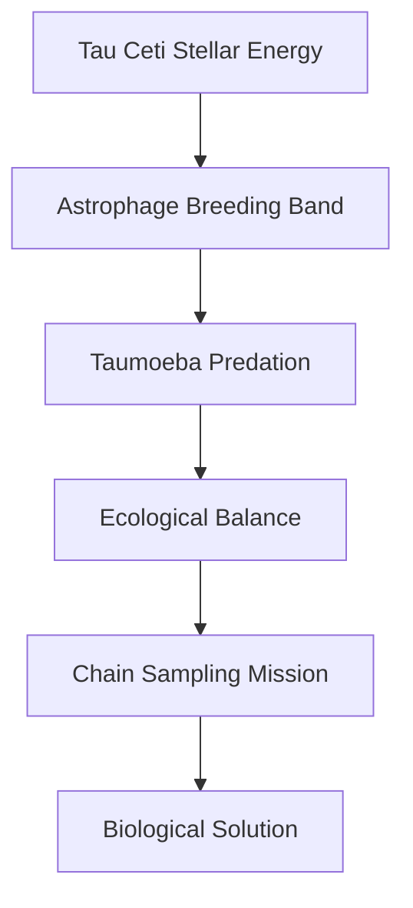

---
tags:
  - phm
  - astrophage
  - adrian
  - ecology
  - taumoeba
  - tau-ceti
up: "[[Project Hail Mary]]"
confidence: verified
freshness: stable
tier-coverage: [intuition, core, deep-dive, practice]
---
# The Adrian Ecology

> **One-line summary** — Adrian is where Astrophage stops looking like an isolated anomaly and is revealed as part of a full alien ecosystem with major scientific and engineering consequences.

## 🎯 Intuition
**The Core Idea:** Adrian is the breeding environment where Astrophage, Taumoeba, and other life forms appear together as a co-evolved ecological system.
**Why It Matters:** Adrian provides the crucial clue that Astrophage is not an uncontrolled cosmic plague everywhere, because something in Tau Ceti keeps it in balance. It also turns the mission from detection into field biology and engineering, since sampling Adrian is what makes the Taumoeba solution possible.

## ⚙️ Core Mechanics
### Key Details
Adrian — the planet (or planetary body) in the Tau Ceti system where Astrophage breeds — is the ecological key to *Project Hail Mary*'s resolution. This note covers what the novel depicts about Adrian's Astrophage habitat, the co-evolved ecology Grace discovers there, and the engineering implications of sampling it.

> **Note on sourcing:** All claims are derived from primary-mode chapter notes verified directly from [[Weir 2021 - Project Hail Mary Novel]]. Supporting chunks are sourced from the chapter layer with precise page references.

The novel reframes Adrian from a simple investigation target to the **Astrophage homeworld** — the place where the organism's full ecological context becomes visible. Key features:
- **The breeding band.** Astrophage concentrates in a narrow altitude band around Adrian: approximately 91.2 km altitude, less than 200 metres thick ([[Astrophage - Petrova-line breeding band at Adrian is 91.2 km altitude and less than 200 metres thick]]). This is where reproduction occurs, and it is the target for sampling.
- **Stellar-photosphere conditions.** The breeding band is characterized by temperatures and radiation levels that mirror stellar-photosphere conditions — the same impossible thermodynamic environment Astrophage requires for reproduction (see [[Astrophage Life Cycle and Migration]]).
- **Population density.** Astrophage is present in sufficient density to affect Tau Ceti's stellar output, but the dimming is less severe than in the Solar System — the central clue that something is controlling the population.

See [[Astrophage - Adrian is reframed as the Astrophage homeworld with a co-evolved ecology]] for the key claim.

Adrian is not a single-organism environment. Grace's investigation reveals that Astrophage shares its habitat with multiple other life forms:
- **ECU microscopy** reveals several distinct organisms co-existing with Astrophage at Adrian ([[Taumoeba - ECU microscopy reveals multiple life forms co-evolving with Astrophage at Adrian]]). This is not a monoculture but an **ecosystem** — organisms competing, predating, and co-evolving in conditions that should be impossible for biology.
- **Taumoeba** is the organism Grace identifies as a specific Astrophage predator (see [[Taumoeba and the Biological Solution]]). Its presence at Adrian explains why Tau Ceti is not dimming as severely as the Sun: Taumoeba holds the Astrophage population in check through predator-prey equilibrium.
- **The panspermia hypothesis.** Grace speculates that Astrophage may be the universal ancestor of all DNA-based galactic life — a hypothesis the novel raises without confirming ([[Astrophage - Grace hypothesises Astrophage may be the universal ancestor of all DNA-based galactic life]]). If true, Adrian's ecology is not local but representative of a galactic biological phenomenon.

Reaching the breeding band and collecting samples is a major engineering challenge that drives several chapters of the novel:
- **The chain sampler.** Rocky and Grace design a 10 km xenonite chain that the ship drags through the breeding band at a 60-degree tilt ([[Engineering - Chain-deployment mechanics tilt the ship at 60 degrees to drag a 10km xenonite chain through the breeding band]]). This is the mechanism that collects the Astrophage and co-evolved organisms Grace subsequently studies.
- **Environmental hostility.** The sampling altitude involves extreme temperature and radiation — conditions that destroy conventional materials. Xenonite's ultra-high-temperature properties ([[Xenonite - Eridian Structural Material]]) are essential to the sampling design.
- **The discovery sequence.** The Adrian sampling yields the raw material for the entire Taumoeba research arc: observation of population suppression → identification of Taumoeba → characterization → nitrogen sensitivity → directed evolution → Taumoeba-82.5. See [[Arc - Taumoeba Discovery]].

The existence of the Adrian ecology has cascading implications:
- **Taumoeba deployment.** If Taumoeba evolved at Adrian and suppresses Astrophage there, deploying it in the Solar System is a deliberate introduction of an alien predator — real ecological concerns about invasive species apply (see [[Taumoeba and the Biological Solution#Open Questions the Novel Raises]]).
- **Xenonite permeability.** Taumoeba-82.5, the nitrogen-tolerant strain bred for deployment, turns out to penetrate xenonite — the structural material Rocky's civilization depends on. The Adrian ecology is benign in its native context but potentially catastrophic when its organisms are removed and modified ([[Taumoeba - Xenonite permeability is an unintended trait evolved during directed-evolution breeding in xenonite tanks]]).
- **Multi-system ecology.** If Astrophage migrates between stars (see [[Astrophage Life Cycle and Migration]]), Adrian's ecology may be one instance of a pattern that repeats across stellar systems. The Solar System's lack of a Taumoeba equivalent is the anomaly, not the norm.

### Key Facts

| Fact | Detail |
|---|---|
| Ecological role | Adrian is presented as Astrophage's homeworld or core breeding environment |
| Breeding habitat | Astrophage reproduces in a narrow breeding band around 91.2 km altitude |
| Key clue | Tau Ceti's weaker-than-expected dimming suggests population control is happening there |
| Ecosystem discovery | ECU microscopy reveals multiple co-evolved organisms, not just Astrophage alone |
| Resolution link | Taumoeba is discovered in this ecosystem and becomes the basis of the solution |
| Engineering tie-in | Sampling Adrian requires xenonite hardware and a 10 km chain sampler |

## 🔬 Deep Dive
### Scientific Accuracy
The ecology is fictional in its environmental conditions, since no known biology can operate in star-like breeding-band temperatures. But the ecosystem logic—population control, predator-prey balance, habitat sampling, and evolutionary co-existence—is grounded in real ecological thinking, which is why Adrian feels scientifically structured even when its thermodynamics do not.

### Narrative Analysis
Adrian is the setting where the novel's mystery finally changes scale: from stellar anomaly to ecosystem investigation. It also concentrates several of the book's biggest strengths in one place—alien biology, collaborative engineering, and a solution that emerges from observation rather than brute force.

### Connections
- The organism at Adrian's center: [[Astrophage Biology]]
- Astrophage lifecycle and migration: [[Astrophage Life Cycle and Migration]]
- The predator discovered at Adrian: [[Taumoeba and the Biological Solution]]
- The research arc that begins at Adrian: [[Arc - Taumoeba Discovery]]
- Target star system: [[Tau Ceti and 40 Eridani]]
- Exoplanet context: [[Exoplanet Science and Target Star Selection]]
- The chain sampler engineering: [[Hail Mary Ship Design and Systems]]
- Xenonite's role: [[Xenonite - Eridian Structural Material]]
- Rocky's engineering contribution: [[Rocky]]
- Accuracy overview: [[Science Accuracy Scorecard]]

## 🏋️ Practice
### Discussion Questions
1. Why is Adrian more important as an ecosystem than as a simple source location for Astrophage?
2. How does Adrian connect Rocky's engineering contribution to Grace's biological discovery process?
3. What real-world ecological or astrobiological ideas make Adrian feel coherent despite its impossible environment?

### Analysis
- Analyze how Adrian reframes the Astrophage problem from astronomy into field ecology and experimental biology.
- Compare the native stability of Adrian's ecosystem with the risks created when Taumoeba is moved and modified for Solar System deployment.

### Creative Challenge
- **What if...** Adrian contained multiple Astrophage predators with different ecological niches instead of Taumoeba alone?

## References

- [[Project Hail Mary/Sources/Sources Index#Weir 2021 Novel|Weir 2021 Novel]] — primary source for Adrian depictions (fictional)
- [[Project Hail Mary/Sources/Sources Index#Weir Interviews Taumoeba|Weir Interviews Taumoeba]] — author commentary on ecological design

## Supporting Chunks

- [[Astrophage - Adrian is reframed as the Astrophage homeworld with a co-evolved ecology]] — the key ecological claim
- [[Astrophage - Petrova-line breeding band at Adrian is 91.2 km altitude and less than 200 metres thick]] — the breeding band specifics
- [[Taumoeba - ECU microscopy reveals multiple life forms co-evolving with Astrophage at Adrian]] — multi-organism ecology evidence
- [[Astrophage - Grace hypothesises Astrophage may be the universal ancestor of all DNA-based galactic life]] — panspermia speculation
- [[Engineering - Chain-deployment mechanics tilt the ship at 60 degrees to drag a 10km xenonite chain through the breeding band]] — sampling mechanics
- [[Novel - Adrian is the first named investigation target for anomalous Astrophage suppression]] — Adrian as narrative target
- [[Taumoeba - First observation shows an amoeba-like organism engulfing and killing Astrophage clumps]] — discovery at Adrian