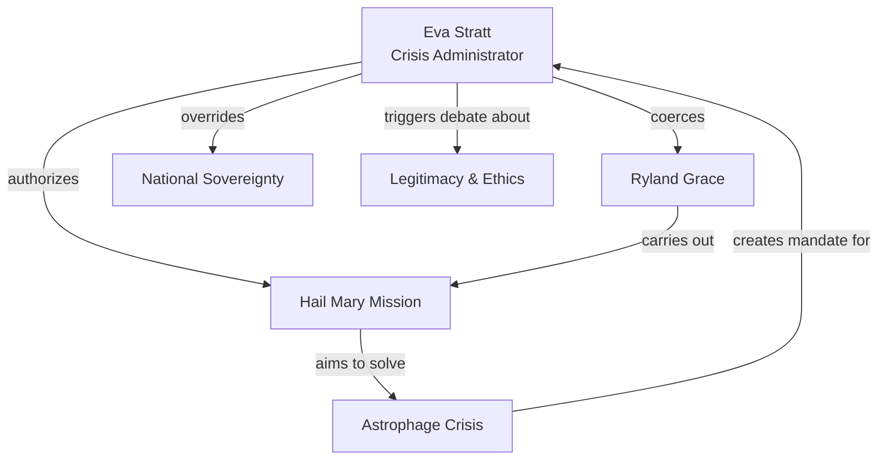

---
tags:
  - phm
  - characters
  - ethics
  - governance
up: "[[Project Hail Mary]]"
confidence: verified
freshness: stable
tier-coverage: [intuition, core, deep-dive, practice]
---
# Eva Stratt and the Ethics of Existential Response

> **One-line summary** — Eva Stratt is the novel's uncompromising crisis administrator, embodying the terrifying effectiveness and moral cost of emergency power.

## 🎯 Intuition
**The Core Idea:** Eva Stratt is the civilian administrator who concentrates extraordinary global power in order to force humanity's response to the Astrophage crisis.
**Why It Matters:** She is not a scientist, politician, or military hero; she is a project manager with dictatorial reach, and the novel is unusually direct about the consequences of that arrangement. Stratt turns abstract questions about survival, coercion, and legitimacy into concrete choices that shape the entire mission. Her presence makes the story ask not only how humanity survives, but what kind of authority survival demands.

## ⚙️ Core Mechanics
### Key Details
#### Stratt as Crisis Leader
Eva Stratt is the administrator given essentially unlimited global authority to coordinate humanity's response to the Astrophage crisis in [[Project Hail Mary]]. She is not a scientist, not a politician, and not a military officer — she is a project manager with the power of a dictator, and the novel is remarkably clear-eyed about what that means.

Stratt's authority is established early and never seriously challenged within the story. She can:
- Commandeer any nation's resources, facilities, and personnel.
- Override national sovereignty and legal protections.
- Coerce individuals into service — including Ryland Grace himself.
- Make irreversible decisions (including selecting a suicide crew) with no oversight.

She is effective precisely *because* she is unconstrained. The Hail Mary project moves at a pace that no democratic institution could match, and the novel implicitly argues this speed was necessary. Stratt's character is the embodiment of the question: what do you sacrifice to save everyone?

#### The Ethics of Emergency Power
The real-world parallel is the tension between existential urgency and democratic legitimacy:

- **For Stratt's model:** Existential threats don't wait for committee votes. Coordination failure kills. A single decisive authority can cut through national rivalries and bureaucratic friction.
- **Against Stratt's model:** No accountability, no proportionality review, no sunset clause. History shows that emergency powers, once granted, tend to persist and be abused. Stratt never faces consequences for her coercions.

The Responsibility to Protect (R2P) doctrine in international law provides a partial framework — sovereignty can be overridden to prevent mass atrocity — but R2P has never been applied at species scale and lacks the institutional machinery for an Astrophage-level crisis. See [[Ethics - Existential threats need globally legitimate decision authority]] for the policy analysis.

#### Existential Triage in the Novel
Stratt practices a ruthless triage:
- **Who is expendable?** The crew is chosen partly for competence and partly for disposability — Grace is selected because he has no family.
- **What is proportionate?** Stratt never asks this question. The entire global economy is redirected. Individual rights are suspended indefinitely.
- **What happens after?** The novel never shows a reckoning. Stratt's power presumably dissolves once the crisis ends, but there's no mechanism for accountability.

This is one of the novel's most thought-provoking ambiguities. Stratt is neither villain nor hero — she is a *necessary instrument* whose necessity doesn't make her methods just.

### Key Facts

| Fact | Detail |
|---|---|
| Role | Administrator of humanity's response to the Astrophage crisis |
| Distinguishing trait | Effective because she operates with essentially unconstrained authority |
| Ethical pressure point | Coerces personnel, overrides sovereignty, and suspends ordinary protections |
| Mission logic | Treats the Hail Mary project as an existential triage problem |
| Narrative function | Forces the novel's debate over legitimacy versus survival into concrete decisions |
| Real-world parallel | Echoes emergency-power debates and partial analogies like R2P |

## 🔬 Deep Dive
### Scientific Accuracy
Stratt's behavior is realistic in one important sense: existential emergencies do reward rapid coordination, logistical ruthlessness, and the ability to cut through institutional delay. Her project-management mindset feels plausible for a species-level mobilization. What is less realistic is the frictionless durability of her authority; real emergency regimes face legal contestation, political bargaining, legitimacy crises, and constant accountability fights. The novel uses that simplification deliberately to isolate the ethical question.

### Narrative Analysis
Stratt functions as the story's embodiment of mission-survival logic. She converts the Astrophage crisis from a scientific puzzle into a political and moral emergency, and she reframes Grace's story by making his presence on the mission inseparable from coercion. Thematically, she embodies the tension between necessity and justice, speed and legitimacy, species survival and individual rights. Weir uses her with striking clarity: she is neither sentimentalized nor demonized, which keeps the reader trapped inside the same uneasy calculus the novel wants to explore.

### Connections
- The mission she assembled: [[The Hail Mary Drive]]
- The crew survival trade-offs: [[Artificial Gravity and Induced Torpor]]
- The crisis that justifies her authority: [[Earth Energy Budget Under Threat]]
- How the film handles her character: [[Novel vs Film Adaptation]]
- Governance gap analysis: [[Ethics - Existential threats need globally legitimate decision authority]]
- Source material: [[Responsibility to Defend Earth 2024]]

## 🏋️ Practice
### Discussion Questions
1. Does Stratt's coercion become morally permissible once extinction is a plausible outcome, or does the scale of the threat make legitimacy even more important?
2. How does Stratt sharpen the novel's larger themes of sacrifice, duty, and the cost of survival?
3. What real-world leaders, institutions, or emergency frameworks does Stratt resemble most closely, and where does the comparison break down?

### Analysis
- Compare Stratt's effectiveness to her legitimacy: which does the novel seem to value more, and why?
- Analyze how Grace's resentment toward Stratt changes the reader's interpretation of the mission's success.

### Creative Challenge
- **What if...** Stratt had been forced to justify every major Hail Mary decision before a multinational democratic body instead of acting unilaterally?

## Supporting Chunks

- [[Ethics - Existential threats need globally legitimate decision authority]]
- [[Ethics - Stratt's pre-emptive pardons demonstrate extraordinary cross-jurisdictional legal authority]] — Ch10: the IP lawsuit scene as the clearest single illustration of her extra-legal authority
- [[Ethics - Coma-resistance genetic marker is an undisclosed crew-selection criterion violating informed consent]]
- [[Novel - Baikonur explosion demonstrates Astrophage energy density as an intuition failure for safe handling]]
- [[Engineering - Redell's blackpanel design is scalable Sahara Astrophage production infrastructure]] — Ch12: Stratt recruits a prisoner to run industrial Astrophage production
- [[Ethics - Antarctic nuclear detonations release subglacial methane as extreme planetary triage]] — Ch13: extreme planetary triage
- [[Ethics - Stratt s coercive conscription of Grace is the sharpest expression of mission-survival logic]] — Ch22: conscription as ethical fulcrum
- [[Ethics - Stratt s war famine pestilence and death framing articulates the existential stakes]] — Ch25: Stratt's moral self-accounting

## References
- [[Project Hail Mary/Sources/Sources Index]]
- [[Project Hail Mary/Novel/Chapter Index]]
