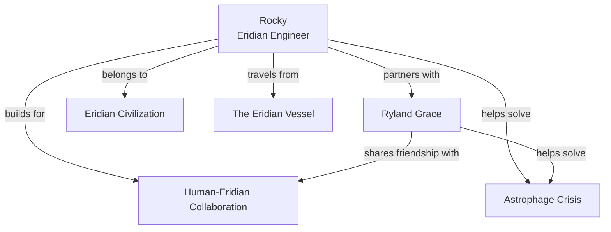

---
tags:
  - phm
  - characters
  - rocky
  - eridians
  - friendship
up: "[[Project Hail Mary]]"
confidence: verified
tier-coverage: [intuition, core, deep-dive, practice]
---
# Rocky

> **One-line summary** — Rocky is the alien engineer whose competence, grief, and friendship turn first contact into the novel's emotional center.

## 🎯 Intuition
**The Core Idea:** Rocky is Ryland Grace's Eridian counterpart — an engineer whose practical brilliance and loyalty make cross-species partnership possible.
**Why It Matters:** Rocky keeps the novel from being a solo-survival story and turns it into a story about collaboration across radical difference. He embodies the book's belief that friendship, communication, and complementary expertise can solve problems neither side could solve alone. His presence also gives the ending its emotional force.

## ⚙️ Core Mechanics
### Key Details
Rocky is the Eridian engineer who becomes Ryland Grace's co-protagonist in [[Project Hail Mary]]. This note covers Rocky as a *character* — personality, relationships, narrative function, and the weight of the final choice. For Rocky's biology, sensory system, and species-level science, see [[Rocky and the Eridians]].

> **Note on sourcing:** All character-specific claims are derived from primary-mode chapter notes verified directly from [[Weir 2021 - Project Hail Mary Novel]]. Supporting chunks are sourced from the chapter layer with precise page references.

#### Personality and Temperament
Rocky is consistently characterized through behavior rather than exposition. Key traits the novel establishes:

- **Pragmatic optimism.** Rocky approaches problems — including lethal ones — with an engineer's assumption that solutions exist and need to be found. His default mode is constructive rather than anxious.
- **Emotional directness.** Eridian tonal communication carries emotional content in pitch and timbre. Rocky does not mask emotion the way humans sometimes do; his grief, excitement, and concern are audible. Grace learns to read these registers over time.
- **Engineering-first cognition.** Rocky thinks in terms of materials, tolerances, and build sequences. When confronted with a novel problem, his instinct is to *build* something. This complements Grace's instinct, which is to *hypothesize and test*.
- **Loyalty and duty.** Rocky left his homeworld on what may be a one-way mission. He lost his crewmates en route. He stays on task. His commitment to solving the Astrophage crisis for Erid is unwavering — yet when the crisis solution threatens his own civilization (xenonite permeability), he does not flinch from the data.

#### Memory and Cognition
One of the most distinctive character traits is Rocky's **perfect recall**. Where Grace relies on the ship's computer and his own notes, Rocky stores and retrieves information without external aids. This is not treated as a superpower but as a cognitive-architecture difference — see [[Eridian - Rocky's perfect recall contrasts with Grace's laptop dependence as a cognitive-architecture difference]]. The implication is that Eridian cognition may allocate resources differently, possibly linked to their acoustic-primary sensory system (see [[Eridian Sensory Biology]]).

#### Engineering Mindset
Rocky is an engineer, explicitly not a scientist. This distinction drives the collaboration:

- Rocky builds the **xenonite docking tunnel** that makes face-to-face contact possible ([[PHM Novel - Chapter 08]], [[PHM Novel - Chapter 09]]).
- Rocky constructs the **pressure sphere** that lets him enter the Hail Mary's interior ([[Eridian - Xenonite pressure sphere is a transit vehicle across incompatible atmospheres]]).
- Rocky designs critical components for the **Adrian sampling chain** ([[Engineering - Chain-deployment mechanics tilt the ship at 60 degrees to drag a 10km xenonite chain through the breeding band]]).
- His engineering conventions — left-handed threading, base-six measurement — reflect an independent technological path ([[Eridian - Left-handed threading marks a distinct Eridian engineering convention]]).

Grace discovers; Rocky builds. The asymmetry is the partnership's engine.

#### Grief and Loss
Rocky lost his entire crew to radiation exposure during the interstellar transit — a fact he discloses to Grace in a moment that transforms their professional exchange into genuine emotional connection. The crew-loss disclosure is the first time Rocky expresses grief across the species barrier, and Grace's response — empathy, not pity — is what begins the friendship. See [[Novel - Rocky's crew-loss disclosure converts first contact into shared grief]].

Rocky carries this loss quietly. The novel does not depict him as traumatized in a human sense, but the loss is present: Rocky is alone, far from home, on a mission his crewmates did not survive. This mirrors Grace's own isolation — two sole survivors collaborating.

#### The Friendship with Grace
The Grace-Rocky relationship is the novel's emotional core. See [[Arc - Grace and Rocky]] for the full arc trajectory. Key character dynamics:

- **Complementary expertise.** Grace is the biologist; Rocky is the engineer. Their knowledge gaps are real and drive genuine synergy rather than redundancy.
- **Environmental barrier as constant.** They cannot share atmosphere. Every physical interaction requires engineering. This keeps the alien-ness intact while allowing warmth.
- **Earned communication.** Their shared language is built from scratch (see [[Xenolinguistics and First Contact]] and [[Arc - Xenolinguistics Progression]]). Every exchange represents real work.
- **Mutual rescue.** Rocky saves Grace during the fuel-breach crisis, sustaining severe oxygen burns ([[Novel - Rocky enters Grace's oxygen atmosphere to save him accepting lethal exposure]]). Grace treats Rocky's injuries. The reciprocity is physical and literal.

#### The Final Choice
The novel's emotional climax hinges on Rocky. After completing the Taumoeba work and launching Beetles toward Earth, Rocky departs. His engine signature disappears. Grace faces the defining decision: continue home, or turn back to find Rocky.

He chooses Rocky.

This is the decision the entire novel builds toward, and it works because the preceding chapters have earned it — through hundreds of pages of collaboration, crisis, and mutual dependence. Grace gives up Earth permanently; the time-dilation arithmetic makes return impossible. See [[Resolution and Aftermath]] and [[Novel - Grace chooses to rescue Rocky instead of returning to Earth as the defining ethical act]].

The Epilogue shows the long-term outcome: Grace living on Erid in a purpose-built human habitat, teaching Eridian children, physically changed by years in an alien world. The choice was permanent, and the novel frames it as the right one.

### Key Facts

| Fact | Detail |
|---|---|
| Role | Eridian engineer and Grace's co-protagonist |
| Defining strength | Solves problems by building practical systems and tools |
| Cognitive distinction | Has perfect recall rather than relying on external notes |
| Emotional anchor | Shared grief and mutual rescue turn first contact into friendship |
| Narrative importance | Makes collaboration, not isolation, the story's emotional center |
| Ending significance | Grace's decision to save Rocky becomes the novel's final ethical test |

## 🔬 Deep Dive
### Scientific Accuracy
Rocky is fictional at the species level, but his *behavior* is written with striking internal realism. His engineering mindset is consistent: he thinks in materials, tolerances, pressure, and fabrication constraints rather than abstract theorizing. The communication barrier, atmospheric incompatibility, and need for improvised interfaces all make the partnership feel more plausible than a frictionless first-contact story. His perfect recall is an extrapolated alien cognition trait, but it is presented as a meaningful trade-off in cognitive architecture rather than magic.

### Narrative Analysis
Rocky functions as both mirror and complement to Grace. Structurally, he ends Grace's isolation and transforms the novel from survival mystery into partnership narrative. Thematically, Rocky embodies trust across difference, competence without cynicism, and friendship earned through work rather than sentiment. Weir uses him to keep the alien truly alien — in body, atmosphere, and communication — while still making the relationship deeply human in emotional effect. That balance is why Rocky carries so much of the book's affective power.

### Connections
- Rocky's biology and species science: [[Rocky and the Eridians]]
- Rocky's sensory system: [[Eridian Sensory Biology]]
- Rocky's civilization: [[Eridian Civilization Profile]]
- Rocky's ship: [[The Eridian Vessel]]
- The co-protagonist: [[Ryland Grace]]
- The administrator who set the mission in motion: [[Eva Stratt and the Ethics of Existential Response]]
- The organism they solve together: [[Taumoeba and the Biological Solution]]
- How the friendship develops: [[Arc - Grace and Rocky]]
- How communication develops: [[Arc - Xenolinguistics Progression]]
- The crisis driving both species: [[Earth Energy Budget Under Threat]]
- Film portrayal challenges: [[Rocky on Screen]]
- Resolution and aftermath: [[Resolution and Aftermath]]

## 🏋️ Practice
### Discussion Questions
1. What makes Rocky feel emotionally credible as a character even though nearly every aspect of his species is radically nonhuman?
2. How does Rocky deepen the novel's themes of cooperation, communication, and mutual dependence?
3. Why do readers often identify so strongly with Rocky, and what real-world forms of friendship or teamwork does that response resemble?

### Analysis
- Analyze how Rocky's engineering identity shapes both the plot's solutions and the tone of his relationship with Grace.
- Compare Rocky's grief over his crew with Grace's isolation: how does the symmetry strengthen the first-contact story?

### Creative Challenge
- **What if...** Rocky had concluded that helping Grace endangered Erid too much, and the partnership had fractured at the moment of the xenonite warning?

## References

- [[Sources Index#Weir 2021 Novel]] — primary source for character depictions (fictional)
- [[Sources Index#Weir Interviews Taumoeba]] — author interviews on Rocky's design
- [[Sources Index#Northeastern Accuracy Discussion]] — public discussion of Rocky's plausibility

## Supporting Chunks

- [[Novel - Rocky's crew-loss disclosure converts first contact into shared grief]] — Ch11: the emotional pivot
- [[Eridian - Rocky's perfect recall contrasts with Grace's laptop dependence as a cognitive-architecture difference]] — Ch11: cognitive contrast
- [[Eridian - Left-handed threading marks a distinct Eridian engineering convention]] — Ch07: engineering identity
- [[Eridian - Xenonite pressure sphere is a transit vehicle across incompatible atmospheres]] — Ch14: building the bridge
- [[Novel - Rocky enters Grace's oxygen atmosphere to save him accepting lethal exposure]] — Ch18: the rescue
- [[Novel - Grace chooses to rescue Rocky instead of returning to Earth as the defining ethical act]] — Ch28: the final choice
- [[Eridian - The thrum is a distributed collective-cognition process mobilised planet-wide for Grace's survival]] — Epilogue: civilizational response to friendship
- [[Engineering - Chain-deployment mechanics tilt the ship at 60 degrees to drag a 10km xenonite chain through the breeding band]] — Ch18: Rocky's engineering in action
- [[Eridian - Rocky learns his crewmates died of radiation sickness completing the workshop-shielding mystery]] — Ch13: crew-death resolution
- [[Eridian - Rocky discloses forty-six years of solitary vigil at Tau Ceti]] — Ch14: isolation timeline
- [[Novel - Rocky s surplus Astrophage offer transforms the one-way sacrifice into a survivable mission]] — Ch15: fuel offer as partnership
- [[Novel - You save me and you save Erid is the emotional payoff of Grace turning back for Rocky]] — Ch29: reunion
- [[Novel - Xenonite-threat briefing transmits the permeability warning that enables Erid s response]] — Ch30: Rocky learns the critical constraint on Taumoeba deployment
- [[Novel - Fist my bump formalises Grace s irrevocable commitment to accompany Rocky to Erid]] — Ch30: commitment formalized through their shared protocol