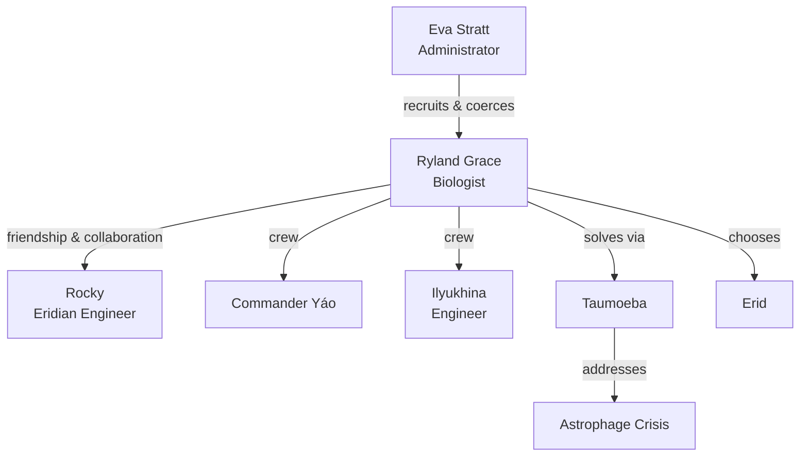

---
tags:
  - phm
  - characters
  - grace
  - protagonist
up: "[[Project Hail Mary]]"
confidence: verified
freshness: stable
tier-coverage: [intuition, core, deep-dive, practice]
---
# Ryland Grace

> **One-line summary** — Ryland Grace is a reluctant scientist-teacher whose method, friendship, and final choice drive the entire novel.

## 🎯 Intuition
**The Core Idea:** Ryland Grace is the novel's protagonist — an involuntary astronaut and biologist who solves an extinction crisis through scientific reasoning and unlikely friendship.
**Why It Matters:** Grace anchors both the book's scientific authenticity and its emotional arc. His amnesia structure lets the reader discover the mission through his behavior before his history, while his partnership with Rocky turns a survival plot into a story about collaboration, duty, and moral choice. He matters not just because he solves the problem, but because of how he learns what kind of person he is under pressure.

## ⚙️ Core Mechanics
### Key Details
Ryland Grace is the protagonist of [[Project Hail Mary]] — a high-school science teacher turned involuntary solo astronaut who wakes aboard an interstellar spacecraft with no memory of who he is, why he is there, or what happened to his crewmates. This note covers his narrative function, scientific identity, character arc, and key relationships.

> **Note on sourcing:** All character-specific claims are derived from primary-mode chapter notes verified directly from [[Weir 2021 - Project Hail Mary Novel]]. Supporting chunks are sourced from the chapter layer with precise page references.

#### Who Grace Is
The novel depicts Grace as a high-school science teacher — a scientist who left academic research under circumstances revealed gradually through flashbacks. (Note: some public summaries describe this role as a community-college biology and chemistry post; the high-school framing is the more consistently cited version and is confirmed in primary-mode chapter notes verified against [[Weir 2021 - Project Hail Mary Novel]].) His teaching background is not incidental: it defines his thinking style. He is a communicator and explainer, someone who organizes knowledge into teachable units. When he wakes aboard the Hail Mary with no memory, he solves problems the way a good teacher would: from first principles, out loud, with visible reasoning.

His scientific specialization is biology, specifically extremophile microbiology. This is precisely the expertise needed to understand Astrophage, and it is why [[Eva Stratt and the Ethics of Existential Response|Stratt]] coerced him into the project.

#### The Amnesia Structure and What It Reveals
Grace's amnesia is one of the novel's central structural devices. See [[Characters - Grace amnesia functions as deferred exposition device]] for the full analysis. In brief:

- The novel opens *in medias res* with Grace waking in an unfamiliar environment, two dead crewmates, and no memory.
- His character is established not through backstory but through *behavior*: the way he approaches the unfamiliar instruments, the way he reasons, the precision of his observation.
- Flashback chapters interleaved with present-day action gradually reveal his recruitment, his initial resistance (he did not volunteer), and his relationship with Stratt.
- The amnesia device means Grace must *rediscover* his own expertise — and the reader watches him be competent before understanding how he became competent.

This structure emphasizes a core theme: Grace is defined by his *method*, not his biography.

#### Grace as Scientist
The novel takes care to show real scientific process through Grace's work aboard the Hail Mary:
- He forms hypotheses and tests them experimentally in the ship's lab.
- He reasons from incomplete data, revises conclusions when evidence contradicts them, and explicitly acknowledges uncertainty.
- His discovery and characterization of [[Taumoeba and the Biological Solution|Taumoeba]] is depicted as methodical: observe anomaly → hypothesize mechanism → test → iterate.

This is one of the novel's most praised elements. Grace models scientific thinking authentically — including false starts, the excitement of discovery, and the care required before acting on findings. His biology background is the specific expertise that allows him to recognize Taumoeba for what it is.

#### Grace and Rocky
The relationship between Grace and Rocky is at the emotional center of the novel. Key dynamics:

- **Complementary knowledge asymmetry**: Grace is the biologist; Rocky is the engineer. Each has expertise the other lacks. Their collaboration is not redundant — it is genuinely synergistic.
- **Communication challenge**: Rocky's species communicates through tone-chords, not visual signals. Grace and Rocky must construct a shared language from scratch, which the novel depicts as a real process. See [[Xenolinguistics and First Contact]].
- **Environmental incompatibility**: Their respective atmospheres are mutually lethal. Physical proximity is impossible without engineering solutions, which Rocky builds.
- **Emotional register**: Despite the physical and communicative barriers, the novel depicts a genuine friendship developing — arguably the most emotionally resonant relationship in the book.

For Rocky's biological and cognitive profile, see [[Rocky and the Eridians]].

#### Grace and Stratt
Stratt selected Grace for the mission partly because of his expertise and partly because he had no immediate family — making him "expendable" in the cold calculus of existential triage. The novel depicts Grace's feelings about this selection as complex: resentment, resignation, and ultimately a kind of acceptance shaped by understanding what the stakes are.

His relationship with Stratt represents the novel's most direct exploration of coercion and duty: Grace did not choose the mission, but he carries it through. See [[Eva Stratt and the Ethics of Existential Response]] for the full ethics analysis.

#### Character Arc Summary
The novel depicts a broad arc for Grace:
1. **Disorientation and recovery**: Wakes with no memory; gradually reconstructs identity through exploration and flashback.
2. **Problem-solving under pressure**: Faces a cascade of engineering and biological crises alone aboard the ship.
3. **Collaboration**: Meets Rocky; builds friendship, language, and joint scientific effort.
4. **Discovery and resolution**: Identifies Taumoeba, characterizes it, and deploys it as the solution to the Astrophage crisis.
5. **The final choice**: Faces a decision between returning to Earth (and the acclaim that awaits) and remaining with Rocky to help the Eridian mission. The novel's ending is a significant emotional beat. See [[Resolution and Aftermath]].

#### Character Arc by Chapter
The following maps Grace's major arc stages to specific chapter notes. See also [[PHM Timeline Map]] for timeline orientation.

| Arc Stage | Description | Key Chapters |
|---|---|---|
| **Disorientation and recovery** | Wakes with amnesia; reconstructs identity through observation and flashback | [[PHM Novel - Chapter 01\|Ch 01]], [[PHM Novel - Chapter 02\|Ch 02]], [[PHM Novel - Chapter 03\|Ch 03]] |
| **Problem-solving under pressure** | Explores ship; identifies drive; arrives at Tau Ceti; handles first-contact protocol alone | [[PHM Novel - Chapter 04\|Ch 04]], [[PHM Novel - Chapter 05\|Ch 05]], [[PHM Novel - Chapter 06\|Ch 06]], [[PHM Novel - Chapter 07\|Ch 07]] |
| **Collaboration** | Meets Rocky; builds shared language; deepens friendship; teaches and learns | [[PHM Novel - Chapter 10\|Ch 10]] – [[PHM Novel - Chapter 16\|Ch 16]] |
| **Discovery and crisis** | Identifies Taumoeba anomaly; designs and retrieves sampler; survives fuel-breach; characterizes and engineers Taumoeba-82.5 | [[PHM Novel - Chapter 17\|Ch 17]] – [[PHM Novel - Chapter 28\|Ch 28]] |
| **The final choice** | Rocky disappears; Grace turns back (Ch 28); finds Rocky (Ch 29); commits to Erid | [[PHM Novel - Chapter 28\|Ch 28]], [[PHM Novel - Chapter 29\|Ch 29]], [[PHM Novel - Chapter 30\|Ch 30]], [[PHM Novel - Epilogue\|Epilogue]] |

For narrative arc context, see [[Arc - Grace and Rocky]] (the Grace-Rocky relationship through all stages) and [[Arc - Taumoeba Discovery]] (the scientific investigation Grace drives). For the compulsion backstory that reframes his presence on the mission, see [[PHM Novel - Chapter 23]].

### Key Facts

| Fact | Detail |
|---|---|
| Role | Protagonist, biologist, and reluctant human representative on the Hail Mary mission |
| Scientific identity | Extremophile microbiologist who approaches problems like a teacher explaining them |
| Structural device | Amnesia lets the reader learn his character through method before biography |
| Key relationship | Friendship with Rocky becomes the emotional center of the novel |
| Ethical tension | Was coerced into the mission by Stratt rather than volunteering freely |
| Arc endpoint | Chooses Rocky and Erid over returning to Earth |

## 🔬 Deep Dive
### Scientific Accuracy
Grace's behavior is one of the book's strongest realism anchors. His problem-solving follows recognizable scientific practice: hypothesis formation, testing, revision, uncertainty tracking, and careful response to anomalous data. His teaching background also reads plausibly, because he narrates ideas by breaking them into explainable steps rather than leaping to unexplained genius. The biggest fictional compression is how many domains he can handle alone under extreme pressure, but the novel usually preserves credibility by making him depend on Rocky for engineering and on experimentation for discovery.

### Narrative Analysis
Grace functions as both point-of-view engine and thematic synthesis. The amnesia structure turns him into a device for deferred exposition, but it also reveals character through action: he is defined by curiosity, explanation, and persistence before the reader knows his history. Thematically, he embodies science as method, duty under coercion, and friendship as transformation. Weir uses Grace's final choice to reframe the whole novel: the story is not only about saving Earth, but about what kind of person Grace becomes when survival and loyalty come into conflict.

### Connections
- His co-protagonist: [[Rocky]] (character) · [[Rocky and the Eridians]] (biology)
- His antagonist-administrator: [[Eva Stratt and the Ethics of Existential Response]]
- His crewmates: [[The Hail Mary Crew - Yao and Ilyukhina]]
- The organism he discovers: [[Taumoeba and the Biological Solution]]
- The crisis driving the mission: [[Earth Energy Budget Under Threat]]
- The ship he wakes aboard: [[Hail Mary Ship Design and Systems]]
- How the film handles his character: [[Novel vs Film Adaptation]]
- The resolution he drives: [[Resolution and Aftermath]]
- Narrative arc: [[Arc - Grace and Rocky]]
- Discovery arc: [[Arc - Taumoeba Discovery]]
- Thematic analysis: [[Themes and Motifs]]
- Timeline map: [[PHM Timeline Map]]

## 🏋️ Practice
### Discussion Questions
1. How does Grace's reluctance to join the mission change the way we interpret his heroism by the end of the novel?
2. In what ways does Grace connect the novel's scientific method theme to its themes of duty, sacrifice, and friendship?
3. Why is Grace so readable as an ordinary person rather than a mythic hero, and how does that affect reader identification?

### Analysis
- Analyze how the amnesia structure shapes the reader's judgment of Grace before the flashbacks reveal his coercion and fear.
- Compare Grace's relationships with Rocky and Stratt as two competing moral frameworks: collaboration versus compulsion.

### Creative Challenge
- **What if...** Grace had volunteered willingly from the start instead of being forced onto the mission?

## References

- [[Project Hail Mary/Sources/Sources Index#Weir 2021 Novel|Weir 2021 Novel]] — primary source for character depictions (fictional)
- [[Project Hail Mary/Sources/Sources Index#Weir Interviews Taumoeba|Weir Interviews Taumoeba]] — author interviews touching on Grace's design
- [[Project Hail Mary/Sources/Sources Index#Northeastern Accuracy Discussion|Northeastern Accuracy Discussion]] — public discussion of Grace's scientific authenticity

## Supporting Chunks

- [[Characters - Grace amnesia functions as deferred exposition device]]
- [[Ethics - Coma-resistance genetic marker is an undisclosed crew-selection criterion violating informed consent]]
- [[Novel - French amnesia drug explains Grace's Chapter 1 memory loss as a deliberate DGSE protocol]]
- [[Novel - Grace chooses to rescue Rocky instead of returning to Earth as the defining ethical act]]
- [[Novel - Grace teaching Eridian children transforms first contact into shared education as the end state]]
- [[Novel - Full-mission time dilation means Grace is biologically younger than elapsed Earth time]]
- [[Characters - Pendulum gravity calculation demonstrates empirical reasoning under cognitive impairment]] — Ch02: first demonstration of scientific method
- [[Characters - Grace accepts certain death transforming obligation into personal commitment]] — Ch05: mission acceptance
- [[Novel - Grace deduces from the Beetle probes that the Hail Mary has no return trajectory]] — Ch03: personal stakes
- [[Novel - Grace buries his crewmates in space establishing humanity alongside scientific detachment]] — Ch03: emotional capacity
- [[Propulsion - Extending centrifuge cables reduces centripetal force enabling movement under deceleration]] — Ch19: engineering under pressure
- [[Engineering - Improvised Petrovascope search repurposes attitude thrusters as rotating Petrova-band illumination]] — Ch28: peak improvisation
- [[Novel - Fist my bump formalises Grace s irrevocable commitment to accompany Rocky to Erid]] — Ch30: commitment formalization as arc culmination