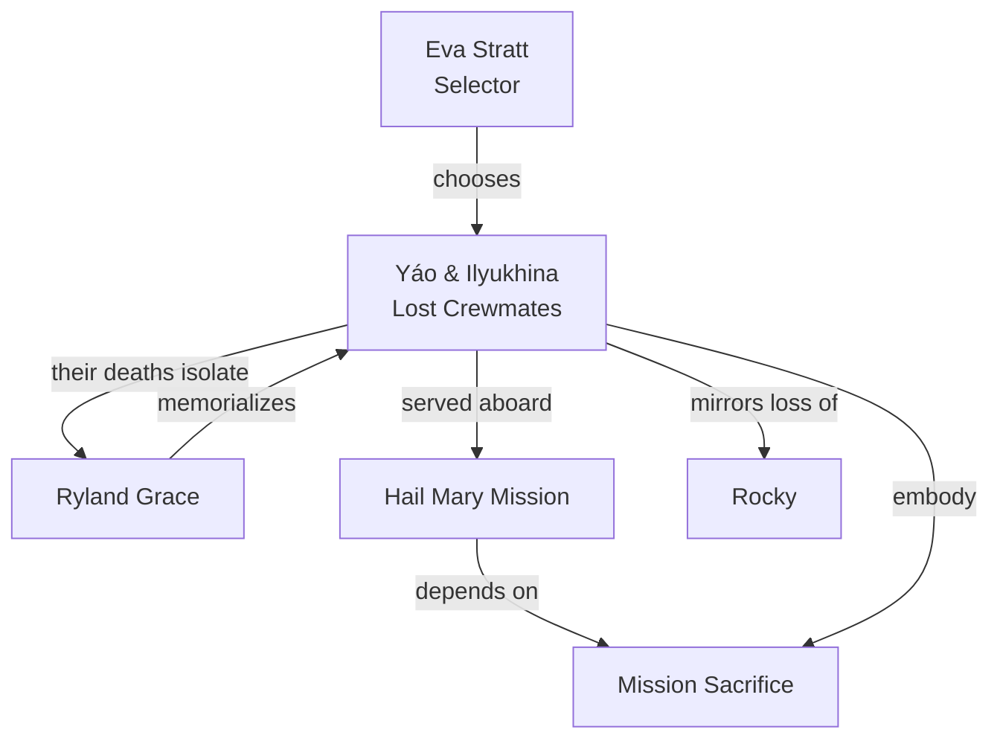

---
tags:
  - phm
  - characters
  - crew
  - yao
  - ilyukhina
up: "[[Project Hail Mary]]"
confidence: verified
tier-coverage: [intuition, core, deep-dive, practice]
---
# The Hail Mary Crew — Yáo and Ilyukhina

> **One-line summary** — Yáo and Ilyukhina matter less through page-time than through their deaths, which create Grace's isolation and expose the cost of the mission.

## 🎯 Intuition
**The Core Idea:** Commander Yáo and Engineer Ilyukhina are the other two Hail Mary crew members, and their offscreen deaths turn a three-person mission into Grace's solitary ordeal.
**Why It Matters:** Their absence is a major structural decision, not just backstory. It sharpens Grace's isolation, mirrors Rocky's crew loss, and makes Stratt's selection calculus feel brutal rather than abstract. The novel uses them to show what the mission costs before the main plot truly begins.

## ⚙️ Core Mechanics
### Key Details
Commander Yáo Lì-Jié and Engineer Olesya Ilyukhina are the two other crew members aboard the *Hail Mary* in [[Project Hail Mary]]. They are dead before the novel's first page. Their absence is one of the story's most consequential structural choices.

> **Note on sourcing:** All claims are derived from primary-mode chapter notes verified directly from [[Weir 2021 - Project Hail Mary Novel]].

#### Who They Were
##### Commander Yáo Lì-Jié
Yáo is the mission's military commander — the person in charge of ship operations, navigation, and mission discipline. His selection reflects [[Eva Stratt and the Ethics of Existential Response|Stratt's]] emphasis on mission completion over crew wellbeing: the crew was chosen for coma tolerance (a genetic marker, not a volunteered skill), and Yáo represented the operational command structure the mission required.

##### Engineer Olesya Ilyukhina
Ilyukhina is the ship's systems engineer. Her role was to maintain the *Hail Mary*'s physical infrastructure — drive systems, life support, and mission hardware. She represents the engineering capability the mission was designed to need.

#### How They Died
Both crew members died during the induced-coma transit phase. Grace wakes alone and discovers their bodies before he recovers his memory. The cause is implied to be a failure of the torpor system or individual physiological variance — the coma-resistance genetic marker that qualified all three crew members was necessary but not sufficient for survival. See [[Artificial Gravity and Induced Torpor]] for the torpor science and [[Ethics - Coma-resistance genetic marker is an undisclosed crew-selection criterion violating informed consent]] for the ethical dimension of crew selection.

The deaths are not depicted as dramatic events. They happened offscreen, during sleep, in transit. Grace discovers the aftermath.

#### Narrative Function
Yáo and Ilyukhina's primary function in the novel is *structural*:

**1. They create Grace's isolation.** A three-person crew reduced to one makes Grace the sole human presence in interstellar space. This isolation is the precondition for the novel's central dynamic: when Rocky arrives, Grace's emotional and intellectual starvation makes the partnership urgent in a way a full crew would not.

**2. They raise the stakes of Stratt's calculus.** The crew was selected without informed consent. Two of three died. This is the cost of Stratt's existential-triage philosophy, and it shadows every flashback scene where Stratt justifies her authority. See [[Eva Stratt and the Ethics of Existential Response]].

**3. They mirror Rocky's loss.** Rocky also lost his crewmates during transit — to radiation exposure rather than torpor failure, but the structural parallel is exact. Two sole survivors, each carrying the weight of dead colleagues, meeting at the crisis point. The crew-loss disclosure ([[Novel - Rocky's crew-loss disclosure converts first contact into shared grief]]) is powerful precisely because the grief is symmetrical.

**4. They establish what Grace is not.** Grace is not a commander (Yáo's role) and not a systems engineer (Ilyukhina's role). He is a biologist. The deaths of his crewmates mean the mission must be carried out with only biological expertise — which, as it turns out, is exactly the expertise the mission needs. The novel's structure rewards the one skillset that survives.

#### What We Don't Get
Weir deliberately keeps Yáo and Ilyukhina thin as individual characters. They appear in flashback scenes — crew selection, training montages, brief interactions — but the novel does not develop them as full characters with arcs. This is a conscious narrative choice: their function is to be *absent*, and their thinness makes Grace's isolation sharper rather than sentimentalized.

#### Mission Selection Context
All three crew members were selected by Stratt's process, which prioritized:
- A specific genetic marker for induced-coma tolerance
- Relevant technical expertise (command, engineering, biology)
- Expendability — no immediate family, limited social connections

Grace's flashback-revealed resistance to being conscripted ([[Novel - French amnesia drug explains Grace's Chapter 1 memory loss as a deliberate DGSE protocol]]) applies to all three: none of them fully chose this mission in the way a volunteer would. The amnesia drug used on Grace was part of the same coercive apparatus that put Yáo and Ilyukhina aboard.

### Key Facts

| Fact | Detail |
|---|---|
| Roles | Yáo is the commander; Ilyukhina is the systems engineer |
| Plot status | Both die during the torpor transit before the novel's opening scene |
| Structural effect | Their deaths make Grace the sole human survivor aboard the Hail Mary |
| Ethical meaning | Their fate exposes the cost of Stratt's coerced mission-selection process |
| Narrative mirror | Their absence parallels Rocky's loss of his own crew |
| Thematic use | They show how sacrifice and disposability are built into the mission |

## 🔬 Deep Dive
### Scientific Accuracy
Their deaths are scientifically plausible within the novel's own torpor-risk framework: a genetic marker can improve survival odds without guaranteeing survival, and long-duration induced coma would plausibly carry catastrophic physiological uncertainty. The page's more realistic strength, though, is institutional rather than biomedical: high-risk missions really do depend on role specialization, redundancy, and ugly selection trade-offs. What the novel compresses is the amount of personal characterization such crew members would likely receive in a real mission context, but that omission is purposeful.

### Narrative Analysis
Yáo and Ilyukhina function as absent presences. They give the mission professional structure — command and engineering — only to remove that structure almost immediately, forcing Grace into a role he was never meant to fill. Thematically, they embody sacrifice, disposability, and the human cost of utilitarian planning. Weir's choice not to give them full arcs is part of the point: the emotional weight comes from their loss and from the vacuum they leave behind, not from independent subplot development.

### Connections
- The protagonist they leave alone: [[Ryland Grace]]
- The administrator who selected them: [[Eva Stratt and the Ethics of Existential Response]]
- The torpor science that failed them: [[Artificial Gravity and Induced Torpor]]
- The ship they crewed: [[Hail Mary Ship Design and Systems]]
- Rocky's parallel loss: [[Rocky]] and [[Novel - Rocky's crew-loss disclosure converts first contact into shared grief]]
- The mission's ethical framework: [[Ethics - Coma-resistance genetic marker is an undisclosed crew-selection criterion violating informed consent]]
- Grace's amnesia and mission coercion: [[Novel - French amnesia drug explains Grace's Chapter 1 memory loss as a deliberate DGSE protocol]]

## 🏋️ Practice
### Discussion Questions
1. Why does the novel gain so much structural power from killing Yáo and Ilyukhina before the opening scene instead of developing them as active crewmates?
2. How do Yáo and Ilyukhina sharpen the book's themes of sacrifice, expendability, and utilitarian decision-making?
3. What real-world mission planning or disaster-response parallels make their selection and loss feel especially unsettling?

### Analysis
- Analyze how the absence of command and engineering expertise reshapes Grace's role and the novel's problem-solving structure.
- Compare the narrative effect of Yáo and Ilyukhina's deaths with Rocky's disclosure about his own crew loss.

### Creative Challenge
- **What if...** one of the two had survived torpor and Grace had not faced Tau Ceti alone?

## References

- [[Sources Index#Weir 2021 Novel]] — primary source for crew depictions (fictional)

## Supporting Chunks

- [[Ethics - Coma-resistance genetic marker is an undisclosed crew-selection criterion violating informed consent]] — the selection criterion that put all three aboard
- [[Novel - French amnesia drug explains Grace's Chapter 1 memory loss as a deliberate DGSE protocol]] — the coercive mechanism behind Grace's (and by extension, the crew's) presence
- [[Novel - Rocky's crew-loss disclosure converts first contact into shared grief]] — the structural parallel between Grace's and Rocky's losses
- [[Characters - Grace amnesia functions as deferred exposition device]] — Grace's amnesia is how the reader discovers the crew's fate
- [[Novel - Grace buries his crewmates in space establishing humanity alongside scientific detachment]] — Ch03: crew memorial