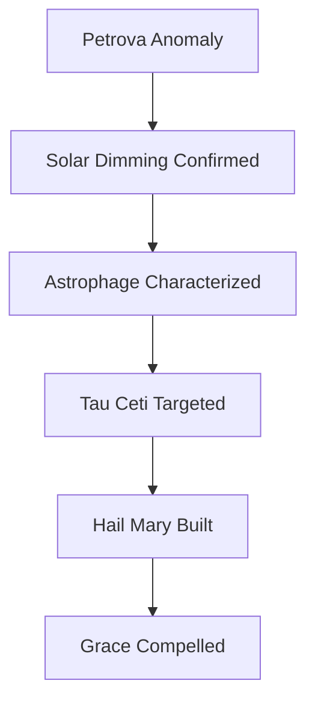

---
tags:
  - phm
  - novel
  - arc
  - astrophage
  - stratt
  - crisis
  - flashback
up: "[[Project Hail Mary/Novel/Chapter Index|Chapter Index]]"
source_mode: primary-synthesis
confidence: verified
freshness: stable
tier-coverage: [intuition, core, deep-dive, practice]
---
# Arc - Astrophage Crisis Escalation

> **One-line summary** — This arc traces how a strange astronomical anomaly becomes a civilization-ending crisis, then a desperate mission built on science, emergency power, and coercive sacrifice.

## 🎯 Intuition
**The Core Idea:** This page follows the Earth-side flashback strand from the Petrova anomaly to Grace’s forced placement aboard the Hail Mary.
**Why It Matters:** The novel’s present-tense survival story only fully lands because this flashback arc shows what the mission cost before it ever launched. It also reveals how Weir turns scientific discovery into a policy thriller, where each new fact escalates both technical stakes and moral compromise.

## ⚙️ Core Mechanics
### Key Details
This arc note assembles the Earth-side flashback strand of *Project Hail Mary*: from the first anomalous infrared observation through confirmed stellar dimming, Stratt's seizure of global emergency authority, the mission design and buildout, and the coercive decisions that put Grace aboard a one-way spacecraft.

> [!info] Primary-synthesis note
> This arc note synthesizes primary-mode chapter notes verified directly from [[Weir 2021 - Project Hail Mary Novel]]. The flashback strand is distributed across "both"-tagged chapters throughout the novel; beat placements are based on primary chapter content. Supporting chunks are sourced from the chapter layer.

---

## What This Arc Covers

The Astrophage crisis arc is the novel's background frame: everything that happens before Grace wakes on the Hail Mary. It answers the question the present-timeline strand keeps deferring — *how did the world end up here?* — through a series of flashbacks that grow in clarity as Grace's memory returns.

The arc covers roughly three acts: recognizing the threat, building the response, and paying the price. It functions as the novel's science-policy thriller strand, in contrast to the first-contact adventure of the present timeline.

---

## From Anomaly to Existential Threat

### The Petrova Line (Ch 01 flashback)
The arc begins with an email from astronomer Dr. Irina Petrova describing an anomalous infrared signature stretching between the Sun and Venus. At this point, no one understands what it is. The Petrova Line — as it will be called — is a clue without a hypothesis. See [[PHM Novel - Chapter 01]].

### Confirmed Solar Dimming (Ch 02 flashback)
Japanese solar probe data reveals the Sun's luminosity is measurably declining. This is not instrument error. The data holds. The scale of what this means begins to become clear: even a small reduction in solar output, sustained, is a civilizational threat. See [[PHM Novel - Chapter 02]] and [[Earth Energy Budget Under Threat]].

### Astrophage Identified and Characterized (Ch 03–05 flashbacks)
Grace — a secondary-school science teacher whose controversial earlier research touched on non-water-based life — is tracked down by Eva Stratt and drafted into the crisis response. In lab work depicted through flashbacks in Chapters 04 and 05, Grace and colleagues characterize what will eventually be named Astrophage: an organism with extraordinary energy storage, a CO₂ affinity, and a reproductive cycle tied to the inner solar system that produces the Petrova Line. See [[PHM Novel - Chapter 03]], [[PHM Novel - Chapter 04]], [[PHM Novel - Chapter 05]], and [[Astrophage Biology]].

### Tau Ceti as the Mission Target (Ch 05 flashback)
The pivotal observation: Tau Ceti has *not* dimmed the way the Sun and other nearby stars have. Something in that system is controlling Astrophage. If a biological counter-agent exists anywhere, it exists at Tau Ceti. This is the scientific basis for the entire mission. See [[PHM Novel - Chapter 05]] and [[Astrophage Life Cycle and Migration]].

---

## Building the Hail Mary Response

### Stratt's Emergency Authority (Ch 03 onward)
Eva Stratt operates with sweeping intergovernmental authority — a construction the novel depicts as globally legitimate but deliberately unaccountable, justified by the argument that an existential threat cannot be managed by normal consensus processes. She is not elected and not answerable to any single government. She makes decisions quickly, decisively, and with an explicit willingness to sacrifice individuals for collective survival. See [[Eva Stratt and the Ethics of Existential Response]].

### Astrophage as Fuel (Ch 05 flashback)
The realization that Astrophage can be cultivated and harvested at scale — because its CO₂ affinity and reproductive cycle make it manageable in lab conditions — transforms the mission's engineering constraints. The fuel problem for an interstellar mission, normally insurmountable, is solved by the organism that created the crisis. The Hail Mary Drive becomes conceptually possible. See [[The Hail Mary Drive]].

### The One-Way Mission Design (Ch 21 flashback)
The original crew accepted the mission's one-way design explicitly. With no certainty of return and no guarantee of survival, the mission was designed around the goal of delivering the solution, not recovering the crew. The novel depicts this not as callousness but as the logical consequence of the stakes. See [[PHM Novel - Chapter 21]] and [[Hail Mary Ship Design and Systems]].

### Climate Projections and the Ticking Clock (Ch 14 flashback)
Dr. François Leclerc's climate science flashback establishes the timeline: the Sun's continued dimming, amplified by ice-albedo feedback, puts Earth on a trajectory toward a civilization-ending freeze within decades. The Hail Mary mission is not a contingency — it is the only option. See [[PHM Novel - Chapter 14]], [[Earth Energy Budget Under Threat]], and [[Stellar Dimming and the Petrova Line]].

---

## The Cost of Urgency

### Grace's Recruitment by Compulsion (Ch 03, Ch 23)
Stratt recruits Grace because his biology background — specifically his earlier work on non-water-based life — makes him the best available scientist for the Astrophage problem. She also selects him partly because he has no immediate family: he is, in her cold calculus, expendable. He does not volunteer. He is compelled. The full truth of this — that Grace was placed aboard the final mission after the Baikonur explosion decimated the original crew — is revealed only when his memory fully returns in Chapter 23. See [[PHM Novel - Chapter 03]], [[PHM Novel - Chapter 23]], and [[Ryland Grace]].

### The Baikonur Explosion (Ch 23)
An explosion at the Baikonur launch site kills or incapacitates most of the original trained crew. Stratt, facing a decimated roster and no time to retrain replacements, identifies Grace as the best available substitute. He is placed aboard under compulsion. The novel uses this revelation to reframe everything that came before — Grace's presence on the mission was not heroic self-sacrifice but administrative necessity exercised by emergency authority. See [[PHM Novel - Chapter 23]].

### Stratt's Personal Cost (Ch 26 flashback)
A late flashback shows Stratt in a prison cell. Her emergency authority was tolerated by the world's governments because the crisis demanded it; once the mission launched, the political reckoning came. The novel does not present this as simple injustice — Stratt made coercive decisions — but it acknowledges the personal cost of wielding emergency power, even in a genuinely existential situation. See [[PHM Novel - Chapter 26]] and [[Eva Stratt and the Ethics of Existential Response]].

---

## Key Flashback Chapters

| Chapter | Flashback Content |
|---|---|
| [[PHM Novel - Chapter 01\|Ch 01]] | Petrova anomaly — the arc's inciting signal |
| [[PHM Novel - Chapter 02\|Ch 02]] | Japanese probe confirms solar dimming |
| [[PHM Novel - Chapter 03\|Ch 03]] | Stratt recruits Grace; his background and resistance established |
| [[PHM Novel - Chapter 04\|Ch 04]] | Early lab work; Astrophage characterization begins |
| [[PHM Novel - Chapter 05\|Ch 05]] | CO₂ cycle and Venus migration; Astrophage as fuel; Tau Ceti as target |
| [[PHM Novel - Chapter 14\|Ch 14]] | Climate timeline: Leclerc's energy-budget projections |
| [[PHM Novel - Chapter 21\|Ch 21]] | Original crew discusses one-way mission design |
| [[PHM Novel - Chapter 23\|Ch 23]] | Baikonur explosion; Grace's compulsion revealed |
| [[PHM Novel - Chapter 26\|Ch 26]] | Stratt in prison — the political aftermath of emergency authority |

### Key Facts

| Fact | Detail |
|---|---|
| Inciting event | The arc begins with the Petrova anomaly and confirmed solar dimming |
| Scientific escalation | Astrophage is characterized as both the threat and the eventual fuel source |
| Strategic pivot | Tau Ceti becomes the mission target because its star is not dimming |
| Political engine | Stratt’s emergency authority drives the global response |
| Moral cost | The mission depends on one-way planning, coercion, and expendability logic |
| Final reveal | Grace’s role is reframed as forced placement after the Baikonur disaster |

## 🔬 Deep Dive
### Scientific Accuracy
This arc is strongest when it tracks scientific inference scaling into planetary policy. The chain from astronomical anomaly to ecological hypothesis to mission target selection is logically tight, even if Astrophage itself remains the foundational impossibility that makes the whole crisis possible.

### Narrative Analysis
Weir uses flashbacks here not just for exposition but for delayed moral pressure. Each recovered memory expands the scope of the crisis while also darkening the cost of the response, so the arc becomes both a thriller about urgency and a critique of what urgency licenses.

### Connections

- The organism at the center: [[Astrophage Biology]] · [[Astrophage Life Cycle and Migration]]
- The decision-maker: [[Eva Stratt and the Ethics of Existential Response]]
- The drive the crisis enabled: [[The Hail Mary Drive]]
- The climate stakes: [[Earth Energy Budget Under Threat]] · [[Stellar Dimming and the Petrova Line]]
- Grace as the reluctant protagonist: [[Ryland Grace]]
- The solution found at Tau Ceti: [[Arc - Taumoeba Discovery]]
- Timeline overview: [[PHM Timeline Map]]

## 🏋️ Practice
### Discussion Questions
1. At what point does the Astrophage problem stop being a scientific anomaly and become a political emergency?
2. How does the flashback structure change your judgment of Stratt’s decisions as more information becomes available?
3. What real-world crises most closely resemble the novel’s tension between expert urgency and democratic accountability?

### Analysis
- Trace how each scientific discovery in this arc directly enlarges the ethical stakes.
- Compare Grace’s coerced role with the original crew’s accepted one-way mission: what distinction is the novel making?

### Creative Challenge
- **What if...** Tau Ceti had shown the same dimming pattern as Sol—how would the entire crisis arc and mission rationale have changed?

## Supporting Chunks

- [[Novel - Baikonur explosion demonstrates Astrophage energy density as an intuition failure for safe handling]]
- [[Astronomy - Petrova Line email introduces the Astrophage phenomenon as an unexplained infrared arc]] — Ch01: inciting observation
- [[Novel - Grace deduces from the Beetle probes that the Hail Mary has no return trajectory]] — Ch03: one-way mission design context
- [[Novel - Hail Mary project reveal is Grace s first formal briefing on the interstellar mission]] — Ch04: mission briefing
- [[Astronomy - Petrovascope first activation confirms Astrophage is present at Tau Ceti]] — Ch05: scientific pivot
- [[Ethics - Antarctic nuclear detonations release subglacial methane as extreme planetary triage]] — Ch13: extreme countermeasure
- [[Ethics - Stratt s coercive conscription of Grace is the sharpest expression of mission-survival logic]] — Ch22: forced crew selection
- [[Ethics - Stratt s war famine pestilence and death framing articulates the existential stakes]] — Ch25: Stratt's moral accounting
- [[Propulsion - Dimitri s 60000 N carrier demonstration is the most technically detailed Astrophage propulsion validation in the novel]] — Ch08 flashback: engineering team validates Astrophage thrust on the carrier

## References

- [[PHM Chapter Summaries - Secondary Sources Registry]]
- [[Weir 2021 - Project Hail Mary Novel]] — primary source (fictional)
- [[Project Hail Mary/Novel/Chapter Index|Chapter Index]]
- [[Eva Stratt and the Ethics of Existential Response]]
- [[Astrophage Biology]]
- [[Earth Energy Budget Under Threat]]