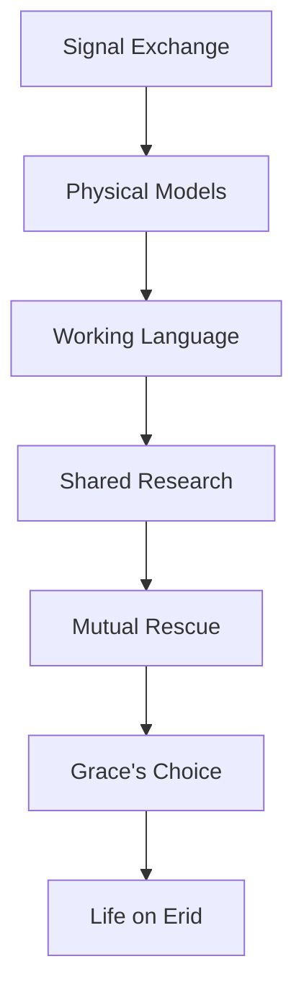

---
tags:
  - phm
  - novel
  - arc
  - grace
  - rocky
  - first-contact
  - relationship
up: "[[Project Hail Mary/Novel/Chapter Index|Chapter Index]]"
source_mode: primary-synthesis
confidence: verified
freshness: stable
tier-coverage: [intuition, core, deep-dive, practice]
---
# Arc - Grace and Rocky

> **One-line summary** — Grace and Rocky’s relationship begins as cautious first contact, becomes a working scientific partnership, and ends as the emotional center of the novel.

## 🎯 Intuition
**The Core Idea:** This page traces the full relational arc between Ryland Grace and Rocky, from first detection to life on Erid.
**Why It Matters:** Their partnership is the novel’s emotional spine and its clearest argument that collaboration across radical difference is both possible and necessary. It also turns the book’s science problems into relationship beats, so that every technical advance deepens trust as well as plot.

## ⚙️ Core Mechanics
### Key Details
The relationship between Ryland Grace and Rocky is the emotional spine of *Project Hail Mary*. This arc note traces the trajectory from first detection through trust, co-research, crisis, rescue, and the final choice — synthesizing chapter notes into a coherent relational narrative.

> [!info] Primary-synthesis note
> This arc note synthesizes primary-mode chapter notes verified directly from [[Weir 2021 - Project Hail Mary Novel]]. Chapter attributions are precise. Supporting chunks are sourced from the chapter layer.

---

## What This Arc Covers

The Grace-Rocky arc is the novel's central relationship: two engineers-scientists from incompatible biospheres, responding to the same existential crisis, who build a working partnership and then a genuine friendship across every barrier that should make connection impossible — atmospheric incompatibility, no shared language, radically different sensory worlds, different mathematical cultures, and the constant pressure of a race against extinction.

The arc matters because the novel uses it to argue that collaboration across radical difference is not only possible but necessary. Neither Grace nor Rocky could solve the Astrophage problem alone; the solution is explicitly joint.

---

## Arc Stages

### Stage 1 — Detection Without Contact (Ch 06–07)
Grace arrives at Tau Ceti and confirms Astrophage presence. He then detects an alien vessel — something that should not exist — in the same system. His initial response is careful and methodical: he initiates a mirrored-signal protocol designed to establish mutual awareness without provocation. The other ship returns signals in kind. At this stage, Rocky is a hypothesis: *something on the other ship is responding intelligently*. See [[PHM Novel - Chapter 06]] and [[PHM Novel - Chapter 07]].

### Stage 2 — Physical Proximity Without Shared Language (Ch 08–09)
The two ships exchange physical models — Grace deduces the alien originated at 40 Eridani, and that its crew is responding to the same stellar dimming crisis. The material the alien uses — xenonite — is unfamiliar and far beyond human material science. The two cooperate to engineer a shared docking tunnel bridging their vessels while maintaining atmospheric separation. By the end of Chapter 09, Grace can detect Rocky's ammonia-rich environment and hear Rocky's tonal communication — but no shared language yet exists. See [[PHM Novel - Chapter 08]] and [[PHM Novel - Chapter 09]].

### Stage 3 — First Contact and Language Bootstrap (Ch 10–12)
Face-to-face contact across the docking tunnel. Grace and Rocky begin constructing a shared vocabulary through systematic object exchange, atomic models, and timekeeping demonstrations. Rocky's base-six mathematics and echolocative world-perception are established. Grace gives Rocky his nickname. By Chapter 12, their shared vocabulary has reached a working level — enough to teach, to ask, and to collaborate. See [[PHM Novel - Chapter 10]], [[PHM Novel - Chapter 11]], and [[PHM Novel - Chapter 12]].

### Stage 4 — Knowledge Exchange and Trust-Building (Ch 13–16)
The collaboration deepens into genuine reciprocity. Grace teaches Rocky radiation physics, which explains the death of Rocky's Eridian crewmates — a moment of both grief and gratitude. Rocky teaches Grace more Eridian biology. Rocky constructs a xenonite pressure sphere to enter the Hail Mary's interior, and for the first time they share a laboratory space. Rocky's disclosure that his vessel carries enough surplus Astrophage fuel to get Grace home transforms the mission's emotional register: this need not be one-way. See [[PHM Novel - Chapter 13]] through [[PHM Novel - Chapter 16]].

### Stage 5 — Co-Research Under Pressure (Ch 17–22)
Grace and Rocky work together on the Adrian sampling problem — the core scientific collaboration. Rocky contributes engineering capabilities Grace lacks; Grace contributes biological analysis Rocky cannot perform. The EVA mission goes catastrophically wrong: a fuel-tank breach puts Grace in mortal danger. Rocky saves him, sustaining severe oxygen burns in the process. Grace must then treat Rocky's injuries under alien-biology constraints with no medical reference. They survive the crisis together. When the Taumoeba contamination is identified, they work in darkness — Rocky's sonar guides them through what would be total disorientation for Grace. See [[PHM Novel - Chapter 17]] through [[PHM Novel - Chapter 22]].

### Stage 6 — The Xenonite Crisis and Its Costs (Ch 24–27)
As Grace and Rocky solve the nitrogen-tolerance problem and produce Taumoeba-82.5, testing reveals that the evolved strain can penetrate xenonite — the material Rocky's entire civilization depends on. Rocky understands immediately what this means. The solution to one civilization's crisis has created an existential threat to the other. The two work together on this problem, but the cost is not trivial, and the weight of it falls on Rocky most heavily. See [[PHM Novel - Chapter 24]] through [[PHM Novel - Chapter 27]].

### Stage 7 — Separation and the Final Choice (Ch 28–30, Epilogue)
Grace launches the Beetles toward Earth, decoupling his personal fate from the mission outcome. Rocky departs on his return journey. His engine signature disappears from Grace's instruments without explanation. Grace faces the novel's defining choice: continue home or turn back. He chooses Rocky. In Chapter 29, he finds him and assists with the crisis that has left the Eridian vessel apparently disabled. In doing so, Grace gives up his return to Earth permanently — any homecoming is now physically impossible given the time-dilation arithmetic. The Epilogue shows Grace living on Erid, years later, in a purpose-built habitat, physically changed, and integrated into an Eridian world that has received the Taumoeba solution. See [[PHM Novel - Chapter 28]], [[PHM Novel - Chapter 29]], [[PHM Novel - Chapter 30]], and [[PHM Novel - Epilogue]].

---

## Why the Relationship Works

Several structural choices make the Grace-Rocky dynamic one of science fiction's more effective first-contact relationships:

**Complementary asymmetry.** Grace is a biologist; Rocky is an engineer. Their knowledge gaps are real and specific. Neither is the competent one — they take turns. The collaboration is genuinely synergistic, not redundant.

**Environmental incompatibility as permanent constraint.** Their atmospheres are mutually lethal throughout the novel. There is no scene where the barrier dissolves. Every physical interaction requires engineering. This keeps the relationship's strangeness intact while still depicting warmth.

**Language as earned access.** The shared vocabulary is built from scratch, on-screen, through work. The reader watches them become able to communicate rather than having it handed to them. This makes every exchange feel real.

**Symmetrical stakes.** Both characters face the same kind of crisis — Astrophage is consuming their star. Neither is in the position of rescuing the other's civilization while their own is safe. The stakes are equal, which makes the collaboration one of genuine partnership rather than asymmetric rescue.

**The friendship is shown, not stated.** The novel earns the emotional weight of Grace's final choice because it has spent hundreds of pages showing, through specific collaborative moments, why this relationship matters. See [[Rocky and the Eridians]] for Rocky's full profile.

---

## Key Chapters

| Chapter | Arc Beat |
|---|---|
| [[PHM Novel - Chapter 06\|Ch 06]] | Alien ship detected — the relationship begins as a question |
| [[PHM Novel - Chapter 07\|Ch 07]] | Signal exchange — cooperative intent established |
| [[PHM Novel - Chapter 08\|Ch 08]] | Physical model exchange — mutual origin understood |
| [[PHM Novel - Chapter 09\|Ch 09]] | Docking tunnel — proximity achieved; atmosphere confirms the alien |
| [[PHM Novel - Chapter 10\|Ch 10]] | Face-to-face contact; vocabulary begins; "Rocky" named |
| [[PHM Novel - Chapter 12\|Ch 12]] | Working language achieved |
| [[PHM Novel - Chapter 13\|Ch 13]] | Radiation lesson — Grace explains Rocky's crewmates' deaths |
| [[PHM Novel - Chapter 15\|Ch 15]] | Shared lab space — qualitative shift in collaboration |
| [[PHM Novel - Chapter 16\|Ch 16]] | Surplus fuel disclosure — return is possible; the mission's emotional frame shifts |
| [[PHM Novel - Chapter 18\|Ch 18]] | Rocky rescues Grace from fuel-breach crisis |
| [[PHM Novel - Chapter 19\|Ch 19]] | Grace treats Rocky's oxygen burns |
| [[PHM Novel - Chapter 27\|Ch 27]] | Xenonite permeability crisis — the solution threatens Rocky's civilization |
| [[PHM Novel - Chapter 28\|Ch 28]] | Grace chooses Rocky over Earth |
| [[PHM Novel - Chapter 29\|Ch 29]] | Grace finds Rocky — reunion after rescue |
| [[PHM Novel - Epilogue\|Epilogue]] | The friendship's long-term outcome: Grace on Erid |

### Key Facts

| Fact | Detail |
|---|---|
| First contact basis | The relationship begins through cautious signaling and engineering, not instant understanding |
| Communication growth | Shared language is built gradually through experiments and exchanged models |
| Collaborative logic | Grace and Rocky’s expertise is complementary rather than overlapping |
| Trust proof | Each saves the other through high-risk acts of cooperation |
| Major late crisis | The xenonite problem threatens to turn a shared solution into a species-level danger |
| Final payoff | Grace ultimately chooses Rocky and Erid over returning to Earth |

## 🔬 Deep Dive
### Scientific Accuracy
This arc is unusually effective because its emotional development depends on technical constraints that remain real within the novel: incompatible atmospheres, different sensory systems, material engineering barriers, and stepwise language acquisition. Even when the underlying speculative biology is impossible by real standards, the relationship itself grows through believable problem-solving.

### Narrative Analysis
Weir turns first contact into a long-form trust exercise. Each stage replaces one impossible barrier with a workable bridge—signal, model, tunnel, vocabulary, lab, rescue, sacrifice—so that the climax feels less like a sudden emotional leap and more like the inevitable endpoint of accumulated shared labor.

### Connections

- Rocky's biology and profile: [[Rocky and the Eridians]]
- Rocky's character profile: [[Rocky]]
- Grace's character arc: [[Ryland Grace]]
- How they communicate: [[Arc - Xenolinguistics Progression]]
- The scientific problem they solve together: [[Arc - Taumoeba Discovery]]
- The crisis driving both of them: [[Arc - Astrophage Crisis Escalation]]
- The novel's ending assessed: [[Resolution and Aftermath]]
- Film treatment of the relationship: [[Novel vs Film Adaptation]]
- Thematic analysis: [[Themes and Motifs]]
- Timeline overview: [[PHM Timeline Map]]

## 🏋️ Practice
### Discussion Questions
1. Which stage in Grace and Rocky’s relationship most convincingly transforms cooperation into friendship?
2. How do technical barriers like atmosphere and language make the relationship stronger rather than weaker as narrative material?
3. What real-world collaborations across major cultural or disciplinary difference best parallel this arc?

### Analysis
- Examine how the novel uses problem-solving scenes to build intimacy without abandoning first-contact strangeness.
- Compare Rocky’s rescue of Grace with Grace’s final return for Rocky: how do these moments mirror one another?

### Creative Challenge
- **What if...** Grace and Rocky had solved the scientific problem together but never achieved real friendship—how would that alter the ending’s force?

## Supporting Chunks

- [[Novel - Rocky's crew-loss disclosure converts first contact into shared grief]]
- [[Novel - Rocky enters Grace's oxygen atmosphere to save him accepting lethal exposure]]
- [[Novel - Grace chooses to rescue Rocky instead of returning to Earth as the defining ethical act]]
- [[Novel - Grace buries his crewmates in space establishing humanity alongside scientific detachment]] — Ch03: first emotional beat
- [[Xenolinguistics - Astrophage on me star confirms both crews share the same existential mission]] — Ch11: shared-mission pivot
- [[Eridian - Rocky learns his crewmates died of radiation sickness completing the workshop-shielding mystery]] — Ch13: shared grief
- [[Eridian - Rocky discloses forty-six years of solitary vigil at Tau Ceti]] — Ch14: emotional context
- [[Novel - Rocky s surplus Astrophage offer transforms the one-way sacrifice into a survivable mission]] — Ch15: mission pivot
- [[Engineering - Improvised Petrovascope search repurposes attitude thrusters as rotating Petrova-band illumination]] — Ch28: search technique
- [[Novel - You save me and you save Erid is the emotional payoff of Grace turning back for Rocky]] — Ch29: emotional climax

## References

- [[PHM Chapter Summaries - Secondary Sources Registry]] — secondary sources for chapter-note bootstrap
- [[Weir 2021 - Project Hail Mary Novel]] — primary source (fictional)
- [[Project Hail Mary/Novel/Chapter Index|Chapter Index]]
- [[Rocky and the Eridians]]
- [[Ryland Grace]]