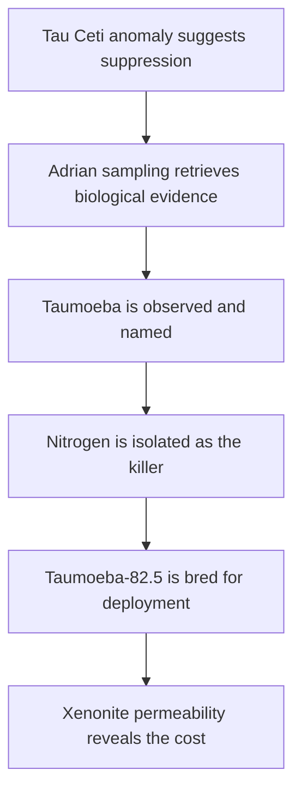

---
tags:
  - phm
  - novel
  - arc
  - taumoeba
  - science
  - discovery
up: "[[Chapter Index]]"
source_mode: primary-synthesis
confidence: verified
tier-coverage: [intuition, core, deep-dive, practice]
---
# Arc - Taumoeba Discovery

> **One-line summary** — A strange Tau Ceti anomaly becomes a predator-discovery arc, a biological cure, and then a new existential threat.

## 🎯 Intuition
**The Core Idea:** This arc follows Grace and Rocky as they apply real scientific method to identify, test, and weaponize Taumoeba against Astrophage.
**Why It Matters:** The Taumoeba arc is the novel's clearest demonstration that problem-solving is never linear. Every breakthrough creates a new layer of responsibility, culminating in a solution that can save Earth while endangering Erid.

## ⚙️ Core Mechanics
### Key Details
This arc note traces the scientific-method arc from the first observation of anomalous Astrophage suppression at Tau Ceti, through sampling Adrian, identifying the predator, characterizing it, engineering a nitrogen-tolerant strain, and confronting the consequences of that strain's ability to penetrate xenonite.

> [!info] Primary-synthesis note
> This arc note synthesizes primary-mode chapter notes verified directly from [[Weir 2021 - Project Hail Mary Novel]]. Beat placements are based on primary chapter content. Supporting chunks are sourced from the chapter layer.

#### What This Arc Covers

The Taumoeba discovery arc is the novel's science-process showcase. It runs from the first anomaly observation through systematic investigation to the delivery of a working solution — and then through one more complication the solution introduces. The arc models real scientific method more carefully than most science fiction: observation, hypothesis, experiment, revision, and ultimately a result with unintended consequences that must themselves be managed.

The arc ends not at a clean resolution but at a handoff: by the time the Taumoeba-82.5 strain is deployed toward Earth, the Taumoeba problem has opened a new one. That new problem — xenonite permeability — is the final scientific crisis Grace and Rocky face before separation. For the broader resolution context, including delivery mechanics and Earth-side aftermath, see [[Resolution and Aftermath]].

#### Recognizing the Missing Variable

##### Tau Ceti's Anomalous Brightness (Ch 05 flashback, Ch 06)
The first indicator that something is different at Tau Ceti appears in the flashback strand: when astronomers survey nearby stars for Astrophage dimming, Tau Ceti is not dimming the way the Sun and other stars are. Something is different in that system. This observation is the scientific premise for the entire mission — if Astrophage can be suppressed there, a suppressive agent might exist. See [[PHM Novel - Chapter 05]] and [[PHM Novel - Chapter 06]].

##### Adrian's Astrophage Deficit (Ch 17)
Orbital sampling data from Adrian — the gas giant in the Tau Ceti system — shows Astrophage concentrations measurably lower than the stellar environment would predict. Something is consuming the organism near this planet. Grace's inference is ecologically straightforward: if a population is being suppressed below what conditions would support, a predator is present. See [[PHM Novel - Chapter 17]].

Rocky, whose Eridian civilization has long managed Astrophage as a known phenomenon, confirms that this pattern matches what Eridian science has observed — and that they never identified the suppressive mechanism either. The problem is genuinely novel to both species. See [[Astrophage Life Cycle and Migration]].

#### Sampling Adrian

##### Chain Sampler Design and Fabrication (Ch 17)
Grace and Rocky design a chain sampler — a kilometres-long xenonite chain dragged through Adrian's narrow Astrophage breeding band to collect biological material. Rocky contributes engineering capabilities beyond human material science; Grace specifies the biological containment requirements. The design is non-trivial: the chain must survive conditions that would destroy conventional spacecraft components. Fabrication takes weeks. See [[PHM Novel - Chapter 17]] and [[Hail Mary Ship Design and Systems]].

##### EVA Retrieval Crisis (Ch 18)
With the chain assembly complete, Rocky designs a life-support sample container for the retrieved material. Grace performs a dangerous EVA to recover the deployed sampler. During the operation, a catastrophic fuel-tank breach throws the Hail Mary into chaotic uncontrolled motion. Grace is tumbled and nearly unable to return to the ship. Rocky rescues him by crossing into the lethal oxygen atmosphere, sustaining severe chemical burns. The sample is recovered. See [[PHM Novel - Chapter 18]].

In Chapter 19, Grace stabilizes the ship and treats Rocky's oxygen burns — improvising alien medical care with no reference. The immediate crisis is resolved, but the cost is real. See [[PHM Novel - Chapter 19]].

The recovery of a biological sample from a lethal environment at the cost of near-death is not an abstract narrative device — it reflects the real costs that field sampling in extreme environments imposes. The sample matters more because of what it cost.

#### Naming and Characterizing the Predator

##### Taumoeba Observed and Named (Ch 20)
With Rocky's injuries treated and the ship stable, Grace analyzes the Adrian sample. Under the microscope, he watches an amoeba-like organism engulf and kill Astrophage clumps. He names it Taumoeba. Grace and Rocky set up atmospheric simulation experiments for Venus and Threeworld conditions. The chapter ends with the ship losing power: "Then the lights go out." See [[PHM Novel - Chapter 20]] and [[Taumoeba and the Biological Solution]].

##### Contamination and Power-Loss Crisis (Ch 21)
Chapter 21 reveals the cause: Taumoeba has escaped into the fuel lines and consumed the Astrophage powering both generators. The ship is completely dark except for Rocky's Eridian equipment. Rocky's sonar navigation becomes essential — guiding them through what would be total disorientation for Grace. They improvise a recovery using Rocky's sealed Astrophage supply for emergency power and the Beetles as makeshift engines. The characterization process has become simultaneously scientific and existential — the ship is losing its fuel to the organism it is trying to study. See [[PHM Novel - Chapter 21]].

##### Atmospheric Testing and Nitrogen Discovery (Ch 22–24)
With the ship stabilized after the power-loss crisis, Grace checks the Venus and Threeworld simulation experiments set up in Chapter 20: both slides are jet-black — Taumoeba are dead in both atmospheres, but the lethal component is unknown. Meanwhile, Rocky reinforces the Beetles for full thrust and the eleven-day transfer toward Blip-A begins. See [[PHM Novel - Chapter 22]].

In Chapter 23, Grace and Rocky isolate the killer systematically. Rocky fabricates a precision xenonite test chamber and Grace adds atmospheric gases one at a time. Carbon dioxide alone: Taumoeba thrive. Nitrogen: every organism in the chamber dies within seconds. The result is startling — nitrogen is essentially inert, harmless to both Earth and Eridian life, yet lethal to Taumoeba at trace concentrations. Grace immediately frames this as a fatal flaw for Earth deployment and pivots to a directed-evolution strategy, breeding Taumoeba for nitrogen tolerance the way bacteria evolve antibiotic resistance. Rocky fabricates ten breeding tanks and the selection program begins. See [[PHM Novel - Chapter 23]].

Chapter 24 spans weeks as the breeding program runs to completion. Taumoeba-35 survives Venus-level nitrogen (3.5%), confirming the approach works; the final breeder tanks yield Taumoeba-82.5, tolerant enough for both Venus and Threeworld conditions. Grace and Rocky celebrate — the biological solution is validated. See [[PHM Novel - Chapter 24]] and [[Taumoeba and the Biological Solution]].

#### Engineering a Usable Strain

##### The Nitrogen Problem (Ch 23–24)
The atmospheric-isolation experiments in Chapter 23 reveal the critical finding: Taumoeba cannot survive in nitrogen-rich conditions. This is a fatal flaw for deploying it toward Earth, whose atmosphere is 78% nitrogen. The organism that could save Earth's sun cannot survive Earth's atmosphere. See [[PHM Novel - Chapter 23]].

This is a real pattern in biological control: the organism that works in its native environment may be incompatible with the target environment, requiring strain development rather than direct deployment. The breeding campaign that follows across Chapters 23–24 addresses this flaw through directed evolution. See [[PHM Novel - Chapter 24]].

##### Directed Evolution to Taumoeba-82.5 (Ch 24)
Grace conducts a directed-evolution campaign — essentially accelerated selective breeding — exposing Taumoeba cultures to progressively higher nitrogen concentrations and selecting for survivors. Taumoeba-35 validates the approach at Venus-level nitrogen (3.5%); the final breeder tanks yield Taumoeba-82.5, tolerant enough for both Venus and Threeworld conditions. The Hail Mary's contaminated fuel systems are purged and refueled with clean Astrophage. See [[PHM Novel - Chapter 24]].

The naming convention — Taumoeba-82.5 — suggests a quantitative threshold has been defined and met, consistent with how real strain-development programs track tolerance levels.

##### Return Journey and Second Outbreak (Ch 25)
With the breeding program complete and Rocky departed, Grace settles into the long return-journey routine. He installs a Beetle mini-farm for ongoing Taumoeba culture maintenance. The chapter's closing beat resets the tension: Taumoeba are loose again — a second contamination event that sets up the nitrogen-flood crisis of Chapter 26. See [[PHM Novel - Chapter 25]].

#### The Cost of the Solution

##### Nitrogen-Flood Containment (Ch 26)
Escaped Taumoeba threatens the Hail Mary's remaining Astrophage fuel stores. Grace executes a nitrogen-flood emergency protocol to sterilize the ship's interior, exploiting the organism's lethal sensitivity to nitrogen. The gambit neutralizes the contamination and secures the fuel needed for the return journey. See [[PHM Novel - Chapter 26]].

##### Xenonite Permeability (Ch 27)
Further testing of the evolved strain reveals a critical and alarming property: Taumoeba-82.5 can penetrate xenonite — the material Rocky's entire civilization uses for ships, tools, and life-support structures. The evolved tolerance that makes the strain safe for deployment toward Earth makes it dangerous to every Eridian who depends on xenonite.

Grace and Rocky both understand the implication immediately. The solution to Earth's Astrophage crisis has introduced an existential threat to Eridian civilization — one that Rocky's species has no defense against, because xenonite was their assumed-inert structural foundation. See [[PHM Novel - Chapter 27]] and [[Rocky and the Eridians]].

##### Beetle Launch to Earth (Ch 28)
With the xenonite problem now understood, Grace loads the Beetles — autonomous probe carriers — with Taumoeba-82.5 and launches them toward the Solar System. The Beetle deployment represents the arc's mission-success moment: Earth's solution is now self-executing and no longer depends on Grace's return. See [[PHM Novel - Chapter 28]].

For the xenonite problem's resolution and the subsequent events — Rocky's departure, Grace's choice, and the Epilogue — see [[Resolution and Aftermath]] and [[Arc - Grace and Rocky]].

#### Key Chapters

| Chapter | Discovery Beat |
|---|---|
| [[PHM Novel - Chapter 05\|Ch 05]] | Tau Ceti not dimming — anomaly first noted |
| [[PHM Novel - Chapter 06\|Ch 06]] | Arrival confirms Astrophage present but suppressed |
| [[PHM Novel - Chapter 17\|Ch 17]] | Adrian sampling data: population deficit inferred; chain sampler designed and fabricated |
| [[PHM Novel - Chapter 18\|Ch 18]] | Chain assembly complete; sample container built; EVA retrieval crisis; Rocky rescues Grace |
| [[PHM Novel - Chapter 19\|Ch 19]] | Rocky's burns treated; immediate emergency resolved |
| [[PHM Novel - Chapter 20\|Ch 20]] | Taumoeba observed and named; experiments begin; lights go out |
| [[PHM Novel - Chapter 21\|Ch 21]] | Contamination identified; shipwide power-loss crisis |
| [[PHM Novel - Chapter 22\|Ch 22]] | Venus/Threeworld tests come back dead; lethal agent unknown; Beetle transfer begins |
| [[PHM Novel - Chapter 23\|Ch 23]] | Nitrogen isolated as lethal agent; directed-evolution strategy proposed; breeding tanks built |
| [[PHM Novel - Chapter 24\|Ch 24]] | Breeding program succeeds: Taumoeba-82.5 validated for Venus and Threeworld conditions |
| [[PHM Novel - Chapter 25\|Ch 25]] | Return-journey routine; Beetle mini-farm installed; second Taumoeba outbreak detected |
| [[PHM Novel - Chapter 26\|Ch 26]] | Nitrogen-flood containment neutralizes escaped Taumoeba |
| [[PHM Novel - Chapter 27\|Ch 27]] | Xenonite permeability discovered — the solution's cost revealed |
| [[PHM Novel - Chapter 28\|Ch 28]] | Beetle launch / deployment to Earth |

### Key Facts

| Fact | Detail |
|---|---|
| Tau Ceti anomaly | The first clue is that Tau Ceti is not dimming like other infected stars, implying a missing suppressive variable. |
| Adrian sampling | Grace and Rocky infer a predator from Adrian's Astrophage deficit and build a chain sampler to retrieve biological evidence. |
| Taumoeba identified | Microscope work confirms an amoeba-like predator that consumes Astrophage and triggers the ship's blackout crisis. |
| Nitrogen weakness | Systematic atmospheric isolation reveals nitrogen as lethally toxic to Taumoeba. |
| Directed evolution | Selective breeding produces Taumoeba-82.5, a strain tough enough for Venus and Threeworld conditions. |
| Solution's cost | The evolved strain can penetrate xenonite, turning Earth's cure into an existential danger for Eridian civilization. |

## 🔬 Deep Dive
### Scientific Accuracy
This is one of the novel's strongest science arcs because it follows observation, hypothesis, experiment, iteration, and unintended consequences in credible order. The ecology and directed-evolution steps are simplified for fiction, but the overall logic—especially the nitrogen-screening experiments and strain selection—tracks closely with real laboratory reasoning.

### Narrative Analysis
Weir structures the arc as a series of escalating scientific wins that are repeatedly interrupted by physical danger: the sampler nearly kills Grace, the discovery blackouts the ship, and the final bred strain creates a new crisis. That pacing keeps the science vivid because each result matters emotionally and materially, not just intellectually.

### Connections
- Full scientific profile of Taumoeba: [[Taumoeba and the Biological Solution]]
- The prey organism's biology: [[Astrophage Biology]] · [[Astrophage Life Cycle and Migration]]
- Rocky's vulnerability: [[Rocky and the Eridians]]
- Broader resolution and aftermath: [[Resolution and Aftermath]]
- Grace as the scientist who drives this: [[Ryland Grace]]
- The collaboration that made it possible: [[Arc - Grace and Rocky]]
- Timeline overview: [[PHM Timeline Map]]

## 🏋️ Practice
### Discussion Questions
1. Why is the Taumoeba arc such an effective model of the scientific method in fiction?
2. How does the Adrian sampler sequence change the emotional weight of the later laboratory discoveries?
3. Why does the xenonite-permeability twist make the solution feel more believable rather than less?

### Analysis
- Trace how each experimental success in this arc produces a new operational or ethical complication.
- Compare Taumoeba as a biological solution with the technological solutions elsewhere in the novel.

### Creative Challenge
- **What if...** Taumoeba had never evolved xenonite permeability and the cure for Earth had been cleanly cost-free?

## References
- [[PHM Chapter Summaries - Secondary Sources Registry]]
- [[Weir 2021 - Project Hail Mary Novel]] — primary source (fictional)
- [[Chapter Index]]
- [[Taumoeba and the Biological Solution]]
- [[Astrophage Life Cycle and Migration]]
- [[Taumoeba - Fictional predator of Astrophage native to Tau Ceti system]]
- [[Taumoeba - Predatory bacteria demonstrate host-specific population suppression]]
- [[Taumoeba - Microbial predator-prey co-evolution can produce stable coexistence]]

## Supporting Chunks
- [[Taumoeba - First observation shows an amoeba-like organism engulfing and killing Astrophage clumps]]
- [[Taumoeba - Fictional predator of Astrophage native to Tau Ceti system]] — organism identity and host-specificity
- [[Taumoeba - Microbial predator-prey co-evolution can produce stable coexistence]] — ecological plausibility for Tau Ceti suppression
- [[Taumoeba - Fuel contamination causes a complete shipwide power-loss cascade on the Hail Mary]] — Ch 21 blackout: the discovery arc's dramatic turning point
- [[Taumoeba - Xenonite permeability is an unintended trait evolved during directed-evolution breeding in xenonite tanks]] — Ch 27: the solution's cost revealed