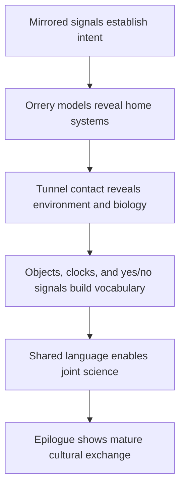

---
tags:
  - phm
  - novel
  - arc
  - xenolinguistics
  - first-contact
  - language
  - rocky
up: "[[Chapter Index]]"
source_mode: primary-synthesis
confidence: verified
tier-coverage: [intuition, core, deep-dive, practice]
---
# Arc - Xenolinguistics Progression

> **One-line summary** — Grace and Rocky move from mirrored signals to a durable shared language that enables science, friendship, and long-term exchange.

## 🎯 Intuition
**The Core Idea:** This arc shows first contact as a staged process of building common meaning from shared objects, measurements, and repeated confirmation.
**Why It Matters:** The xenolinguistics arc is what makes the Grace-Rocky partnership believable. Instead of skipping to effortless translation, the novel turns communication itself into a major source of wonder, rigor, and character development.

## ⚙️ Core Mechanics
### Key Details
This arc note traces how first contact between Grace and Rocky evolves from raw signal exchange through object-based vocabulary construction to a working shared language, and then through sustained scientific collaboration and multi-year educational exchange.

> [!info] Primary-synthesis note
> This arc note synthesizes primary-mode chapter notes verified directly from [[Weir 2021 - Project Hail Mary Novel]]. Beat placements are based on primary chapter content. Supporting chunks are sourced from the chapter layer.

#### What This Arc Covers

The xenolinguistics arc is one of the novel's most technically detailed and widely praised elements. It depicts a credible, staged process for establishing communication between two species with no shared language, no shared alphabet, no shared sensory channel, and radically different mathematical cultures.

The arc has four phases: detecting intelligence and establishing cooperative intent; building a shared vocabulary from physical objects and demonstrations; using that vocabulary to do science together; and — in the long run — creating the conditions for ongoing cultural and scientific exchange. See [[Xenolinguistics and First Contact]] for the broader context in SETI and communication theory.

#### Contact Before Language

##### Signal Mirroring (Ch 07)
Grace's first deliberate act toward the alien is a mirrored-signal protocol: he sends signals that are copies of what the other ship transmitted. This is a minimal claim — *I received what you sent* — that establishes mutual awareness without requiring any shared symbol system. The alien returns signals in kind. Cooperative intent is established before any vocabulary exists. See [[PHM Novel - Chapter 07]].

This mirrors real SETI thinking: mathematics and mirroring are considered the lowest-assumption opening moves because they require only that the other party recognize pattern and respond. See [[Xenolinguistics - Alien signals can be treated as cryptanalysis problems]] and [[Xenolinguistics - Mathematics is the safest first bridge in alien communication]].

##### Physical Model Exchange (Ch 08)
The next step is object exchange: physical models conveying each ship's origin. Grace deduces from the alien's models that the vessel originated at 40 Eridani. Both parties now understand they are responding to the same crisis at different stars. This exchange requires no shared language — only shared physical reality (stellar distances, materials, models). See [[PHM Novel - Chapter 08]].

##### Atmospheric Detection (Ch 09)
The engineering of the shared docking tunnel is a communication act in itself. It requires both parties to solve the same problem cooperatively without the ability to discuss it. When Grace detects Rocky's ammonia-rich atmosphere through the tunnel, he gains his first direct biochemical data about the alien. The environment communicates what words could not yet. See [[PHM Novel - Chapter 09]].

#### Building Shared Vocabulary

##### Object Exchange and Demonstrations (Ch 10–11)
The systematic vocabulary-building begins with face-to-face contact. Grace and Rocky exchange physical objects, build atomic models, demonstrate timekeeping, and use consistent yes/no confirmation signals to verify each new term. Rocky's base-six mathematics — reflecting his species' six-limbed anatomy — is established through counting demonstrations. Grace coins the name Rocky. See [[PHM Novel - Chapter 10]] and [[PHM Novel - Chapter 11]].

The methodology is grounded in real communication theory: shared physical referents are the most reliable bridge because they are verifiable by both parties through direct observation. Abstractions are deferred until a scaffold of concrete terms exists.

##### Concentrated Language-Building (Ch 12)
A focused burst of vocabulary exchange produces a working shared language. The novel depicts this as rapid once the methodology is established — a plausible outcome given that both parties are intelligent, motivated, and operating with strong confirmation feedback. By the end of this chapter, Grace and Rocky can teach each other things, not just point at things. See [[PHM Novel - Chapter 12]].

#### Science Through Translation

##### Teaching Radiation Physics (Ch 13)
The first substantial scientific lesson is Grace explaining ionizing radiation to Rocky — a concept Rocky's species has no evolutionary or cultural framework for, because their world's atmosphere provided complete shielding. This lesson has immediate emotional weight: it explains how Rocky's Eridian crewmates died. The act of translation here is not just linguistic but conceptual — Grace must build the underlying physics from scratch using their shared vocabulary. See [[PHM Novel - Chapter 13]].

##### Eridian Biology and the Knowledge Gap (Ch 14–15)
Rocky reciprocates with biological and biographical detail about Eridian life. The knowledge exchange becomes increasingly bidirectional, with each party teaching the other things that their respective evolutionary histories made invisible. This phase shows the shared language being used for genuine intellectual work, not just operational coordination. See [[PHM Novel - Chapter 14]] and [[PHM Novel - Chapter 15]].

##### Coordinating the Adrian Investigation (Ch 17–18)
The shared language is put to its most demanding test: designing and coordinating a joint scientific project — the Adrian atmospheric sampler — without being able to hand each other tools, drawings, or equations in a shared medium. Rocky builds what Grace cannot; Grace analyzes what Rocky cannot characterize biologically. The language enables a collaboration that the environmental incompatibility would otherwise make impossible. See [[PHM Novel - Chapter 17]] and [[PHM Novel - Chapter 18]].

##### Operating in Darkness (Ch 22)
When the ship is blacked out and all instruments are down, Rocky's echolocative navigation becomes the primary sensory channel for both of them. The shared language, built for a sighted-human and a hearing-Eridian, must serve a situation where one party is functionally blind and the other is fully operational. That it does reflects the depth the vocabulary has reached. See [[PHM Novel - Chapter 22]].

#### Long-Term Communication

##### Educational Exchange (Epilogue)
The Epilogue, set years after the main events, shows Grace living on Erid in a purpose-built habitat. The scale of what has been built since his arrival is implied: an accommodation of a human being in an alien world requires sustained communication far beyond anything the docking tunnel vocabulary had to handle — medical, architectural, dietary, social. The novel suggests that the language Grace and Rocky built was genuinely generative, not just functional, and that it seeded a longer-term exchange between their civilizations. See [[PHM Novel - Epilogue]].

#### Key Chapters

| Chapter | Communication Milestone |
|---|---|
| [[PHM Novel - Chapter 07\|Ch 07]] | Signal mirroring — cooperative intent established without vocabulary |
| [[PHM Novel - Chapter 08\|Ch 08]] | Physical model exchange — origins communicated without language |
| [[PHM Novel - Chapter 09\|Ch 09]] | Docking tunnel — cooperative engineering as communication |
| [[PHM Novel - Chapter 10\|Ch 10]] | Face-to-face vocabulary begins; base-six math; "Rocky" named |
| [[PHM Novel - Chapter 11\|Ch 11]] | Object exchange system; sonar navigation observed |
| [[PHM Novel - Chapter 12\|Ch 12]] | Working shared language achieved |
| [[PHM Novel - Chapter 13\|Ch 13]] | First complex scientific lesson: radiation physics |
| [[PHM Novel - Chapter 15\|Ch 15]] | Shared laboratory space — communication supports direct collaboration |
| [[PHM Novel - Chapter 17\|Ch 17]] | Adrian anomaly discussed and planned using shared language |
| [[PHM Novel - Chapter 22\|Ch 22]] | Communication under sensory deprivation — language stress test |
| [[PHM Novel - Epilogue\|Epilogue]] | Long-term exchange: Grace on Erid; civilizational communication implied |

### Key Facts

| Fact | Detail |
|---|---|
| Mirrored signals | Grace and Rocky first establish mutual awareness and cooperative intent through simple signal copying. |
| Model exchange | Physical stellar-system models communicate Sol and 40 Eridani without any shared words. |
| Tunnel engineering | The docking tunnel becomes a practical communication act, revealing atmosphere, trust, and constraints. |
| Vocabulary bootstrapping | Object exchange, yes/no signals, clocks, and counting demos create a reliable shared scaffold. |
| Science through language | Once vocabulary stabilizes, Grace and Rocky can teach radiation, biology, and mission-critical procedures. |
| Long-term exchange | The Epilogue proves the language became generative enough to support life, education, and culture on Erid. |

## 🔬 Deep Dive
### Scientific Accuracy
The arc is unusually grounded for first-contact fiction because it builds communication from low-assumption primitives: mirroring, mathematics, shared physical referents, and repeated confirmation. Real xenolinguistics would be far messier, but Weir's staged progression is credible in broad outline and especially strong on sensory mismatch and verification.

### Narrative Analysis
Weir makes language acquisition dramatic by tying each communication gain to a relationship gain. The pacing moves from curiosity to trust to grief to collaboration, so every new word feels like both a technical breakthrough and an emotional deepening of the partnership.

### Connections
- Broader first-contact and SETI context: [[Xenolinguistics and First Contact]]
- Rocky's sensory system and language: [[Rocky and the Eridians]]
- The relationship the language made possible: [[Arc - Grace and Rocky]]
- The science the language enabled: [[Arc - Taumoeba Discovery]]
- Timeline overview: [[PHM Timeline Map]]

## 🏋️ Practice
### Discussion Questions
1. Why does the novel spend so much time on the mechanics of communication instead of skipping straight to translation?
2. Which moment best turns the xenolinguistics arc from first contact into friendship?
3. How does the arc use sensory difference to make both species feel genuinely alien?

### Analysis
- Analyze how verification rituals like clocks, counting, and yes/no signals make the arc scientifically persuasive.
- Compare the language arc's emotional progression with the scientific progression of the Taumoeba arc.

### Creative Challenge
- **What if...** Rocky and Grace had never found a stable yes/no system and every later exchange remained dangerously ambiguous?

## References
- [[PHM Chapter Summaries - Secondary Sources Registry]]
- [[Weir 2021 - Project Hail Mary Novel]] — primary source (fictional)
- [[Chapter Index]]
- [[Xenolinguistics and First Contact]]
- [[Rocky and the Eridians]]
- [[Xenolinguistics - Alien signals can be treated as cryptanalysis problems]]
- [[Xenolinguistics - Mathematics is the safest first bridge in alien communication]]

## Supporting Chunks
- [[Xenolinguistics - Orrery-model exchange communicates stellar origin without shared language]] — Ch07: physical-reality exchange as first meaningful information transfer
- [[Xenolinguistics - Vibration language discovery is the pivotal first-contact communication breakthrough]] — Ch09: Rocky speaks; the language breakthrough
- [[Xenolinguistics - Clock synchronisation establishes the first shared scientific unit of time]] — Ch09: first quantitative inter-species calibration
- [[Xenolinguistics - Jazz-hands and balled fist are minimal cross-species yes-no primitives]] — Ch11: yes/no foundation for systematic vocabulary building
- [[Novel - Rocky's crew-loss disclosure converts first contact into shared grief]] — Ch11: emotional pivot that deepens the collaboration
- [[Xenolinguistics - Mirrored Petrova-signal exchange applies mathematical universality as first-contact basis]] — Ch06: mathematical universality as first bridge
- [[Xenolinguistics - Astrophage on me star confirms both crews share the same existential mission]] — Ch11: shared-mission pivot
- [[Xenolinguistics - Organ-keyboard teaching scene marks xenolinguistics maturing to classroom instruction]] — Epilogue: mature classroom instruction