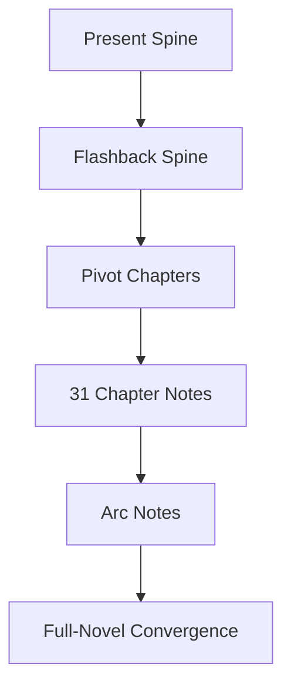

---
tags:
  - phm
  - novel
  - moc
up: "[[Project Hail Mary]]"
confidence: verified
freshness: stable
tier-coverage: [intuition, core, deep-dive, practice]
---
# Chapter Index

> **One-line summary** — The chapter layer is the novel’s master navigation spine, linking every scene-level note, timeline thread, and higher-order arc analysis.

## 🎯 Intuition
**The Core Idea:** This page is the main contents map for chapter-level analysis of *Project Hail Mary*.
**Why It Matters:** It lets you move between the novel’s present-tense mission narrative and its Earth-side flashback structure without losing track of where each chapter fits. It also records source-verification status, making the index both a reading guide and a reliability checkpoint.

## ⚙️ Core Mechanics
### Key Details
Map of contents for chapter-level analysis of *Project Hail Mary*. Each chapter note contains an original summary, science annotations, and chunk candidates. Direct quotes remain pending until primary-source verification.

**Workflow:** [[Novel Ingestion Guide]]
**Source registration:** [[Weir 2021 - Project Hail Mary Novel]]
**Secondary sources:** [[PHM Chapter Summaries - Secondary Sources Registry]]

---

## Source Mode Legend

Chapter notes in this index are built in two possible modes. Check the `source_mode` frontmatter field on any note to confirm its status.

| Mode | Icon | Meaning |
|---|---|---|
| `secondary` | 🟡 | Created from public secondary summaries. Paraphrased content only; Key Quotes section is a placeholder; chapter boundaries are approximate pending direct-source verification. |
| `primary` | 🟢 | Verified against a legally owned copy of the novel. Direct quotes may be present (fair use, max 3 per chapter). |

> **Current status:** Primary-ingestion pass complete. All 31 chapter notes have been upgraded from secondary mode to primary mode against the staged EPUB at `D:\Sources\ProjectHailMary\Weir 2021 - Project Hail Mary.epub`. Summaries are verified, key quotes (fair use) are in place, and `source_mode: primary` is set on every chapter note. A defect-fix pass (post-Phase 8) resolved: Ch20 duplicate content replaced with verified pp. 372–394 content; Ch13 summary typo corrected; Epilogue cross-reference corrected; Ch16 and Ch27 quote blocks trimmed to ≤2 sentences. Remaining work: chunk extraction for candidates flagged during the primary pass (see each chapter's Chunk Candidates section).

---

## Timeline Structure

The novel alternates between two timelines:

- **Present** — Ryland Grace wakes alone on the Hail Mary, pieces together his mission, and encounters Rocky.
- **Flashback** — Grace is recruited by Eva Stratt, the Astrophage crisis escalates, and the mission is assembled on Earth.

Each chapter note tags its `timeline` field as `present`, `flashback`, or `both` (for chapters that switch mid-chapter). This enables filtering by narrative thread.

---

## Chapters

1. [[PHM Novel - Chapter 01]]
2. [[PHM Novel - Chapter 02]]
3. [[PHM Novel - Chapter 03]]
4. [[PHM Novel - Chapter 04]]
5. [[PHM Novel - Chapter 05]]
6. [[PHM Novel - Chapter 06]]
7. [[PHM Novel - Chapter 07]]
8. [[PHM Novel - Chapter 08]]
9. [[PHM Novel - Chapter 09]]
10. [[PHM Novel - Chapter 10]]
11. [[PHM Novel - Chapter 11]]
12. [[PHM Novel - Chapter 12]]
13. [[PHM Novel - Chapter 13]]
14. [[PHM Novel - Chapter 14]]
15. [[PHM Novel - Chapter 15]]
16. [[PHM Novel - Chapter 16]]
17. [[PHM Novel - Chapter 17]]
18. [[PHM Novel - Chapter 18]]
19. [[PHM Novel - Chapter 19]]
20. [[PHM Novel - Chapter 20]]
21. [[PHM Novel - Chapter 21]]
22. [[PHM Novel - Chapter 22]]
23. [[PHM Novel - Chapter 23]]
24. [[PHM Novel - Chapter 24]]
25. [[PHM Novel - Chapter 25]]
26. [[PHM Novel - Chapter 26]]
27. [[PHM Novel - Chapter 27]]
28. [[PHM Novel - Chapter 28]]
29. [[PHM Novel - Chapter 29]]
30. [[PHM Novel - Chapter 30]]
31. [[PHM Novel - Epilogue]]

> All 31 chapter notes exist and have been upgraded to `source_mode: primary` during the primary-ingestion pass (Phase 8). The secondary bootstrap layer (registered in [[PHM Chapter Summaries - Secondary Sources Registry]]) served as the scaffold; all summaries and quotes are now verified against the primary EPUB source.

---

## Arc Notes

Narrative and timeline analysis built on top of the chapter layer. Use these to follow thematic through-lines across the novel without reading all 31 chapter notes in sequence.

| Note | What It Covers |
|---|---|
| [[PHM Timeline Map]] | Navigation foundation: present spine, flashback spine, mixed/pivot chapters, and arc entry points in one place |
| [[Arc - Grace and Rocky]] | The Grace-Rocky relationship from first detection through trust, co-research, rescue, and the final choice |
| [[Arc - Astrophage Crisis Escalation]] | The Earth-side flashback strand: anomaly → Stratt's response → mission buildout → coercive decisions |
| [[Arc - Xenolinguistics Progression]] | First contact evolving from signal exchange through object vocabulary to working language and long-term exchange |
| [[Arc - Taumoeba Discovery]] | The scientific-method arc: Astrophage suppression observed → sampling → characterization → nitrogen-resistant strain → xenonite threat |

### Key Facts

| Fact | Detail |
|---|---|
| Primary function | Serves as the chapter-level master index for *Project Hail Mary* |
| Structural logic | Organizes the novel by alternating present, flashback, and mixed timeline tags |
| Coverage | Links all 31 chapter-level notes, including the epilogue |
| Verification status | Records that every chapter note is now in `source_mode: primary` |
| Higher-order navigation | Points readers from chapter notes into arc-analysis pages |
| Workflow integration | Connects the index to ingestion, source-registration, and coverage-tracking pages |

## 🔬 Deep Dive
### Scientific Accuracy
For a structural page, the core question is not scientific realism but navigational fidelity. This index handles the novel’s science-heavy structure well by making source mode, chapter boundaries, and timeline tags explicit, which helps readers separate verified chapter evidence from higher-level interpretation.

### Narrative Analysis
The dual-timeline format is one of the novel’s key storytelling engines, and this index makes that architecture legible. By separating present, flashback, and pivot chapters while also linking to cross-chapter arc notes, the page supports both linear reading and thematic reassembly of the plot.

### Connections

- [[Novel Ingestion Guide]] — Step-by-step processing workflow, including secondary-mode bootstrap and primary upgrade path
- [[Weir 2021 - Project Hail Mary Novel]] — Primary source registration and legal-copy status
- [[PHM Chapter Summaries - Secondary Sources Registry]] — Public sources used for the chapter bootstrap layer
- [[QnA - Novel Chapter Coverage]] — Query for tracking ingestion progress and source-mode status

## 🏋️ Practice
### Discussion Questions
1. How does the index’s present/flashback split change the way you understand the novel’s pacing?
2. Which arc note seems most useful as a companion to chapter-by-chapter reading, and why?
3. What does source-mode tracking add to a reader’s trust in a literary knowledge base?

### Analysis
- Compare the usefulness of chapter-by-chapter navigation versus arc-based navigation for a nonlinear novel.
- Consider how this page turns a narrative structure into a research structure.

### Creative Challenge
- **What if...** the novel were reorganized into strict chronological order—how would this index need to change to preserve the same analytical value?

## References
- [[Project Hail Mary/Sources/Sources Index]]
- [[Project Hail Mary/Novel/Novel Ingestion Guide]]
- [[Project Hail Mary/Novel/Weir 2021 - Project Hail Mary Novel]]
