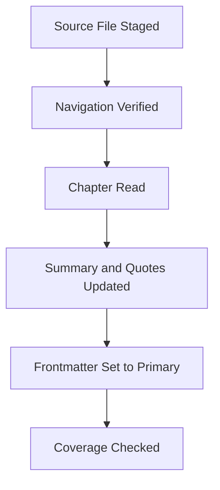

---
tags:
  - phm
  - novel
  - system
up: "[[Chapter Index]]"
confidence: verified
tier-coverage: [intuition, core, deep-dive, practice]
---
# Novel Ingestion Guide

> **One-line summary** — This guide explains how *Project Hail Mary* moved from a secondary-summary bootstrap into a fully verified primary-source chapter system.

## 🎯 Intuition
**The Core Idea:** This page is the operational manual for turning the novel into a structured, compliant knowledge-base layer.
**Why It Matters:** It defines how summaries, chapter notes, quotes, chunk candidates, and source verification are handled without breaking legal or vault-structure constraints. It also preserves the historical bootstrap workflow, so the current system remains auditable instead of looking like it appeared fully formed.

## ⚙️ Core Mechanics
### Key Details
Operational workflow for processing *Project Hail Mary* into the knowledge base. This guide covers the secondary-mode bootstrap (current default), the upgrade path to primary mode, prerequisites, compliance rules, and step-by-step procedures.

---

## Source Available — Primary Ingestion Complete

A legally owned EPUB was staged at `D:\Sources\ProjectHailMary\Weir 2021 - Project Hail Mary.epub`. The primary-ingestion pass is now complete: all 31 chapter notes have been upgraded from secondary mode to primary mode. A subsequent defect-fix pass resolved five residual issues: Ch20 duplicate content replaced with verified pp. 372–394 content; Ch13 summary self-reference typo corrected (Chapter 12, not 13); Epilogue Beetle-launch chapter reference corrected (Chapter 28, not 29); Ch16 and Ch27 quote blocks trimmed to ≤2 sentences. The chapter layer is no longer in bootstrap mode and all known defects are resolved.

> **OCR Scan Warning:** The available EPUB is an OCR scan. Embedded chapter headings and navigation are **unreliable**: chapter numbers show systematic off-by-one errors, some headings are garbled (e.g. "CHAPTER E3", "CHAPTER 14" where OCR misread digits), and the late chapters (Ch29, Ch30) have no OCR-captured headings at all. The EPUB's `nav.xhtml` and `toc.ncx` are empty. Do **not** rely on the EPUB's internal navigation. Use `chapter_map.json` as the sole navigation source of truth.

**External staging artifacts (remain in place for future re-processing):**
- `D:\Sources\ProjectHailMary\Weir 2021 - Project Hail Mary.epub` — the source file (canonical external EPUB path; **not inside the vault**)
- `D:\Sources\ProjectHailMary\chapter_map.json` — authoritative chapter page map (all 30 chapters + Epilogue)
- `D:\Sources\ProjectHailMary\discover_chapters.py` — EPUB structure inspector (reusable for future verification)
- `D:\Sources\ProjectHailMary\extract_chapter.py` — prints chapter text to stdout (no full-text output files)

---

## Secondary Mode (Legacy — Bootstrap Layer Complete)

> **This section is now historical.** The secondary bootstrap layer has been superseded by the primary-ingestion pass. All 31 chapter notes are in `source_mode: primary`. The description below explains what the bootstrap phase did and is retained for provenance.

No legally owned digital copy of the novel was available at the time of the bootstrap pass. Chapter notes were created in **secondary mode** using public, legal summary sources. That hybrid bootstrap workflow is documented here for reference.

### What Secondary Mode Allows

- Creating all 31 chapter note files using the [[Chapter Summary Template]] with `source_mode: secondary`.
- Writing original paraphrase summaries drawn from secondary summary sites (registered in [[PHM Chapter Summaries - Secondary Sources Registry]]).
- Populating the Timeline, Science and Technology, Characters Present, Plot Connections, and Chunk Candidates sections.
- Identifying chunk candidates for later extraction.

### What Secondary Mode Prohibits

- **No direct quotes from the novel.** The Key Quotes section must remain as the placeholder text from the template. Do not relay quotes that appear in secondary summary sites — those quotes are not yours to use without the primary source.
- **No page numbers.** Secondary sources do not supply reliable page references.
- **No verbatim copying from secondary sources.** All summary text must be original paraphrase.

### Secondary Mode Frontmatter

All bootstrap-layer notes must include:

```yaml
source_mode: secondary
quotes_pending: true
```

### Upgrade Path to Primary Mode

When a legally owned DRM-free copy becomes available at `D:\Sources\ProjectHailMary\`:

1. Place the file in the external staging folder (do not copy it into the vault).
2. Run the format-specific extraction workflow below to read each chapter.
3. For each chapter note:
   - Verify and update the summary against the primary text.
   - Add direct quotes to the Key Quotes section (fair use: 1–2 sentences, max 3 per chapter, with page numbers).
   - Change `source_mode: secondary` → `source_mode: primary`.
   - Remove `quotes_pending: true` (or set to `false`).
   - Update `status` to `processed`.
4. Update [[Weir 2021 - Project Hail Mary Novel]] to reflect primary ingestion status.

---

## Prerequisites

| Requirement | Status |
| --- | --- |
| Legal DRM-free source file | **Complete** — `D:\Sources\ProjectHailMary\Weir 2021 - Project Hail Mary.epub` |
| Accepted formats: EPUB, PDF, TXT | EPUB (OCR scan) |
| Python 3.11 + pip | Installed locally |
| Calibre (optional, for EPUB conversion) | Not installed |
| chapter_map.json | **Complete** — `D:\Sources\ProjectHailMary\chapter_map.json` |
| Source file location | `D:\Sources\ProjectHailMary\` (external — never copied into vault) |
| Chapter upgrade (secondary → primary) | **Complete** — all 31 notes upgraded |

> The source file must **not** be copied into the Obsidian vault. It stays in the external staging folder.

---

## Compliance Rules

These are non-negotiable:

1. **No DRM bypass.** If the file is DRM-protected, it cannot be processed. Obtain a DRM-free copy.
2. **No full chapter text in the vault.** Chapter notes contain original summaries and short quotes only.
3. **Fair-use quoting.** Max 1–2 sentences per quote, max 3 quotes per chapter. Each must serve commentary or analysis. Primary mode only.
4. **Original summaries.** All chapter summaries must be written in your own words, not copied from the novel or from any secondary source.
5. **No redistribution.** The source file and any extracted full text stay local and are never committed to version control or shared.

---

## Processing Workflow (Primary Mode)

### Format-Specific Extraction

**EPUB (preferred):**
- Python: use `ebooklib` to parse chapters (`pip install ebooklib beautifulsoup4`).
- Each EPUB chapter maps to an HTML section. Extract text per chapter, feed to summarization.
- Calibre (if installed): `ebook-convert input.epub output.txt` for plain-text fallback.

**PDF:**
- Python: use `pymupdf` or `pdfplumber` (`pip install pymupdf` or `pip install pdfplumber`).
- Chapter boundaries may need manual identification (look for "Chapter N" headings).

**TXT:**
- Split on chapter headings manually or with a simple script.
- Least metadata, but most portable.

### Per-Chapter Processing Steps

For each chapter (1–30 + epilogue):

1. **Read the chapter** from the source file (external staging folder, not the vault).
2. **Open the existing chapter note** in `Project Hail Mary/Novel/` (created during secondary bootstrap).
3. **Verify or rewrite the summary** in your own words (3–5 sentences).
4. **Annotate science and technology** — link to existing wiki notes.
5. **Select key quotes** — max 3 short quotes with page numbers.
6. **Confirm characters present** and their role in the chapter.
7. **Confirm or expand chunk candidates** — claims or details worth extracting into `_chunks/`.
8. **Update frontmatter:** `source_mode: primary`, remove `quotes_pending`, set `status: processed`.

### After Each Chapter

- Update the chapter's `status` field to `processed`.
- Extract any chunk candidates using the [[Chunk Template]].
- Update `chunk_count` in both the chapter note and the raw note.

### After All Chapters

- Update [[Weir 2021 - Project Hail Mary Novel]] status to `fully-chunked`.
- Update [[Chapter Index]] with any title annotations if desired.
- Update the master MOC [[Project Hail Mary]] if new wiki note links were created.
- Run [[QnA - Novel Chapter Coverage]] to verify completeness.

---

## Manual Mode (No Digital File)

If no usable digital file is available, chapter notes can still be built manually:

1. Read the physical book or audiobook.
2. Open the existing secondary-mode chapter note.
3. Verify and rewrite summaries from first-hand reading.
4. Select short quotes directly from the physical text.
5. Update `source_mode: primary` and remove `quotes_pending`.

This is slower but fully compatible with the same vault structure.

### Key Facts

| Fact | Detail |
|---|---|
| Current state | Primary ingestion is complete for all 31 chapter notes |
| Historical layer | Secondary mode remains documented for provenance, not active use |
| Source handling | The EPUB and helper artifacts stay outside the vault in `D:\Sources\ProjectHailMary\` |
| Navigation caveat | OCR navigation is unreliable, so `chapter_map.json` is the trusted chapter map |
| Compliance model | The workflow forbids DRM bypass, full-text storage, and non-original summaries |
| Processing scope | The system supports EPUB, PDF, TXT, and manual verification workflows |

## 🔬 Deep Dive
### Scientific Accuracy
For a process page, “accuracy” means methodological rigor rather than science content. This guide is strong because it separates verified primary-text work from provisional bootstrap work, explicitly documents OCR limitations, and keeps a clear boundary between source extraction and analytical transformation.

### Narrative Analysis
Although procedural, the page mirrors the novel’s own logic: incremental problem solving under constraints. The workflow treats chapter ingestion as a sequence of evidence checks, which fits a book whose storytelling depends on reconstruction, verification, and cumulative understanding.

### Connections

- [[Chapter Index]] — MOC for all chapter notes
- [[Chapter Summary Template]] — Template for individual chapters
- [[Chunk Template]] — Template for atomic claims
- [[Weir 2021 - Project Hail Mary Novel]] — Source registration
- [[PHM Chapter Summaries - Secondary Sources Registry]] — Public sources used for bootstrap layer
- [[QnA - Novel Chapter Coverage]] — Progress tracking query



## 🏋️ Practice
### Discussion Questions
1. Why is it important that this workflow preserves the historical secondary-mode layer instead of deleting it?
2. How does `chapter_map.json` function as a trust anchor in a messy OCR environment?
3. What parallels exist between this ingestion method and real-world archival or research workflows?

### Analysis
- Evaluate how the compliance rules shape both the legal safety and the analytical quality of the knowledge base.
- Consider whether the workflow is more robust because it was designed to survive imperfect source files.

### Creative Challenge
- **What if...** the only available source were a flawed PDF instead of the OCR EPUB—how would you adapt this workflow while preserving the same verification standards?

## References