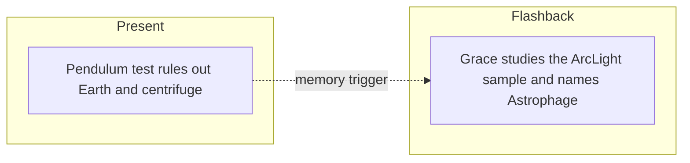

# PHM Novel - Chapter 02

← [[PHM Novel - Chapter 01]] | [[Project Hail Mary/Novel/Chapter Index|Chapter Index]] | [[PHM Novel - Chapter 03]] →

> **One-line summary** — Grace proves he is far from Earth while flashbacks name Astrophage and explain its link to Venus.

## 🎯 Intuition
**The Core Idea:** This chapter replaces raw confusion with measurement, then turns that same method toward the Astrophage mystery.
**Why It Matters:** Grace's pendulum test shows that science, not luck, will be his tool for survival. The flashbacks also supply the novel's first real biological explanation for Astrophage, tying personal memory recovery to humanity's existential problem.

## ⚙️ Core Mechanics
### Summary
Present-timeline: Grace improvises a pendulum from a tape measure to calculate gravitational acceleration with precision. The math shows that any centrifuge producing this gravity would require a radius of roughly 1,280 metres—far beyond anything ever constructed—eliminating that hypothesis. He concludes definitively that he is not on Earth and not in the solar system. Flashbacks reconstruct the ArcLight mission: NASA's live-broadcast Venus probe (described as the most-watched event in human history), followed by Grace receiving the first ArcLight sample from Stratt—a hermetically sealed cylinder with fourteen latches containing live cells. Lab analysis surprises Grace: despite his career-defining work on non-water-based life, Astrophage is overwhelmingly water, with a hydrogen-to-oxygen ratio of 2:1. Pressing further, he discovers that Astrophage detects Venus by sensing its distinctive CO₂ emission signature at infrared wavelengths, navigating directly toward it to harvest carbon dioxide and reproduce. This mechanism accounts for the shape of the Petrova Line. He names the organism "Astrophage." In a present-timeline coda, Grace notices the solar image on the control-room screen shows sunspots moving far faster than expected, hinting that he may be moving relative to the sun.

### Characters Present
- Ryland Grace ([[Ryland Grace]]) — present timeline: pendulum test, sunspot observation; flashback: first Astrophage lab work, naming the organism
- Eva Stratt ([[Eva Stratt and the Ethics of Existential Response]]) — flashback: hands Grace the ArcLight sample cylinder; present during early lab sessions
- Dr. Irina Petrova — referenced; her original email from Chapter 1 connects to the Petrova Line explanation developed here

### Key Quotes
> [!quote] p. 28
> "So I'm not in a centrifuge. And I'm not on Earth."

> [!quote] p. 61
> "That's the name. The thing that threatens all life on Earth. Astrophage."

## 🔬 Deep Dive
### Science and Technology
- [[Astrophage Biology]] — the organism is identified as water-based, named, and shown to navigate via CO₂ spectroscopy; its reproductive cycle linking sun and Venus is established.
- [[Ryland Grace]] — Grace's pendulum calculation under cognitively impaired conditions illustrates his scientific methodology and is the chapter's primary present-timeline beat.
- [[Stellar Dimming and the Petrova Line]] — the infrared arc's mechanism is explained for the first time in narrative terms here.

### Plot Connections
- **Previous:** [[PHM Novel - Chapter 01]] — Grace's awakening and initial gravity tests
- **Next:** [[PHM Novel - Chapter 03]] — Grace explores the Hail Mary, recovers crewmate memories, and realises the mission is one-way
- [[Astrophage Biology]] — CO₂ navigation mechanism and Petrova Line origin established here
- [[Stellar Dimming and the Petrova Line]] — the real-science analogue of the Petrova Line is covered in this wiki note

### Narrative Analysis
Chapter 2 is built around a satisfying symmetry: Grace solves his immediate environment by experiment, then solves part of Earth's larger crisis by experiment in memory. Weir rewards the reader twice with the same method, which quickly establishes the novel's trust in scientific reasoning as narrative momentum.

## 🏋️ Practice
### Discussion Questions
1. Why is the pendulum calculation a stronger reveal than simply telling the reader Grace is in space?
2. How does the chapter connect Grace's personal competence to the broader Astrophage problem?
3. What makes the CO₂-navigation discovery feel scientifically plausible within the story?

### Analysis
- Examine how the chapter turns a simple physics exercise into a major character-establishing moment.
- Consider why Weir places the naming of Astrophage in a flashback rather than in a present-timeline exposition dump.

### Creative Challenge
- **What if...** Grace had misread the pendulum result and spent another chapter believing he was still near Earth?

## Chunk Candidates
> [!info] Primary-mode — chunk extraction ready
> Chapter directly verified against the primary EPUB (p. 25–61). Chunk extraction can proceed when the pipeline is active.

- [x] Pendulum gravity calculation as a worked example of empirical reasoning under cognitive impairment → [[Characters - Pendulum gravity calculation demonstrates empirical reasoning under cognitive impairment|chunk-grace-002]]
- [ ] ArcLight sample opening as the in-universe first contact with Astrophage
- [ ] CO₂ spectroscopy navigation as the mechanistic link between Astrophage biology and the Petrova Line *(intentional skip — canonical extraction lives in [[Astrophage - CO2 emission spectroscopy explains how Astrophage navigates to Venus for reproduction]]; Ch02 surfaces the observation but Ch04 is the synthesis moment where the mechanism is fully established, so the chunk was sourced there)*
- [ ] Naming of "Astrophage" as the in-universe origin of the term

## References
- [[Weir 2021 - Project Hail Mary Novel]] — primary source, p. 25–61
- [[Project Hail Mary/Novel/Chapter Index|Chapter Index]]
