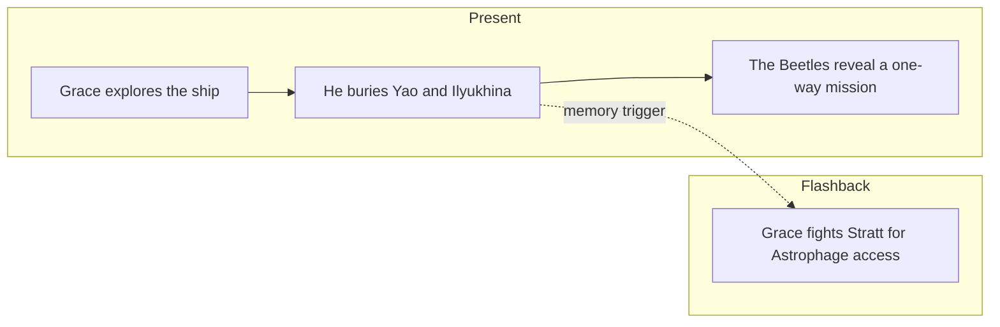

# PHM Novel - Chapter 03

← [[PHM Novel - Chapter 02]] | [[Chapter Index]] | [[PHM Novel - Chapter 04]] →

> **One-line summary** — Grace explores the Hail Mary, buries his dead crewmates, and realizes the mission was always one-way.

## 🎯 Intuition
**The Core Idea:** The chapter transforms Grace from confused survivor into the sole active custodian of the mission.
**Why It Matters:** Burying Yáo and Ilyukhina gives the story its first major emotional grounding. The Beetle discovery then shifts the mission's stakes: Grace does not need to survive to matter, only to solve the problem and send the answer home.

## ⚙️ Core Mechanics
### Summary
Present-timeline: Grace panics upon confirming he is in another solar system, then forces himself to calm down using the same breathing technique he teaches his students. He finds a ship diagram on a monitor that identifies the vessel as the Hail Mary and locates its sections: Lab, Dormitory, Storage, and Spin Drive. He infers the Spin Drive uses the 20,000 kg of Astrophage aboard as propulsion. He climbs down to the storage area, finds uniforms, and recovers fragmentary memories of his crewmates. He recalls Olesya Ilyukhina—described as warm and quick to make anyone laugh—and Yáo Li-Jie, who was more reserved. He performs the emotionally significant act of using the airlock jettison system to give each crewmate a burial in space. Continuing to explore ship records, he discovers four small "beetle" probe ships, each with 5 terabytes of storage, and deduces they are meant to carry his findings back to Earth. This leads to the realisation that the Hail Mary has no return trajectory. Flashbacks: Grace observes Astrophage's anomalous ambient temperature of 96.415°C in a lab session with Stratt; he teaches a geology class interrupted when a student asks what is happening to the sun; he argues forcefully with Stratt, invoking the futures of his students, and wins three Astrophage cells to continue his research.

### Characters Present
- Ryland Grace ([[Ryland Grace]]) — present: explores ship, buries crewmates, grasps one-way mission; flashback: lab work, teaching, argues with Stratt
- Eva Stratt ([[Eva Stratt and the Ethics of Existential Response]]) — flashback: present during lab temperature observation; argues with Grace over sample access
- Olesya Ilyukhina — named and remembered in present timeline; crewmate, now deceased
- Yáo Li-Jie — named and remembered in present timeline; crewmate, now deceased

### Key Quotes
> [!quote] p. 73
> "Olesya Ilyukhina. She was hilarious. She could have you laughing your butt off within thirty seconds of meeting you."

> [!quote] p. 83
> "Anyway, all this can only mean one thing: The Hail Mary isn't going home. This is a one-way ticket."

## 🔬 Deep Dive
### Science and Technology
- [[Ryland Grace]] — the crewmate burial is the chapter's central emotional beat; Grace's academic backstory (non-water-based life research) is further contextualised in the flashbacks.
- [[Eva Stratt and the Ethics of Existential Response]] — Stratt's authority and her approach to conscripting expertise are illustrated in the argument over Astrophage samples.
- [[Astrophage Biology]] — the 96.415°C ambient temperature is a key empirical property noted here; Grace's insistence on direct access to Astrophage drives the lab-work thread.
- [[The Hail Mary Drive]] — Grace identifies the Spin Drive and infers Astrophage propulsion; this wiki note covers the drive in full.

### Plot Connections
- **Previous:** [[PHM Novel - Chapter 02]] — Grace eliminates centrifuge hypothesis; Astrophage named
- **Next:** [[PHM Novel - Chapter 04]] — Astrophage CO₂ navigation mechanism worked out in full; Hail Mary project formally revealed; Dimitri introduced
- [[The Hail Mary Drive]] — Spin Drive identified here; full drive physics in this wiki note
- [[Astrophage Biology]] — 96.415°C temperature observation and sample-access conflict establish Grace's ongoing lab methodology
- [[Eva Stratt and the Ethics of Existential Response]] — Stratt's ethics arc begins in this chapter

### Narrative Analysis
Weir balances grief with deduction, preventing the chapter from becoming either purely sentimental or purely procedural. The burial sequence humanizes Grace just before the one-way revelation hardens the novel's stakes, making the emotional and structural turns reinforce each other.

## 🏋️ Practice
### Discussion Questions
1. Why does the crewmate burial land as such an important turning point in Grace's characterization?
2. How does the Beetle reveal reshape the novel's larger mission structure?
3. What role does the 96.415°C Astrophage observation play in building the scientific mystery?

### Analysis
- Compare the intimacy of the burial scene with the colder logic of Grace's one-way-mission deduction.
- Consider how the flashbacks keep Stratt morally complicated rather than purely antagonistic.

### Creative Challenge
- **What if...** one of the Beetles had been missing or broken when Grace found them?

## Chunk Candidates
> [!info] Primary-mode — chunk extraction ready
> Chapter directly verified against the primary EPUB (p. 62–83). Chunk extraction can proceed when the pipeline is active.

- [x] Crewmate burial sequence as the novel's first significant emotional beat and a demonstration of Grace's humanity amid crisis → [[Novel - Grace buries his crewmates in space establishing humanity alongside scientific detachment|chunk-novel-011]]
- [x] One-way mission realisation (beetle probes) as the narrative turning point establishing personal stakes → [[Novel - Grace deduces from the Beetle probes that the Hail Mary has no return trajectory|chunk-novel-010]]
- [ ] Stratt argument scene as an example of emergency governance overriding individual preference while Grace's student-care motivation is established

## References
- [[Weir 2021 - Project Hail Mary Novel]] — primary source, p. 62–83
- [[Chapter Index]]
