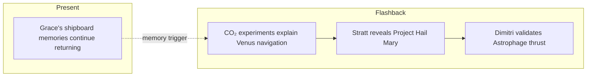

# PHM Novel - Chapter 04

← [[PHM Novel - Chapter 03]] | [[Project Hail Mary/Novel/Chapter Index|Chapter Index]] | [[PHM Novel - Chapter 05]] →

> **One-line summary** — Grace solves the Petrova Line mechanism as the Hail Mary mission and Astrophage propulsion are formally revealed.

## 🎯 Intuition
**The Core Idea:** This chapter turns the Astrophage mystery into a coherent system and ties that system directly to the interstellar mission.
**Why It Matters:** The Venus-cycle breakthrough gives the novel's central phenomenon a satisfying explanatory backbone. At the same time, the Hail Mary reveal expands Grace's personal research into a coordinated species-level response.

## ⚙️ Core Mechanics
### Summary
This chapter is dominated by flashback lab work. Grace addresses his three Astrophage samples—nicknamed Larry, Curly, and Moe—and works systematically through the question of why they migrate to Venus. He first suspects light-based navigation and tests various wavelengths; then narrows on the spectral emission signature of CO₂ at specific infrared bands as the key attractant. The complete mechanistic picture of the Petrova Line emerges: Astrophage absorbs energy at the Sun, then detects Venus's overwhelming CO₂ spectral signature to navigate there, reproduces in the upper Venusian atmosphere, and both parent and daughter cell return to the Sun. Stratt convenes an international briefing at which Grace receives top-secret clearance on the spot and is shown the Hail Mary project on paper for the first time—a mission to Tau Ceti, the one nearby star that has not dimmed. Russian physicist Dimitri Komorov demonstrates that controlled Astrophage combustion generates 60,000 Newtons of thrust, vastly exceeding any chemical rocket and validating Astrophage as a viable propulsion source. Grace learns that he will be permanently stationed aboard the carrier. In present-timeline interludes, Grace continues piecing together memories of the mission as his cognition recovers aboard the Hail Mary.

### Characters Present
- Ryland Grace ([[Ryland Grace]]) — flashback: CO₂ navigation experiments; present: memory recovery aboard Hail Mary
- Eva Stratt ([[Eva Stratt and the Ethics of Existential Response]]) — flashback: convenes international briefing; grants Grace clearance on the spot
- Dimitri Komorov — introduced; Russian physicist; demonstrates 60,000 N thrust; becomes Grace's scientific collaborator
- Minister Voigt — German representative at the briefing; objects to the speed of Stratt's clearance procedures
- Ms. Xi — Chinese scientist at the briefing

### Key Quotes
> [!quote] p. 84
> "Why the heck do you go to Venus?" — Grace addressing his three Astrophage samples, establishing the chapter's central question.

## 🔬 Deep Dive
### Science and Technology
- [[Astrophage Biology]] — CO₂ spectral navigation is the chapter's central scientific discovery; the Petrova Line mechanism is fully explained for the first time.
- [[Astrophage Life Cycle and Migration]] — the complete Venus-cycle migration pattern originates in Grace's lab work in this chapter.
- [[The Hail Mary Drive]] — Dimitri's 60,000 N thrust experiment validates Astrophage propulsion; this wiki note covers the drive in full.
- [[Tau Ceti and 40 Eridani]] — Tau Ceti's anomalous immunity to Astrophage dimming is introduced as the Hail Mary's scientific justification.

### Plot Connections
- **Previous:** [[PHM Novel - Chapter 03]] — crewmates buried; one-way mission realised; Spin Drive identified
- **Next:** [[PHM Novel - Chapter 05]] — mission objective recalled; Petrovascope activated; alien object detected at Tau Ceti
- [[Astrophage Life Cycle and Migration]] — CO₂ navigation and Venus-cycle discovery originate in this chapter's flashbacks
- [[The Hail Mary Drive]] — propulsion validated by Dimitri's thrust experiment; full drive description in this wiki note
- [[Tau Ceti and 40 Eridani]] — the anomalous Tau Ceti immunity introduced here drives the entire mission rationale

### Narrative Analysis
Weir lets the chapter operate like a scientific crescendo: small lab steps accumulate into a complete explanatory model, and only then does the geopolitical mission briefing arrive. That order makes the big reveal feel earned because the reader sees why Tau Ceti matters before being told how humanity plans to act on it.

## 🏋️ Practice
### Discussion Questions
1. Why does the CO₂-navigation solution feel like such a satisfying scientific payoff?
2. How does the Tau Ceti briefing redirect the novel from discovery to mission planning?
3. What does Dimitri's thrust demonstration prove about Astrophage as a propulsion technology?

### Analysis
- Examine how the chapter builds from playful lab curiosity to high-stakes global strategy.
- Consider why Weir places the propulsion validation in the same chapter as the full biological explanation.

### Creative Challenge
- **What if...** Tau Ceti had dimmed like every other star and humanity had no anomalous target system to investigate?

## Chunk Candidates
> [!info] Primary-mode — chunk extraction ready
> Chapter directly verified against the primary EPUB (p. 84–111). Chunk extraction can proceed when the pipeline is active.

- [x] CO₂ spectroscopy navigation experiment as the mechanistic explanation of the Petrova Line → [[Astrophage - CO2 emission spectroscopy explains how Astrophage navigates to Venus for reproduction|chunk-astroph-009]]
- [x] Hail Mary project reveal as Grace's first formal introduction to the mission → [[Novel - Hail Mary project reveal is Grace s first formal briefing on the interstellar mission|chunk-novel-012]]
- [ ] Dimitri's 60,000 N thrust demonstration as the engineering validation of Astrophage propulsion

## References
- [[Weir 2021 - Project Hail Mary Novel]] — primary source, p. 84–111
- [[Project Hail Mary/Novel/Chapter Index|Chapter Index]]
