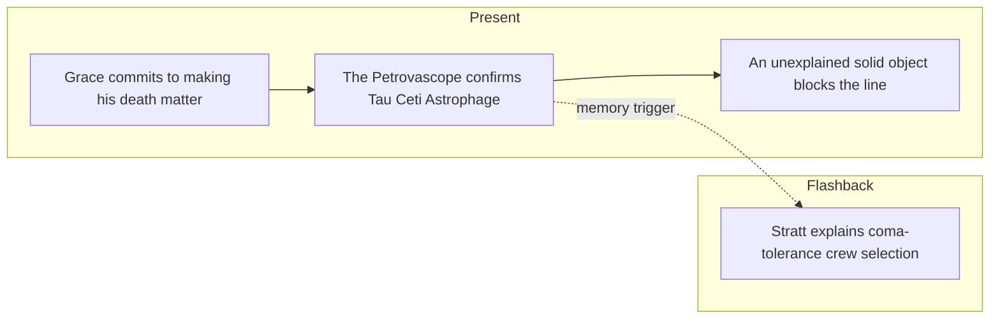

# PHM Novel - Chapter 05

← [[PHM Novel - Chapter 04]] | [[Chapter Index]] | [[PHM Novel - Chapter 06]] →

> **One-line summary** — Grace accepts the likelihood of his own death, confirms Astrophage at Tau Ceti, and detects the object that will become first contact.

## 🎯 Intuition
**The Core Idea:** The chapter fuses mission acceptance with the first concrete sign that humanity is not alone.
**Why It Matters:** Grace's resolution gives the present timeline a stable purpose for the first time. The Petrovascope discovery then rewards that commitment immediately, first by validating the mission and then by revealing an impossible object in the line.

## ⚙️ Core Mechanics
### Summary
Present-timeline: Grace accepts that he will likely die in this system and resolves that his death will have meaning—he will find a solution to the Astrophage crisis and transmit his findings via the beetle probes. He works through the ship's control interfaces and locates the Petrovascope, which requires the Spin Drive to be off before it can operate. He calculates the Hail Mary's velocity (7,595 km/s at this point in deceleration) and reviews the navigation map showing the ship will enter a stable orbit around Tau Ceti between the third and fourth planets. With roughly five days until engine cutoff, he waits. After drive shutdown, he activates the Petrovascope for the first time and discovers Tau Ceti does have a Petrova Line—Astrophage is present at this system. He also experiences acute vertigo and vomits in zero gravity while making his way back from the Petrovascope. As he continues observing, he notices a sharp cutoff in the Petrova Line that cannot be explained by a lens artefact and switches to visible light—revealing a solid object. Flashbacks: Stratt is shown alone with a bottle of gin wrestling with a difficult undisclosed decision; a later flashback covers her explanation to Grace that the Hail Mary's crew had to be selected for rare physiological tolerance to deep-coma torpor rather than conventional expertise, because the voyage requires years in coma. Grace reflects that his own survival (while Yao and Ilyukhina died) likely owes to this coma-resistance trait.

### Characters Present
- Ryland Grace ([[Ryland Grace]]) — present: navigates ship controls, activates Petrovascope, detects alien object; flashback: reflects on coma resistance and crewmate deaths
- Eva Stratt ([[Eva Stratt and the Ethics of Existential Response]]) — flashback: shown alone wrestling with a major decision; explains coma-tolerance crew selection rationale

### Key Quotes
> [!info] Primary source verified — OCR quality limited
> This chapter was read directly from the primary EPUB (p. 112–133). The opening pages carry OCR artefacts (dropped or substituted characters in first-person pronouns) that make verbatim quotation of the opening resolution scene impractical. The Petrovascope discovery and flashback content are readable; exact quoting should be deferred to a clean digital or print copy.

## 🔬 Deep Dive
### Science and Technology
- [[Artificial Gravity and Induced Torpor]] — crew selection for coma tolerance is directly addressed in the flashbacks; Grace names his own trait as the explanation for his survival.
- [[Relativistic Travel and Time Dilation]] — the navigation readout showing the journey took at least 1,000 days and the relativistic implications are noted by Grace in present timeline.
- [[Astrophage Biology]] — Tau Ceti Petrova Line confirmation is the chapter's central scientific event.
- [[Rocky and the Eridians]] — the solid object blocking the Petrova Line, glimpsed at chapter's end, is the first detection of what will become Rocky's ship.

### Plot Connections
- **Previous:** [[PHM Novel - Chapter 04]] — CO₂ navigation discovery; Hail Mary project revealed; Dimitri's thrust experiment
- **Next:** [[PHM Novel - Chapter 06]] — alien ship confirmed; engine mirroring begins; first cylinder retrieved
- [[Artificial Gravity and Induced Torpor]] — coma-tolerance selection criterion is established in this chapter's flashbacks
- [[Rocky and the Eridians]] — alien vessel first detected here; full contact develops across subsequent chapters
- [[Tau Ceti and 40 Eridani]] — Astrophage presence at Tau Ceti is confirmed here

### Narrative Analysis
The chapter is paced like a long inhale followed by a shock: Grace first settles emotionally into the mission, then the telescope sequence steadily escalates from confirmation to anomaly to revelation. The flashbacks about coma tolerance quietly deepen the cost of the project underneath that suspense.

## 🏋️ Practice
### Discussion Questions
1. Why is Grace's personal commitment so important before the alien-object reveal occurs?
2. How does this chapter bridge the Earth-focused Astrophage mystery and the first-contact plotline?
3. What does the coma-tolerance criterion reveal about the practical limits of deep-space human travel?

### Analysis
- Explore how the chapter converts waiting and observation into suspense instead of stalling the story.
- Consider the contrast between Grace's inward acceptance and the outward expansion of the novel's universe.

### Creative Challenge
- **What if...** the solid object had turned out to be natural rather than artificial?

## Chunk Candidates
> [!info] Primary-mode — chunk extraction ready
> Chapter directly verified against the primary EPUB (p. 112–133). Chunk extraction can proceed when the pipeline is active.

- [x] Grace's opening resolution ("if I'm going to die, it's going to have meaning") as the novel's mission-acceptance moment → [[Characters - Grace accepts certain death transforming obligation into personal commitment|chunk-grace-003]]
- [x] Petrovascope first activation and Tau Ceti Petrova Line confirmation as the scientific pivot of the present-timeline arc → [[Astronomy - Petrovascope first activation confirms Astrophage is present at Tau Ceti|chunk-astron-004]]
- [ ] Coma-tolerance as crew-selection criterion — trade-off between physiology and expertise

## References
- [[Weir 2021 - Project Hail Mary Novel]] — primary source, p. 112–133
- [[Chapter Index]]
