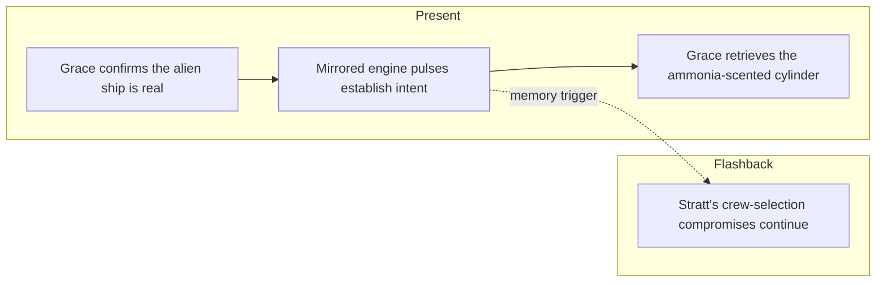

# PHM Novel - Chapter 06

← [[PHM Novel - Chapter 05]] | [[Project Hail Mary/Novel/Chapter Index|Chapter Index]] | [[PHM Novel - Chapter 07]] →

> **One-line summary** — Grace confirms the alien ship is intelligent, establishes mirrored communication, and retrieves the first artefact from another species.

## 🎯 Intuition
**The Core Idea:** This chapter turns abstract suspicion into deliberate interspecies contact.
**Why It Matters:** The novel's scope changes instantly once Grace decides cooperation is worth the risk. The mirrored-signal exchange is also the first proof that the Astrophage crisis reaches beyond humanity, which reframes the mission as a shared civilizational emergency.

## ⚙️ Core Mechanics
### Summary
Present-timeline: Grace confirms through the visible-light telescope that the object blocking the Petrova Line is an alien spacecraft—angular, composed entirely of flat panels, with a diamond-shaped midsection, a trapezoidal base, and a pyramid nose cone unlike any human engineering. The ship has matched his velocity exactly (to within sensor precision) at a range of 217 metres, which cannot be coincidence. Grace reasons through the implications: another rational species from another star, apparently confronting the same Astrophage crisis. He decides cooperation is worth the risk. He performs a brief Spin Drive pulse and watches the alien ship respond by firing its own engine in the Petrova frequency for exactly the same duration—it is mirroring him. He escalates to a pattern of short and long flashes; the alien mirrors that too. Concluding they are intelligent and non-hostile, Grace conducts an EVA in a Russian Orlan suit to retrieve a cylinder the alien ship has released across the gap. The cylinder is warm to the touch and carries a powerful ammonia smell; he gets it aboard after some difficulty. Flashbacks: Stratt's crew-selection process is explored—the Hail Mary's crew had to be chosen partly for physiological coma tolerance, meaning several more-qualified candidates were passed over.

### Characters Present
- Ryland Grace ([[Ryland Grace]]) — present: confirms alien ship, executes mirrored-signal exchange, EVA, retrieves cylinder
- Eva Stratt ([[Eva Stratt and the Ethics of Existential Response]]) — flashback: oversees crew-selection process with coma-tolerance as a criterion

### Key Quotes
> [!quote] p. 138
> "Then, the rear of the ship lights up in the Petrova frequency for one second. Just like I did." — the alien ship's first mirrored response.

## 🔬 Deep Dive
### Science and Technology
- [[Rocky and the Eridians]] — the alien vessel's flat-panel construction, non-human geometry, and ammonia-scented cylinder are the first physical evidence of Eridian technology and biochemistry.
- [[Xenolinguistics and First Contact]] — Grace's mirrored-signal approach is an instinctive application of the mathematical universality principle at the heart of first-contact theory.
- [[Artificial Gravity and Induced Torpor]] — coma-tolerance crew selection is directly addressed in the flashbacks.

### Plot Connections
- **Previous:** [[PHM Novel - Chapter 05]] — solid object first detected blocking Petrova Line
- **Next:** [[PHM Novel - Chapter 07]] — cylinder is decoded; stellar-system model exchange begins; left-handed threading discovered
- [[Xenolinguistics and First Contact]] — mirrored-signal communication strategy first applied here
- [[Rocky and the Eridians]] — alien ship and first physical artefact introduced in this chapter
- [[Tau Ceti and 40 Eridani]] — alien ship is in the same system; their origin (40 Eridani) is established in subsequent chapters

### Narrative Analysis
Weir keeps the first-contact logic admirably incremental: geometry, velocity matching, mirrored signals, then physical exchange. That stepwise structure makes the encounter feel intellectually earned rather than magical, while the EVA keeps the scene physically dangerous.

## 🏋️ Practice
### Discussion Questions
1. Why is signal mirroring a smart first-contact move for Grace?
2. How does the chapter reframe the Astrophage crisis once an alien ship appears in the same system?
3. What does the ammonia smell imply about the alien species before Grace even sees them?

### Analysis
- Analyze how Weir keeps the alien encounter suspenseful while still making Grace's reasoning transparent.
- Consider how the EVA adds bodily risk to a scene that could otherwise have been purely conceptual.

### Creative Challenge
- **What if...** Grace had interpreted the alien velocity match as hostile and broken contact immediately?

## Chunk Candidates
> [!info] Primary-mode — chunk extraction ready
> Chapter directly verified against the primary EPUB (p. 134–148). Chunk extraction can proceed when the pipeline is active.

- [x] Grace's mirrored-signal exchange as an application of mathematical universality in first contact → [[Xenolinguistics - Mirrored Petrova-signal exchange applies mathematical universality as first-contact basis|chunk-xenol-007]]
- [ ] Alien ship's flat-panel geometry as a narrative marker for non-human engineering philosophy
- [ ] EVA and cylinder retrieval as the novel's first physical alien artefact encounter

## References
- [[Weir 2021 - Project Hail Mary Novel]] — primary source, p. 134–148
- [[Project Hail Mary/Novel/Chapter Index|Chapter Index]]
