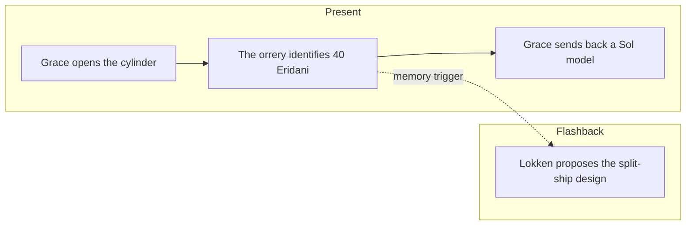

# PHM Novel - Chapter 07

← [[PHM Novel - Chapter 06]] | [[Project Hail Mary/Novel/Chapter Index|Chapter Index]] | [[PHM Novel - Chapter 08]] →

> **One-line summary** — Grace decodes the alien cylinder into a model of 40 Eridani while a ship-design flashback explains how the Hail Mary became viable.

## 🎯 Intuition
**The Core Idea:** The chapter advances first contact through shared physical models rather than shared words.
**Why It Matters:** By identifying the alien home system, Grace realizes the other ship is responding to the same cosmic threat from another star. The Lokken flashback mirrors that logic of practical problem-solving on the human side, showing another crucial design breakthrough built from rethinking assumptions.

## ⚙️ Core Mechanics
### Summary
Flashback: By the time the project team reaches Geneva, Grace has bred nearly six grams of Astrophage in the breeder. A UN-convened meeting introduces Norwegian engineer Dr. Lokken, who challenges the entire lab-equipment plan for the Hail Mary. Lokken argues that purpose-built new instruments will be unreliable; she proposes replacing them with proven equipment from existing Earth labs, which requires splitting the ship into two detachable halves during transit so the front section can spin for artificial gravity around a shared hinge. Stratt accepts over the objections of Voigt and others who want committee review. Present-timeline: Grace works to decode the alien cylinder from the previous chapter. He disassembles a small internal device and finds it contains models—whisker-like rods of different lengths attached to a base. He realises it is a miniature orrery representing a stellar system; the star has a specific position that matches 40 Eridani, making this the alien's home system. He also discovers the cylinder uses left-handed threading—an engineering and cultural detail. He sends back his own cylinder containing a similar model marking the Sun as his origin. The alien ship returns yet another cylinder with a model of the 40 Eridani system and one of the planets marked—Grace interprets this as identifying the Eridians' home world. He reflects on the shared Astrophage crisis: "The enemy of my enemy is my friend." He catches the new cylinder as it drifts through his open hatchway.

### Characters Present
- Ryland Grace ([[Ryland Grace]]) — present: decodes alien cylinder, identifies 40 Eridani, returns Sol model, catches new cylinder; flashback: at Geneva meeting
- Eva Stratt ([[Eva Stratt and the Ethics of Existential Response]]) — flashback: Geneva meeting; accepts Lokken's split-ship proposal
- Dr. Lokken — Norwegian engineer; proposed lab redesign requiring ship bifurcation; named and confirmed directly in EPUB (p. 150)

### Key Quotes
> [!quote] p. 166
> "The enemy of my enemy is my friend. If Astrophage is your enemy, I'm your friend."

## 🔬 Deep Dive
### Science and Technology
- [[Rocky and the Eridians]] — 40 Eridani confirmed as the alien's home system; left-handed threading is an Eridian engineering convention; the shared Astrophage crisis context is established here.
- [[The Hail Mary Drive]] — the Lokken flashback resolves the two-section ship design, explaining the detachable spin section described in this wiki note.
- [[Xenolinguistics and First Contact]] — the orrery-model exchange is a physical-communication method that circumvents language barriers entirely.

### Plot Connections
- **Previous:** [[PHM Novel - Chapter 06]] — alien ship confirmed; mirrored signals; cylinder retrieved
- **Next:** [[PHM Novel - Chapter 08]] — hull-sample exchange; xenonite introduced; docking tunnel construction begins
- [[Rocky and the Eridians]] — 40 Eridani origin and left-handed threading established here; this wiki note is the primary reference
- [[The Hail Mary Drive]] — split-ship design resolved in Geneva flashback; connects to drive and spin-section engineering
- [[Tau Ceti and 40 Eridani]] — 40 Eridani confirmed as the alien home system

### Narrative Analysis
This chapter is structured around elegant acts of interpretation: Grace reads intention from models, while the flashback reads engineering failure as a solvable design problem. Both timelines reward flexible thinking, which strengthens the novel's theme that intelligence shows up in method, not just in data.

## 🏋️ Practice
### Discussion Questions
1. Why is the orrery exchange such an effective non-linguistic communication method?
2. How does identifying 40 Eridani deepen the larger novel arc beyond simple first contact?
3. What engineering problem does Lokken's split-ship proposal solve for the Hail Mary?

### Analysis
- Compare the kinds of intelligence on display in the cylinder-decoding scene and the Geneva engineering meeting.
- Consider how left-handed threading functions as both a practical clue and a cultural signal.

### Creative Challenge
- **What if...** Grace had misread the model and inferred the wrong home system for the aliens?

## Chunk Candidates
> [!info] Primary-mode — chunk extraction ready
> Chapter directly verified against the primary EPUB (p. 149–167). Chunk extraction can proceed when the pipeline is active.

- [x] Orrery-model exchange as non-linguistic communication of stellar origin
- [x] Left-handed threading as a cultural/engineering marker for Eridian technology
- [ ] Lokken's split-ship proposal as the engineering decision that shapes the Hail Mary's physical design

## References
- [[Weir 2021 - Project Hail Mary Novel]] — primary source, p. 149–167
- [[Project Hail Mary/Novel/Chapter Index|Chapter Index]]
