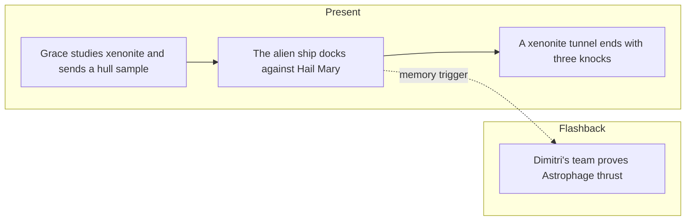

# PHM Novel - Chapter 08

← [[PHM Novel - Chapter 07]] | [[Project Hail Mary/Novel/Chapter Index|Chapter Index]] | [[PHM Novel - Chapter 09]] →

> **One-line summary** — Grace and the alien crew trade materials, a docking tunnel is built, and first contact becomes physically immediate.

## 🎯 Intuition
**The Core Idea:** This chapter turns distant signaling into engineered proximity.
**Why It Matters:** The xenonite sample and docking tunnel prove that both sides are willing to risk trust through construction, not just symbols. The flashback to Dimitri's demonstration reinforces the same theme: civilizations survive by turning discovery into usable hardware.

## ⚙️ Core Mechanics
### Summary
Present-timeline: Grace studies the xenonite model sent by the aliens—nearly indestructible and clearly not a human material—and decides to send a corresponding hull sample so the aliens can compare materials. He conducts a brief EVA to knock a chunk of hull off, notes it is past the pressurised section over what had been the Astrophage fuel tanks, and releases it toward the alien ship. While waiting, he reflects that if Eridians live above the boiling point of water it vindicates his career-long argument that the "Goldilocks Zone" is not a prerequisite for life. The alien ship edges progressively closer over hours until it is docked against the Hail Mary's hull; Grace can hear it manoeuvring. A docking tunnel is constructed—by the aliens, using xenonite—bridging the two ships. Grace equalises his side of the tunnel with ship air and waits. The chapter ends with three deliberate knocks from the far side of the tunnel wall. Flashbacks: Dimitri's Astrophage breeder team ("Dimitri's Denizens") on the carrier demonstrates 60,000 Newtons of thrust from a controlled Astrophage combustion experiment, validating the drive concept and prompting stunned celebration among the Russian team.

### Characters Present
- Ryland Grace ([[Ryland Grace]]) — present: sends hull sample, observes alien docking, equalises tunnel air, hears the knocks
- Dimitri Komorov — flashback: leads Astrophage breeder team; announces 60,000 N thrust result
- Eva Stratt ([[Eva Stratt and the Ethics of Existential Response]]) — flashback: present at the thrust demonstration

### Key Quotes
> [!quote] p. 168
> "Is this a good idea? I have a planet to save. As awesome as it is to meet up with intelligent aliens, is this risk worth it?"

> [!quote] p. 176
> "Sixty thousand Newtons of force!" — Dimitri announcing the thrust measurement result.

## 🔬 Deep Dive
### Science and Technology
- [[Rocky and the Eridians]] — xenonite's near-indestructibility is the chapter's physical evidence of Eridian materials science; the docking tunnel is their engineering; Eridian environment above water's boiling point is inferred.
- [[The Hail Mary Drive]] — Dimitri's 60,000 N thrust experiment is the flashback's central beat, providing the most technically detailed propulsion validation in the novel.
- [[Xenolinguistics and First Contact]] — the docking tunnel itself is a physical communication artefact; its construction by the alien party signals trust and engineering intent.

### Plot Connections
- **Previous:** [[PHM Novel - Chapter 07]] — stellar-model exchange; 40 Eridani origin confirmed; left-handed threading
- **Next:** [[PHM Novel - Chapter 09]] — knocking back; first visual contact with Rocky's claw; language discovery
- [[Rocky and the Eridians]] — xenonite and docking tunnel introduced here; Eridian environment above boiling point inferred
- [[The Hail Mary Drive]] — 60,000 N thrust experiment is the primary engineering validation of Astrophage propulsion
- [[Tau Ceti and 40 Eridani]] — the two ships in orbit around Tau Ceti represents both civilisations converging on the same problem

### Narrative Analysis
Weir stretches suspense by slowing the approach, letting every incremental movement of the alien ship matter. The chapter ends on the three knocks because physical presence is now more dramatic than explanation—the reader feels contact before understanding it.

## 🏋️ Practice
### Discussion Questions
1. Why is the docking tunnel more meaningful than any earlier signal exchange?
2. How does this chapter link first contact to the larger theme of practical cooperation under crisis?
3. What does xenonite suggest about Eridian materials science compared with human engineering?

### Analysis
- Examine how the chapter converts waiting for contact into escalating physical tension.
- Consider why Weir pairs the present-tense tunnel construction with a flashback about propulsion proof.

### Creative Challenge
- **What if...** Grace had refused to equalize the tunnel because the mission risk felt too high?

## Chunk Candidates
> [!info] Primary-mode — chunk extraction ready
> Chapter directly verified against the primary EPUB (p. 168–183). Chunk extraction can proceed when the pipeline is active.

- [ ] Grace's cost-benefit reflection on first contact vs. mission priority as an ethical decision-making beat
- [x] Xenonite docking tunnel as engineered neutral zone between incompatible environments
- [x] Dimitri's 60,000 N demonstration as the most technically detailed Astrophage propulsion validation in the novel → [[Propulsion - Dimitri s 60000 N carrier demonstration is the most technically detailed Astrophage propulsion validation in the novel|chunk-prop-007]]

## References
- [[Weir 2021 - Project Hail Mary Novel]] — primary source, p. 168–183
- [[Project Hail Mary/Novel/Chapter Index|Chapter Index]]
