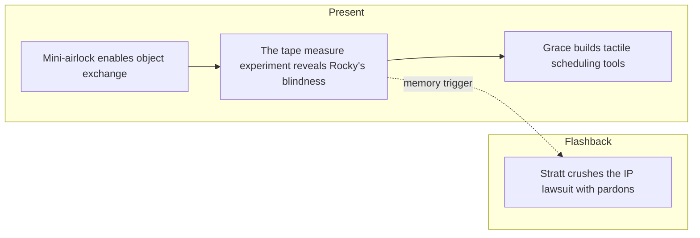

# PHM Novel - Chapter 10

← [[PHM Novel - Chapter 09]] | [[Chapter Index]] | [[PHM Novel - Chapter 11]] →

> **One-line summary** — Grace and Rocky build more reliable exchange methods as Grace deduces Rocky's blindness and a Stratt flashback shows earthly power at its most extreme.

## 🎯 Intuition
**The Core Idea:** The chapter deepens first contact by shifting from exciting discovery to practical communication engineering.
**Why It Matters:** Learning how Rocky perceives the world is the key step from meeting him to truly working with him. The Stratt flashback parallels that pragmatism from Earth's side, showing institutions being bent or broken to keep the larger mission alive.

## ⚙️ Core Mechanics
### Summary
Present-timeline: Grace wakes from a two-hour nap floating in a foetal position in the control room—not rested at all—but returns to the tunnel to honour the agreed schedule and not give Rocky a bad impression of humans. Rocky has installed a miniature square airlock in the tunnel wall with simple controls, allowing small objects to be transferred between the incompatible environments. The first exchange reveals a complication: Grace sends a metal tape measure into Rocky's side, but the rubber grip pads melt (Rocky's environment is above their melting point) and the graduated markings become unreadable. Grace then realises Rocky cannot see visible-light ink—black markings on white tape produce no response. He tests the hypothesis more carefully and concludes that Rocky is likely blind to visible light, navigating and communicating through touch and sound. Grace identifies Rocky as the same individual across sessions by the distinctive irregular ridges on his carapace. They begin coordinating sleep schedules: because Rocky's base-six clock has only five digits and rolls over roughly every five hours, Grace uses a spreadsheet to convert Eridian time to Earth time and prepares Popsicle-stick symbols Rocky can feel with his claws. Flashback: Stratt appears alone at a defence table in a court hearing captioned "Intellectual Property Alliance v. Project Hail Mary," where she produces pre-emptive pardons from multiple heads of state and dismisses a consolidated IP lawsuit, demonstrating the extraordinary legal authority she wields.

### Characters Present
- Ryland Grace ([[Ryland Grace]]) — present: returns to tunnel, observes tape-measure melt, deduces Rocky's blindness, coordinates sleep schedule
- Rocky ([[Rocky and the Eridians]]) — installs mini-airlock; identified as the same individual by carapace features; confirmed blind to visible light
- Eva Stratt ([[Eva Stratt and the Ethics of Existential Response]]) — flashback: defends against consolidated IP lawsuit; produces presidential and head-of-state pardons

### Key Quotes
> [!quote] p. 205
> "Wait. Are you blind?" — Grace's realisation that Rocky cannot see visible-light markings.

> [!quote] p. 208
> "Today's case is Intellectual Property Alliance v. Project Hail Mary." — opening of the court hearing at which Stratt produces multi-jurisdiction pardons.

## 🔬 Deep Dive
### Science and Technology
- [[Rocky and the Eridians]] — Rocky's blindness to visible light, high-temperature environment, base-six time system, and tactile/auditory communication are all confirmed here; this wiki note is the primary reference.
- [[Xenolinguistics and First Contact]] — Popsicle-stick symbols for tactile communication, object exchange via mini-airlock, and sleep-schedule coordination represent the most systematic language-bootstrapping sequence so far.
- [[Eva Stratt and the Ethics of Existential Response]] — the IP lawsuit flashback illustrates the legal powers Stratt assembled; presidential pardons pre-emptively issued across multiple jurisdictions.

### Plot Connections
- **Previous:** [[PHM Novel - Chapter 09]] — vibration language discovered; clock exchange; time unit established
- **Next:** [[PHM Novel - Chapter 11]] — Grace and Rocky deepen their shared language and begin coordinating on the Astrophage problem
- [[Rocky and the Eridians]] — Rocky's blindness, temperature environment, and base-six system all catalogued in this wiki note
- [[Xenolinguistics and First Contact]] — tactile symbol system and object-exchange airlock are the most developed first-contact tools introduced so far
- [[Eva Stratt and the Ethics of Existential Response]] — IP lawsuit flashback is the clearest illustration of Stratt's extra-legal authority

### Narrative Analysis
Weir smartly follows the high of first contact with logistics, because real cooperation depends on routines, interfaces, and error correction. The lawsuit flashback broadens that same idea politically: both timelines are about building systems that function under extraordinary pressure.

## 🏋️ Practice
### Discussion Questions
1. Why is Rocky's blindness such a decisive breakthrough in the relationship?
2. How does the chapter show first contact becoming a matter of infrastructure rather than spectacle?
3. What does the tape-measure failure reveal about the thermal and sensory assumptions built into human tools?

### Analysis
- Compare Grace's careful experimental reasoning in the tunnel with Stratt's blunt legal pragmatism in the flashback.
- Consider how the chapter uses mundane objects to make alien cognition legible.

### Creative Challenge
- **What if...** Grace had mistaken Rocky's non-response for unwillingness rather than for a sensory mismatch?

## Chunk Candidates
> [!info] Primary-mode — chunk extraction ready
> Chapter directly verified against the primary EPUB (p. 201–213). Flashback confirmed (Stratt IP court, p. 208–210); timeline corrected to `both`. Chunk extraction can proceed when the pipeline is active.

- [x] Tape-measure melt as the first direct evidence of Rocky's extreme-temperature environment
- [x] Rocky's blindness deduction as a model of hypothesis testing through object exchange → [[Eridian - Grace deduces Rocky s blindness to visible light through systematic object-exchange experiments|chunk-erid-012]]
- [ ] Popsicle-stick tactile symbols as the pivot from audio to tactile communication modality
- [x] Stratt's pre-emptive pardons as the clearest single illustration of her extraordinary legal authority

## References
- [[Weir 2021 - Project Hail Mary Novel]] — primary source, p. 201–213
- [[Chapter Index]]
