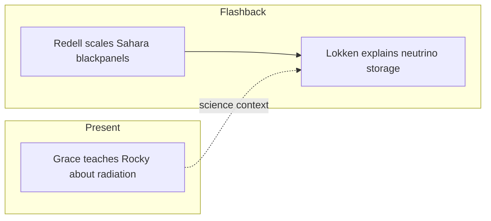

---

id: novel-ch-12

type: novel-chapter

chapter: 12

timeline: both

status: processed

source_mode: primary

quotes_pending: false

chunk_count: 4

source: "[[Weir 2021 - Project Hail Mary Novel]]"

tags:

  - phm

  - novel

  - chapter

up: "[[Project Hail Mary/Novel/Chapter Index|Chapter Index]]"

confidence: verified
freshness: stable

tier-coverage: [intuition, core, deep-dive, practice]

---

# PHM Novel - Chapter 12

← [[PHM Novel - Chapter 11]] | [[Project Hail Mary/Novel/Chapter Index|Chapter Index]] | [[PHM Novel - Chapter 13]] →

> **One-line summary** — Grace and Rocky begin the radiation lesson while flashbacks reveal both Earth's Astrophage industrial infrastructure and a major breakthrough in Astrophage physics.

## 🎯 Intuition

**The Core Idea:** The chapter links human scientific discovery with an Eridian blind spot, showing how different civilizations can know radically different things about the same universe.

**Why It Matters:** This is where the novel's collaborative logic deepens: Grace can explain radiation because humanity had to study it, while Rocky lacks the concept entirely because Erid's environment shielded his species from it. The flashbacks also show that Earth survived long enough to launch Hail Mary only through extreme scientific improvisation and scale.

## ⚙️ Core Mechanics

### Summary

The flashback strand opens in Auckland Prison ("Pare"), where Stratt and Grace visit Robert Redell — a convicted embezzler and engineer who had been quietly developing a concept for industrial-scale Astrophage production in the Sahara Desert. Redell describes his blackpanel design: black anodised metal foil under glass, trapping heat above the Astrophage critical temperature, assembled from foil, glass, and ceramics at the scale of trillions of units across North Africa. Stratt, immediately recognising the concept's value, agrees to reduce his sentence in exchange for running the programme. In the present strand, Grace and Rocky expand their vocabulary enough for Grace to begin teaching Rocky radiation science — explaining cosmic rays and high-speed hydrogen atoms in space. Rocky has no cultural framework for ionising radiation: Eridian biology evolved under a magnetic field twenty-five times Earth's and an atmosphere twenty-nine times as thick, providing such perfect shielding that Eridians never discovered radiation at all. Midway through, a second flashback cuts to Dr. Lokken revealing a CERN advance paper: Astrophage stores energy via neutrino production — a counterintuitive but experimentally confirmed mechanism that pins its temperature at exactly 96.415 °C. Dr. Lokken also explains that Astrophage's "super cross-section" means it will absorb all radiation inside a hull, making it a natural radiation shield for the Hail Mary itself. The present-day radiation lesson is still ongoing as the chapter ends; the full emotional weight of the revelation — that Rocky's crewmates died of radiation sickness — carries over into Chapter 13.

### Characters Present

- **Ryland Grace** — begins teaching Rocky radiation science; works through the CERN neutrino implications with Lokken

- **Rocky** — receives the radiation explanation; his crew's deaths are about to be explained (conclusion in Ch14)

- **Eva Stratt** (flashback) — recruits Redell; authorises the Sahara blackpanel programme

- **Dr. Robert Redell** (flashback) — describes the blackpanel concept; agrees to run the Sahara installation

- **Dr. Lokken** (flashback) — presents the CERN advance paper on neutrino energy storage; proposes Astrophage as hull shielding

### Key Quotes

> "They figured out how Astrophage stores energy." "Really?!" / "It's neutrinos." — Lokken revealing the CERN paper (p. 243–244)

> "Waaaaaait... We know Astrophage is always 96.415 degrees Celsius. Temperature is just the average kinetic energy of particles..." — Grace working through the neutrino implication (p. 244)

## 🔬 Deep Dive

### Science and Technology

- Blackpanel design for Sahara Astrophage production: black anodised foil + glass + sealed air gap, reaching >100 °C equilibrium in direct sunlight — see [[Eva Stratt and the Ethics of Existential Response]].

- Eridian radiation blindness: Erid's 25× Earth magnetic field and 29× atmospheric thickness provide complete shielding — Eridians evolved without ever encountering ionising radiation — see [[Rocky and the Eridians]].

- CERN neutrino-storage breakthrough: Astrophage stores energy by producing neutrinos, locking temperature at 96.415 °C; also exhibits "super cross-section" that blocks all radiation — see [[Astrophage Biology]].

- Astrophage as a Hail Mary hull-radiation-shield (Lokken's proposal): the super cross-section means the live Astrophage lining will absorb cosmic rays — see [[Astrophage Life Cycle and Migration]].

### Plot Connections

- Previous chapter: [[PHM Novel - Chapter 11]]

- Next chapter: [[PHM Novel - Chapter 13]]

- The radiation teaching that begins here concludes in Chapter 13, when Rocky learns his crewmates died of radiation sickness — the emotional payoff of the lesson.

- Redell's blackpanel programme is the industrial-scale Astrophage production infrastructure underpinning the entire Hail Mary mission.

- The neutrino energy-storage mechanism resolves a key scientific mystery about Astrophage's extraordinary energy density — see [[Astrophage Biology]].

- The "super cross-section" radiation-shielding property is what makes filling the Hail Mary's double hull with Astrophage fuel both safe and beneficial.

### Narrative Analysis

Weir braids two explanatory flashbacks into an unfinished present-day lesson, so scientific exposition becomes suspense rather than interruption. The structure withholds the emotional payoff of the radiation revelation until the next chapter, making this installment feel like a carefully loaded spring.

## 🏋️ Practice

### Discussion Questions

1. Why does Rocky's lack of any cultural concept of radiation matter so much to the chapter's emotional stakes?

2. How do the Redell and Lokken flashbacks expand the broader picture of how humanity responded to the Astrophage crisis?

3. What makes Astrophage's fixed temperature and radiation-shielding properties scientifically surprising?

### Analysis

- Examine how the chapter turns exposition into tension by delaying Rocky's realization about his crew.

- Consider how environmental differences between Earth and Erid shape not only biology but entire scientific traditions.

### Creative Challenge

- **What if...** Grace never figures out how to explain radiation clearly enough to Rocky. What alternative path might they have taken to deduce the Blip-A crew's fate?

## Chunk Candidates

> [!info] Primary-mode note

> Chapter verified directly from [[Weir 2021 - Project Hail Mary Novel]], pp. 231–249. Chunk extraction ready for next pass.

- [x] Redell's blackpanel design — black foil + glass + sealed gap; scales to trillions across the Sahara

- [x] Eridian radiation blindness as a species-specific knowledge gap: 25× magnetic field + 29× atmosphere = zero evolutionary exposure to ionising radiation

- [x] Astrophage energy storage via neutrino production — mechanism for 96.415 °C temperature lock

- [x] Astrophage "super cross-section" as hull radiation shield — turns fuel into structural protection → [[Astrophage - Astrophage super cross-section turns the fuel layer into a hull radiation shield|chunk-astroph-010]]

- [ ] Radiation teaching begins (conclusion in Ch14) — Grace explaining cosmic rays to Rocky in 50+ new words

## References

- [[Weir 2021 - Project Hail Mary Novel]] — primary source, pp. 231–249

- [[PHM Chapter Summaries - Secondary Sources Registry]] — superseded secondary summary

- [[Project Hail Mary/Novel/Chapter Index|Chapter Index]]
