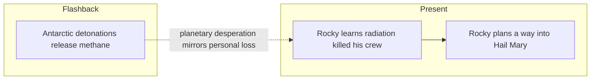

---

id: novel-ch-13

type: novel-chapter

chapter: 13

timeline: both

status: processed

source_mode: primary

quotes_pending: false

chunk_count: 5

source: "[[Weir 2021 - Project Hail Mary Novel]]"

tags:

  - phm

  - novel

  - chapter

up: "[[Project Hail Mary/Novel/Chapter Index|Chapter Index]]"

confidence: verified
freshness: stable

tier-coverage: [intuition, core, deep-dive, practice]

---

# PHM Novel - Chapter 13

← [[PHM Novel - Chapter 12]] | [[Project Hail Mary/Novel/Chapter Index|Chapter Index]] | [[PHM Novel - Chapter 14]] →

> **One-line summary** — Rocky learns radiation killed his crew as flashbacks show Earth's worsening desperation and the two friends theorize why their civilizations met at Tau Ceti at all.

## 🎯 Intuition

**The Core Idea:** A scientific explanation becomes an act of mourning, then expands into a theory about technology, evolution, and interstellar contact.

**Why It Matters:** This chapter completes the emotional arc started when Rocky first admitted he was alone. It also broadens the novel's scope, connecting one friendship to planetary triage on Earth and even to the possibility that Astrophage underlies life across the galaxy.

## ⚙️ Core Mechanics

### Summary

The chapter opens with Stratt's science team in a flashback meeting featuring Dr. François Leclerc, who presents grim climate-feedback projections: solar dimming from Astrophage will cause cascading crop failures and biome collapse beyond any standard mitigation. Leclerc argues that the only available intervention is releasing methane trapped in Antarctic ice — triggered by strategic nuclear detonations. The team watches the controlled ice-shelf collapse from an aircraft carrier. In the present strand, the radiation lesson begun in Chapter 12 concludes: it takes three hours and fifty new words, but Grace finally explains ionising radiation to Rocky. Rocky's response — "Thank. Now I know how my friends died" — is delivered in low, sad tones. The chapter then explores why Rocky survived while his crew did not: Rocky spent most of his time alone in his workshop, which happened to be the most shielded compartment on the Blip-A. A broader theoretical discussion follows: Rocky and Grace reason that only civilisations in a technological "Goldilocks zone" — advanced enough to build an interstellar ship but not yet capable of solving Astrophage locally — would be forced to send missions to Tau Ceti, which is why Grace and Rocky met at all. Grace also speculates that Astrophage may be the evolutionary ancestor of all DNA-based life in the galaxy. The chapter closes with Rocky revealing he is building a pressurised device — "Room and device keep me alive in your ship" — signalling his intent to cross into the Hail Mary.

### Characters Present

- **Ryland Grace** — concludes radiation teaching; develops the Goldilocks civilisation theory; reacts to Rocky's entry plan

- **Rocky** — learns how his crewmates died; expands biological self-disclosure; builds the pressurised entry device

- **Dr. François Leclerc** (flashback) — presents climate-cascade projections; oversees Antarctic detonation from the carrier

- **Eva Stratt** (flashback) — authorises nuclear detonations in Antarctica; accepts future prosecution as personal sacrifice

### Key Quotes

> "Thank. Now I know how my friends died." — Rocky (p. 254)

> "We all have to make sacrifices. If I have to be the world's whipping boy to secure our salvation, then that's my sacrifice to make." — Stratt (p. 263)

> "Room and device keep me alive in you ship." — Rocky, announcing his intent to enter the Hail Mary (p. 268)

## 🔬 Deep Dive

### Science and Technology

- Conclusion of radiation-sickness diagnosis: Rocky's workshop provided accidental shielding; his crew had none — see [[Rocky and the Eridians]].

- Eridian biological detail expanded: ATP sacs, biological smelters (oxygen extracted from minerals), radiator vents on carapace for heat management — see [[Rocky and the Eridians]].

- Climate feedback from stellar dimming: ice-albedo cascade, frozen rice paddies, wheat fungal parasites — methane release as a counter-forcing mechanism — see [[Eva Stratt and the Ethics of Existential Response]].

- Antarctic nuclear detonations: controlled shelf collapse to release subglacial methane, raising atmospheric greenhouse-gas concentration — see [[Eva Stratt and the Ethics of Existential Response]].

- "Goldilocks civilisation" argument: only a species in the right technological range (can build interstellar ships but can't solve Astrophage locally) would be forced to Tau Ceti — cross-species encounter as a self-selecting filter — see [[Rocky and the Eridians]].

- Astrophage as universal ancestor hypothesis: all DNA-based life across the galaxy may share Astrophage as a common evolutionary root.

### Plot Connections

- Previous chapter: [[PHM Novel - Chapter 12]]

- Next chapter: [[PHM Novel - Chapter 14]]

- The "Now I know how my friends died" moment completes the emotional arc begun when Rocky first revealed his dead crew in Chapter 11.

- The Antarctic nuclear detonation is one of the most ethically extreme unilateral decisions Stratt takes; her matter-of-fact acceptance of future prosecution is a character-defining beat — see [[Eva Stratt and the Ethics of Existential Response]].

- Rocky building his pressurised entry device here leads directly to his entry into the Hail Mary in Chapter 14.

- The Goldilocks civilisation argument retroactively explains the entire framing of the novel — both crews are in a specific technological window that makes the encounter possible and necessary.

### Narrative Analysis

The present strand moves from painful revelation to wide-ranging speculation, which makes the friendship feel intellectually generative rather than merely comforting. In parallel, the flashback raises the stakes on Earth, showing that private grief and civilizational desperation are part of the same story engine.

## 🏋️ Practice

### Discussion Questions

1. Why is Rocky's response to learning how his friends died one of the chapter's most important emotional beats?

2. How does the Goldilocks-civilization theory connect this chapter to the novel's larger first-contact premise?

3. What does the proposed methane-release plan suggest about the scale and ethics of planetary climate intervention?

### Analysis

- Analyze how Grace and Rocky's theoretical conversation turns the chapter from mystery resolution into cosmological speculation.

- Consider Stratt's willingness to accept future punishment. Does the chapter frame that as heroism, pragmatism, or something darker?

### Creative Challenge

- **What if...** The Antarctic methane plan fails much sooner than expected. How might that have changed Earth's timeline and the urgency of the Hail Mary mission?

## Chunk Candidates

> [!info] Primary-mode note

> Chapter verified directly from [[Weir 2021 - Project Hail Mary Novel]], pp. 250–269. Chunk extraction ready for next pass.

- [x] "Now I know how my friends died" — resolution of the radiation-mystery arc; workshop shielding as accidental survival mechanism → [[Eridian - Rocky learns his crewmates died of radiation sickness completing the workshop-shielding mystery|chunk-erid-013]]

- [x] Eridian biology: ATP sacs, biological smelter physiology, radiator vents — full picture of Rocky's alien biochemistry → [[Eridian - Rocky's physiology includes ATP sacs, biological smelter, and carapace radiator vents|chunk-erid-006]]

- [x] Antarctic nuclear detonations to release subglacial methane — existential-crisis planetary triage → [[Ethics - Antarctic nuclear detonations release subglacial methane as extreme planetary triage|chunk-ethics-004]]

- [x] Goldilocks civilisation argument — technological range as filter for interstellar first contact → [[Eridian - Goldilocks civilisation argument explains why technologically capable species meet at Tau Ceti|chunk-erid-007]]

- [x] Astrophage as universal ancestor of all DNA-based galactic life — speculative but scientifically motivated hypothesis → [[Astrophage - Grace hypothesises Astrophage may be the universal ancestor of all DNA-based galactic life|chunk-astroph-006]]

- [ ] Rocky begins building pressurised xenonite entry device — structural setup for Chapter 14

## References

- [[Weir 2021 - Project Hail Mary Novel]] — primary source, pp. 250–269

- [[PHM Chapter Summaries - Secondary Sources Registry]] — superseded secondary summary

- [[Project Hail Mary/Novel/Chapter Index|Chapter Index]]
